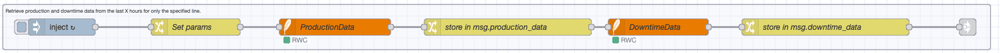
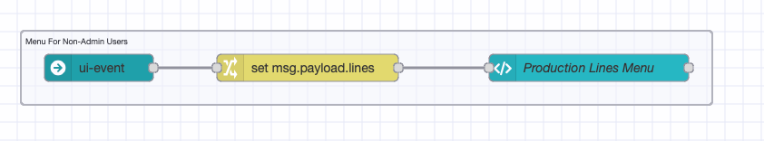
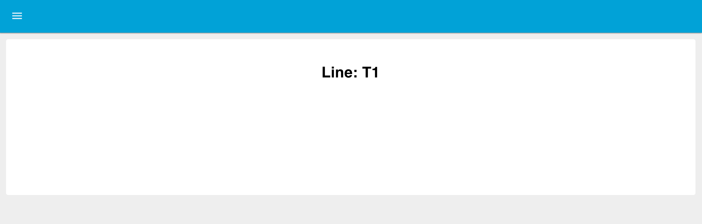
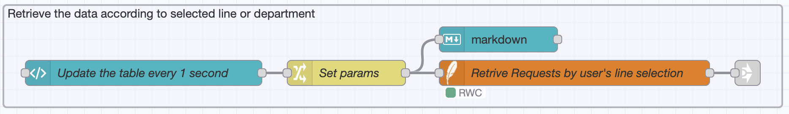
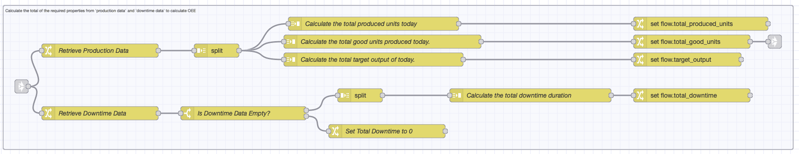
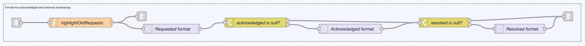

In Part 1, the concept of an Andon Task Manager was introduced along with a basic dashboard design and a list of key features and interface elements.

<!--more-->

In this second part, the focus shifts to building the system using the FlowFuse Dashboard (also known as Node-RED Dashboard 2.0) and the FlowFuse platform.

## Getting Started

To simplify the development process, the implementation is divided into the following key sections:

- Creating the SQLite flow  
- Populating demo departments and lines  
- Creating a menu for lines  
- Handling dashboard access via URL  
- Building the Flow to Fetch Live Requests Per Line Using Client Context 
- Preparing and rendering data in a table  
- Setting up visual alerts  
- Implementing request status updates and row highlighting using CSS  
- Displaying data in a table  
- Building Flow to Submit a Request

Before proceeding, a basic understanding of Node-RED is recommended. If you are new to Node-RED, consider going through this [free Node-RED Fundamentals Course](https://node-red-academy.learnworlds.com/course/node-red-getting-started) to get started.

Additionally, please organize the flows into well-structured groups. To align with my group organization, I’ve provided images of the flow for each section. If a Link In node is present at the start, make sure the group begins from the Link In node and ends at the Link Out node.

### Prerequisites

Before you begin building the Andon Task Manager with FlowFuse, make sure you have the following:

- **Running FlowFuse Instance:** Make sure you have a FlowFuse instance set up and running. If you don't have an account, check out the [free trial](https://flowfuse.com/) and [learn](/docs/user/introduction/#creating-a-node-red-instance) how to create an instance.
- **FlowFuse Dashboard:** Ensure you have FlowFuse Dashboard (also known as Node-RED Dashboard 2.0 in the community) installed.
- **SQLite Contrib Node:** Install `node-red-contrib-sqlite` to handle local data storage.
- **FlowFuse Multi-user Andon:** Install `@flowfuse/node-red-dashboard-2-user-addon` to enable multi-user support.
- **User Authentication:** [Enable user authentication](/blog/2024/04/displaying-logged-in-users-on-dashboard/#enabling-flowfuse-user-authentication) on your FlowFuse instance.
- **Moment Contrib Node:** Install `node-red-contrib-moment` for date and time formatting.

### Creating the SQLite Flow

The first step is to set up a database to store requests and their updates.

1. Drag an **Inject** node onto the canvas and configure it to trigger on Deploy, after a delay of 0.1 seconds.  
2. Drag an **SQLite** node onto the canvas. Double-click and click the **+** icon to add a new database configuration.  
3. Give the database a name and set the mode to **Read-Write-Create**. Click **Add** to save.
4. Set **SQL Query** to **Fixed statement** and enter:

   ```sql
   CREATE TABLE IF NOT EXISTS requests (
     rowid INTEGER PRIMARY KEY,
     line TEXT NOT NULL,
     support TEXT NOT NULL,
     requested TEXT NOT NULL,
     acknowledged TEXT,
     resolved TEXT,
     notes TEXT
   );
   ```

5. Connect the Inject node to the SQLite node.
6. Click **Deploy**.

{data-zoomable}
_Flow to initialize the SQLite database and create the requests table._

Once deployed, this will create the SQLite database and `requests` table if it does not already exist.

### Populating Demo Departments and Lines

Since the admin feature is not yet available, let's populate demo data using a predefined flow:


[{"id":"d5dd9bfc599374d4","type":"tab","label":"Populate with demo support areas and lines","disabled":false,"info":"","env":[]},{"id":"6471824e24f18939","type":"group","z":"d5dd9bfc599374d4","name":"Add demo production line and department","style":{"label":true},"nodes":["34c733b480e41a13","4e46ae25d198fd1b","882e29d2dcc9326c","399bd159f46c7427","5001c1cdf6661f88"],"x":34,"y":39,"w":1302,"h":122},{"id":"34c733b480e41a13","type":"inject","z":"d5dd9bfc599374d4","g":"6471824e24f18939","name":"Add production lines and department for testing","props":[],"repeat":"","crontab":"","once":true,"onceDelay":0.1,"topic":"","x":260,"y":100,"wires":[["4e46ae25d198fd1b","399bd159f46c7427"]]},{"id":"4e46ae25d198fd1b","type":"switch","z":"d5dd9bfc599374d4","g":"6471824e24f18939","name":"Is lines undefined?","property":"#:(persistent)::lines","propertyType":"global","rules":[{"t":"istype","v":"undefined","vt":"undefined"}],"checkall":"true","repair":false,"outputs":1,"x":770,"y":80,"wires":[["882e29d2dcc9326c"]]},{"id":"882e29d2dcc9326c","type":"change","z":"d5dd9bfc599374d4","g":"6471824e24f18939","name":"Store lines to context store","rules":[{"t":"set","p":"#:(persistent)::lines","pt":"global","to":"[{\"value\":\"T1\",\"label\":\"T1\"},{\"value\":\"T2\",\"label\":\"T2\"}]","tot":"json"}],"action":"","property":"","from":"","to":"","reg":false,"x":1140,"y":80,"wires":[[]]},{"id":"399bd159f46c7427","type":"switch","z":"d5dd9bfc599374d4","g":"6471824e24f18939","name":"Is departments undefined?","property":"#:(persistent)::departments","propertyType":"global","rules":[{"t":"istype","v":"undefined","vt":"undefined"}],"checkall":"true","repair":false,"outputs":1,"x":800,"y":120,"wires":[["5001c1cdf6661f88"]]},{"id":"5001c1cdf6661f88","type":"change","z":"d5dd9bfc599374d4","g":"6471824e24f18939","name":"Store departments to context store","rules":[{"t":"set","p":"#:(persistent)::departments","pt":"global","to":"[{\"value\":\"Maintenance\",\"label\":\"Maintenance\"},{\"value\":\"Stores\",\"label\":\"Stores\"},{\"value\":\"Quality\",\"label\":\"Quality\"}]","tot":"json"}],"action":"","property":"","from":"","to":"","reg":false,"x":1170,"y":120,"wires":[[]]}]


1. Import the provided demo flow.  
2. Deploy the flow.

This will store demo lines and departments in the global context as `global.lines` if not already present.

### Menu for Lines

Now, let us create a new page and menu item for Production Lines. This page will list all currently available production lines, making it easier to navigate through them.

1. Drag a **ui-event** node to detect page navigation.
2. Drag a **change** node and configure it to:
   - Set msg.payload.lines to global.get("lines")

3. Drag a **ui-template** node onto the canvas. Create a new page (e.g., “Line Menu”) and a group.
4. Paste the following into the template:

```html
<template>
  <v-container>
    <v-row>
      <v-col>
        <h3>Production Lines</h3>
      </v-col>
    </v-row>

    <v-row class="scrollable-row" no-gutters>
      <v-col v-for="(btn, index) in lines" :key="index" cols="auto">
        <v-btn :href="`/dashboard/lines?line=${btn.value}`" class="custom-btn" rounded>
          {{ btn.label }}
        </v-btn>
      </v-col>
    </v-row>

    <v-alert v-if="selectedLine" type="success" class="mt-3">
      Selected Line: {{ selectedLine }}
    </v-alert>
  </v-container>
</template>

<script>
export default {
  data() {
    return {
      selectedLine: '',
      lines: []
    };
  },
  methods: {
    updateButtonContent(data) {
      this.lines = (data.lines || []).sort((a, b) => a.label.localeCompare(b.label));
    }
  },
  mounted() {
    this.lines = [];
    this.$socket.on('msg-input:' + this.id, (msg) => {
      this.updateButtonContent(msg.payload);
    });
  }
};
</script>

<style scoped>
.scrollable-row {
  display: flex;
  overflow-x: auto;
  padding: 10px 0;
  flex-wrap: wrap;
}
.scrollable-row .v-col {
  flex-shrink: 0;
  margin-bottom: 10px;
}
.scrollable-row {
  min-height: 60px;
}
.custom-btn {
  background-color: rgb(32, 44, 52) !important;
  color: white !important;
  margin-right: 12px;
  padding: 8px 16px;
}
.custom-btn:hover {
  background-color: rgb(54, 70, 86) !important;
}
</style>
```

5. Deploy the flow.

Once deployed, the dashboard will show buttons for each production line. Clicking a line redirects the user to a page like:

```
https://<your-instance-name>/dashboard/lines?line=T1
```

{data-zoomable}
_Node-RED flow to create a dynamic menu for production lines on the dashboard._

{data-zoomable}
_Dashboard view showing production line buttons generated from the flow._

This "line" URL parameter will be used in the next section to store the selected line.

### Managing Dashboard Navigation via URL with Line Validation and Client-Specific Selection

This flow handles direct URL access to the dashboard. It validates the line parameter in the URL. If the parameter is valid, the flow redirects the user to the Lines page and stores the selected line along with the client session context. If the parameter is invalid or missing, the user is redirected to a Not Found page.

However, in order to store the user's selected line, we also need client-specific metadata. So before we build the flow, we must first configure the dashboard to provide this data.

#### Configuring Dashboard Widgets to Include Client Information

To ensure client data is available in your flows, follow these steps:

1. Open the Dashboard 2.0 sidebar.
2. Switch to the Client Data tab.
3. Enable the option “Include client data”.
4. Tick the checkbox in front of:
   - ui-control
   - ui-template
   - ui-button
   - ui-text-input
   - ui-dropdown
5. Deploy the updated configuration.

{data-zoomable}
_Dashboard 2.0 settings to include client metadata from selected widgets like buttons and templates._

These widgets output will now include client-related metadata as `msg._client`, which we will use in our OEE Dashboard flow.

#### Building a Dashboard Flow for URL Access, Line Validation, and User Selection

1. Drag a **ui-event node** onto the canvas and configure it with the correct UI base path. This node listens for dashboard navigation events, such as URL changes or user interactions.
   
2. Drag a **switch node** and configure it with the property `msg.topic` and add the following condition:
   - `== $pageview`

3. **Drag another switch node** and configure it with the property `msg.payload.page.params.line`, with two conditions:
   - has key `line`
   - is empty

4. Connect the `ui-event` node to the first `switch` node (from step 2), then connect that `switch` node to the second `switch` node (from step 3). This checks for page access via URL and whether a line parameter is present.

5. **Drag a function node** onto the canvas and paste the following code:

   ```javascript
   let lines = global.get('lines', 'persistent') || [];
   let labels = [
      ...lines.map(obj => obj.label),
   ];
   msg.payload.labels = labels;
   return msg;
   ```

This retrieves the list of available lines from the persistent global context, extracts their labels, and creates an array for easier verification of whether the line in the URL parameter is present.

6. Drag a change node onto the canvas and configure it to:
   - Set `global.store[msg._client.socketId].line` to `msg.payload`.
7. Drag another switch node and configure it with the condition `msg.payload.page.name` is equal to "Lines". This ensures the user is currently on the "Lines" page.
8. Connect the function node (from step 5) and the change node (from step 6) to the first output of the switch node (from step 3), which handles the case when a line parameter exists.
9.  Drag another switch node and configure it with the condition:
    - `msg.payload.labels` contains `global.store[msg._client.socketId].line`

This checks whether the selected line is valid by comparing it with the list of known line labels.

10. For the first output of the switch node from step 7, drag a change node and configure it to:
    - Set `msg.payload.page.name` to "All Lines"
11. Drag the ui control widget onto the canvas and 12. connect it to the change node (from step 10). This node will handle the redirection or display feedback on the dashboard.
13. For the first output of the switch node from step 9, drag a change node and configure it to:
    - Set `msg.payload` to "Incorrect Link"
14. Drag a ui-control node onto the canvas and configure it with the correct UI base path.
15. Deploy the changes.

{data-zoomable}
_Flow for managing URL-based access, validating line parameters, and storing client-specific selections on the OEE dashboard._

### Building the Flow to Fetch Live Requests Per Line Using Client Context

Let’s build the flow to retrieve the data.

1. Drag a Template widget onto the canvas.
2. Double-click the Template widget to open its configuration.
3. Set the scope to `ui` and select the appropriate UI Base.
4. Paste the following script into the content field. This script triggers every second and sends a message that includes the current user's client data:

```html
<script>
   export default {
     mounted() {
       // Set an interval to update the message every second
       this.intervalId = setInterval(() => {
         this.send('Component has loaded')
       }, 1000);
     },
     beforeUnmount() {
       // Clear the interval when the component is about to be destroyed
       clearInterval(this.intervalId);
     },
   };
</script>
```

5. Drag a Change node onto the canvas.
6. Configure the Change node with the following rules:
    - Set msg.line to msg.store[msg._client.socketId].line
    - Set msg.query to "line"
    - Delete msg.topic
7. Drag another Template node onto the canvas.
8. Double-click the Template node and set the property to msg.topic.
9. Paste the following SQL query into the content field:

```sql
SELECT * from requests WHERE "{{query}}" ="{{line}}" AND resolved IS NULL
```

10. Drag a Markdown widget onto the canvas.
11. Create a new group in the UI for the Markdown widget to render into.
12. Enter the following content into the Markdown widget:

```sql
<h1 style="text-align: center;">Line: {{ msg?.line }}</h1>
```

{data-zoomable}
_The dashboard displays the selected production line name, retrieved from the client context, rendered using a Markdown widget._

13.  Drag a SQLite node onto the canvas.
14.  Select the appropriate database configuration.
15.  Set the SQL Query property to use msg.topic.
16.  Connect the Template widget to the Change node, Change node to the Template node, and Template node to the SQLite node.
17.  Drag the link-out node onto the canvas and connect it to the SQLite node.
18.  Deploy the changes

{data-zoomable}
_Flow that triggers periodic queries for open requests specific to the user’s selected line using the client session and a SQLite database._

### Preparing Data for Display and Rendering it in a Table

Once the data is retrieved, it needs to be validated, formatted, and routed appropriately for display. In this section, a flow will be built to check whether any unresolved requests exist for the selected production line. If there are no requests, a message will be shown to the user. Otherwise, the data will be processed and rendered in a table format using Dashboard widgets.

1. Drag a **link-in node** onto the canvas and connect it to the last **link-out node**.

2. Add a **switch node** to check whether the `msg.payload` is empty.
   - Configure the switch with the following conditions:
     - `msg.payload is empty`
     - `Otherwise`

3. Drag a **change node** onto the canvas and configure it to set a message when the payload is empty:
   - Set `msg.payload` to "There are no outstanding requests"
   
4. Connect this **change node** to the first output of the switch node.

5. Drag another **change node** onto the canvas and configure it as follows:
   - Set `msg.payload` to an empty string `""`

6. Connect this second **change node** to the second output of the switch node.

7. Drag a **text widget** onto the canvas, double-click it, and add a new group in the "Lines" page to render the message.

8. Connect the **text widget** to both **change nodes** that are setting the text message.

9. Drag another **link-in node** onto the canvas and connect it to the second output of the switch node that checks whether `msg.payload` is empty.

10. Drag the **link-out node** onto the canvas and connect it to the last **link-in node**.

11. Drag a **split node** onto the canvas and connect it to the **link-in node**.

12. Drag a **link-out node** and connect it to the **split node**.

13. Deploy the changes

{data-zoomable}
_Flow that checks if unresolved requests exist, sends an appropriate message when none are found, or prepares the data for tabular rendering._

### Setting Up Visual Alerts and Timestamp Formatting

To enhance the visibility of production line requests, this section focuses on setting up visual alerts based on how old each request is and formatting their timestamps in a user-friendly way. The flow will classify requests using configurable thresholds and visually highlight older or unresolved ones. Additionally, timestamps such as requested, acknowledged, and resolved will be formatted using relative time (e.g., "5 minutes ago") to improve readability on the dashboard.

1. Drag a **link-in node** and a **function node** onto the canvas, and open the **function node**.

2. Paste the following JavaScript code into the function node:

```javascript
const requested = msg.payload.requested;
const now = Date.now();

const requestedTime = new Date(requested).getTime();
const difference = now - requestedTime;

const oldRequestThreshold = global.get('oldRequestThreshold');
const veryOldRequestThreshold = global.get('veryOldRequestThreshold');
const alertActivationThreshold = global.get('alertActivationThreshold');

if (difference > (veryOldRequestThreshold * 60 * 1000)) {
   msg.payload.class = 'older';
   if (difference > (alertActivationThreshold * 60 * 1000)) {
       msg.payload.alert = true;
   }
   return msg;
}
else if (difference > (oldRequestThreshold * 60 * 1000)) {
   msg.payload.class = 'old';
   if (difference > (alertActivationThreshold * 60 * 1000)) {
       msg.payload.alert = true;
   }
   return msg;
}
else {
   if (difference > (alertActivationThreshold * 60 * 1000)) {
       msg.payload.alert = true;
   }
   msg.payload.class = 'normal';
   return msg;
}

```

3. Connect the link-in node to the function node.

4. Drag a date time formatter node onto the canvas.

5. Double-click on the date time formatter node and set outputFrom to fromNow.

6. Set both input and output to msg.payload.requested.

7. Connect the function node to the date time formatter node.

8. Drag a link-out node and connect it to the date time formatter node.

9. Drag a switch node onto the canvas and set the property to `msg.payload.requested` and add the following conditions: 
    - is null, otherwise.

10. Connect this switch node to the link-in node created earlier.

11. Drag a second date time formatter node onto the canvas, Set outputFrom to fromNow and Set both input and output to `msg.payload.acknowledged`.

12. Connect the second date time formatter node to the second output of the switch node from step 23.

13. Drag another switch node onto the canvas and set the property to `msg.payload.resolved` and add the following conditions: 
    - is null, otherwise.
14. Connect this switch node to the output of the second date time formatter node and to the first output of the first switch node.

15. Drag a third date time formatter node onto the canvas, Set outputFrom to fromNow and Set input and output to `msg.payload.resolved`.

16. Connect this date time formatter node to the second output of the second switch node.

17. Drag a link-out node and connect this link-out node to the third date time formatter node.

18. Drag another link-out node and connect it to the first output of the second switch node.

19. Deploy the changes

{data-zoomable}
_Dashboard showing a request visually highlighted based on how long ago it was made, with applied styling and alert classification._

{data-zoomable}
_Flow for setting visual alert classes and formatting timestamps like "5 minutes ago" to enhance clarity and urgency of displayed requests._

## Building Flow to Submit a Request

To create a flow that allows users to submit a request, follow these steps to set up the necessary UI elements, store the request details, validate input, and store the data in a database.

1. Drag the **ui-event** widget onto the canvas and configure it with the correct UI settings.

2. Drag a **change node** to retrieve the department list. Set `msg.ui_update.options` to `global.departments` to dynamically update the department dropdown.

3. Create a new group for the dropdown widget on the lines page. Connect the **change node** to the input of the dropdown widget, then link it to the **ui-event** node.

4. Drag another **change node** and set `msg.payload` to `msg.store[msg._client.socketId].support` to store the selected department in the global context.

5. Drag a **text input widget** for the notes field. Create a group for it in the lines page. Add another **change node** to store the notes in the global context:
   - Set `msg.payload` to `msg.store[msg._client.socketId].notes`.

6. Drag the **button widget**, label it "Request Support," and connect it to the **change node** that updates the UI with the department list.

7. Add a **change node** to store the request details in the global context:
   - Set `msg.store[msg._client.socketId].support` to `msg.request.support`.
   - Set `msg.store[msg._client.socketId].notes` to `msg.request.notes`.
   - Set `msg.store[msg._client.socketId].line` to `msg.request.line`.
   - Set `msg.store[msg._client.socketId].reference` to `msg.request.reference`.

8. Drag a **Function node** and add the following code:

```javascript
let request = msg.request;
if (typeof request !== "object" || request === null) {
   msg.payload = "Request must be an object.";
   return [null, null, msg]; // Send msg to third output if request is not an object
} else if (!request.hasOwnProperty("support")) {
   msg.payload = "Please select the appropriate department for the request.";
   return [null, msg, null]; // Send msg to second output, nothing to first or third
} else if (!request.hasOwnProperty("notes") || typeof request.notes !== "string" || request.notes.trim() === "") {
   msg.payload = "Please add notes to provide more context on the request.";
   return [null, null, msg]; // Send msg to third output, nothing to first or second
} else {
   return [msg, null, null]; // Send msg to first output, nothing to second or third
}
```

9. Connect the change node to Function node, function node's first output to the Date/Time Formatter node. Set the input to 'Timestamp (milliseconds since epoch)' and the output to `msg.request.time`.

10.  Drag a change node and set `msg.payload` to "Are you sure you want to submit a request?"

11.  Drag a ui notification widget, configure it with the correct UI, and set the position to center.

12.  Connect the Function node’s second and third outputs to the ui notification widget for displaying validation messages.

13.  Add a switch node and set the property to msg.payload with the condition == confirm_clicked.

14. Drag a template node and add the following SQL query:

```sql
INSERT INTO requests (rowid,line,support,requested,notes)
VALUES(NULL,'{{request.line}}','{{request.support}}','{{request.time}}','{{request.notes}}');
```

15. Connect the ui-notification to the switch node, Connect the template node to the switch node's first output.

16.  Drag the sqlite node, select the correct database configuration, and choose SQL Query via `msg.topic`.

17.  Drag a change node and set the following:
    - Delete `msg.store[msg._client.socketId].support`.
    - Delete `msg.store[msg._client.socketId].notes`.
    - Drag the link-out node and connect it to the last change node. Then link the last change node to the first output of the switch node.

18.  Connect the switch node to the ui notification widget.

19.  Drag the link-in node and connect it to the link-out node.

20.  Drag two change nodes and add the following elements:
    - First change node: Set `msg.payload` to an empty array [].
    - Second change node: Set `msg.payload` to an empty string "".
    
21.  Connect the change nodes to the link in, completing the flow.
22.  Connect the first change node to the ui dropdown widget and second to text input widget.
23. Deploy the changes

{data-zoomable}
_Node-RED flow to handle request submission, including form validation, timestamp formatting, and SQL database insertion._

{data-zoomable}
_Dashboard UI where users select a department, enter notes, and submit a support request for the production line._

## Up Next

Up until now, the focus has been on building the core functionality of the Andon Task Manager dashboard, including the Lines page. Design and layout have not been the priority. In the next part, you will learn how to enhance the visual design, improve usability, and create a dedicated page and menu for departments.
Later, we will guide you through building the Admin page for the Andon Task Manager dashboard—enabling request management, department configuration, and overall system control.