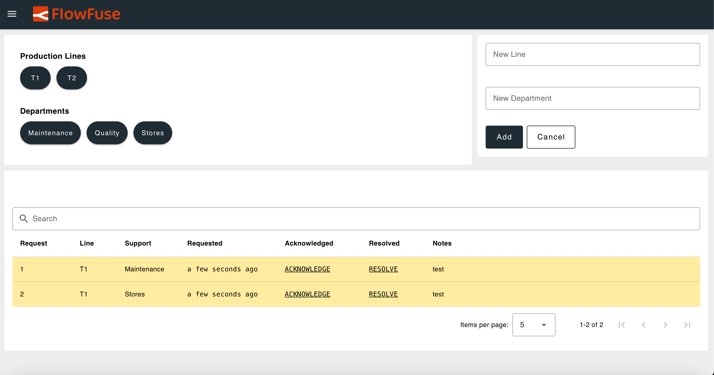
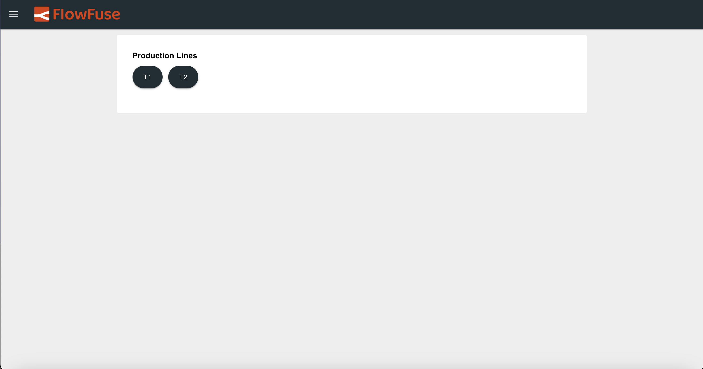
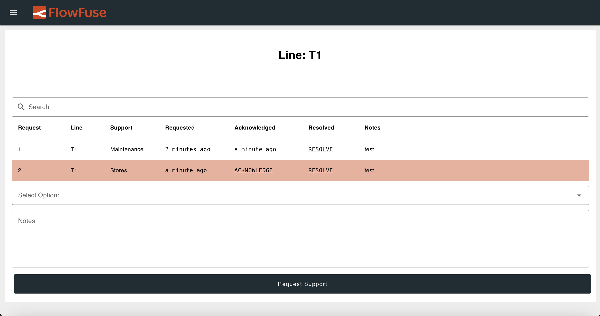
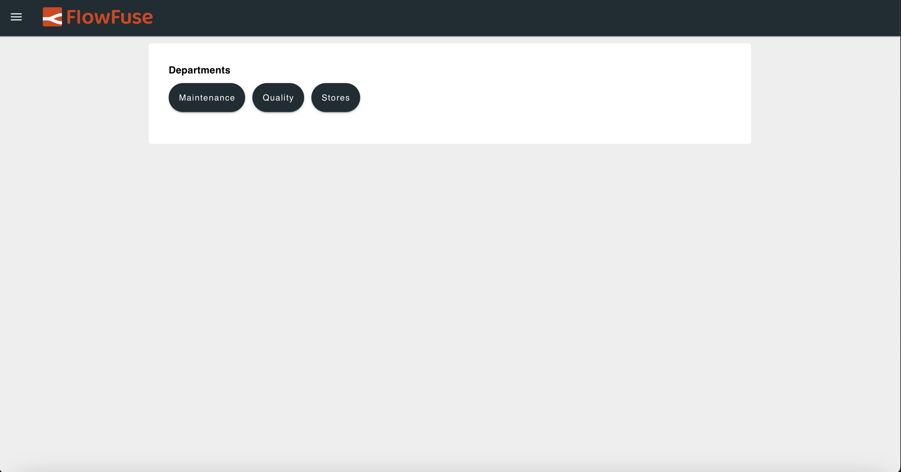
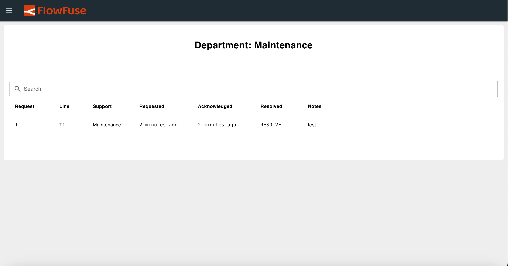

In modern manufacturing and service environments, speed and transparency are critical for addressing issues as they arise. An Andon system helps achieve this by enabling frontline workers to signal problems in real time, triggering quick responses from support teams.

<!--more-->

However, many manufacturers struggle to find a solution that truly fits their needs. Some tools lack essential features, while others are overloaded with unnecessary ones that add complexity. In this series, we’re going to build a real-time Andon Task Manager using FlowFuse—starting with the foundation and planning in this first part. The result will be a system that’s fully customizable to fit your needs, easy to manage, and scalable across teams or factory floors.

## What is the Andon Task Manager?

The Andon Task Manager is a digital system designed to streamline real-time issue reporting, escalation, and resolution tracking. Inspired by the traditional Andon systems used in lean manufacturing, it brings these concepts into a modern, cloud-enabled environment.

At its core, it’s a communication and response tool designed to improve transparency and speed on the factory floor or within service teams. Frontline workers can quickly raise issues—like equipment breakdowns, material shortages, or support needs—which are immediately sent to the right person or team. Once the issue is resolved, the responder updates the status so everyone stays informed and the task is properly closed.

## Planning the Andon Task Manager

Before building the system, it is important to define its core components and plan how each part will work together. We will also discuss the visual components that will be used in the dashboard to ensure operators and responders can interact with the system efficiently. This planning phase helps establish a clear, scalable architecture and avoids unnecessary complexity down the line.

### Breaking Down the Request and Its Data Fields

The request is the core of the Andon Task Manager. Each request represents a task raised by a frontline worker and needs to carry essential information for proper tracking and resolution. This includes:

- the line where the issue occurred
- the department responsible
- the time the request was made
- whether it has been acknowledged and when
- whether it has been resolved and when
- any notes providing additional context

Having this data ensures that every request is clearly documented, easy to follow, and can be addressed efficiently.

#### Request Table Fields

When creating the database table, we will need the following fields:

- `id`
- `line`
- `department`
- `created_at`
- `acknowledged` (null or timestamp when acknowledged)
- `resolved` (null or timestamp when resolved)
- `notes`

Since the `department` and `line` fields are part of the request, we will also need a reference list of all available lines and departments in the factory. This ensures that requesters and resolvers can create and manage requests using consistent, validated options.

## Outlining Key Feature Requirements

Now that we know what kind of data each request should include, let’s look at the key features the system needs to support. These are the basic building blocks that will help both frontline workers and responders use the system effectively.

### Core Features

- **Create and Submit Requests**  
  Frontline workers should be able to raise a request easily by selecting the line and department, adding a quick note, and submitting it. Each request should automatically record the time it was created.

- **Update Request Status**  
  Once a team member sees the request, they should be able to acknowledge it. After the issue is handled, they should also be able to mark it as resolved. The system should log both of these timestamps.

- **Filter by Line and Department**  
  Since different teams might be handling different lines or departments, users should be able to view and filter requests based on this information.

- **Manage Departments and Lines**  
  There should be a way to add or update the list of departments and lines—ideally only available to admins—so the options stay clean and consistent.

- **Clear Status Tracking**  
  Every request should show its current state: whether it’s still waiting, acknowledged, or resolved. This helps everyone quickly understand what needs attention.

- **Real-Time Visual Feedback**  
  The dashboard should highlight new or pending requests with visual cues. For example, unacknowledged requests could appear in a darker or more prominent color to draw attention.

- **Optional Sound Alerts**  
  To make sure urgent requests don’t go unnoticed, the system could also play a sound if a request has not been acknowledged within a certain time.

## Dashboard Visualization & UI Design

With the core features defined, the next step is to design a dashboard that is easy to use and efficient for both frontline workers and managers and admin users. A good UI ensures quick interaction and smooth navigation, especially in fast-paced environments.

The system will support two user roles: **admins** and **regular users**. Regular users will have access only to features relevant to their role, such as viewing and managing requests by line or department. Admins will have extended capabilities, including the ability to create and manage departments and lines.

The dashboard will be designed as a single-page interface with dynamic content rendering. Instead of navigating between pages, the interface will update based on the user’s selection. For example, selecting a specific line or department will refresh the main view to show relevant requests and controls.

Admins will have access to a dedicated section that includes a form for creating new lines or departments and a table listing all requests. Regular users will interact with filtered views as per their selection of department and line.

To support efficient navigation, the dashboard will include menus for selecting specific lines or departments. These menus will dynamically update the request list and input forms to match the selected context, allowing users to view, create, and manage requests.

This design keeps the dashboard focused, avoids unnecessary complexity, and ensures a smooth experience for both everyday users and administrators.

### In summary, our dashboard will include:

#### Admin Page
- Menu to select and navigate to specific departments or lines
- Form to create new departments and lines
- Table to view and manage all requests across the system, with Acknowledge and Resolve buttons

#### Line View
- Filtered table showing only the requests for the selected line
- Form to create a new request for that line

#### Department View
- Filtered table showing only the requests for the selected department

#### Line Menu
- Displays a list of all available lines

#### Department Menu
- Displays a list of all available departments

{data-zoomable}
_The following dashboard image illustrates the intended design and key objectives of our Andon Task Manager._

{data-zoomable}
_The following dashboard image illustrates the intended design and key objectives of our Andon Task Manager._

{data-zoomable}
_The following dashboard image illustrates the intended design and key objectives of our Andon Task Manager._

{data-zoomable}
_The following dashboard image illustrates the intended design and key objectives of our Andon Task Manager._

{data-zoomable}
_The following dashboard image illustrates the intended design and key objectives of our Andon Task Manager._

## Storage Mechanism

Let us now look at how data is stored in the Andon Task Manager. To keep things simple and efficient, we use an SQLite database for storing user requests. SQLite is lightweight, easy to manage, and well-supported in Node-RED through the `node-red-contrib-sqlite` node, making it ideal for local deployments.

For storing dynamic data like the user’s selected line or department, as well as the full list of available lines and departments, we use FlowFuse’s built-in context storage. This approach ensures fast access and persistent state across sessions, without adding database complexity.

## Up Next

In this first part of the series, we defined the foundation for building a real-time Andon Task Manager using FlowFuse. We explored the core objectives of an Andon system, detailed the structure of request data, outlined key functional requirements, and proposed a streamlined dashboard design tailored to both frontline users and administrators.

With a solid understanding of the data flow, UI layout, and user interactions, we’re now ready to move into implementation. In the next part, we will cover building the **Line** and **Department** views, along with the menus for selecting departments and lines. In a later part, we will show how to build the **Admin interface**.