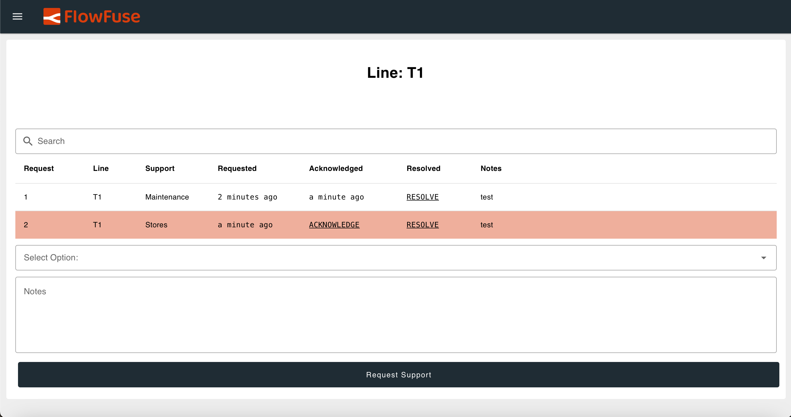

In modern manufacturing and service environments, speed and transparency are critical for addressing issues as they arise. An Andon system helps achieve this by enabling frontline workers to signal problems in real time, triggering quick responses from support teams.

<!--more-->

However, many manufacturers struggle to find a solution that truly fits their needs. Some tools lack essential features, while others are overloaded with unnecessary ones that add complexity.

This blog series introduces a practical approach to building a real-time Andon Task Manager using FlowFuse and Node-RED. In this first part, the focus is on understanding the concept of an Andon system and laying the foundation for the solution.

## What is the Andon Task Manager?

The Andon Task Manager is a digital system designed to streamline real-time issue reporting, escalation, and resolution tracking. Inspired by the traditional Andon systems used in lean manufacturing, it brings these concepts into a modern, cloud-enabled environment.

At its core, it’s a communication and response tool designed to improve transparency and speed on the factory floor or within service teams. Frontline workers can quickly raise issues—like equipment breakdowns, material shortages, or support needs—which are immediately sent to the right person or team. Once the issue is resolved, the responder updates the status so everyone stays informed and the task is properly closed.

## What Problem It Solves?

In a typical manufacturing environment, multiple processes run simultaneously across large factory floors. Each area—or line—has specific machinery, workflows, and potential points of failure. When something goes wrong, quick and clear communication is essential. However, factories are often spread out, and support teams are divided across different departments (e.g., maintenance, quality control, safety, etc.).

In many cases, workers rely on informal or manual systems—such as radio calls, phone messages, or shouting across the floor—to report issues. These methods are inefficient, error-prone, and often delay response times. The lack of a structured, real-time communication system leads to:

- Delayed responses because support staff are unaware of new issues
- Lack of visibility into the status of reported issues
= No accountability for weather the issue is acknowledged/resolved or not
- Unstructured logging that makes follow-up or audits difficult

The Andon Task Manager solves this by acting as a centralized system where any frontline worker can quickly raise an issue. Once submitted, the request is instantly visible to the relevant department—without needing someone to manually assign it. This enables self-routing and real-time visibility, ensuring the right people take action quickly and efficiently, even when the requester and responder are in completely different parts of the factory.

## Planning the Andon Task Manager

At the core of the system is the concept of a request. Every request represents a task or issue raised by an operator. To ensure traceability and clarity, each request should include key details. This structured format makes it easier for departments to manage and resolve issues efficiently.

Each request must include the following:

- `id`: A unique identifier for the request.
- `line`: The line or machine where the issue was raised.
- `department`: The department responsible for resolving the issue.
- `created`: The timestamp when the request was created.
- `acknowledged`: Optional timestamp indicating when the request was acknowledged.
- `resolved`: Optional timestamp indicating when the issue was resolved.
- `note`: Optional text added by users for context or follow-up.
Only predefined values for line and department should be allowed. These values will be managed through admin settings to ensure consistency across the system.

### Defining Key Features

The system needs to support core operations that reflect how issues are reported and resolved in real-life factory environments. These features help ensure that tasks are handled efficiently and that everyone involved knows the current status.

The essential features include:

- Request creation: Users select the line and department, optionally enter a note, and submit a request.
- Acknowledge requests: A responder can mark a request as acknowledged once they start working on it.
- Resolve requests: After resolving the issue, the responder marks it as resolved.
- View filtering: Requests can be filtered by line or department.
- Admin tools: Admins can add and manage the list of departments and lines.
- Status display: Requests display their current state — pending, acknowledged, or resolved.
- Alerts (optional): Visual or sound alerts for unacknowledged requests after a time threshold.

Each of these actions will be timestamped to provide a clear history of who did what and when.

### Dashboard Visualization & UI Design

With the core features defined, the next step is to design a dashboard that is intuitive and efficient for both frontline workers and admin users. A well-structured user interface ensures quick interaction and smooth navigation, especially in fast-paced environments where timely responses are critical.

The system will support two distinct user roles: admins and regular users. Regular users will have access to features specific to their role, such as submitting requests, viewing requests by department or line, and managing tasks relevant to their area. Admins, on the other hand, will have extended capabilities, including the ability to create and manage departments and lines, and access a full view of all request data.

The dashboard will be implemented as a single-page interface with dynamic content updates. Instead of traditional page navigation, the content will change based on the user's selection of a line or department. For example, when a user selects a specific production line, the request list and relevant controls will update automatically to reflect only those related to the chosen line.

Admins will have access to a dedicated view that includes a form for creating new lines or departments, along with a comprehensive table showing all existing requests. This view will also include a user-friendly menu for quickly switching between departments and lines, making it easy to manage the full system from a centralized location.

Regular users will interact with a streamlined version of the dashboard. They can use drop-down menus or navigation panels to select their department or line, and the interface will update to show only the relevant request list and input form. This filtered view reduces visual clutter and helps users focus on the tasks that matter to them.

To support efficient navigation for all users, the dashboard will include:

- A department menu and line menu for selecting context.
- A dynamic request list that updates based on the selected context.
- Simple, role-appropriate controls for creating, acknowledging, and resolving requests.

This design keeps the interface focused and responsive. It avoids unnecessary complexity while providing all necessary tools for users to perform their tasks efficiently — whether they are reporting an issue or managing overall operations.

{data-zoomable}
_The following dashboard image illustrates the intended design and key objectives of our Andon Task Manager._

{data-zoomable}
_The following dashboard image illustrates the intended design and key objectives of our Andon Task Manager._

{data-zoomable}
_The following dashboard image illustrates the intended design and key objectives of our Andon Task Manager._

{data-zoomable}
_The following dashboard image illustrates the intended design and key objectives of our Andon Task Manager._

{data-zoomable}
_The following dashboard image illustrates the intended design and key objectives of our Andon Task Manager._

### Storage Mechanism

To ensure a simple and efficient data management system for the Andon Task Manager, we will use SQLite to store user requests. SQLite is a lightweight, easy-to-manage database that is well-supported in Node-RED through the `node-red-contrib-sqlite node`. This makes it an ideal choice for local deployments or scenarios where a lightweight database is needed.

For dynamic runtime data—such as the user's selected line or department, as well as the full list of available lines and departments—FlowFuse’s built-in context storage will be utilized. This solution allows for fast access to real-time data while maintaining persistent state across sessions, without introducing unnecessary database complexity or overhead.

By using both SQLite for structured request data and context storage for dynamic, session-based information, the system remains efficient and easy to maintain.

## Up Next

In this first part of the series, we've laid the groundwork for building a real-time Andon Task Manager using FlowFuse. We explored the key objectives of an Andon system, detailed the structure of request data, outlined essential functional requirements, and proposed a streamlined dashboard design for both frontline users and administrators.

With a clear understanding of the data flow, UI layout, and user interactions, we’re now prepared to move on to the implementation phase. In the next part, we will focus on developing the Lines view for normal users, along with the navigation menu, and the menus for selecting lines and departments. Later, we will cover the development of the Admin interface.
