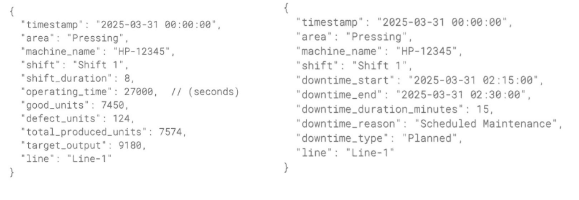
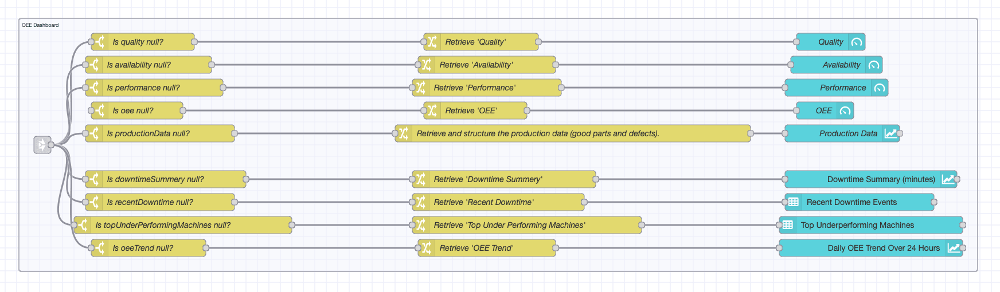

In [Part 1](/blog/2025/04/building-oee-dashboard-with-flowfuse-part-1/), we explored the fundamentals of OEE, outlined a basic design of the dashboard, and identified the key elements to include in the OEE dashboard. 
In this Part 2, we will focus on building the OEE dashboard interface using [FlowFuse Dashboard](https://dashboard.flowfuse.com/) (Node-RED Dashboard 2.0) and FlowFuse, utilizing simulated production and downtime data.

<!--more-->

## Getting Started

To simplify the development process, we will divide development into five key parts:

1. Collecting and configuring data
2. Preparing data for calculations
3. Calculating OEE and key metrics
4. Detailed breakdown of OEE data
5. Building the dashboard

Before we start, it is recommended to have a basic knowledge of Node-RED. For that, I recommend this free [Node-RED Fundamental Course](https://node-red-academy.learnworlds.com/course/node-red-getting-started).

Additionally, ensure that you organize flows into well-structured groups. To match my group organization, I have provided images of the flow for each section. Also, if a Link In node is present at the start, create the group starting from the Link In node and ending at the Link Out node.

### Prerequisites

Before you begin building the OEE Dashboard with FlowFuse, make sure you have the following:

- **Running FlowFuse Instance:** Make sure you have a FlowFuse instance set up and running. If you don't have an account, check out our [free trial]() and learn how to create an instance in FlowFuse.
- **FlowFuse Dashboard:** Ensure you have [FlowFuse Dashboard](https://flows.nodered.org/node/@flowfuse/node-red-dashboard) (also known as Node-RED Dashboard 2.0 in the community) installed and properly configured on your instance.
- **SQLite Contrib Node:** Ensure you have [node-red-contrib-sqlite](https://flows.nodered.org/node/node-red-node-sqlite) installed.

### Preparing Simulated Data

Before building the dashboard, we need a data source for production and downtime metrics. This data will serve as input for OEE calculations. We will focus on connecting a real source in the next part, but for now, let's generate simulated data.


[{"id":"fa7147e04d4d5ec3","type":"tab","label":"Simulated Data Generation","disabled":false,"info":"","env":[]},{"id":"3f2126c3c00b9e0d","type":"group","z":"fa7147e04d4d5ec3","style":{"stroke":"#b2b3bd","stroke-opacity":"1","fill":"#f2f3fb","fill-opacity":"0.5","label":true,"label-position":"nw","color":"#32333b"},"nodes":["853fb3a395d833bb","a96ffd171bf11823","3d30995a4329eb71","0f466ba2a885e22a","f8229c651706b162","2ceebc93d54adba4","0c927abd3b139e97","8222855bc32e9240"],"x":24,"y":99,"w":1142,"h":182},{"id":"07a3d5b9075ff846","type":"group","z":"fa7147e04d4d5ec3","style":{"stroke":"#b2b3bd","stroke-opacity":"1","fill":"#f2f3fb","fill-opacity":"0.5","label":true,"label-position":"nw","color":"#32333b"},"nodes":["aa7bd867fa7daca5","234aef8a999cb8d9","d7641c9327f295f8","c3e96b73cd6ec586","13f2e851e3f28ec6","9a444655c076d5a7","e1fe1b1a4f1ef2e5","2beb68abc5da93bc","b83d517fae3c7bbf","50ebbbfb159a3cbe","8873774ad339b67e","77e22b20d1862c7e"],"x":-6,"y":299,"w":2092,"h":162},{"id":"c0550db87d6fb947","type":"group","z":"fa7147e04d4d5ec3","style":{"stroke":"#b2b3bd","stroke-opacity":"1","fill":"#f2f3fb","fill-opacity":"0.5","label":true,"label-position":"nw","color":"#32333b"},"nodes":["b1f773f4cc2266c6","cce91928076adb23","d853a554ecd152b1","45628fb0ca0a4672","36ae627ad694fc09","69afd49e2ceb191b","808db5612ba1aedc","6dcd69acd5990793"],"x":34,"y":479,"w":1202,"h":142},{"id":"a96ffd171bf11823","type":"template","z":"fa7147e04d4d5ec3","g":"3f2126c3c00b9e0d","name":"Create ProductionData table","field":"topic","fieldType":"msg","format":"sql","syntax":"mustache","template":"CREATE TABLE IF NOT EXISTS ProductionData (\n    id INTEGER PRIMARY KEY AUTOINCREMENT,\n    timestamp DATETIME NOT NULL,\n    area VARCHAR(255) NOT NULL,\n    line VARCHAR(100) NOT NULL,  \n    machine_name VARCHAR(255) NOT NULL,\n    shift VARCHAR(50) NOT NULL,\n    shift_duration DECIMAL(5,2) NOT NULL,\n    good_units INT NOT NULL,\n    defect_units INT NOT NULL,\n    total_produced_units INT NOT NULL,\n    cycle_time DECIMAL(5,2) NOT NULL,\n    ideal_cycle_time DECIMAL(5,2) NOT NULL,\n    target_output INT NOT NULL DEFAULT 0,\n    operating_time INT NOT NULL\n);\n","output":"str","x":500,"y":140,"wires":[["853fb3a395d833bb"]]},{"id":"3d30995a4329eb71","type":"inject","z":"fa7147e04d4d5ec3","g":"3f2126c3c00b9e0d","name":"","props":[{"p":"payload"},{"p":"topic","vt":"str"}],"repeat":"","crontab":"","once":true,"onceDelay":0.1,"topic":"","payload":"","payloadType":"date","x":150,"y":140,"wires":[["a96ffd171bf11823"]]},{"id":"0f466ba2a885e22a","type":"debug","z":"fa7147e04d4d5ec3","g":"3f2126c3c00b9e0d","name":"debug 1","active":false,"tosidebar":true,"console":false,"tostatus":false,"complete":"false","statusVal":"","statusType":"auto","x":1050,"y":140,"wires":[]},{"id":"2ceebc93d54adba4","type":"template","z":"fa7147e04d4d5ec3","g":"3f2126c3c00b9e0d","name":"Create Downtime table","field":"topic","fieldType":"msg","format":"sql","syntax":"mustache","template":"CREATE TABLE IF NOT EXISTS DowntimeData (\n    id INTEGER PRIMARY KEY AUTOINCREMENT,\n    timestamp DATETIME NOT NULL,\n    area VARCHAR(255) NOT NULL,\n    line VARCHAR(100) NOT NULL,  \n    machine_name VARCHAR(255) NOT NULL,\n    shift VARCHAR(50) NOT NULL,\n    downtime_start DATETIME NOT NULL,\n    downtime_end DATETIME NOT NULL,\n    downtime_duration_minutes INTEGER NOT NULL,\n    downtime_type VARCHAR(50) NOT NULL CHECK (downtime_type IN ('Planned', 'Unplanned')),\n    downtime_reason TEXT NOT NULL\n);\n","output":"str","x":440,"y":240,"wires":[["f8229c651706b162"]]},{"id":"0c927abd3b139e97","type":"inject","z":"fa7147e04d4d5ec3","g":"3f2126c3c00b9e0d","name":"","props":[{"p":"payload"},{"p":"topic","vt":"str"}],"repeat":"","crontab":"","once":true,"onceDelay":0.1,"topic":"","payload":"","payloadType":"date","x":150,"y":240,"wires":[["2ceebc93d54adba4"]]},{"id":"8222855bc32e9240","type":"debug","z":"fa7147e04d4d5ec3","g":"3f2126c3c00b9e0d","name":"debug 2","active":false,"tosidebar":true,"console":false,"tostatus":false,"complete":"false","statusVal":"","statusType":"auto","x":1050,"y":240,"wires":[]},{"id":"234aef8a999cb8d9","type":"template","z":"fa7147e04d4d5ec3","g":"07a3d5b9075ff846","name":"Insert production data record","field":"topic","fieldType":"msg","format":"handlebars","syntax":"mustache","template":"INSERT INTO ProductionData (\n    timestamp, \n    area, \n    line, \n    machine_name, \n    shift, \n    shift_duration, \n    good_units, \n    defect_units, \n    total_produced_units, \n    cycle_time, \n    ideal_cycle_time,  \n    target_output,\n    operating_time  \n) \nVALUES (\n    '{{payload.timestamp}}', \n    '{{payload.area}}', \n    '{{payload.line}}', \n    '{{payload.machine_name}}', \n    '{{payload.shift}}', \n    '{{payload.shift_duration}}',  \n    '{{payload.good_units}}',  \n    '{{payload.defect_units}}',  \n    '{{payload.total_produced_units}}',  \n    '{{payload.cycle_time}}',  \n    '{{payload.ideal_cycle_time}}',  \n    '{{payload.target_output}}',  \n    '{{payload.operating_time}}'  \n);\n","output":"str","x":1550,"y":340,"wires":[["aa7bd867fa7daca5"]]},{"id":"d7641c9327f295f8","type":"debug","z":"fa7147e04d4d5ec3","g":"07a3d5b9075ff846","name":"debug 3","active":false,"tosidebar":true,"console":false,"tostatus":false,"complete":"false","statusVal":"","statusType":"auto","x":1970,"y":340,"wires":[]},{"id":"cce91928076adb23","type":"template","z":"fa7147e04d4d5ec3","g":"c0550db87d6fb947","name":"Drop demo downtime data","field":"topic","fieldType":"msg","format":"sql","syntax":"mustache","template":"Drop table DowntimeData;","output":"str","x":480,"y":580,"wires":[["b1f773f4cc2266c6"]]},{"id":"d853a554ecd152b1","type":"inject","z":"fa7147e04d4d5ec3","g":"c0550db87d6fb947","name":"","props":[{"p":"payload"},{"p":"topic","vt":"str"}],"repeat":"","crontab":"","once":false,"onceDelay":0.1,"topic":"","payload":"","payloadType":"date","x":150,"y":580,"wires":[["cce91928076adb23"]]},{"id":"45628fb0ca0a4672","type":"debug","z":"fa7147e04d4d5ec3","g":"c0550db87d6fb947","name":"debug 5","active":false,"tosidebar":true,"console":false,"tostatus":false,"complete":"false","statusVal":"","statusType":"auto","x":1120,"y":580,"wires":[]},{"id":"c3e96b73cd6ec586","type":"inject","z":"fa7147e04d4d5ec3","g":"07a3d5b9075ff846","name":"Click to generate and insert demo data.","props":[{"p":"payload"},{"p":"topic","vt":"str"}],"repeat":"","crontab":"","once":false,"onceDelay":"0.5","topic":"","payload":"","payloadType":"date","x":230,"y":380,"wires":[["13f2e851e3f28ec6"]]},{"id":"13f2e851e3f28ec6","type":"function","z":"fa7147e04d4d5ec3","g":"07a3d5b9075ff846","name":"Generate simulated production and downtime data","func":"function generateProductionData() {\n    const areas = {\n        \"Pressing\": [\"Hydraulic Press\", \"CNC Press Brake\", \"Stamping Press\", \"Power Press\"],\n        \"Assembly\": [\"Robotic Arm\", \"Screw Insertion Machine\", \"Pick-and-Place Machine\"],\n        \"Packaging\": [\"Carton Sealing Machine\", \"Shrink Wrapping Machine\", \"Bottle Filling and Capping Machine\", \"Flow Wrapper\"]\n    };\n\n    const shifts = [\"Shift 1\", \"Shift 2\", \"Shift 3\"];\n    const shiftStartTimes = {\n        \"Shift 1\": \"00:00:00\",\n        \"Shift 2\": \"08:00:00\",\n        \"Shift 3\": \"16:00:00\"\n    };\n\n    const uniqueShortCodes = {\n        \"Pressing\": [\"HP\", \"PB\", \"SP\", \"PP\"],\n        \"Assembly\": [\"RA\", \"SIM\", \"P and P\"],\n        \"Packaging\": [\"CSM\", \"SWM\", \"BFCM\", \"FW\"]\n    };\n\n    const downtimeTypes = [\"Planned\", \"Unplanned\"];\n    const plannedDowntimeReasons = [\n        \"Scheduled Maintenance\", \"Equipment Upgrades\", \"Shift Changeover\",\n        \"Tool Changeover\", \"Calibration and Quality Checks\", \"Cleaning and Sanitation\", \"Planned Power Outage\"\n    ];\n    const unplannedDowntimeReasons = [\n        \"Power Failure\", \"Material Shortage\", \"Technical Fault\", \"Operator Unavailable\"\n    ];\n\n    const data = [];\n    const downtimeData = [];\n    const now = new Date();\n\n    const normalizeTimestamp = (timestamp) => timestamp.toISOString().split(\"T\").join(\" \").slice(0, 19);\n\n    for (let i = 0; i < 30; i++) {\n        const date = new Date();\n        date.setDate(now.getDate() - i);\n        const formattedDate = date.toISOString().split(\"T\")[0];\n\n        shifts.forEach(shift => {\n            const shiftStart = shiftStartTimes[shift];\n            const shiftTimestamp = new Date(`${formattedDate}T${shiftStart}`);\n\n            Object.entries(areas).forEach(([area, machines]) => {\n                machines.forEach((_, index) => {\n                    const randomCode = uniqueShortCodes[area][Math.floor(Math.random() * uniqueShortCodes[area].length)];\n                    const uniqueID = Math.floor(10000 + Math.random() * 90000);\n                    const shortMachineName = `${randomCode}-${uniqueID}`;\n\n                    const shiftDuration = 8;\n                    let totalDowntimeMinutes = 0;\n                    let downtimeEvents = [];\n\n                    // Increase downtime frequency (up to 4 events per shift)\n                    const numDowntimes = Math.floor(Math.random() * 4) + 1;\n\n                    for (let d = 0; d < numDowntimes; d++) {\n                        if (Math.random() < 0.75) {  // Increase probability of downtime\n                            let downtimeMinutes = Math.floor(5 + Math.random() * 10); // Shorter downtimes (5-15 mins)\n                            totalDowntimeMinutes += downtimeMinutes;\n\n                            const downtimeStartMinutes = Math.floor(Math.random() * (shiftDuration * 60 - downtimeMinutes));\n                            const downtimeStart = new Date(shiftTimestamp);\n                            downtimeStart.setMinutes(downtimeStart.getMinutes() + downtimeStartMinutes);\n\n                            const downtimeEnd = new Date(downtimeStart);\n                            downtimeEnd.setMinutes(downtimeEnd.getMinutes() + downtimeMinutes);\n\n                            const downtimeType = downtimeTypes[Math.floor(Math.random() * downtimeTypes.length)];\n                            const downtimeReason = downtimeType === \"Planned\"\n                                ? plannedDowntimeReasons[Math.floor(Math.random() * plannedDowntimeReasons.length)]\n                                : unplannedDowntimeReasons[Math.floor(Math.random() * unplannedDowntimeReasons.length)];\n\n                            downtimeEvents.push({\n                                timestamp: normalizeTimestamp(shiftTimestamp),\n                                area,\n                                machine_name: shortMachineName,\n                                shift,\n                                downtime_start: normalizeTimestamp(downtimeStart),\n                                downtime_end: normalizeTimestamp(downtimeEnd),\n                                downtime_duration_minutes: downtimeMinutes,\n                                downtime_reason: downtimeReason,\n                                downtime_type: downtimeType,\n                                line: `Line-${index + 1}`\n                            });\n                        }\n                    }\n\n                    const operatingTime = (shiftDuration * 60 - totalDowntimeMinutes) * 60;\n                    let efficiency = Math.random() * 0.2 + 0.75;\n                    let targetOutput = Math.floor(operatingTime / 3) || 1;\n                    let totalProduced = Math.floor(targetOutput * efficiency);\n                    totalProduced = Math.min(totalProduced, targetOutput);\n\n                    const defectRate = Math.random() * 0.02 + 0.01;\n                    const defectUnits = Math.floor(totalProduced * defectRate);\n                    const goodUnits = totalProduced - defectUnits;\n\n                    data.push({\n                        timestamp: normalizeTimestamp(shiftTimestamp),\n                        area,\n                        machine_name: shortMachineName,\n                        shift,\n                        shift_duration: shiftDuration,\n                        operating_time: operatingTime - totalDowntimeMinutes * 60,\n                        good_units: goodUnits,\n                        defect_units: defectUnits,\n                        total_produced_units: totalProduced,\n                        target_output: targetOutput,\n                        line: `Line-${index + 1}`\n                    });\n\n                    downtimeData.push(...downtimeEvents);\n                });\n            });\n        });\n    }\n\n    return [\n        { payload: data },\n        { payload: downtimeData }\n    ];\n}\n\nconst productionDataSet = generateProductionData();\n\nreturn [\n    { payload: productionDataSet[0].payload },\n    { payload: productionDataSet[1].payload }\n];\n","outputs":2,"timeout":0,"noerr":0,"initialize":"","finalize":"","libs":[],"x":690,"y":380,"wires":[["9a444655c076d5a7"],["8873774ad339b67e"]]},{"id":"9a444655c076d5a7","type":"split","z":"fa7147e04d4d5ec3","g":"07a3d5b9075ff846","name":"","splt":"\\n","spltType":"str","arraySplt":1,"arraySpltType":"len","stream":false,"addname":"","x":1060,"y":340,"wires":[["e1fe1b1a4f1ef2e5"]]},{"id":"e1fe1b1a4f1ef2e5","type":"delay","z":"fa7147e04d4d5ec3","g":"07a3d5b9075ff846","name":"10 msg/s","pauseType":"rate","timeout":"5","timeoutUnits":"seconds","rate":"10","nbRateUnits":"1","rateUnits":"second","randomFirst":"1","randomLast":"5","randomUnits":"seconds","drop":false,"allowrate":false,"outputs":1,"x":1280,"y":340,"wires":[["234aef8a999cb8d9"]]},{"id":"b83d517fae3c7bbf","type":"template","z":"fa7147e04d4d5ec3","g":"07a3d5b9075ff846","name":"Insert downtime data record","field":"topic","fieldType":"msg","format":"handlebars","syntax":"mustache","template":"INSERT INTO DowntimeData ( timestamp, area, line, machine_name, shift, \n    downtime_start, downtime_end, downtime_duration_minutes, \n    downtime_type, downtime_reason\n)  \nVALUES (\n    '{{payload.timestamp}}',  \n    '{{payload.area}}', \n    '{{payload.line}}', \n    '{{payload.machine_name}}', \n    '{{payload.shift}}', \n    '{{payload.downtime_start}}',\n    '{{payload.downtime_end}}',  \n    {{payload.downtime_duration_minutes}},  \n    '{{payload.downtime_type}}',  \n    '{{payload.downtime_reason}}'  \n);\n","output":"str","x":1550,"y":420,"wires":[["2beb68abc5da93bc"]]},{"id":"50ebbbfb159a3cbe","type":"debug","z":"fa7147e04d4d5ec3","g":"07a3d5b9075ff846","name":"debug 8","active":false,"tosidebar":true,"console":false,"tostatus":false,"complete":"false","statusVal":"","statusType":"auto","x":1970,"y":420,"wires":[]},{"id":"8873774ad339b67e","type":"split","z":"fa7147e04d4d5ec3","g":"07a3d5b9075ff846","name":"","splt":"\\n","spltType":"str","arraySplt":1,"arraySpltType":"len","stream":false,"addname":"","x":1060,"y":420,"wires":[["77e22b20d1862c7e"]]},{"id":"77e22b20d1862c7e","type":"delay","z":"fa7147e04d4d5ec3","g":"07a3d5b9075ff846","name":"10 msg/s","pauseType":"rate","timeout":"5","timeoutUnits":"seconds","rate":"10","nbRateUnits":"1","rateUnits":"second","randomFirst":"1","randomLast":"5","randomUnits":"seconds","drop":false,"allowrate":false,"outputs":1,"x":1280,"y":420,"wires":[["b83d517fae3c7bbf"]]},{"id":"69afd49e2ceb191b","type":"template","z":"fa7147e04d4d5ec3","g":"c0550db87d6fb947","name":"Drop demo production data","field":"topic","fieldType":"msg","format":"sql","syntax":"mustache","template":"Drop table ProductionData;","output":"str","x":480,"y":520,"wires":[["36ae627ad694fc09"]]},{"id":"808db5612ba1aedc","type":"inject","z":"fa7147e04d4d5ec3","g":"c0550db87d6fb947","name":"","props":[{"p":"payload"},{"p":"topic","vt":"str"}],"repeat":"","crontab":"","once":false,"onceDelay":0.1,"topic":"","payload":"","payloadType":"date","x":150,"y":520,"wires":[["69afd49e2ceb191b"]]},{"id":"6dcd69acd5990793","type":"debug","z":"fa7147e04d4d5ec3","g":"c0550db87d6fb947","name":"debug 4","active":false,"tosidebar":true,"console":false,"tostatus":false,"complete":"false","statusVal":"","statusType":"auto","x":1120,"y":520,"wires":[]},{"id":"853fb3a395d833bb","type":"sqlite","z":"fa7147e04d4d5ec3","g":"3f2126c3c00b9e0d","mydb":"1ae6d7f7fdb60191","sqlquery":"msg.topic","sql":"","name":"","x":720,"y":140,"wires":[["0f466ba2a885e22a"]]},{"id":"f8229c651706b162","type":"sqlite","z":"fa7147e04d4d5ec3","g":"3f2126c3c00b9e0d","mydb":"1ae6d7f7fdb60191","sqlquery":"msg.topic","sql":"","name":"","x":720,"y":240,"wires":[["8222855bc32e9240"]]},{"id":"aa7bd867fa7daca5","type":"sqlite","z":"fa7147e04d4d5ec3","g":"07a3d5b9075ff846","mydb":"1ae6d7f7fdb60191","sqlquery":"msg.topic","sql":"","name":"","x":1780,"y":340,"wires":[["d7641c9327f295f8"]]},{"id":"b1f773f4cc2266c6","type":"sqlite","z":"fa7147e04d4d5ec3","g":"c0550db87d6fb947","mydb":"1ae6d7f7fdb60191","sqlquery":"msg.topic","sql":"","name":"","x":730,"y":580,"wires":[["45628fb0ca0a4672"]]},{"id":"2beb68abc5da93bc","type":"sqlite","z":"fa7147e04d4d5ec3","g":"07a3d5b9075ff846","mydb":"1ae6d7f7fdb60191","sqlquery":"msg.topic","sql":"","name":"","x":1780,"y":420,"wires":[["50ebbbfb159a3cbe"]]},{"id":"36ae627ad694fc09","type":"sqlite","z":"fa7147e04d4d5ec3","g":"c0550db87d6fb947","mydb":"1ae6d7f7fdb60191","sqlquery":"msg.topic","sql":"","name":"","x":730,"y":520,"wires":[["6dcd69acd5990793"]]},{"id":"1ae6d7f7fdb60191","type":"sqlitedb","db":"sqllite","mode":"RWC"}]


1. Import the provided flow for data generation.

2. Click the **Deploy** button to activate the flow.

3. On deployment, it will create two SQLite tables: `ProductionData` and `DowntimeData`.

4. Find the **Inject node** labeled *Click to generate and insert demo data*.

5. Click the inject node to trigger data generation.

The flow will generate data with the following fields:

{data-zoomable}
_Demo Production and Downtime data object_

### Collecting and Configuring Data

Once the simulated data is generated and stored in SQLite, the next step is to create a flow for configuration settings. These settings will be used across the entire flow, allowing the flow to be reused by simply modifying the settings. The configured data will then be collected for use in the OEE dashboard.

#### Adding flow to configure settings:

1. Click on the **"+"** to create a new flow.

2. Name the newly created flow to **OEE Dashboard for Line-1**.

3. Drag a **Change node** onto the canvas, double-click it, and add the following elements:
   - Set `flow.line` to `"Line-1"`
   - Set `flow.shift_duration` to `12`
   - Set `flow.shiftDuration24h` to `24`

4. Drag an **Inject node**, set it to trigger on deploy by enabling **Inject once after X seconds** (set delay to `0.1` seconds).

5. Click **Deploy** to apply changes.

In this flow, we are configuring the production line based on the demo data, specifically for **Line-1**, as we are building the OEE dashboard for this line. The settings define the shift duration for the last **X** hours used in OEE calculations and the total shift duration within a **24-hour** period.

{data-zoomable}
_Flow to set basic configuration settings that will be used across the OEE dashboard flow for calculations._

#### Retrieving Data from SQLite:

1. Drag an **Inject node** and configure it to trigger at regular intervals.

2. Drag a **Change node** and add following elements:
   - Set `msg.params` to `{}`
   - Set `msg.params.$startTime` to `$moment($millis() - ($number($flowContext('shift_duration')) * 60 * 60 * 1000)).format('YYYY-MM-DD HH:mm:ss')`
   - Set `msg.params.$endTime` to `$moment($millis()).format('YYYY-MM-DD HH:mm:ss')`
   - Set `msg.params.$line` to `flow.line`
  
3. Drag an **SQLite node** and insert the following query:
   ```sql
   SELECT timestamp, machine_name, area, line, total_produced_units, good_units, defect_units, target_output
   FROM ProductionData
   WHERE timestamp BETWEEN $startTime AND $endTime AND line = $line;
   ```

4. Drag a Change node onto the canvas and set the following element to store the retrived production data result as new property:
   - Set `msg.payload` to `msg.productionData`

5. Connect the Inject node’s output to the input of the Change node that sets parameters. Then, connect the Change node’s output to the input of the SQLite node that retrieves production data. Finally, connect the SQLite node’s output to the input of last change node we added.

6. Drag another **SQLite node** and insert the following query:
   ```sql
   SELECT timestamp, machine_name, downtime_start, downtime_duration_minutes, downtime_reason
   FROM DowntimeData
   WHERE timestamp BETWEEN $startTime AND $endTime AND line = $line;
   ```

7. Drag a Change node onto the canvas and set the following element to store the retrived production data result as new property:
   - Set `msg.payload` to `msg.downtimeData`

8. Connect the SQLite node’s output to the input of last change node we added.

9.  Now, drag the Link Out node onto the canvas and connect it to the last Change node.

{data-zoomable}
_Flow that retrives the data from the sqlite table_

### Preparing Data for OEE Calculations

Now that we have a flow to retrieve production and downtime data, we can calculate key OEE metrics. The total number of good units, defective units, total produced units, target output, and downtime duration are summed across all production lines. Using these values, we can calculate availability, performance, and quality for the entire production system, which can then be used to calculate OEE.

1. Drag the **link in node** onto the canvas and connect it to the **link out node**.

2. Drag two **Change nodes** onto the canvas and connect them to the **Link In** node.
   - In the first Change node, set `msg.payload` to `production_data`.
   - In the second Change node, set `msg.payload` to `downtime_data`.

3. Drag a **Split node** onto the canvas and connect it to the first **Change node**, the one setting `production_data`. Configure the **Split node** so that `msg.payload` is assigned to `production_data`.

4. Drag three **Join nodes** onto the canvas and connect them to the **Split node** to sum individual data points. Configure each **Join node** with the following settings:
     - Mode: Reduce Sequence
     - Initial Value: 0
     - Fix-up Expression: `$A`
  
5. Set the reduce expressions as follows:
   - First Join Node: `$A + msg.payload.total_produced_units`
   - Second Join Node: `$A + msg.payload.good_units`
   - Third Join Node: `$A + msg.payload.target_output`

6. Drag three **Change nodes** onto the canvas and connect each to a **Join node**.
7. Configure these **Change nodes** to store the summed values using the following variables to flow context:
      - `total_produced_units`
      - `total_good_units`
      - `total_target_output`
  
8. Drag a **Switch node** onto the canvas and connect it to the **Change node** that sets the retrieved downtime data to `msg.payload`, for switch node set the Property to `msg.payload` and add the following conditions:
    -  is not empty.
    -  Otherwise.

9.  Drag a **Split node** onto the canvas and connect it to the first output of the **Switch node**.

10. Drag a **Join node** onto the canvas and connect it to the **Split node**.

11. Configure the **Join node** with the following settings:
    - Mode: Reduce Sequence
    - Initial Value: 0
    - Fix-up Expression: `$A`
    - Reduce Expression: `$A + payload.downtime_duration_minutes`

12. Drag a **Change node** onto the canvas and connect it to the **Join node**, Configure this **Change node** to store the total downtime duration in the flow context with following element:
    - Set `flow.total_downtime` to `msg.payload`

13. Drag another Change node onto the canvas and connect it to the second output of the Switch node, Set this Change node to store 0 in the flow context for total_downtime with following element:
   - Set `flow.total_downtime` to 0

14. Drag a **Link Out** node onto the canvas and connect it to any of the Change nodes that store the summed metrics in the flow context.

{data-zoomable}
_Flow to prepare the data necessary to calculate OEE and all its three components._

### Calculating OEE and Key Metrics

Now that we have all the necessary pieces, we can calculate the key metrics for OEE: Availability, Performance, and Quality and later OEE.

1. Drag a **Link In node**.

2. Drag a **Change node** and add element as following:
   - Set `msg.quality` to `($flowContext('total_good_units') / $flowContext('total_produced_units')) * 100` as JSONata expression.
   - Set `msg.availability` to `(($flowContext('shift_duration') - $flowContext('total_downtime')) / $flowContext('shift_duration')) * 100` as JSONata expression.
   - Set `msg.performance` to `($flowContext('total_produced_units') / $flowContext('target_output')) * 100` as JSONata expression.
   - Set `msg.oee` to `$round(((msg.availability / 100) * (msg.performance / 100) * (msg.quality / 100)) * 100, 2)` as JSONata expression.
   - Set `msg.quality`to `$round(msg.quality, 2)`
   - Set `msg.availability` to `$round(msg.availability, 2)`
   - Set `msg.performance` to `$round(msg.performance, 2)`
   - Set `msg.productionData` to JSONata expression:
   ```json
   [
   {
       "reason": "Total Good Units Produced",
       "units": $flowContext("total_good_units")
     },
     {
       "series": "Total Defective Units Produced",
       "units": $number($flowContext("total_produced_units")) - $number($flowContext("total_good_units"))
     }
   ]
   ```
3. Drag a **Link Out node** and connect it to the **Change node**.

4. Drag a separate **Link In** node for visualization and keep it in a separate flow. This will be the **Link In** node where all the calculated final data for visualization will be stored.

5. Connect **link out** node to this **link in** node.

{data-zoomable}
_Flow that calculates availability, quality, performance, and OEE, and also prepares production data for visualization._

### Detailed Breakdown of OEE Data

We have calculated the OEE and other key metrics. However, as discussed in the planning section of our previous article, we will also visualize recent downtime events, a downtime summary, the top underperforming machines (OEE-wise), and the OEE trend over the last 30 days on the dashboard.

Let’s do that.

1. Drag the **link in node** onto the canvas and connect it to the **link out node** that is part of the SQLite flow, which is also connected to the change node that sets the retrieved downtime result to `msg.payload`.

2. Drag a **change node** onto the canvas and set the following element: `Set msg.downtime_data to msg.payload`.

#### Downtime Summary

1. Drag a **function node** onto the canvas and add the following JavaScript to calculate the downtime summary:

```javascript
function calculateDowntimeByReason(downtimeData) {
   if (!Array.isArray(downtimeData) || downtimeData.length === 0) {
       return []; f
   }
   const summary = {};
   downtimeData.forEach(({ downtime_reason, downtime_duration_minutes }) => {
       summary[downtime_reason] = (summary[downtime_reason] || 0) + downtime_duration_minutes;
   });
   return Object.entries(summary).map(([reason, duration]) => ({
       downtime_reason: reason,
       downtime_duration_minutes: duration
   }));
}
msg.payload = calculateDowntimeByReason(msg.payload) || [];
return msg;
```

2. Drag a **change node** onto the canvas and set: 
   - Set `msg.payload` to `msg.downtimeSummary`.

3. Drag a **link out** node and connect it to the change node that sets `msg.downtime_data` to `msg.payload`.

4. Connect this **link out node** to the **link in node** that we added earlier to receive all the calculated metrics for visualization.

#### Recent Downtime

1. Drag a **Switch** node onto the canvas and set the property to **msg.payload**. Add the following condition:  
   - **is not empty**  
   - **otherwise**  

2. Drag a **Split** node onto the canvas and connect it to the **first output** of the **Switch** node.  

3. Drag a **Sort** node onto the canvas and connect it to the **Split** node. Set the sort to **"message sequence"**, key to **`msg.payload.downtime_start`**, and order to **"descending."** This will sort the downtime data from **most recent to oldest** based on its start time.  

4. Drag a **Join** node onto the canvas and set the mode to **automatic**, then connect it to the **Sort** node.  

5. Drag a **Change** node onto the canvas and set the following element:  
   - **Set `msg.recentDowntime` to `payload^(10)` as a JSONata expression.**  

6. Connect the **Change** node to the **Link Out** node that was added before.

#### Top Underperforming Machines

1. Drag a **Function** node onto the canvas and connect it to the **Link In** node that is receiving the **SQLite result**.  

2. Add the following **JavaScript** code to the **Function** node:  

```javascript
const productionData = msg.production_data;
const downtimeEvents = msg.downtime_data;
const shiftDuration = (flow.get('shift_duration') || 1) * 60; // Convert hours to minutes

// Group production data by machine (including area)
let machineData = {};
productionData.forEach(data => {
    if (!machineData[data.machine_name]) {
        machineData[data.machine_name] = {
            total_produced_units: 0,
            good_units: 0,
            target_output: 0,
            count: 0,
            area: data.area // Store area
        };
    }
    machineData[data.machine_name].total_produced_units += data.total_produced_units;
    machineData[data.machine_name].good_units += data.good_units;
    machineData[data.machine_name].target_output += data.target_output;
    machineData[data.machine_name].count += 1;
});

let oeeResults = Object.keys(machineData).map(machineName => {
    let data = machineData[machineName];

    let machineDowntime = downtimeEvents.filter(event => event.machine_name === machineName);

    function calculateOEE(data, downtime) {
        if (data.target_output === 0) {
            return { availability: 0, performance: 0, quality: 0, oee: 0 };
        }

        let totalDowntime = downtime.reduce((acc, event) =>
            typeof event.downtime_duration_minutes === 'number' ? acc + event.downtime_duration_minutes : acc
            , 0);

        let availability = (shiftDuration - totalDowntime) / shiftDuration;
        availability = Math.max(0, Math.min(1, availability));

        let performance = data.target_output > 0 ? data.total_produced_units / data.target_output : 0;
        let quality = data.total_produced_units > 0 ? data.good_units / data.total_produced_units : 0;

        let oee = availability * performance * quality;

        return {
            availability: parseFloat((availability * 100).toFixed(2)),
            performance: parseFloat((performance * 100).toFixed(2)),
            quality: parseFloat((quality * 100).toFixed(2)),
            oee: parseFloat((oee * 100).toFixed(2))
        };
    }

    let metrics = calculateOEE(data, machineDowntime);

    return {
        machine_name: machineName,
        area: data.area,
        oee: metrics.oee
    };
});

// Filter only machines with OEE < 85
msg.payload = oeeResults.filter(machine => machine.oee < 85);

return msg;
```

{data-zoomable}
_Flow that prepares the Recent Downtime, Downtime Summary, and Top Underperforming Machines (OEE-wise)_

#### OEE Trend for the Last 30 Days

Now, to calculate the OEE for the last 30 days, we need the complete production and downtime data for that period. However, the current SQLite flow retrieves only the last 12 hours. Therefore, we need another SQLite flow to retrieve data from the last 30 days.

##### Retrieving Production and Downtime Data for the Last 30 Days

1. Copy the existing **SQLite flow** from the **Inject node** to the **Change node** that sets the retrieved downtime result to `msg.payload`.
  
2. Click on the **Change node** that sets the parameters for the SQL query, keep only the element setting the line parameter, and remove the rest.  

3. Modify the first SQLite node's SQL query to the following: 

```sql
SELECT
    timestamp AS timestamp,
    machine_name AS machine_name,
    area AS area,
    line AS line,
    total_produced_units AS total_produced_units,
    good_units AS good_units,
    defect_units AS defect_units,
    target_output AS target_output
FROM ProductionData
WHERE line = $line
  AND timestamp >= datetime('now', '-30 days');
```

4. Modify the second SQLite node's SQL query to the following:  

```sql
SELECT
    timestamp AS timestamp,
    machine_name AS machine_name,
    downtime_start AS downtime_start,
    downtime_duration_minutes AS downtime_duration_minutes,
    downtime_reason AS downtime_reason
FROM DowntimeData
WHERE
    timestamp BETWEEN $startTime AND $endTime
    AND line = $line;
```

##### Calculating last 30d days OEE

1. Drag the **Link Out node** onto the canvas and connect it to the last **Change node** of the SQLite flow.  

2. Drag the **Link In node** onto the canvas and connect it to the last **Link Out node**.
  
3. Drag the **Function node** onto the canvas, add the following JavaScript, and connect the Function node to the **Link In node**: 
 
```javascript
let productionData = msg.production_data;
let downtimeData = msg.downtime_data;
let line = flow.get('line');
let shiftDuration = flow.get('shiftDuration24h') * 3600;

let groupedData = {};

productionData.forEach(entry => {
    if (entry.line === line) {
        let date = entry.timestamp.split(" ")[0];

        if (!groupedData[date]) {
            groupedData[date] = {
                totalShiftDuration: shiftDuration,
                totalGoodUnits: 0,
                totalProducedUnits: 0,
                totalDowntimeSeconds: 0,
                totalCycleTime: 0,
                cycleCount: 0,
                totalTargetOutput: 0,
                timestamp: entry.timestamp
            };
        }

        groupedData[date].totalGoodUnits += entry.good_units;
        groupedData[date].totalProducedUnits += entry.total_produced_units;
        groupedData[date].totalCycleTime += entry.cycle_time;
        groupedData[date].cycleCount++;
        groupedData[date].totalTargetOutput += entry.target_output;
    }
});

downtimeData.forEach(downtime => {
    if (downtime.line === line) {
        let date = downtime.timestamp.split(" ")[0];
        if (groupedData[date]) {
            groupedData[date].totalDowntimeSeconds += downtime.downtime_duration_minutes * 60;
        }
    }
});

let oeeResults = Object.entries(groupedData).map(([date, data]) => {
    let avgCycleTime = data.cycleCount > 0 ? data.totalCycleTime / data.cycleCount : 0;
    let availableTime = data.totalShiftDuration - data.totalDowntimeSeconds;
    let availability = availableTime / data.totalShiftDuration;
    let performance = data.totalTargetOutput > 0 ? data.totalProducedUnits / data.totalTargetOutput : 0;
    let quality = data.totalProducedUnits > 0 ? data.totalGoodUnits / data.totalProducedUnits : 0;
    let oee = (availability * performance * quality * 100).toFixed(2);

    return { date, availability, performance, quality, oee, timestamp: data.timestamp };
});

// Sort data by timestamp (oldest to most recent)
oeeResults.sort((a, b) => new Date(a.timestamp).valueOf() - new Date(b.timestamp).valueOf());
msg.payload = oeeResults;
return msg;
```

4. Drag the **Change node** onto the canvas and set `msg.payload` to `msg.oeeTrend`.

5. Drag the **Link Out node** onto the canvas and connect it to the **Change node**. 

6. Connect this **Link Out node** to the **Link In node** that was added earlier to receive all the calculated metrics for visualization.

{data-zoomable}
_Flows that calculate the OEE for each day over the last 30 days._

### Building the OEE Dashboard  

Now that the key OEE metrics have been calculated and detailed insights into production performance have been gathered, it is time to bring everything together in a visually intuitive and interactive dashboard. The OEE dashboard will provide real-time visibility into availability, performance, and quality while also displaying recent downtime events, downtime summaries, underperforming machines, and historical OEE trends.  

Using FlowFuse Dashboard (Node-RED Dashboard 2.0), a clean and efficient interface will be designed, allowing operators and decision-makers to monitor production efficiency at a glance.  

1. Drag a Switch node onto the canvas, set the property to `msg.oee`, and add the condition:  
   - "Is not null".  

2. Connect it to the Link-In node that receives calculated metrics.  

3. Drag a Change node, set `msg.oee` to `msg.payload`, and connect it to a Gauge widget.  
   - Create a new Group on a new page named **Line-1**.  
   - Set the page layout to **Grid**, adjust the range from **0 to 100**, and label the gauge **OEE**.  
   - Choose **Half Gauge** as the type, set the style to **Rounded**, and adjust the width and height to **6** and **3** for both the group and the widget.  

4. Repeat these steps for `msg.quality`, `msg.availability`, and `msg.performance`, ensuring each has a separate Group with the correct label.  

5. Drag a Switch node for `msg.productionData` and connect it to a Change node setting `msg.productionData` to `msg.payload`:  
   - "Is not null".  

6. Repeat this step for `msg.downtimeSummary`, `msg.recentDowntime`, `msg.topUnderPerformingMachines`, and `msg.oeeTrend`, ensuring each has a separate Switch node and Change node.  

7. Drag a Bar Chart widget, create a new Group, set the width to **6** and height to **8** for both the group and widget, label it **Production Data**, group data by **Stacks**, and map **X to series** and **Y to units**. Connect it to the node setting `msg.productionData`.  

8. Duplicate the chart for **Downtime Summary**, mapping **X to downtime_reason** and **Y to downtime_duration_minutes**, and connect it to the node setting `msg.downtimeSummary` to `msg.payload`.  

9. Drag a Table widget, create a new Group, set width **6** and height **2** for both the group and widget, label it **Recent Downtime Events**, set max rows to **5**, and add columns with keys:  
   - `machine_name`  
   - `downtime_start`  
   - `downtime_duration_minutes`  
   - `downtime_reason`  

10. Connect it to the node setting `msg.recent_downtime` to `msg.payload`.  

11. Duplicate the table for **Top Underperforming Machines**, adding columns with keys:  
    - `machine_name`  
    - `area`  
    - `oee`  

12. Connect it to `msg.topUnderPerformingMachines`.  

13. Drag a Line Chart widget, create a new Group, set width **12** and height **5** for both the group and widget, label it **Daily OEE Trend Over 24 Hours**, set X-axis to **Timescale**, format **Y-l-d**, and map **X to `date`** and **Y to `oee`**. Connect it to the Change node setting `msg.oeeTrend` to `msg.payload`.  

14. Click **Deploy**.
15. Open the dashboard by clicking the Dashboard 2.0 button located at the top-right corner of the Dashboard 2.0 sidebar.

{data-zoomable}
_OEE Dashboard UI flow_

Your OEE dashboard is now set up and ready to use. It will visualize key metrics, including OEE, quality, availability, performance, production data, downtime events, and machine performance trends.  

{data-zoomable}
_OEE Dashboard results without proper theming and styling._

{data-zoomable}
_OEE Dashboard results without proper theming and styling_

However, the dashboard may not yet look exactly as it did in the previous design or intended layout. Some components may not align correctly with adjacent components in terms of width and height. Additionally, on different screens, you may notice layout inconsistencies, and the top header elements, such as the OEE Dashboard title and logo is missing.  

Do not worry—in the next part of this series, we will style the dashboard to match the original design. Later, we will demonstrate how to connect it to a real data source, scale it across your production lines, and explain how you can use this dashboard to improve production efficiency.

## What Next?

Part 3 of this series will follow soon. In the meantime, if you’re excited to quickly launch your OEE dashboard in your factory environment, don’t delay! [Register for a FlowFuse account]() now and initiate your journey with our new effective, ready-made [OEE Dashboard Blueprint](/blueprints/manufacturing/oee-dashboard/).
