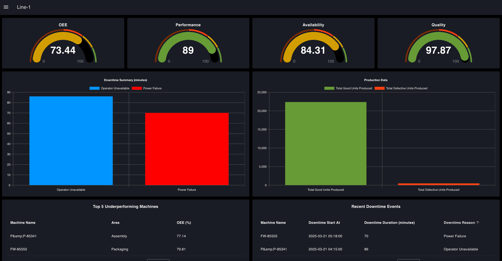

OEE (Overall Equipment Effectiveness) is a KPI used in manufacturing to measure equipment performance based on availability, efficiency, and quality.

To effectively track this KPI, an OEE dashboard is built, but creating one can be complex, especially when consolidating data from various sources, with limited flexibility to integrate data across different systems. Additionally, building a customizable dashboard to suit specific needs adds another layer of complexity.

<!--more-->

With FlowFuse, it's possible to build a customized, OEE Dashboard, without writing any code, that can provide real-time production data based on your needs.

In this first part of a new blog series on building an OEE dashboard with FlowFuse, we explain the concept of OEE, how it is calculated, and outline the basic plan for the dashboard. In that plan, we cover the scope of OEE calculation, key metrics, visualization strategies, and the expected design of the dashboard.

Let’s get started!

## What is OEE?

Overall Equipment Effectiveness (OEE) is a crucial metric in manufacturing that assesses the productivity of equipment through three key components. These components evaluate the efficiency of equipment during the production process:

- **Availability:** How often does the equipment perform when needed?
- **Performance:** How much product does the equipment produce?
- **Production Quality:** How many high-quality products does the equipment produce?

The concept of OEE was introduced by Seiichi Nakajima in the 1960s as part of the [Total Productive Maintenance (TPM)](https://en.wikipedia.org/wiki/Total_productive_maintenance) initiative in Japan. Nakajima, an engineer at the Japan Institute of Plant Maintenance (JIPM), developed OEE to measure and enhance manufacturing productivity by identifying inefficiencies. This metric has since become widely adopted across the manufacturing industry. Today, OEE remains one of the most critical KPIs, with a really huge number of manufacturers considering it either important or very important for improving production efficiency and minimizing waste.

Measuring and improving OEE allows you to improve the utilization of existing machinery and improves operational efficiency. In many cases, improving OEE is the most strategic and cost-effective approach to increasing output.

## How is OEE calculated?

OEE is calculated using the formula:

***OEE (%) = Availability × Performance × Quality***

Where:

- ***Availability (%) = (Operating Time ÷ Planned Production Time) × 100***
- ***Performance (%) = (Actual Output ÷ Maximum Possible Output) × 100***
- ***Quality (%) = (Good Products ÷ Total Products) × 100***

For example, if a machine is available 90% of the time, runs at 95% of its ideal speed, and 98% of products are defect-free, your OEE would be: 0.90 × 0.95 × 0.98 = 83.7%

## Planning Your OEE Dashboard

Now that we’ve covered what OEE is, let's focus on designing a basic plan that details what are the things that we should display on our dashboard. This should consist of three parts:

- **Scope of the Calculation:** How much data will be collected and analyzed?
- **Key Metrics:** Which metrics are the most important to track?
- **Layout & Visualisation:** What visual elements will be used to present the data? 

### Defining the Scope of OEE Calculation

The first and most important step before creating the dashboard is defining the scope of the OEE calculation. The tracking level can vary based on the focus on area. Scope can vary between:

- **Machine-level OEE:** Concentrates on individual machines, aiding in the identification of specific inefficiencies that impact performance.
- **Line-level OEE:** Assesses the entire production line, offering insights into the collaboration of multiple machines and pinpointing where bottlenecks arise.
- **Factory-level OEE:** Compiles data from various production lines to provide a comprehensive overview of overall efficiency and trends. 

For those building dashboards from scratch, it’s advisable to start at the machine level. This approach allows for faster time to value, as data collection can typically begin from a single point, reducing initial complexity. Once you’ve established the machine-level tracking and identified the inefficiencies, you can scale up to line-level and eventually factory-level OEE. Starting with machine-level data ensures that you can quickly uncover key insights and iteratively improve the scope and detail of your dashboard.

For this series, we will be building the dashboard at the line-level. In this case, we will collect data specific to a production line and perform the OEE calculation based on that data.

### Key Metrics and Insights

As mentioned earlier, the dashboard will calculate OEE for a production line, presenting key metrics such as availability, performance, quality, and the overall OEE score. While the overall OEE score provides a quick snapshot of performance, it does not offer enough detail to pinpoint specific areas that need improvement.

To address this, the dashboard will break down the OEE calculation at the machine level as well, enabling managers to identify underperforming machines that affect overall efficiency. Additionally, it will display recent downtime incidents, summarizing this data to uncover trends and identify potential root causes. This breakdown will provide a clearer understanding of where inefficiencies are occurring and allow for targeted corrective actions.

The dashboard will also track production quality, displaying the number of acceptable versus defective parts to ensure a continued focus on quality control. Additionally, last 30-days OEE trend analysis will be included, offering insights into performance changes over time. This will help managers identify patterns, monitor improvements, and highlight areas requiring attention.

### Dashboard Visualization & UI Design

To ensure that insights are easy to understand and act upon, the dashboard will feature a well-structured visual layout that presents complex data in a clear and intuitive manner. After analyzing various OEE dashboards, I designed this one with a focus on clarity, usability, and actionable insights. It will include gauges for a quick OEE overview, bar charts to track downtime and production trends, tables to highlight underperforming machines and recent downtime events, and line charts to monitor efficiency patterns over time. This setup ensures managers can quickly spot problems, understand their causes, and take the necessary steps to optimize production.

The following dashboard image illustrates the intended design and key objectives of our OEE dashboard. Based on the plan outlined in this part, we will build the dashboard interface in the next part of the series using simulated production and downtime data.

Later, we will show how to connect real factory data, scale the dashboard across multiple production lines, and use it to enhance OEE effectively.

{data-zoomable}
_OEE Dashboard_

{data-zoomable}
_OEE Dashboard_

## What Next

Here’s [Part 2](/blog/2025/04/building-oee-dashboard-with-flowfuse-2/) on the next steps to build your OEE dashboard with FlowFuse. But if you rather skip the tutorials and dive straight in, just [register for a FlowFuse account]({{ site.onboardingURL }}) and start using our ready-made [OEE Dashboard Blueprint](/blueprints/manufacturing/oee-dashboard/) to optimize your operations and boost efficiency right away!
