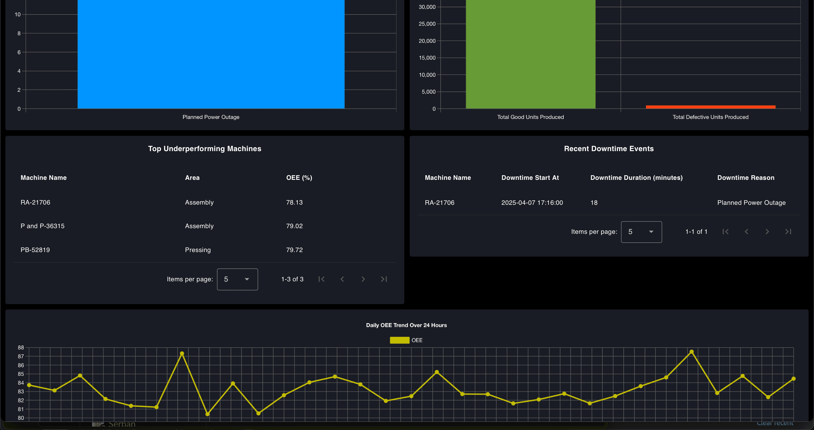

In Part 2, we built the flow to calculate OEE for the production line using simulated production and downtime data and created a dashboard interface for visualization. However, we did not focus much on theme, layout, or styling.

In this Part 3, we will focus on improving the theme and design of the OEE dashboard. We will learn how to connect a real data source, adjust fields if your data structure differs, scale the dashboard for multiple production lines, and finally, explore how you can use it to take action based on insights.

Let's get started !

## Enhancing the Dashboard Theme and Design

In the planning section of [Part 1](/blog/2025/04/building-oee-dashboard-with-flowfuse-part-1/), we introduced a mockup of the dashboard with a modern dark theme. The theme was built around a sleek, professional aesthetic, using high-contrast colors for readability and a visually appealing layout.

The primary colors in the theme include:

- **Black (#000000)** — used for the page background to create contrast and reduce eye strain.
- **Charcoal Blue (#1A1C24)** — a deep, muted tone that adds depth while maintaining a clean and modern look, used for the groups.
- **White (#FFFFFF)** — used for text elements to ensure maximum readability against the dark background.
- **Accent Colors** — vibrant colors such as teal, orange, green, yellow, and blue are used across widget elements, including chart bars, line graphs, and indicators. These accents help differentiate data types and bring attention to key metrics.

### To update the dashboard theme in Node-RED Dashboard 2.0:

1. Open the Dashboard 2.0 sidebar from the Node-RED editor.
2. Switch to the Theme tab.
3. In the list of themes (you will likely see only the default one), click the settings (gear) icon next to it.
4. In the theme settings:
    - Set Charcoal Blue (#1A1C24) as the color for the header background, group background, and group outline.
    - Set Black (#000000) as the page background.
5. Click **Update** and **Deploy Changes**.

Your dashboard should now display the updated dark theme with a clean, modern appearance and improved visual contrast.

However, a few additional adjustments are needed to fully align the visuals — specifically the chart grid lines and label text colors.

### To update these:

1. Double-click on a chart widget to open its configuration panel.
2. Scroll to the bottom of the chart config UI.
3. Uncheck the following options:
    - Use ChartJs Default Text Colors
    - Use ChartJs Default Grid Colors
4. Set the text color to `#FFFFFF` (white) and the grid line color to `#606060`.
5. Click **Done**, then **Deploy the changes**.

These tweaks will ensure the charts match the dark theme and maintain good readability.

## Improving Layout Consistency Across Screen Sizes

When you open the same dashboard on different screen sizes—such as a mobile phone, tablet, or a smaller desktop monitor—you might find that the layout appears inconsistent or cramped. For example, widgets may overlap or appear too small.

{data-zoomable}
_OEE Dashboard broken layout on smaller screen_

### To make the dashboard truly responsive:

1. Open the **Page Settings** in the Node-RED Dashboard editor.
2. Scroll down to locate the **Breakpoint Settings Table** for different device sizes.
3. Identify the **Tablet** row in the table.
4. Notice that the current Tablet column count is set to `9`.

Our OEE dashboard has:

- Four KPI widgets (OEE, Performance, Availability, Quality) each set to 3 columns wide.
- A total of 3 × 4 = 12 columns, which does not fit in the 9-column grid—so the layout breaks and one widget drops to the next row.
- Other widgets like Production Summary and Downtime Events are each 6 columns wide, which leaves 3 columns of unused space in a 9-column layout.

5. To correct this, set the Tablet column count to `6` in the breakpoint table.

This change ensures:

- Two KPI widgets fit perfectly per row (3 + 3 = 6).
- Summary widgets span the full row (6/6), making the layout cleaner and more consistent on tablet devices.

6. Click Deploy the changes.

Even after adjusting the breakpoint settings, one more issue may appear: inconsistent heights between the *Top Underperforming Machines* and *Recent Downtime Events* sections—especially when one of the tables has fewer rows than the other.

{data-zoomable}
_Inconsistent height of the widgets on OEE Dashboard_

This can make the dashboard layout look uneven, with one card appearing much shorter than the other.

To fix this visual imbalance, apply custom CSS:

1. Drag a **Template** widget onto your canvas.
2. Set its type to `CSS (all pages)`.
3. Paste the following CSS into the template:

```css
.nrdb-ui-group > .v-card {
    height: 100% !important;
}
```

4. Deploy the changes.

## Adding Header Elements: Logo and Dashboard Title

To give your OEE Dashboard a professional look, it is a good idea to add branding elements such as a company logo and a clear dashboard title. These additions improve usability and help users instantly recognize the purpose of the dashboard.

1. Drag **Template** widget onto the canvas.
2. Double click onto it and add the following Vue code into it:

```html
<template>
   <!-- Teleport the title and logo to the #app-bar-actions area -->
   <Teleport to="#app-bar-title">
       <h3 style="color: white; margin-left: auto; margin-right: auto;">OEE Dashboard</h3>
   </Teleport>
   <Teleport to="#app-bar-actions">
       <div style="display: flex; align-items: center;">
           
       </div>
   </Teleport>
</template>

<script>
   export default {
   data() {
       return {
           mounted: false
       };
   },
   mounted() {
       this.mounted = true;
   }
};
</script>
```

3. Update the `src` attribute in the `` tag to your logo's path. If you are using FlowFuse, you can host your logo using the static assets service.

4. Click Deploy the changes.

We are using Vue’s Teleport feature to insert a custom dashboard title and logo into the top bar of the Dashboard 2.0 layout. For more information on this please read our article: *Customise theming in your FlowFuse Dashboard*.

## Scaling the Dashboard for Multiple Production Lines

Currently, the dashboard is configured for a single production line. To support multiple lines, you need to adjust your flows and dashboard structure to handle each line separately while keeping a consistent layout and theme.

### Follow these steps:

1. Select the dashboard flow that handles your current production line. Include all relevant change nodes that set values like `msg.quality`, `msg.performance`, etc., to `msg.payload`.
2. From the main menu, hover over **Subflows** and click **Create Subflow**.
3. Inside the subflow:
    - Add an **Input** node, and connect it to all the change nodes you included from the original flow.
    - Reconnect any **Link In** node (that was previously wired to the change nodes) to the input of the newly created subflow.
4. Open the **subflow properties**, and define environment variables to represent widget groups. In the dashboard widgets inside the subflow, reference these variables instead of hardcoding group names.
5. Click **Deploy** to apply the changes.

This modular approach simplifies scaling and reduces manual work when adding new production lines to the dashboard.

### To reuse it for another production line:

1. Copy the entire OEE dashboard flow.
2. Create a new tab.
3. Paste the copied flow into the new tab.
4. Rename the tab to match the new production line.
5. Create a new dashboard page with the same configuration but a different name and path.
6. Open the subflow by double-clicking on it and add a new group for dashboard widgets.
7. Go to the configuration flow, and update the name of the line to match the new production line.
8. Adjust both shift duration values to reflect the new line’s schedule.
9. Click **Deploy**.

Once deployed, you will have a separate page ready for your new production line. You can create as many pages as needed to monitor multiple production lines.

## Connecting Your Real Data Source

Now that you have built a complete OEE dashboard using simulated factory data and learned how to reuse it for all your production lines, the next step is to connect it to your real factory environment.

To make the dashboard truly useful in a live setting, you need to understand how to integrate it with your actual data sources. Most commonly, the OEE dashboard relies on data that is often static or retained — such as values stored in a database. First, determine whether your factory uses a relational database like MySQL or PostgreSQL, a NoSQL database like MongoDB, or a time-series database like InfluxDB.

### Then:

1. Use the **Palette Manager** in Node-RED to install the corresponding contrib node for your selected database.
2. Replace the existing `sqlite` nodes in your flow with the nodes for the database you are using.
3. If using SQL based database, queries may remain unchanged. For NoSQL or time-series DBs, rewrite the queries as needed.

For help, refer to our [Database](/node-red/database/) section, which includes guides for MongoDB, PostgreSQL, InfluxDB, TimescaleDB, and DynamoDB.

When connecting to your real data source, you may notice that the field names used in your database are different from those used in the our oee dashboard sqlite node queries. While this might seem like a lot of manual work, the good news is that the dashboard is designed with flexibility in mind. You only need to make two changes to adapt the queries to your schema.

### To match your schema:

1. Open each database node and update the query to reflect your field names.
   - Do **not** change the alias names — they are used throughout the dashboard.
2. Replace table names with those used in your actual database.
3. Do **not** change the dynamic parameters like `$startTime`, `$endTime`, and `$line`.

Example query:

```sql
SELECT
   timestamp as timestamp,
   machine_name as machine_name,
   area as area,
   line as line,
   total_produced_units as total_produced_units,
   good_units as good_units,
   defect_units as defect_units,
   target_output as target_output
FROM ProductionData
WHERE
   timestamp BETWEEN $startTime AND $endTime AND line = $line;
```

If your database uses different field names, such as time instead of timestamp, machine instead of machine_name, section instead of area, production_line instead of line, produced_units instead of total_produced_units, quality_units instead of good_units, faulty_units instead of defect_units, or planned_output instead of target_output, you should update the query accordingly. After modification, it should look like this:

```sql
SELECT
    time AS timestamp,
    machine AS machine_name,
    section AS area,
    production_line AS line,
    produced_units AS total_produced_units,
    quality_units AS good_units,
    faulty_units AS defect_units,
    planned_output AS target_output
FROM YourTableName 
WHERE 
    time BETWEEN $startTime AND $endTime AND production_line = $line;
```

## How to Actually Use Your OEE Dashboard

Alright, your OEE dashboard is up and running. It looks good, updates in real time, and shows a bunch of numbers—but what now?

This is where the dashboard becomes more than just a display. When OEE drops, do not stop at the number—figure out what changed. Start by checking the three key metrics: availability, performance, and quality. If availability is down, it could mean an unplanned stop, setup time, or a machine that sat idle. If performance dropped, maybe the output slowed down for some reason. And if quality is lower, you are likely seeing more rejects or rework.

Let’s say OEE falls from 82% to 65%, and the dashboard shows performance is down. Start by checking production data. See if fewer good parts were produced during that time. Then look at the defect count—an increase in rejects might be affecting both quality and performance. After that, check the downtime logs and the list of underperforming machines. Most times, you will find one or two machines behind the dip—maybe there was a recurring issue or a drop in efficiency after a changeover.

Use the 30-day graph to spot longer-term trends. Even if the day-to-day numbers look okay, the graph can reveal a slow decline or confirm that recent improvements are working.

## Conclusion

This final part completes our series on building a real-time OEE dashboard with FlowFuse. You now have a fully functional, visually refined, and scalable dashboard that connects to live production data, adapts to multiple lines, and reflects your plant’s branding and layout requirements.

By the end of this journey, you have not only built a dashboard—you have created a foundation for continuous improvement in your manufacturing environment using open-source, low-code tools.
We hope this series helped you understand how FlowFuse and Node-RED can be used to quickly prototype and deploy powerful industrial applications. Thank you for following along!

If you have not built your OEE dashboard yet or are facing issues along the way, you can get started instantly—[sign up](https://app.flowfuse.com/account/create) now and use our ready-made [OEE Dashboard Blueprint](/blueprints/manufacturing/oee-dashboard/) to accelerate your deployment.