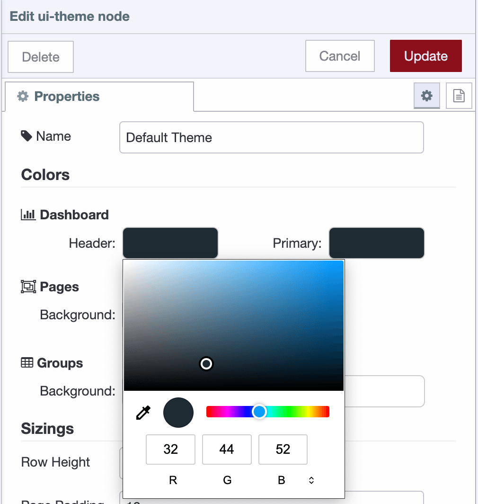
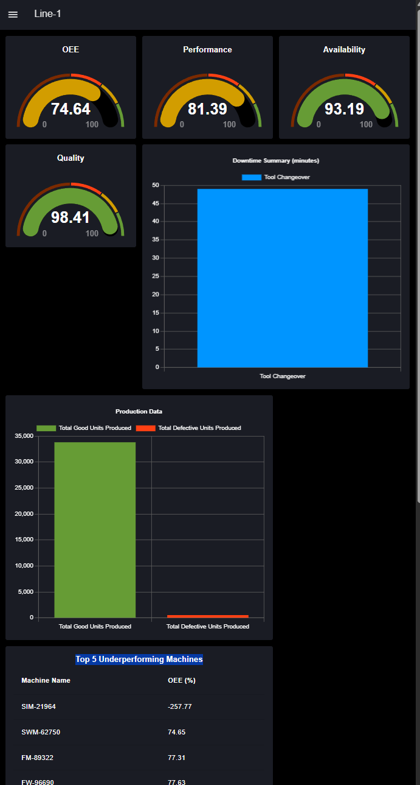
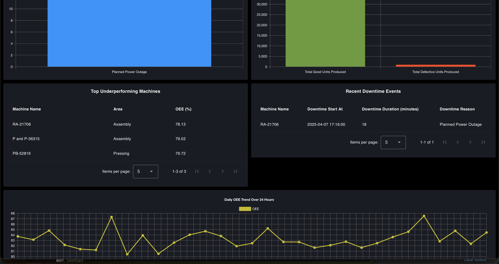
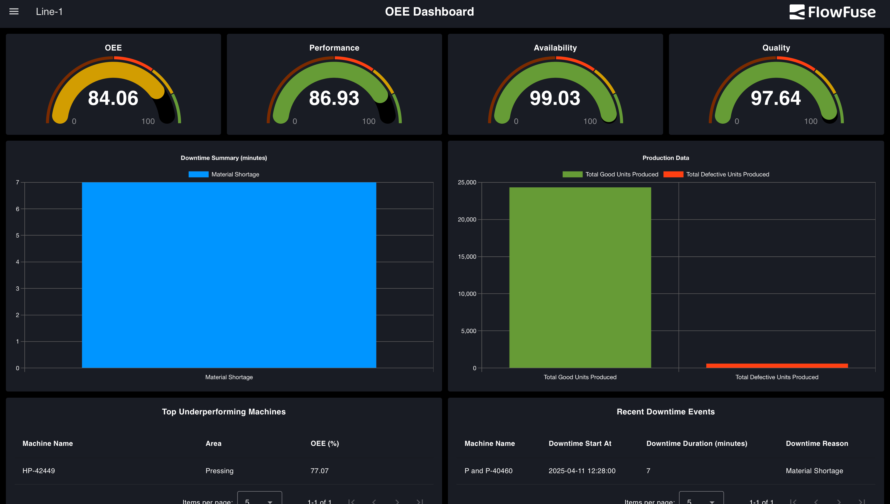
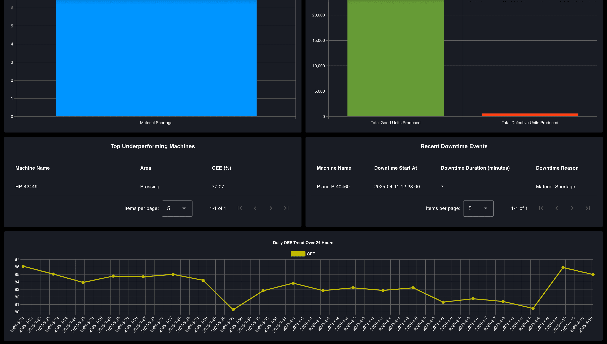
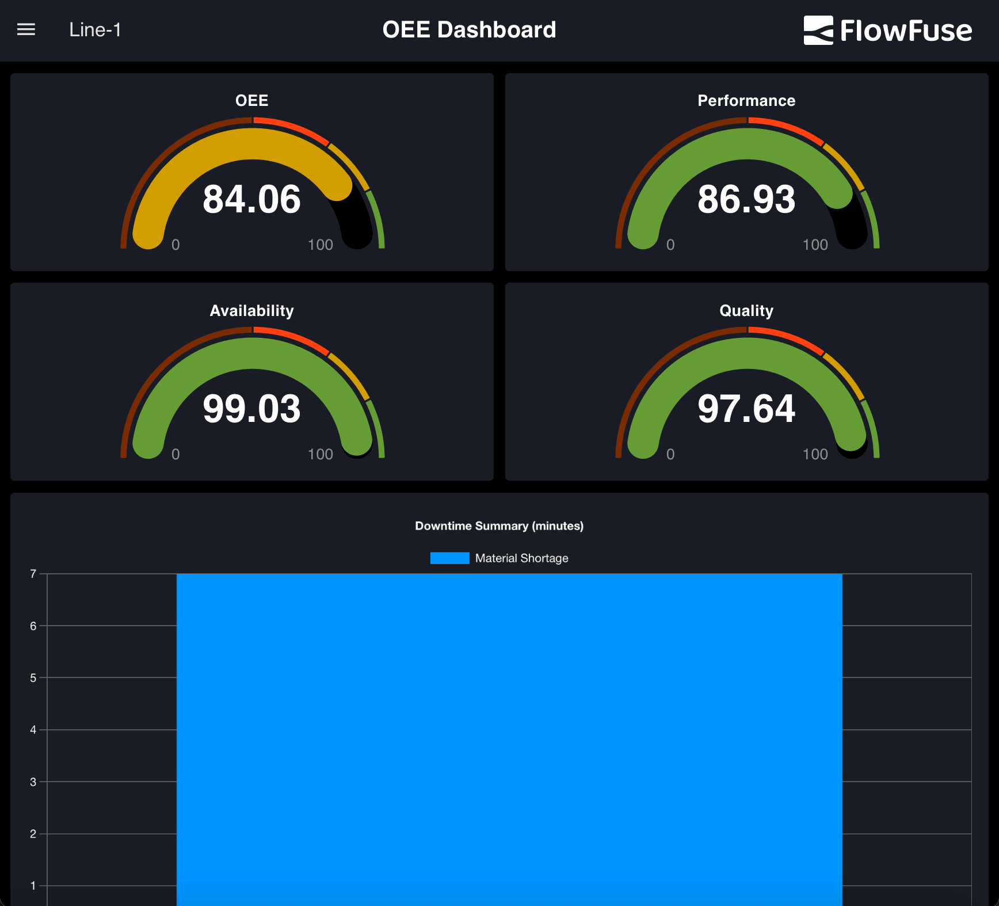
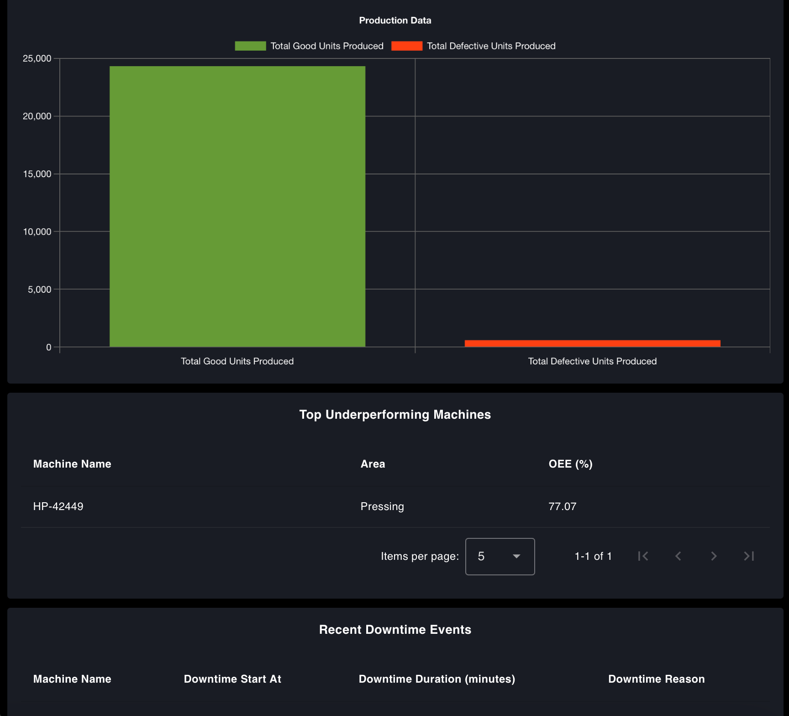

In [Part 2 of this series](/blog/2025/04/build-manufacturing-oee-dashboard/), we built the flow that calculates OEE for a production line from simulated production and downtime data, and put a dashboard interface on top of it. What we did not do was make it look like something you would hang on a factory wall.

<!--more-->

This final part closes that gap. We will theme the dashboard, fix the layout so it holds up on tablets and smaller monitors, add branding to the header, scale it across multiple production lines with subflows, and finally swap the simulated data for your real database. We will finish with how to actually act on what the dashboard tells you.

If you have not worked through [Part 1](/blog/2025/04/what-is-an-oee-dashboard/) and [Part 2](/blog/2025/04/build-manufacturing-oee-dashboard/), start there - this article assumes you already have the flow from Part 2 deployed.

Let's get started!

## Enhancing the Dashboard Theme and Design

In the planning section of [Part 1](/blog/2025/04/what-is-an-oee-dashboard/), we introduced a mockup of the dashboard with a modern dark theme. The theme was built around a sleek, professional aesthetic, using high-contrast colors for readability and a visually appealing layout.

The primary colors in the theme include:

- **Black (#000000)**, used for the page background to create contrast and reduce eye strain.
- **Charcoal Blue (#1A1C24)**, a deep, muted tone that adds depth while maintaining a clean and modern look, used for the groups.
- **White (#FFFFFF)**, used for text elements to ensure maximum readability against the dark background.
- **Accent Colors**, vibrant colors such as teal, orange, green, yellow, and blue are used across widget elements, including chart bars, line graphs, and indicators. These accents help differentiate data types and bring attention to key metrics.

But how do you come up with a dashboard design like this on your own? It starts with understanding why the theme matters. The design should reflect the context it is used in, the people interacting with it, and the mood it should convey. A dashboard on a factory floor may need to feel bold and focused, while one used by executives might aim for minimal and polished. A hospital system would need a tone that is calm, clean, and highly legible.

If you have a brand palette, that’s a great starting point. If not, choose colors that support the usability and tone of your dashboard. Our OEE dashboard, for instance, was designed for manufacturing teams who need to quickly read live data. The layout needed to be sharp, high-contrast, and low on visual noise, ideal for control rooms with limited lighting. The dark theme helps key data stand out while reducing eye strain over long periods of use.

### What to Consider When Designing a Factory Dashboard

A dashboard destined for the shop floor is not the same design problem as one viewed on a laptop, and a few constraints should shape every decision you make:

- **Design for the viewing distance.** A wall-mounted screen is read from three to ten meters away, often by someone walking past. The OEE number needs to be legible at that distance, which usually means it is far larger than feels comfortable in the editor. Size the type for the furthest reader, not for your monitor.
- **Give the screen one job.** Someone glancing up for two seconds should learn one thing: are we on target or not. Put the overall OEE score in the strongest visual position and let availability, performance, and quality sit a level below it. Everything else - machine breakdowns, downtime tables, trends - is for the person who has already stopped to investigate.
- **Use color to encode state, not to decorate.** Reserve green, amber, and red for whether a value is good, marginal, or bad, and use neutral tones for everything else. If every widget is colorful, nothing reads as urgent. Also check your palette against red-green color blindness, which affects roughly one in twelve men - pair color with position, shape, or a label so it is never the only signal.
- **Match the lighting.** A dark theme works well in a dim control room but can wash out under bright shop-floor lighting or direct sunlight, where a light, high-contrast theme reads better. Whichever you pick, hold a strong contrast ratio between text and background and avoid mid-grey on mid-grey.
- **Never make a wall display scroll or ask for input.** Nobody will scroll a screen mounted six feet up. If the content does not fit, split it across pages that rotate, or cut it. Same for anything requiring a click - an unattended display must be complete standing still.
- **Show the reader when the data is stale.** A frozen dashboard looks identical to a healthy one. A visible last-updated timestamp, or a status indicator that turns amber when data stops arriving, prevents decisions being made on yesterday's numbers.
- **Design for the person, not the metric.** An operator needs to know what to do right now; a supervisor needs the shift trend; a plant manager wants to compare lines. Trying to serve all three on one screen serves none of them. Build separate pages and route each audience to their own.

For a fuller tour of the theming and layout options available to you beyond what we use here, see our [comprehensive guide to FlowFuse Dashboard layout, sidebar, and styling](/blog/2024/05/node-red-dashboard-2-layout-navigation-styling/).

### Modifying Theme

1. Open the Dashboard 2.0 sidebar from the Node-RED editor.
2. Switch to the Theme tab.
3. In the list of themes (you will likely see only the default one), click the settings (gear) icon next to it.
4. In the theme settings, click any colored rectangle to open the color picker. You can use the wheel or the dropper tool at the bottom to pick exact colors:

{data-zoomable}
_Color tool for selecting colors for the theme_

   - Set Charcoal Blue (#1A1C24) as the color for the header background, group background, and group outline.
   - Set Black (#000000) as the page background.

5. Click **Update** and **Deploy Changes**.

Your dashboard should display the updated dark theme with a clean, modern appearance and improved visual contrast.

However, additional adjustments are needed to fully align the visuals, specifically the chart grid lines and label text colors.

### To update these:

1. Double-click on a chart widget to open its configuration panel.
2. Scroll to the bottom of the chart config UI.
3. Uncheck the following options:
    - Use ChartJs Default Text Colors
    - Use ChartJs Default Grid Colors
4. Set the text color to `#FFFFFF` (white) and the grid line color to `#606060`.
5. Click **Done**, then **Deploy the changes**.

These tweaks will ensure the charts match the dark theme and maintain good readability.

## Improving Layout Consistency Across Screen Sizes

When you open the same dashboard on different screen sizes, such as a mobile phone, tablet, or smaller desktop monitor, you might find the layout inconsistent or cramped. For example, widgets may overlap or appear too small.

{data-zoomable}
_OEE Dashboard broken layout on smaller screen_

### To make the dashboard truly responsive:

1. Open the **Page Settings** in the Node-RED Dashboard editor.
2. Scroll down to locate the **Breakpoint Settings Table** for different device sizes.
3. Identify the **Tablet** row in the table.
4. Notice that the current Tablet column count is set to `9`.

Our OEE dashboard has:

- Four KPI widgets (OEE, Performance, Availability, Quality), each set to 3 columns wide.
- A total of 3 × 4 = 12 columns, which does not fit in the 9-column grid, so the layout breaks, and one widget drops to the next row.
- Other widgets like Production Summary and Downtime Events are each 6 columns wide, which leaves 3 columns of unused space in a 9-column layout.

5. To correct this, set the Tablet column count to `6` in the breakpoint table.

This change ensures:

- Two KPI widgets fit perfectly per row (3 + 3 = 6).
- Summary widgets span the full row (6/6), making the layout cleaner and more consistent on tablet devices.

6. Click Deploy the changes.

Even after adjusting the breakpoint settings, one more issue may appear: inconsistent heights between the *Top Underperforming Machines* and *Recent Downtime Events* sections, especially when one of the tables has fewer rows than the other.

{data-zoomable}
_Inconsistent height of the widgets on the OEE Dashboard_

This can make the dashboard layout uneven, with one card appearing much shorter.

To fix this visual imbalance, apply custom CSS:

1. Drag a **Template** widget onto your canvas.
2. Set its type to `CSS (all pages)`.
3. Paste the following CSS into the template:

```css
.nrdb-ui-group > .v-card {
    height: 100% !important;
}
```

4. Deploy the changes.

## Adding Header Elements: Logo and Dashboard Title

To give your OEE Dashboard a professional look, add branding elements such as a company logo and a clear dashboard title. These additions improve usability and help users instantly recognize the dashboard's purpose.

1. Drag **Template** widget onto the canvas.
2. Double click on it and add the following Vue code to it:

```html
<template>
   <!-- Teleport the title and logo to the #app-bar-actions area -->
   <Teleport to="#app-bar-title">
       <h3 style="color: white; margin-left: auto; margin-right: auto;">OEE Dashboard</h3>
   </Teleport>
   <Teleport to="#app-bar-actions">
       <div style="display: flex; align-items: center;">
           
       </div>
   </Teleport>
</template>

<script>
   export default {
   data() {
       return {
           mounted: false
       };
   },
   mounted() {
       this.mounted = true;
   }
};
</script>
```

3. Update the `src` attribute in the `` tag to your logo's path. If you are using FlowFuse, you can host your logo using the [static asset service](/docs/user/static-asset-service/), which serves files directly from your instance so you do not have to depend on an external image host.

4. Click Deploy the changes.

We are using Vue’s Teleport feature to insert a custom dashboard title and logo into the top bar of the Dashboard 2.0 layout. For more information, please read our article: [Customise theming in your FlowFuse Dashboard](/blog/2024/08/customise-theming-in-your-dashboards/).

The dashboard now looks clean, adapts well to all screen sizes, and maintains visual consistency across different UI elements. The header elements have also been enhanced to align with the overall design.

{data-zoomable}
_OEE Dashboard with proper styling, theme_

{data-zoomable}
_OEE Dashboard with proper styling, theme_

{data-zoomable}
_OEE Dashboard with proper styling, theme on smaller screen_

{data-zoomable}
_OEE Dashboard with proper styling, theme on smaller screen_

## Scaling the Dashboard for Multiple Production Lines

Currently, the dashboard is configured for a single production line. To support multiple lines, you must adjust your flows and dashboard structure to handle each line separately while keeping a consistent layout and theme.

The tool that makes this manageable is the subflow: one reusable definition, many instances, each configured through environment variables. If subflows are new to you, our guide on [how to create and use subflows](/blog/2024/09/how-to-use-subflow-in-node-red/) covers the basics before you apply them here.

### Follow these steps:

1. Select the dashboard flow that handles your current production line. Include all relevant change nodes that set values like `msg.quality`, `msg.performance`, etc., to `msg.payload`.
2. From the main menu, hover over **Subflows** and click **Create Subflow**.
3. Inside the subflow:
    - Add an **Input** node, and connect it to all the change nodes you included from the original flow.
    - Reconnect any **Link In** node (that was previously wired to the change nodes) to the input of the newly created subflow.
4. Open the **subflow properties**, and define environment variables to represent widget groups. In the dashboard widgets inside the subflow, reference these variables instead of hardcoding group names.
5. Click **Deploy** to apply the changes.

This modular approach simplifies scaling and reduces manual work when adding new production lines to the dashboard.

### To reuse it for another production line:

1. Copy the entire OEE dashboard flow.
2. Create a new tab.
3. Paste the copied flow into the new tab.
4. Rename the tab to match the new production line.
5. Create a new dashboard page with the same configuration but a different name and path.
6. Open the subflow by double-clicking on it and add a new group for dashboard widgets.
7. Go to the configuration flow, and update the line's name to match the new production line.
8. Adjust both shift duration values to reflect the new line’s schedule.
9. Click **Deploy**.

Once deployed, you will have a separate page ready for your new production line. You can create as many pages as needed to monitor multiple production lines.

## Connecting Your Real Data Source

Now that you have built a complete OEE dashboard using simulated factory data and learned how to reuse it for all your production lines, the next step is to connect it to your real factory environment.

To make the dashboard truly useful in a live setting, you must understand how to integrate it with your data sources. Most commonly, the OEE dashboard relies on static or retained data, such as values stored in a database. First, determine whether your factory uses a relational database like MySQL or PostgreSQL, a NoSQL database like MongoDB, or a time-series database like InfluxDB.

### Then:

1. Use the **Palette Manager** in Node-RED to install the corresponding contrib node for your selected database.
2. Replace the existing `sqlite` nodes in your flow with the nodes for the database you are using.
3. If using SQL based database, queries may remain unchanged. For NoSQL or time-series DBs, rewrite the queries as needed.

For help, refer to our [Database](/node-red/database/) section, which includes guides for MongoDB, PostgreSQL, InfluxDB, TimescaleDB, and DynamoDB. If you do not already have a database to point at, [FlowFuse Tables](/docs/user/ff-tables/) gives you a managed PostgreSQL instance inside the platform - we walk through that pattern end to end in [Building a historical data dashboard with FlowFuse Tables](/blog/2025/08/time-series-dashboard-flowfuse-postgresql/).

When connecting to your real data source, you may notice that the field names used in your database differ from those used in the our oee dashboard sqlite node queries. While this seems like a lot of manual work, the dashboard is designed with flexibility in mind. You only need to make two changes to adapt the queries to your schema.

### To match your schema:

1. Open each database node and update the query to reflect your field names.
   - Do **not** change the alias names, they are used throughout the dashboard.
2. Replace table names with those used in your actual database.
3. Do **not** change the dynamic parameters like `$startTime`, `$endTime`, and `$line`.

Example query:

```sql
SELECT
   timestamp as timestamp,
   machine_name as machine_name,
   area as area,
   line as line,
   total_produced_units as total_produced_units,
   good_units as good_units,
   defect_units as defect_units,
   target_output as target_output
FROM ProductionData
WHERE
   timestamp BETWEEN $startTime AND $endTime AND line = $line;
```

Suppose your database uses different field names, such as time instead of timestamp, machine instead of machine_name, section instead of area, production_line instead of line, produced_units instead of total_produced_units, quality_units instead of good_units, faulty_units instead of defect_units, or planned_output instead of target_output. In that case, you should update the query accordingly. After modification, it should look like this:

```sql
SELECT
    time AS timestamp,
    machine AS machine_name,
    section AS area,
    production_line AS line,
    produced_units AS total_produced_units,
    quality_units AS good_units,
    faulty_units AS defect_units,
    planned_output AS target_output
FROM YourTableName 
WHERE 
    time BETWEEN $startTime AND $endTime AND production_line = $line;
```

## How to Use Your OEE Dashboard

Your OEE dashboard is live. It updates in real-time and shows key metrics. But what should you do with the information?

The dashboard is not just for display, it is there to help you take action. When OEE drops, do not stop at the number. Dig into the cause by checking the three main metrics: availability, performance, and quality.

- If availability is low, check for unplanned stops, long changeovers, or idle machines. A [machine downtime tracking application](/blog/2026/07/build-downtime-logger/) is the natural next build, and [automating downtime detection and escalation](/blog/2026/06/event-driven-downtime-escalation-workflow/) stops those stops from going unlogged in the first place.
- If performance is down, the line may run slower than expected.
- If quality has dropped, you may produce more rejects or rework. A [defect tracking and quality monitoring dashboard](/blog/2026/07/defect-and-quality-monitoring/) gives you the detail this view cannot.

One caution before you start making decisions from this screen: OEE is easy to compute in a way that flatters the plant. [OEE is misleading your factory: here's how to fix it](/blog/2026/05/fixing-oee-measurement-in-manufacturing/) walks through the measurement mistakes that inflate the number, and [TEEP](/blog/2025/12/what-is-teep/) is the companion metric that exposes capacity your OEE score hides.

Say your OEE drops from 82% to 65%, and performance is the problem. Start by checking how many good parts were produced. Look at reject counts, more bad parts affect both quality and output. Then, check downtime logs and machine performance. One or two machines are often behind the drop, maybe they had repeated issues or ran slowly after a setup.

Use the 30-day trend graph to spot patterns over time. A sudden drop might show a specific issue, while a slow decline could signal a more significant process problem. Trends can also help you confirm if recent changes are making a real difference.
Finally, share what you find. Use the dashboard during team reviews or shift handovers to keep everyone focused on what needs fixing. An OEE dashboard's real value is how you respond to it.

## Conclusion

This final part completes our series on building a real-time OEE dashboard with FlowFuse. You now have a fully functional, visually refined, and scalable dashboard that connects to live production data, adapts to multiple lines, and reflects your plant’s branding and layout requirements.

By the end of this journey, you have built a dashboard and created a foundation for continuous improvement in your manufacturing environment using open-source, low-code tools.
We hope this series helped you understand how FlowFuse and Node-RED can quickly prototype and deploy powerful industrial applications. Thank you for following along!

If you have not built your OEE dashboard yet, or you got stuck somewhere along the way, you can skip ahead: [sign up](https://app.flowfuse.com/account/create) and start from our ready-made [OEE Dashboard Blueprint](/blueprints/manufacturing/oee-dashboard/) instead of building the flow from scratch.

And if you are working out what else belongs on the floor alongside OEE, our [manufacturing dashboard examples](/blog/2026/08/manufacturing-dashboard-examples/) cover production, downtime, quality, and calibration views built the same way.

If you landed here first, [Part 1 explains what an OEE dashboard is and how to plan one](/blog/2025/04/what-is-an-oee-dashboard/) and [Part 2 builds the flow behind it](/blog/2025/04/build-manufacturing-oee-dashboard/).
