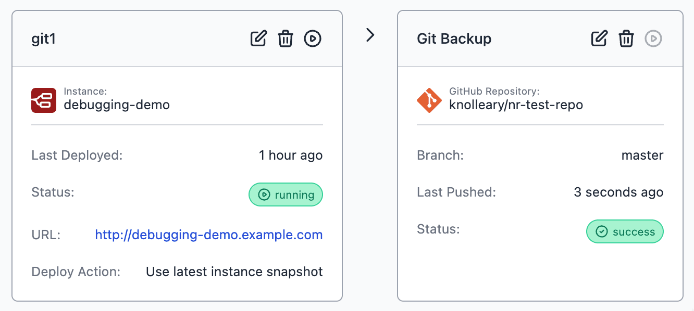
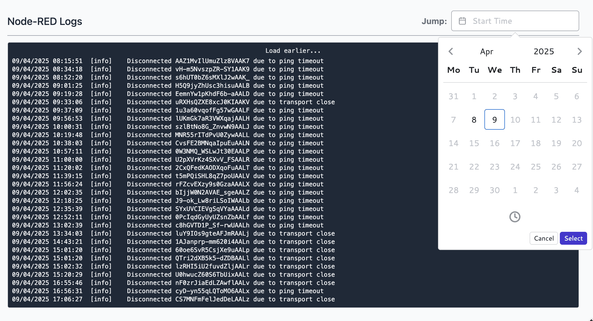

Another release from the FlowFuse team to keep [realising our mission](https://flowfuse.com/handbook/company/strategy/) to empower you to fuse the digital realm and physical reality.

<!--more-->

## Git Integration

{data-zoomable}
_Screenshot of a Git Pipeline Stage_

This has been one of those features that has come up a number of times with our users; we knew we wanted to have Git integration in the platform, but we also wanted it to fit in a natural way with the developer workflows we provide.

With this release, you can now add a Git Repository stage to your deployment pipelines. When the pipeline is triggered, the latest snapshot will get pushed to the configured repository.

This is very much a "first-iteration" of the feature that will allow us to get feedback early and continue to iterate.

With this release, the following restrictions apply:

 - Only GitHub.com hosted repostories are supported
 - Users must create a GitHub Personal Access Token and add to their Team Settings
 - We currently only support pushing snapshots to a Git repository

This last point is important; this release lets you backup your flows to git, but we haven't yet enabled the return journey of pulling a snapshot from a Git repository back to your Node-RED instance. That'll come in the near future and will unlock a full git-based review workflow within the pipelines.

We'll also look at enabling other Git hosting providers - let us know which you'd like to see on the list.

This feature is available to Enterprise teams on FlowFuse Cloud and self-hosted customers.

## Better Node-RED log handling

We've improved the log handling within our Hosted Node-RED instances. Previously we were using a fix sized buffer in memory; meaning the noisier your Node-RED instance was, the less history you'd have. The UI for browsing the logs was also awkward when you wanted to jump back to an earlier section of the logs.

With this release, once you update your instances to the latest version, we will
now store the last 7 days worth of logs for each hosted Node-RED instance.

To go along side this, we've added the ability to jump to a specific time/date in the logs without having to endlessly scroll.

To start benefiting from the extended logs, make sure you update the latest version via your Instance Settings page.

{data-zoomable}
_Screenshot of browsing Node-RED logs by timestamp_

## Remote Instance Provisioning

We've updated the provisioning token support to allow you to automatically assign your remote instances to an application within your team.

The option to assign to a hosted instance is still there, but being able to assign to the appilcation is more generally useful for most workflows on the platform.

Details available in the [changelog](https://flowfuse.com/changelog/2025/04/device-provisioning/).

## Local Login for Remote Instances

One of the great features of our Remote Instance management is that we enable secure remote access to the Node-RED editor through the platform. To date, this approach has meant we disable direct local access to the editor.

With the most recent Device Agent release, we've added the ability to configure a local user login for the editor. This can be used when the remote instance is not able to reach the FlowFuse platform.

We're keen for feedback on this and will continue to explore otherwise to provide secure local access to the remote instance.

## Resource Alerts

We expanded the notficiations we send to help you track the health of your Node-RED instances. We will now send notifications if the CPU and/or memory usages exceeds 75% of the available capacity for a prolonged time.

You can further opt-in or out of these notifications via the instance settings.

Details available in the [changelog](https://flowfuse.com/changelog/2025/03/resource-notifications/)

## Changes to tags for `flowfuse/node-red` containers

For kubernetes and docker environments, we've updated the base container our `latest` tag points at to ensure
it defaults to the latest Node.js and Node-RED versions.

Check the [changelog](https://flowfuse.com/changelog/2025/03/container-tags/) entry for full details

## What Else Is New?

For a full list of everything that went into our 2.16 release, you can check out the [release notes](https://github.com/FlowFuse/flowfuse/releases/tag/v2.16.0).

We're always working to enhance your experience with FlowFuse. We're always interested in your thoughts about FlowFuse too. Your feedback is crucial to us, and we'd love to hear about your experiences with the new features and improvements. Please share your thoughts, suggestions, or report any [issues on GitHub](https://github.com/FlowFuse/flowfuse/issues/new/choose). 

Together, we can make FlowFuse better with each release!

## Try FlowFuse

### Self-Hosted

We're confident you can have self managed FlowFuse running locally in under 30 minutes. You can install FlowFuse using [Docker](/docs/install/docker/) or [Kubernetes](/docs/install/kubernetes/).

### FlowFuse Cloud

The quickest and easiest way to get started with FlowFuse is on our own hosted instance, FlowFuse Cloud.

[Get started for free]() now, and you'll have your own Node-RED instances running in the Cloud within minutes.
