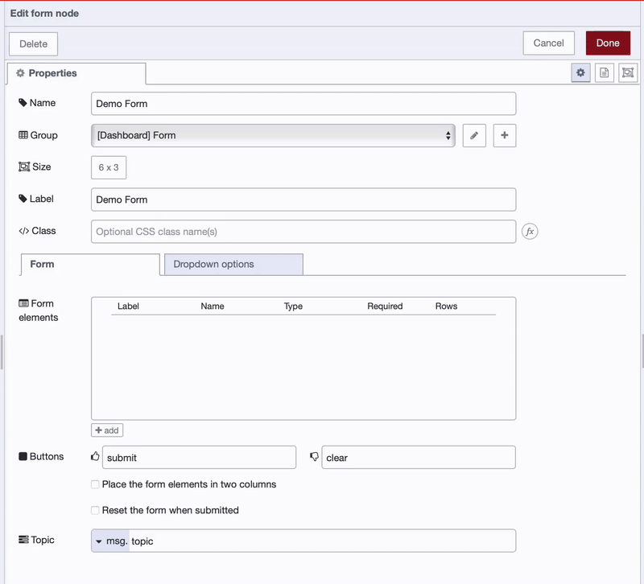
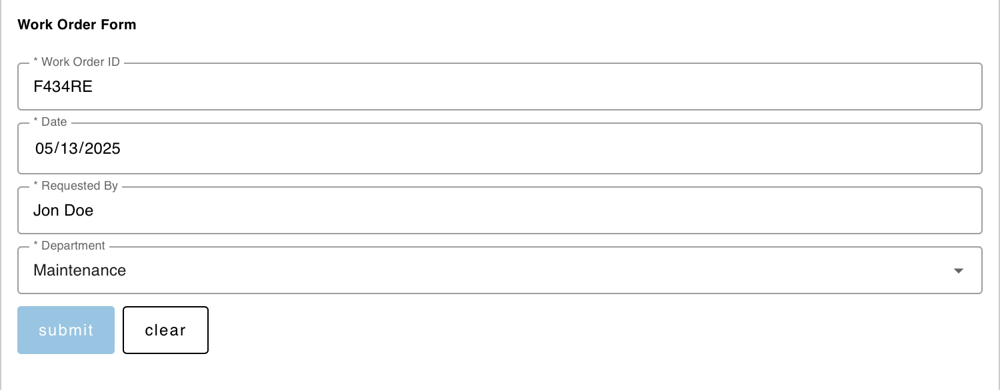
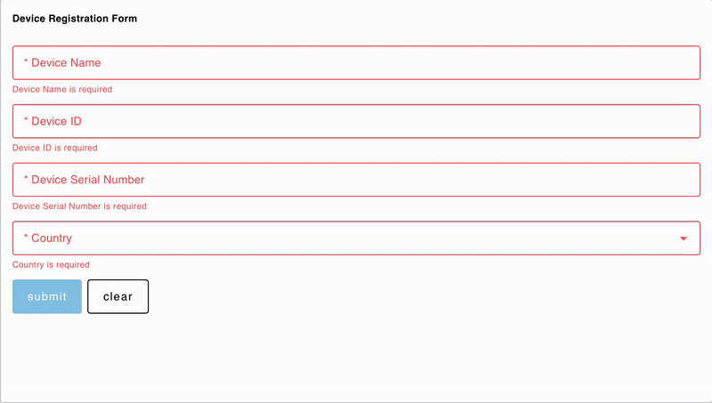

Some industrial applications are built purely for monitoring, while others focus on control and configuration. Dashboards that support control and configuration often require forms—but building forms and handling data from them can seem complex. With the FlowFuse Dashboard, you can quickly create dashboards with forms, whether they are simple or highly dynamic.

<!--more-->

In this article, you will learn how to build both static and dynamic forms using the FlowFuse Dashboard and collect data within Node-RED and FlowFuse.

## Prerequisites

Before you begin, make sure you have the following:

- **Running FlowFuse Instance:** Make sure you have a FlowFuse instance set up and running. If you don't have an account, check out our [free trial](https://app.flowfuse.com/account/create).
- **FlowFuse Dashboard:** Ensure you have [FlowFuse Dashboard](https://flows.nodered.org/node/@flowfuse/node-red-dashboard) (also known as Node-RED Dashboard 2.0 in the community) installed and properly configured on your instance.
- You are familiar with creating and deploying basic flows in Node-RED. If not, consider taking the [Node-RED Fundamentals Course](https://node-red-academy.learnworlds.com/course/node-red-getting-started) sponsored by FlowFuse.

## Creating Forms in FlowFuse Dashboard

In the FlowFuse Dashboard, forms can be created using the `ui_form` widget. This widget is highly flexible and supports a wide range of input types, such as text fields, number inputs, date pickers, text areas, dropdowns, and checkboxes. One of its key strengths is the ability to configure these fields either statically or dynamically, depending on the requirements of your flow.

### Adding and Configuring the Form Widget

1. Drag the **ui_form** widget onto the canvas.
2. Double-click on the widget and create a new group for it with the correct page configuration to render it.
3. Set the correct size (width and height) according to your preferences.
4. Enter the label for the form.

Now that we have completed all the basic and necessary configurations for the form, let’s add the input elements.

### Adding Input Fields to the Form Statically

The `ui_form` widget supports various input element types that can be tailored to specific use cases — from collecting simple text to selecting dates or choosing from predefined options.

**To add input elements:**

1. Click the **+ add** button in the widget’s configuration dialog.
2. A new configuration row will appear for the element.
3. Configure each input element with the following fields:

- **Label**: This is the visible label for the field shown to the user.
- **Name**: A unique key used in the message payload (e.g., `msg.payload.firstname`) when the form is submitted.
- **Type**: Select the input type. Supported types include:
  - **Text**: For short text inputs (e.g., name, city).
  - **Number**: For numeric inputs (e.g., age, price).
  - **Date**: For selecting a date.
  - **Text Area**: For longer free-form text.
  - **Dropdown**: For selecting from a list of predefined values.  
    _We will cover how to add options to the dropdown field in a later section._
  - **Checkbox**: For boolean values (checked or unchecked).
- **Required**: Check this box to make the field mandatory. The form cannot be submitted unless this field is filled.
- **Row**:: If Multiline is selected, this defines the number of visible rows in the text area.

{data-zoomable}
_Adding Form Elements_]

#### Adding Options to Dropdown Inputs Statically

When you select Dropdown as the input type while adding an element to the **ui_form** widget, you need to provide a list of options that the user can choose from. These options can be configured in the **ui_form** widget's configuration dialog.

**To add static options:**

1. In the **ui_form** widget's configuration dialog, switch to the Dropdown Options tab.
2. Click the **+ add** button to insert a new option row.
3. In the new row, fill in the following fields:
   - **Dropdown**: Select the dropdown input field you want to add options to.
   - **Value**: The internal value that will be sent in the form payload when this option is selected.
   - **Label**: The visible text shown to the user in the dropdown list.

Repeat this process for each option you want to add.

Below i have provided simple form for work order image and the flow:

{data-zoomable}
_Work Order Form_]


[{"id":"ae88cb20d346b699","type":"ui-form","z":"c999ef59c5b6d761","name":"Manufacturing Work Order Form","group":"9d8410282eed756b","label":"Work Order Form","order":1,"width":"6","height":"3","options":[{"label":"Work Order ID","key":"workOrderId","type":"text","required":true,"rows":null},{"label":"Date","key":"date","type":"date","required":true,"rows":null},{"label":"Requested By","key":"requestedBy","type":"text","required":true,"rows":null},{"label":"Department","key":"department","type":"dropdown","required":true,"rows":null}],"formValue":{"workOrderId":"","date":"","requestedBy":"","department":""},"payload":"","submit":"submit","cancel":"clear","resetOnSubmit":false,"topic":"topic","topicType":"msg","splitLayout":"","className":"","passthru":false,"dropdownOptions":[{"dropdown":"department","value":"Production","label":"Production"},{"dropdown":"department","value":"QA","label":"Maintenance"},{"dropdown":"department","value":"Logistics","label":"Logistics"}],"x":990,"y":280,"wires":[[]]},{"id":"9d8410282eed756b","type":"ui-group","name":"Form","page":"af5d8df053cee060","width":6,"height":"4","order":1,"showTitle":false,"className":"","visible":"true","disabled":"false","groupType":"default"},{"id":"af5d8df053cee060","type":"ui-page","name":"Dashboard","ui":"14350e2db0cc0391","path":"/demo","icon":"home","layout":"grid","theme":"8f11ab98853c5874","breakpoints":[{"name":"Default","px":"0","cols":"3"},{"name":"Tablet","px":"576","cols":"6"},{"name":"Small Desktop","px":"768","cols":"9"},{"name":"Desktop","px":"1024","cols":"12"}],"order":1,"className":"","visible":true,"disabled":false},{"id":"14350e2db0cc0391","type":"ui-base","name":"My Dashboard","path":"/dashboard","appIcon":"","includeClientData":true,"acceptsClientConfig":["ui-notification","ui-control"],"showPathInSidebar":false,"headerContent":"page","navigationStyle":"default","titleBarStyle":"default","showReconnectNotification":true,"notificationDisplayTime":1,"showDisconnectNotification":true,"allowInstall":true},{"id":"8f11ab98853c5874","type":"ui-theme","name":"Theme Name","colors":{"surface":"#ffffff","primary":"#0094ce","bgPage":"#eeeeee","groupBg":"#ffffff","groupOutline":"#cccccc"},"sizes":{"density":"default","pagePadding":"12px","groupGap":"12px","groupBorderRadius":"4px","widgetGap":"12px"}}]


This method is ideal for simple or fixed lists—such as predefined categories, yes/no selections, or product IDs. For more dynamic use cases, such as loading values from a database or API, you can send options dynamically at runtime (covered in the next section).

### Add Form Elements Dynamically at Runtime

Sometimes you’ll need to adjust the form dynamically based on real-time data. For example, showing additional fields based on a user’s selection, or loading dropdown options from an API. This dynamic capability adds a new level of interactivity to your forms.

**To update form fields at runtime:**

1. Use the `msg.ui_update.options` message to modify the form after it has been rendered.
2. This message should contain an array of objects, where each object defines the new configuration for the element:

Below are the supported element types and their corresponding JSON configurations:

| **Element Type** | **JSON Configuration** |
|------------------|------------------------|
| **Text** | ```{ "type": "text", "label": "Name", "key": "name", "required": true }``` |
| **Multiline** | ```{ "type": "multiline", "label": "Name", "key": "name", "required": true, "rows": 4 } ``` |
| **Password** | ```{ "type": "password", "label": "Password", "key": "password", "required": true } ``` |
| **Email** | ```{ "type": "email", "label": "E-Mail Address", "key": "email", "required": true } ``` |
| **Number** | ```{ "type": "number", "label": "Age", "key": "age", "required": true }``` |
| **Checkbox** | ```{ "type": "checkbox", "label": "Subscribe to Newsletter", "key": "newsletter" } ``` |
| **Switch** | ```{ "type": "switch", "label": "Enable Notifications", "key": "notifications" }``` |
| **Date** | ```{ "type": "date", "label": "Date of Birth", "key": "dob", "required": true } ``` |
| **Time** | ```{ "type": "time", "label": "Time of Birth", "key": "tob", "required": true } ``` |
| **Dropdown** | ```{ "type": "dropdown", "label": "Dropdown", "key": "selection" } ``` |

#### Adding/Overriding Options to Dropdown Inputs Dynamically at Runtime

To update the options of a dropdown field at runtime, use the `msg.ui_update.dropdownOptions` property in your flow.

This is useful when you want to update just the dropdown options without changing the rest of the form.

**Example:**

```json
[
   {
        "dropdown": "Machine Type",
        "value": "A",
        "label": "Option A"
   },
   {
        "dropdown": "Machine Type",
        "value": "B",
        "label": "Option B"
   }
]
```

The "dropdown" refers to the name of the dropdown field you want to add options for. The "value" represents the internal value that is sent when the user selects the option. The "label" is the option displayed to the user in the dropdown.

While building static forms is straightforward, dynamically adding form elements can be more complex—especially for beginers. To make this easier to understand, let us walk through a step-by-step example.

### Demo: Building a Dynamic Device Registration Form

In this demo, we will build a Device Registration Form with the following fields:

- Device Name (text field)
- Device ID (text field)
- Device Serial Number (number field)
- Country (dropdown field)

The Country field will be a dropdown whose options are fetched dynamically from an API at runtime.

1. Drag the ui-event widget onto the canvas, configure it with correct ui base
2. Drag the http request node, double click onto it to open configuration dialogue
3. then select method get and enter url `https://countriesnow.space/api/v0.1/countries` and configure return output to "a parsed json object"
4. Drag the function node onto the canvas and add following javascript:
```javascript
let countriesData = msg.payload.data;

let dropdownOptions = countriesData.map(country => {
    return {
        dropdown: "country",
        value: country.iso2,
        label: country.country
    };
});

msg.payload = dropdownOptions;
return msg;
```

5. Drag the **change** node onto the canvas and add following elements:
   - Set `msg.ui_update.options` to
   ```json
   [{"type":"text","label":"Device Name","key":"device_name","required":true},{"type":"text","label":"Device ID","key":"device_id","required":true},{"type":"number","label":"Device Serial Number","key":"serial_number","required":true},{"type":"dropdown","label":"Country","key":"country","required":true}]
   ```
   - Set `msg.ui_update.options.dropdownOptions` to `msg.payload`
6. Drag **ui_form** widget onto the canvas and configure it with correct group, label, and size, and to make sure the node does not show the add one input element.
7. Connect the **ui_event** widget to **http request**, **http request** to **function** node, and **function** node to **change** node and **change** node to **ui_form** widget.
8. Deploy the flow and open dashboard.


[{"id":"ce07471b2c6ec023","type":"change","z":"c999ef59c5b6d761","g":"14c55ba61274f8cc","name":"","rules":[{"t":"set","p":"ui_update.options","pt":"msg","to":"[{\"type\":\"text\",\"label\":\"Device Name\",\"key\":\"device_name\",\"required\":true},{\"type\":\"text\",\"label\":\"Device ID\",\"key\":\"device_id\",\"required\":true},{\"type\":\"number\",\"label\":\"Device Serial Number\",\"key\":\"serial_number\",\"required\":true},{\"type\":\"dropdown\",\"label\":\"Country\",\"key\":\"country\",\"required\":true}]","tot":"json"},{"t":"set","p":"ui_update.dropdownOptions","pt":"msg","to":"payload","tot":"msg"}],"action":"","property":"","from":"","to":"","reg":false,"x":920,"y":180,"wires":[["ae88cb20d346b699"]]},{"id":"c66678e9330c886c","type":"http request","z":"c999ef59c5b6d761","g":"14c55ba61274f8cc","name":"","method":"GET","ret":"obj","paytoqs":"ignore","url":"https://countriesnow.space/api/v0.1/countries","tls":"","persist":false,"proxy":"","insecureHTTPParser":false,"authType":"","senderr":false,"headers":[],"x":290,"y":180,"wires":[["aba4bee2f5069b9c"]]},{"id":"aba4bee2f5069b9c","type":"function","z":"c999ef59c5b6d761","g":"14c55ba61274f8cc","name":"Map Country API to Dropdown Options","func":"let countriesData = msg.payload.data;\n\nlet dropdownOptions = countriesData.map(country => {\n    return {\n        dropdown: \"country\",\n        value: country.iso2,\n        label: country.country\n    };\n});\n\nmsg.payload = dropdownOptions;\nreturn msg;\n","outputs":1,"timeout":0,"noerr":0,"initialize":"","finalize":"","libs":[],"x":620,"y":180,"wires":[["ce07471b2c6ec023"]]},{"id":"72df4de74a1360e5","type":"ui-event","z":"c999ef59c5b6d761","g":"14c55ba61274f8cc","ui":"14350e2db0cc0391","name":"","x":140,"y":180,"wires":[["c66678e9330c886c"]]},{"id":"1a9d266b846519e0","type":"group","z":"c999ef59c5b6d761","name":"Create Table","style":{"label":true},"nodes":["857320d880de2ceb","f7eb0f050ac4ef98","f839801cdbb18882"],"x":54,"y":39,"w":552,"h":82},{"id":"857320d880de2ceb","type":"inject","z":"c999ef59c5b6d761","g":"1a9d266b846519e0","name":"","props":[],"repeat":"","crontab":"","once":true,"onceDelay":0.1,"topic":"","x":150,"y":80,"wires":[["f7eb0f050ac4ef98"]]},{"id":"f7eb0f050ac4ef98","type":"sqlite","z":"c999ef59c5b6d761","g":"1a9d266b846519e0","mydb":"21eff3b14043c329","sqlquery":"fixed","sql":"CREATE TABLE IF NOT EXISTS devices (\n    device_name TEXT NOT NULL,\n    device_id TEXT NOT NULL,\n    serial_number INTEGER NOT NULL,\n    country TEXT NOT NULL\n);\n","name":"Create Table","x":310,"y":80,"wires":[["f839801cdbb18882"]]},{"id":"f839801cdbb18882","type":"debug","z":"c999ef59c5b6d761","g":"1a9d266b846519e0","name":"debug 1","active":true,"tosidebar":true,"console":false,"tostatus":false,"complete":"false","statusVal":"","statusType":"auto","x":500,"y":80,"wires":[]},{"id":"21eff3b14043c329","type":"sqlitedb","db":"/tmp/sqlite","mode":"RWC"},{"id":"194942254896c173","type":"group","z":"c999ef59c5b6d761","name":"Inserting Form Data into the Database","style":{"label":true},"nodes":["70381f98a6020b24","ecad729994edb691","f6f6e4ee41e826fb","97ca18901335efff"],"x":54,"y":239,"w":952,"h":82},{"id":"70381f98a6020b24","type":"link in","z":"c999ef59c5b6d761","g":"194942254896c173","name":"link in 1","links":["4ff3e54b12340fa0"],"x":95,"y":280,"wires":[["ecad729994edb691"]]},{"id":"ecad729994edb691","type":"change","z":"c999ef59c5b6d761","g":"194942254896c173","name":"Set Params","rules":[{"t":"set","p":"params","pt":"msg","to":"{}","tot":"json"},{"t":"set","p":"params.$device_name","pt":"msg","to":"payload.device_name","tot":"msg"},{"t":"set","p":"params.$device_id","pt":"msg","to":"payload.device_id","tot":"msg"},{"t":"set","p":"params.$serial_number","pt":"msg","to":"payload.serial_number","tot":"msg"},{"t":"set","p":"params.$country","pt":"msg","to":"payload.country","tot":"msg"}],"action":"","property":"","from":"","to":"","reg":false,"x":290,"y":280,"wires":[["f6f6e4ee41e826fb"]]},{"id":"f6f6e4ee41e826fb","type":"sqlite","z":"c999ef59c5b6d761","g":"194942254896c173","mydb":"21eff3b14043c329","sqlquery":"prepared","sql":"INSERT INTO devices (device_name, device_id, serial_number, country)\nVALUES ($device_name, $device_id, $serial_number, $country);","name":"","x":530,"y":280,"wires":[["97ca18901335efff"]]},{"id":"97ca18901335efff","type":"debug","z":"c999ef59c5b6d761","g":"194942254896c173","name":"debug 2","active":true,"tosidebar":true,"console":false,"tostatus":false,"complete":"false","statusVal":"","statusType":"auto","x":900,"y":280,"wires":[]},{"id":"14350e2db0cc0391","type":"ui-base","name":"My Dashboard","path":"/dashboard","appIcon":"","includeClientData":true,"acceptsClientConfig":["ui-notification","ui-control"],"showPathInSidebar":false,"headerContent":"page","navigationStyle":"default","titleBarStyle":"default","showReconnectNotification":true,"notificationDisplayTime":1,"showDisconnectNotification":true,"allowInstall":true}]


{data-zoomable}
_Dynamically Generated Device Registration Form_]

## Handling Input Data Collected from the Dashboard Form

Once the form data is submitted, the collected input can be accessed and processed within Node-RED. This allows for various operations like validation, transformation, or forwarding to other systems, such as databases or APIs.

**Retrieving Submitted Data**

The submitted form data is available within `msg.payload`. Each input field is represented by the corresponding key or name that was defined while adding form elements.

**For example:**

- Device Name: `msg.payload.device_name`
- Device ID: `msg.payload.device_id`
- Device Serial Number: `msg.payload.serial_number`
- Country: `msg.payload.country`

You can then use this data within your flow—for example, to store it in a database or in the FlowFuse context store.

Below is an example flow demonstrating how to retrieve the submitted form data and store it in a database.


[{"id":"ce07471b2c6ec023","type":"change","z":"c999ef59c5b6d761","g":"14c55ba61274f8cc","name":"","rules":[{"t":"set","p":"ui_update.options","pt":"msg","to":"[{\"type\":\"text\",\"label\":\"Device Name\",\"key\":\"device_name\",\"required\":true},{\"type\":\"text\",\"label\":\"Device ID\",\"key\":\"device_id\",\"required\":true},{\"type\":\"number\",\"label\":\"Device Serial Number\",\"key\":\"serial_number\",\"required\":true},{\"type\":\"dropdown\",\"label\":\"Country\",\"key\":\"country\",\"required\":true}]","tot":"json"},{"t":"set","p":"ui_update.dropdownOptions","pt":"msg","to":"payload","tot":"msg"}],"action":"","property":"","from":"","to":"","reg":false,"x":920,"y":180,"wires":[["ae88cb20d346b699"]]},{"id":"c66678e9330c886c","type":"http request","z":"c999ef59c5b6d761","g":"14c55ba61274f8cc","name":"","method":"GET","ret":"obj","paytoqs":"ignore","url":"https://countriesnow.space/api/v0.1/countries","tls":"","persist":false,"proxy":"","insecureHTTPParser":false,"authType":"","senderr":false,"headers":[],"x":290,"y":180,"wires":[["aba4bee2f5069b9c"]]},{"id":"aba4bee2f5069b9c","type":"function","z":"c999ef59c5b6d761","g":"14c55ba61274f8cc","name":"Map Country API to Dropdown Options","func":"let countriesData = msg.payload.data;\n\nlet dropdownOptions = countriesData.map(country => {\n    return {\n        dropdown: \"country\",\n        value: country.iso2,\n        label: country.country\n    };\n});\n\nmsg.payload = dropdownOptions;\nreturn msg;\n","outputs":1,"timeout":0,"noerr":0,"initialize":"","finalize":"","libs":[],"x":620,"y":180,"wires":[["ce07471b2c6ec023"]]},{"id":"72df4de74a1360e5","type":"ui-event","z":"c999ef59c5b6d761","g":"14c55ba61274f8cc","ui":"14350e2db0cc0391","name":"","x":140,"y":180,"wires":[["c66678e9330c886c"]]},{"id":"1a9d266b846519e0","type":"group","z":"c999ef59c5b6d761","name":"Create Table","style":{"label":true},"nodes":["857320d880de2ceb","f7eb0f050ac4ef98","f839801cdbb18882"],"x":54,"y":39,"w":552,"h":82},{"id":"857320d880de2ceb","type":"inject","z":"c999ef59c5b6d761","g":"1a9d266b846519e0","name":"","props":[],"repeat":"","crontab":"","once":true,"onceDelay":0.1,"topic":"","x":150,"y":80,"wires":[["f7eb0f050ac4ef98"]]},{"id":"f7eb0f050ac4ef98","type":"sqlite","z":"c999ef59c5b6d761","g":"1a9d266b846519e0","mydb":"21eff3b14043c329","sqlquery":"fixed","sql":"CREATE TABLE IF NOT EXISTS devices (\n    device_name TEXT NOT NULL,\n    device_id TEXT NOT NULL,\n    serial_number INTEGER NOT NULL,\n    country TEXT NOT NULL\n);\n","name":"Create Table","x":310,"y":80,"wires":[["f839801cdbb18882"]]},{"id":"f839801cdbb18882","type":"debug","z":"c999ef59c5b6d761","g":"1a9d266b846519e0","name":"debug 1","active":true,"tosidebar":true,"console":false,"tostatus":false,"complete":"false","statusVal":"","statusType":"auto","x":500,"y":80,"wires":[]},{"id":"21eff3b14043c329","type":"sqlitedb","db":"/tmp/sqlite","mode":"RWC"},{"id":"194942254896c173","type":"group","z":"c999ef59c5b6d761","name":"Inserting Form Data into the Database","style":{"label":true},"nodes":["70381f98a6020b24","ecad729994edb691","f6f6e4ee41e826fb","97ca18901335efff"],"x":54,"y":239,"w":952,"h":82},{"id":"70381f98a6020b24","type":"link in","z":"c999ef59c5b6d761","g":"194942254896c173","name":"link in 1","links":["4ff3e54b12340fa0"],"x":95,"y":280,"wires":[["ecad729994edb691"]]},{"id":"ecad729994edb691","type":"change","z":"c999ef59c5b6d761","g":"194942254896c173","name":"Set Params","rules":[{"t":"set","p":"params","pt":"msg","to":"{}","tot":"json"},{"t":"set","p":"params.$device_name","pt":"msg","to":"payload.device_name","tot":"msg"},{"t":"set","p":"params.$device_id","pt":"msg","to":"payload.device_id","tot":"msg"},{"t":"set","p":"params.$serial_number","pt":"msg","to":"payload.serial_number","tot":"msg"},{"t":"set","p":"params.$country","pt":"msg","to":"payload.country","tot":"msg"}],"action":"","property":"","from":"","to":"","reg":false,"x":290,"y":280,"wires":[["f6f6e4ee41e826fb"]]},{"id":"f6f6e4ee41e826fb","type":"sqlite","z":"c999ef59c5b6d761","g":"194942254896c173","mydb":"21eff3b14043c329","sqlquery":"prepared","sql":"INSERT INTO devices (device_name, device_id, serial_number, country)\nVALUES ($device_name, $device_id, $serial_number, $country);","name":"","x":530,"y":280,"wires":[["97ca18901335efff"]]},{"id":"97ca18901335efff","type":"debug","z":"c999ef59c5b6d761","g":"194942254896c173","name":"debug 2","active":true,"tosidebar":true,"console":false,"tostatus":false,"complete":"false","statusVal":"","statusType":"auto","x":900,"y":280,"wires":[]},{"id":"14350e2db0cc0391","type":"ui-base","name":"My Dashboard","path":"/dashboard","appIcon":"","includeClientData":true,"acceptsClientConfig":["ui-notification","ui-control"],"showPathInSidebar":false,"headerContent":"page","navigationStyle":"default","titleBarStyle":"default","showReconnectNotification":true,"notificationDisplayTime":1,"showDisconnectNotification":true,"allowInstall":true}]


## Conclusion

Forms remain a vital part of industrial applications where human input is still necessary for data collection, configuration, and decision-making. With FlowFuse Dashboard, you can build both static and dynamic forms that adapt to your operational needs.

In this article, you explored how to create and customize forms using the **ui_form** widget, populate dropdowns dynamically from APIs, and handle submitted data within Node-RED. By combining the powerful features of FlowFuse with the flexibility of Node-RED, you can streamline how users interact with your systems—enhancing both usability and data accuracy.

Now that you have a solid understanding of form-building in FlowFuse, try integrating your own forms into a real use case.
