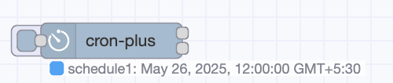

Automation isn’t just about reacting to events—sometimes it’s about doing things at the right time. In Node-RED, the Inject node is great for triggering flows at set intervals, but it’s limited when you need more control. Cron jobs offer precise scheduling, letting you set up custom times for your tasks. In this guide, we'll show you how to create flexible cron schedules in FlowFuse with Node-RED, so your flows run exactly when needed.

<!--more-->

## What is a Cron Job?

Let’s kick things off by demystifying what a cron job actually is. You’ve probably heard the term before, and while it might sound complex, it’s really just a way of setting up tasks to run at specific times — automatically.

Think of it this way: with Node-RED’s Inject node, you can trigger tasks at intervals like every 5 seconds, every minute, or even on specific weekdays at set times (for example, every Monday, Tuesday, or Sunday). But when you use cron jobs, you gain much more control over the timing.

For example, you can trigger a task every two hours, only on weekdays, but skip holidays or run a job every 5 minutes during business hours, but only in the first week of each quarter. You can even schedule flows to run at 6:45 AM on the last Friday of every month, or at 11:59 PM on the last day of the year — these kinds of patterns are either extremely complex or completely unachievable using just the Inject node.

The magic of cron lies in its ability to express complex time logic in a simple, compact format — perfect for orchestrating automation schedules that go well beyond what the basic Inject node can offer.

## Prerequisites

Before we start building flexible cron schedules in FlowFuse, make sure you have the following in place:

- **Running FlowFuse Instance:** Make sure you have a FlowFuse instance set up and running. If you don't have an account, check out our [free trial]() and learn how to create an instance in FlowFuse.
- **node-red-contrib-cron-plus:** Ensure you have [node-red-contrib-cron-plus](https://flows.nodered.org/node/node-red-contrib-cron-plus) installed, It’s developed by Steve, a software engineer here at FlowFuse and one of the core maintainers of Node-RED.

## Building Scheduled Automations with cron-plus

Now that you understand what cron jobs are and why they’re useful, let’s dive into building them inside Node-RED using the cron-plus node. When working with cron-plus, you’ll encounter different types of schedules—each suited for different needs—and varying levels of complexity depending on what you're trying to automate.

At the most basic level, you can define static schedules using familiar cron expressions (like "every 5 minutes" or "at 8:00 AM daily"). As you progress, you’ll learn to use solar event triggers (like sunrise or sunset), create date-specific schedules, and even manage schedules dynamically at runtime—adding, removing, or modifying them based on incoming data or user interactions.

In this section, we’ll walk through each of these layers step by step, starting with the simplest use cases and gradually moving into more powerful and flexible scheduling techniques—giving you full control over when and how your flows run.

> Tip: This article draws information from the node’s [README](https://flows.nodered.org/node/node-red-contrib-cron-plus), which is highly informative. I recommend going through it as well for more details.

### Static Schedules

The most straightforward way to use cron-plus is to define static schedules using cron expressions. These are pre-configured inside the node and run on a fixed pattern—perfect for predictable, repetitive tasks. For example we need to Trigger a flow every day at 8:00 AM.

1. Drag and drop the cron-plus node onto your Node-RED workspace.

2. Double-click on the cron-plus node to open its configuration panel.

3. If no schedules are configured yet, click the +add button to add a new schedule. Enter the following:
   - Schedule Name: e.g., "Daily 8 AM"
   - Topic: Enter a topic to send with the message when triggered, such as "daily-trigger".
   - Payload: Choose what payload you want to send when the cron job triggers, such as "Triggering Flow at 8 AM".

4. Select Cron from the Schedule Type dropdown.

5. In the Schedule field, enter the following cron expression to run the task at 8:00 AM every day:

```
   0 8 * * *
```

A cron expression is composed of five fields (sometimes six or seven, depending on the system) that determine the schedule for executing tasks.
Below is a breakdown of each field that node-red-contrib-cron-plus supports:

| Field              | Possible Values      | Special Symbols   |
|--------------------|----------------------|-------------------|
| Second  (optional) | `0-59`               | `* / , -`         |
| Minute             | `0-59`               | `* / , -`         |
| Hour               | `0-23`               | `* / , -`         |
| Day of Month       | `1-31`               | `* / , - ? L W`   |
| Month              | `1-12` or `JAN-DEC`  | `* / , -`         |
| Day of Week        | `0-6` or `SUN-SAT`   | `* / , - ? L #`   |
| Year (optional)    | `1970-2099`          | `* / , -`         |

Here are some examples of how you can use the special symbols and shorthand's:

| Symbol | Meaning                  | Example             | Explanation                                                 |
|--------|--------------------------|---------------------|-------------------------------------------------------------|
| `*`    | All possible values      | `* * * * *`         | Every minute of every hour, day, month, and weekday         |
| `?`    | No specific value        | `0 0 12 ? * MON`    | At 12 PM Only on Mondays (no specific day of the month)     |
| `-`    | Range                    | `0 10-12 * * * *`     | Minutes 10, 11, and 12 of every hour                      |
| `,`    | List of values           | `0 0 12 * 1,3,5 *`  | At 12 PM only in January, March, and May                    |
| `/`    | Step values              | `*/15 * * * *`      | Every 15 minutes (00, 15, 30, 45)                           |
| `L`    | Last                     | `0 0 12 L * *`      | 12 PM on the last day of the month                          |
| `W`    | Nearest weekday          | `0 0 0 15W * * *`   | At midnight on the nearest weekday to the 15th of the month |
| `#`    | nth weekday of the month | `0 0 0 * * MON#1 *` | At midnight on the first Monday of the month                |

6. Connect the cron-plus node to other nodes (e.g., a debug node or an action node) to specify the actions when the flow is triggered.

7. Click Deploy to save and activate your flow. The cron-plus node will now trigger your flow every day at 8:00 AM.


[{"id":"cba15bd32c5434a5","type":"group","z":"b37428694e90b2c5","style":{"stroke":"#b2b3bd","stroke-opacity":"1","fill":"#f2f3fb","fill-opacity":"0.5","label":true,"label-position":"nw","color":"#32333b"},"nodes":["2af2e9274fe1321a","458c9533a1437ee1"],"x":94,"y":179,"w":392,"h":82},{"id":"2af2e9274fe1321a","type":"debug","z":"b37428694e90b2c5","g":"cba15bd32c5434a5","name":"debug 1","active":true,"tosidebar":true,"console":false,"tostatus":false,"complete":"false","statusVal":"","statusType":"auto","x":380,"y":220,"wires":[]},{"id":"458c9533a1437ee1","type":"cronplus","z":"b37428694e90b2c5","g":"cba15bd32c5434a5","name":"Cron Plus","outputField":"payload","timeZone":"","storeName":"","commandResponseMsgOutput":"output1","defaultLocation":"","defaultLocationType":"default","outputs":1,"options":[{"name":"Daily 8 AM","topic":"daily-trigger","payloadType":"default","payload":"","expressionType":"cron","expression":" 0 8 * * *","location":"","offset":"0","solarType":"all","solarEvents":"sunrise,sunset"}],"x":200,"y":220,"wires":[["2af2e9274fe1321a"]]}]


Here are some advance patterns: 

**Every weekday at 9:30 AM**
```
30 9 * * 1-5
```

**Every hour**
```
0 * * * *
```

**Every 15 min during work hours (Mon–Fri, 9–5)**
```
*/15 9-16 * * 1-5
```

**First Monday of the month at 10:00 AM**
```
0 10 * * MON#1
```

**Last Friday of the month at 6:45 AM**
```
45 6 ? * FRIL
```

#### Easy Builder Feature 

To make it even easier to create and customize cron patterns, the cron-plus node includes a feature called Easy Builder. This feature provides a user-friendly interface that lets you quickly generate and adjust cron expressions without needing to write them manually. You can select options like time intervals, days of the week, and more, and the Easy Builder will generate the correct cron syntax for you.

{data-zoomable}
_Image showing the easy builder feature_

### Solar Event Schedules

Solar event-based triggers are a great feature in cron-plus for automating tasks based on sunlight events like sunrise, sunset, dawn, and dusk. You can fine-tune your triggers with offsets, like triggering an action 30 minutes after sunset.

Here are the solar events you can use:

   - **nightEnd**: End of night, start of twilight.
   - **nauticalDawn**: Horizon becomes faintly visible, used by sailors.
   - **civilDawn**: Light enough for outdoor activities without lights.
   - **sunrise**: Sun first visible on the horizon.
   - **sunriseEnd**: Full sun above the horizon.
   - **morningGoldenHourEnd**: End of the morning golden hour.
   - **solarNoon**: Sun is at its highest point in the sky.
   - **eveningGoldenHourStart**: Start of the evening golden hour.
   - **sunsetStart**: Sun starts to set.
   - **sunset**: Sun is fully below the horizon.
   - **civilDusk**: Last light before it gets dark.
   - **nauticalDusk**: Horizon is no longer visible, dark sky.
   - **nightStart**: Full darkness after twilight.
   - **nadir**: Darkest point of the night.
  
Let's start and learn how to use it. Suppose we need to trigger the flow 30 minutes after sunset. Here's how you do it:

Let’s start by setting up a flow that triggers 30 minutes after sunset. Here’s how:

1. Drag a new `cron-plus` node onto your Node-RED canvas.

2. Set the location — solar events depend on your geographic location. You can configure this at the node level or per schedule. In the Location field, either:
   - Enter your latitude and longitude manually, or  
   - Click the three-dot icon to open a map and select your location.

3. Add a new schedule. Enter the following Schedule Name, Topic, Payload

4. Choose the solar event — set the Schedule Type to `solar`.  
   You can choose "All Solar Events" or "Selected Solar Events" to pick specific ones.  
   For this example, choose "sunset".

5. Set the offset — this defines how much earlier or later the trigger should happen compared to the solar event.  
   For 30 minutes after sunset, enter:
   ```
   30
   ```
   You can also use negative numbers (like `-10` for 10 minutes before sunset) or larger values like `60` for 1 hour after.

6. Click Done, connect the node to the rest of your flow, and Deploy.


[{"id":"cba15bd32c5434a5","type":"group","z":"b37428694e90b2c5","style":{"stroke":"#b2b3bd","stroke-opacity":"1","fill":"#f2f3fb","fill-opacity":"0.5","label":true,"label-position":"nw","color":"#32333b"},"nodes":["2af2e9274fe1321a","458c9533a1437ee1"],"x":94,"y":179,"w":392,"h":82},{"id":"2af2e9274fe1321a","type":"debug","z":"b37428694e90b2c5","g":"cba15bd32c5434a5","name":"debug 1","active":true,"tosidebar":true,"console":false,"tostatus":false,"complete":"false","statusVal":"","statusType":"auto","x":380,"y":220,"wires":[]},{"id":"458c9533a1437ee1","type":"cronplus","z":"b37428694e90b2c5","g":"cba15bd32c5434a5","name":"Cron Plus","outputField":"payload","timeZone":"","storeName":"","commandResponseMsgOutput":"output1","defaultLocation":"","defaultLocationType":"default","outputs":1,"options":[{"name":"et","topic":"30min After Sunset","payloadType":"default","payload":"","expressionType":"solar","expression":" 0 8 * * *","location":"20.70816594524601 75.673828125","offset":"30","solarType":"selected","solarEvents":"sunset"}],"x":200,"y":220,"wires":[["2af2e9274fe1321a"]]}]


Your flow will now trigger 30 minutes after sunset every day — automatically adjusting for seasonal changes based on your location.

### Date Sequence Schedules

While cron expressions and solar events are great for recurring patterns, sometimes you need to schedule flows to run at very specific, one-time moments—like a product launch, system maintenance window, or a holiday-specific action. This is where the Date Sequence schedule type in cron-plus comes in.

With this method, you can define exact dates and times (including timezone support), and the node will trigger your flow at those precise moments—once or multiple times, depending on the list you define.

The sequence field supports:

   - UNIX timestamps (in milliseconds)
   ```
   1767225600000 
   ```

   - Date and time (in plain text)
   ```
   2026-04-03 00:00
   ```

   - Date and time with timezone
   ```
   2026-04-06 12:00 GMT+0
   ```

You can list multiple times, separated by commas:

```
1767225600000, 2026-04-03 00:00, 2026-04-06 12:00 GMT+0
```

Let’s learn how to set this up:

1. Drag a new cron-plus node onto the canvas.
2. Double-click the node to open its settings.
3. Click +add to create a new schedule.
4. Give the schedule a name and configure the topic — this is the value that will be sent with the message when the schedule triggers.
5. Set the payload to whatever message or data you want to send when triggered.
6. Choose Date Sequence from the Schedule Type dropdown.
7. In the Expression field, enter one or more dates using any of the 8. supported formats we discussed above (UNIX timestamp, plain date/time, or date/time with timezone). You can separate multiple values with commas.
9. Click Done, then connect the cron-plus node to the rest of your flow (e.g., a debug node to see it trigger, or an action node to perform something).
10. Finally, click Deploy to save and start your schedule.


[{"id":"2ff341cec3114c53","type":"cronplus","z":"b37428694e90b2c5","g":"2aa2d59a36bf0fa7","name":"Date Sequence","outputField":"payload","timeZone":"","storeName":"","commandResponseMsgOutput":"output1","defaultLocation":"","defaultLocationType":"default","outputs":1,"options":[{"name":"schedule1","topic":"fixed dates","payloadType":"str","payload":"fixed","expressionType":"dates","expression":"1767225600000, 2026-04-03 00:00, 2026-04-06 12:00 GMT+0","location":"","offset":"0","solarType":"all","solarEvents":"sunrise,sunset"}],"x":300,"y":780,"wires":[["b66ebe91df84b4ce"]]},{"id":"b66ebe91df84b4ce","type":"debug","z":"b37428694e90b2c5","g":"2aa2d59a36bf0fa7","name":"debug 1","active":true,"tosidebar":true,"console":false,"tostatus":false,"complete":"false","statusVal":"","statusType":"auto","x":560,"y":780,"wires":[]}]


The flow will now trigger exactly at each date and time you've specified.

### Handling Time Zones and Daylight Saving Time (DST)

When dealing with scheduled tasks, managing time zones and Daylight Saving Time (DST) is crucial to ensure your cron jobs trigger at the correct local time. With cron-plus in Node-RED, this is made easy. Cron-plus provides global time zone support, allowing you to specify the time zone for all schedules within a particular cron-plus node. When configuring the cron-plus node, you'll see an input field labeled "Timezone", where you can start typing your desired time zone and select from suggested options.

{data-zoomable}
_Screenshot showing the Timezone input field in the cron-plus node configuration with auto-suggestions while typing_

For example, if your tasks need to run in the Eastern Time Zone, you would enter "America/New_York" in the Timezone field. Similarly, for the UK time zone, you would enter "Europe/London".

When scheduling tasks in a time zone that observes Daylight Saving Time (DST), cron-plus will automatically adjust your task’s execution times to account for the DST changes. If you set a schedule for 8:00 AM daily, cron-plus will ensure that the task triggers at 8:00 AM local time, whether it's during Standard Time (e.g., EST) or Daylight Saving Time (e.g., EDT).

When DST begins (e.g., in spring), cron-plus will shift the scheduled task forward by one hour. Similarly, when DST ends (e.g., in fall), the task will shift back by one hour. This automatic adjustment is handled based on the time zone you enter.

### Understanding Node Status Symbols and Their Descriptions

The cron-plus node visually indicates its state using status markers in the flow editor:

- **● (Dot):** Indicates a static schedule configured directly in the node.
- **○ (Ring):** Indicates a dynamic schedule added via input messages.

Also, the node indicates the next event, along with the type of schedule. For example, node in the following image specifies that the next event is on May 26, 2025, at 12:00 AM GMT +5:30. It is a static schedule, and its name is 'Schedule1'

{data-zoomable}
_A node showing the next event scheduled for May 26, 2025, at 12:00 AM GMT +5:30 with a static schedule named 'Schedule1'._

### Dynamic Schedule Control via Input Messages

In some cases, you might not know your schedule ahead of time—or you may want it to change based on user actions or incoming data. The cron-plus node supports this with dynamic control using input messages. This means you can add, update, or remove schedules while your flow is running, without opening the editor. It’s a powerful way to make your automations more responsive and adaptable.

Each control message is sent to the `cron-plus` node using a specially formatted `msg.payload` with a command and associated configuration.

Below are some examples of dynamic commands. Please refer to the built-in help of the cron-plus node for more details:

| Command   | Description                                                           | Example                                                                                      |
|-----------|-----------------------------------------------------------------------|----------------------------------------------------------------------------------------------|
| `trigger` | Triggers a schedule by name.                                          | `{ "command": "trigger", "name": "dynamic-1" }`                                              |
| `add`     | Add (or update) a dynamic schedule.                                   | `{ "command": "add", "name": "dynamic-1", "topic": "dynamic-schedule", "payloadType": "default", "expressionType": "cron", "expression": "*/2 * * * *" }` |
| `remove`  | Removes a specific schedule by name.                                  | `{ "command": "remove", "name": "dynamic-1" }`                                               |
| `start`   | Starts a specific schedule by name.                                   | `{ "command": "start", "name": "dynamic-1" }`                                                |
| `stop`    | Stops a specific schedule by name.                                    | `{ "command": "stop", "name": "dynamic-1" }`                                                 |
| `pause`   | Pauses a specific schedule by name.                                   | `{ "command": "pause", "name": "dynamic-1" }`                                                |
| `export`  | Exports a schedule by name.                                           | `{ "command": "export", "name": "dynamic-1" }`                                               |
| `status`  | Provides the status of a specific schedule by name.                   | `{ "command": "status", "name": "dynamic-1" }`                                               |
| `describe`| Provides a human-readable description of a cron or solar expression.  | `{ "command": "describe", "expression": "0 8 * * 1-5", "expressionType": "cron" }`           |

Commands can also include a `filter` to operate on multiple schedules at once. Below are a few examples. Please refer to the built-in help of the cron-plus node for more details:

| Filter                    | Description                                          | Example                                       |
|---------------------------|------------------------------------------------------|-----------------------------------------------|
| `-all`                    | Operate a command on all schedules.                  | `{ "command": "start-all" }`                  |
| `-all-dynamic`            | Operate a command on all dynamic schedules.          | `{ "command": "export-all-dynamic" }`         |
| `-all-static`             | Operate a command on all static schedules.           | `{ "command": "pause-all-static" }`           |
| `-all-active`             | Operate a command on all active schedules.           | `{ "command": "stop-all-active" }`            |
| `-all-inactive`           | Operate a command on all inactive schedules.         | `{ "command": "start-all-inactive" }`         |
| `-all-active-static`      | Operate a command on all active static schedules.    | `{ "command": "stop-all-active-static" }`     |
| `-all-active-dynamic`     | Operate a command on all active dynamic schedules.   | `{ "command": "stop-all-active-dynamic" }`    |
| `-all-inactive-static`    | Operate a command on all inactive static schedules.  | `{ "command": "start-all-inactive-static" }`  |
| `-all-inactive-dynamic`   | Operate a command on all inactive dynamic schedules. | `{ "command": "remove-all-inactive-dynamic" }`|

#### Dynamic Demo 1

For example, we need to build a flow that triggers on UK public holidays to stop recording the OEE (Overall Equipment Efficiency) or lock the entry gates of the factory. To achieve this, we can integrate a UK public holiday API into our Node-RED flow, fetch the holiday data, and then trigger actions based on those holidays.

1. Drag the Inject node onto the canvas and set it to trigger on deploy after `0.1` seconds.
2. Next, drag the HTTP request node onto the canvas, set the method to GET, and use the URL `https://www.gov.uk/bank-holidays.json`. Set the return to "parsed JSON object".
3. Drag the Function node onto the canvas and add the following JavaScript code into it:

```javascript
// Retrieve public holidays for England and Wales from the API response
const engHols = msg.payload["england-and-wales"].events;

// Clear out any existing schedules before adding new ones
node.send({ topic: 'remove-all' });

// Create an array to hold the new holiday schedules
const newSchedules = [];

// Loop through all the holiday events
for (let index = 0; index < engHols.length; index++) {
    const hol = engHols[index]; // Get the current holiday
    const date = new Date(hol.date); // Convert the holiday date to a Date object

    // Skip holidays that are in the past (before the current date)
    if (date.valueOf() < Date.now()) {
        continue; // Skip to the next holiday
    }

    // Create a new schedule for upcoming holidays
    const newSchedule = {
        "command": "add", // Command to add a new schedule
        "name": hol.title + ` (${date.getFullYear()})`, // Holiday name with year
        "topic": hol.title, // Holiday title as topic
        "expression": hol.date, // Holiday date to use as an expression
        "expressionType": "dates", // Define the type as dates
        "payload": hol, // Send the holiday details as the payload
        "payloadType": "json" // Specify that the payload is in JSON format
    };

    // Add the new schedule to the list of new schedules
    newSchedules.push(newSchedule);    
}

// Set the topic as empty (not used for now)
msg.topic = '';
// Set the payload to the new schedules array created above
msg.payload = newSchedules;

// Return the updated message with new schedules
return msg;
```

4. Drag a cron-plus node onto the canvas. Connect the Inject node to the HTTP request node, the HTTP request node to the Function node, and the Function node to the cron-plus node.
5. Deploy the flow.

Now you can check the dynamic schedules list (see how at the end of this section).


[{"id":"3608db0d1bd59aa5","type":"inject","z":"1791a7bd576b3a15","name":"Update bank holidays","props":[{"p":"topic","vt":"str"}],"repeat":"","crontab":"00 02 * * 1","once":false,"onceDelay":0.1,"topic":"","x":160,"y":60,"wires":[["252cb7c88de78e45"]]},{"id":"252cb7c88de78e45","type":"http request","z":"1791a7bd576b3a15","name":"","method":"GET","ret":"obj","paytoqs":"ignore","url":"https://www.gov.uk/bank-holidays.json","tls":"","persist":false,"proxy":"","insecureHTTPParser":false,"authType":"","senderr":false,"headers":[],"x":370,"y":60,"wires":[["cf71e6ad0a983d80"]]},{"id":"cf71e6ad0a983d80","type":"function","z":"1791a7bd576b3a15","name":"england bank holiday schedules","func":"const engHols = msg.payload[\"england-and-wales\"].events\n\n// clear out existing schedules\nnode.send({topic:'remove-all'})\n\nconst newSchedules = []\nfor(let index = 0; index < engHols.length; index++) {\n    const hol = engHols[index];\n    const date = new Date(hol.date)\n    if (date.valueOf() < Date.now()) {\n        continue\n    }\n    const newSchedule = {\n        \"command\": \"add\",\n        \"name\": hol.title + ` (${date.getFullYear()})`,\n        \"topic\": hol.title,\n        \"expression\": hol.date,\n        \"expressionType\": \"dates\",\n        \"payload\": hol,\n        \"payloadType\": \"json\"\n    }\n    newSchedules.push(newSchedule)    \n}\n\nmsg.topic = ''\nmsg.payload = newSchedules\n\nreturn msg;","outputs":1,"timeout":0,"noerr":0,"initialize":"","finalize":"","libs":[],"x":430,"y":120,"wires":[["abea360f336bbf5c"]]},{"id":"abea360f336bbf5c","type":"cronplus","z":"1791a7bd576b3a15","name":"","outputField":"payload","timeZone":"","storeName":"","commandResponseMsgOutput":"output2","defaultLocation":"","defaultLocationType":"default","outputs":2,"options":[],"x":360,"y":200,"wires":[["dfff5dae3de9e7de"],["7834e47a1631346f"]]},{"id":"b5a53df2dedde1d2","type":"inject","z":"1791a7bd576b3a15","name":"","props":[{"p":"topic","vt":"str"}],"repeat":"","crontab":"","once":false,"onceDelay":0.1,"topic":"list-all","x":110,"y":180,"wires":[["abea360f336bbf5c"]]},{"id":"7834e47a1631346f","type":"debug","z":"1791a7bd576b3a15","name":"list","active":true,"tosidebar":true,"console":false,"tostatus":false,"complete":"payload","targetType":"msg","statusVal":"","statusType":"auto","x":750,"y":220,"wires":[]},{"id":"dfff5dae3de9e7de","type":"debug","z":"1791a7bd576b3a15","name":"action","active":true,"tosidebar":true,"console":false,"tostatus":false,"complete":"payload","targetType":"msg","statusVal":"","statusType":"auto","x":750,"y":180,"wires":[]},{"id":"041f7306088daf24","type":"inject","z":"1791a7bd576b3a15","name":"","props":[{"p":"topic","vt":"str"}],"repeat":"","crontab":"","once":false,"onceDelay":0.1,"topic":"remove-all","x":120,"y":220,"wires":[["abea360f336bbf5c"]]}]


#### Dynamic Demo 2

Additionally, I'd like to share another demo that Steve has prepared for the community, which demonstrates dynamic scheduling based on the best energy prices:


[{"id":"0f969cd96da84b2e","type":"http request","z":"f559cf0eb4eca11c","name":"","method":"GET","ret":"obj","paytoqs":"ignore","url":"https://api.awattar.at/v1/marketdata","tls":"","persist":false,"proxy":"","insecureHTTPParser":false,"authType":"","senderr":false,"headers":[],"x":450,"y":220,"wires":[["32e08539d8339f74"]]},{"id":"2a7465d67deae278","type":"inject","z":"f559cf0eb4eca11c","name":"get liveData","props":[],"repeat":"","crontab":"","once":false,"onceDelay":0.1,"topic":"","x":290,"y":220,"wires":[["0f969cd96da84b2e"]]},{"id":"32e08539d8339f74","type":"function","z":"f559cf0eb4eca11c","name":"Billigsten 5 Stunden -> msg.liveData","func":"var timestamp = Date.now();\nvar maxLoadingDuration = 5;\n\nvar cheapestHours = msg.payload.data\n    .sort((a,b) => a.marketprice - b.marketprice)\n    .slice(0,maxLoadingDuration)\n    .sort((a,b) => a.start_timestamp - b.start_timestamp);\n    var currentHour = cheapestHours.filter(d => d.start_timestamp < timestamp\n                                        && d.end_timestamp > timestamp);\nmsg.liveData = {\n    soc:msg.payload,\n    cheapestHours: cheapestHours\n}\nreturn msg;\n","outputs":1,"timeout":"","noerr":0,"initialize":"","finalize":"","libs":[],"x":370,"y":280,"wires":[["5c56b3ca5ac4f7c2"]]},{"id":"89c2acf51e7fbc9c","type":"function","z":"f559cf0eb4eca11c","name":"merge active and new schedules","func":"\nconst inputData = msg.liveData.cheapestHours\nconst activeSchedules = msg.activeSchedules || []\n\n// Clear existing schedules\nnode.send({ topic: \"remove-all-dynamic\" });\n\n// helper function\nconst makeSchedule = (start, time, suffix) => {\n    const isStart = start == true || start === \"start\" || start === \"on\" || start == 1\n    const title = formatTime(time) + (isStart ? \"-on\" : \"-off\")\n    const name = suffix ? `${title} (${suffix}) ` : title\n    return {\n        \"command\": \"add\",\n        \"name\": name,\n        \"expression\": time,\n        \"expressionType\": \"dates\",\n        \"payloadType\": \"str\",\n        \"payload\": isStart ? \"start\" : \"stop\",\n    }\n}\n// helper function\nconst formatTime = (date) => {\n    const d = new Date(date)\n    const hh = (\"\" + d.getHours()).padStart(2, \"0\")\n    const mm = (\"\" + d.getMinutes()).padStart(2, \"0\")\n    return `${hh}:${mm}`\n}\n\n// vars\nconst newSchedules = []\nconst mergedSchedules = []\nconst keepSchedules = []\n\nfor (let index = 0; index < inputData.length; index++) {\n    const element = inputData[index];\n    let suffix = ''\n    suffix = element.marketprice + \" \" + element.unit\n    const startTime = new Date(element.start_timestamp)\n    const endTime = new Date(element.end_timestamp)\n    newSchedules.push(makeSchedule(\"start\", startTime.valueOf(), suffix))\n    newSchedules.push(makeSchedule(\"stop\", endTime.valueOf(), suffix))\n}\n\n\n// if there are any existing schedules not yet operated\n// and they are before the first in the new data, lets keep them\nif (newSchedules?.length) {\n    const firstNewSchedule = newSchedules[0]\n    const existingSchedulesBeforeFirstNew = activeSchedules?.filter(e => e.expression < firstNewSchedule.expression)\n    if (existingSchedulesBeforeFirstNew?.length) {\n        keepSchedules.push(...existingSchedulesBeforeFirstNew.map(e => {\n            const n = e.name\n            const k = makeSchedule (e.payload, e.expression) \n            k.name = n.replace(' (keep)', '') + \" (keep)\"\n            return k\n        }))\n    }\n} else {\n    // keep all existing active schedules (as there are no new ones)\n    keepSchedules.push(...activeSchedules)\n}\n\nmergedSchedules.push(...newSchedules, ...keepSchedules)\nmergedSchedules.sort((a, b) => a.expression - b.expression) // order by expression asc\n\n// deduplicate the schedules by seeing if there are consecutive on/off schedules\nlet deduplicatedSchedules = [];\nlet prevSchedule\nfor (let i = 0; i < mergedSchedules.length; i++) {\n    const currentSchedule = mergedSchedules[i]\n    if (i === 0) {\n        deduplicatedSchedules.push(currentSchedule);\n    } else {\n        if (currentSchedule.payload === prevSchedule.payload) {\n            // to scheules are the same (start/start or stop/stop)\n            if (currentSchedule.payload === \"start\") {\n                // ignore this one as the previous one was a \"start\" (and due to sorting, this one is superfluous)\n            } else if (currentSchedule.payload === \"stop\") {\n                // since the previous one was a \"stop\", we need to update the previous schedule to the new stop time\n                prevSchedule.expression = currentSchedule.expression\n            }\n        } else {\n            deduplicatedSchedules.push(currentSchedule); // push the current schedule\n        }\n    }\n    prevSchedule = currentSchedule\n}\n\n// node.warn({newSchedules, keepSchedules, mergedSchedules, deduplicatedSchedules}) // debug\nmsg.payload = deduplicatedSchedules\nmsg.topic = \"update schedules\"\n\nreturn msg;\n","outputs":1,"timeout":0,"noerr":0,"initialize":"","finalize":"","libs":[],"x":740,"y":340,"wires":[["b6a5d42c7751fae2"]]},{"id":"827e16c3f02d1962","type":"inject","z":"f559cf0eb4eca11c","name":"Clear all scedules","props":[{"p":"topic","vt":"str"}],"repeat":"","crontab":"","once":false,"onceDelay":0.1,"topic":"remove-all-dynamic","x":310,"y":380,"wires":[["b6a5d42c7751fae2"]]},{"id":"32a88825fe3edf37","type":"switch","z":"f559cf0eb4eca11c","name":"start","property":"payload","propertyType":"msg","rules":[{"t":"eq","v":"start","vt":"str"}],"checkall":"true","repair":false,"outputs":1,"x":1250,"y":280,"wires":[["e84ba501a1405907"]]},{"id":"5e5497cff754ef73","type":"switch","z":"f559cf0eb4eca11c","name":"stop","property":"topic","propertyType":"msg","rules":[{"t":"eq","v":"payload","vt":"str"}],"checkall":"true","repair":false,"outputs":1,"x":1250,"y":320,"wires":[["b2e8c3606bd04897"]]},{"id":"e84ba501a1405907","type":"debug","z":"f559cf0eb4eca11c","name":"start something","active":true,"tosidebar":true,"console":false,"tostatus":true,"complete":"payload","targetType":"msg","statusVal":"payload","statusType":"auto","x":1460,"y":280,"wires":[]},{"id":"b2e8c3606bd04897","type":"debug","z":"f559cf0eb4eca11c","name":"stop something","active":true,"tosidebar":true,"console":false,"tostatus":true,"complete":"payload","targetType":"msg","statusVal":"payload","statusType":"auto","x":1460,"y":320,"wires":[]},{"id":"b6a5d42c7751fae2","type":"cronplus","z":"f559cf0eb4eca11c","name":"","outputField":"payload","timeZone":"","storeName":"","commandResponseMsgOutput":"output2","defaultLocation":"","defaultLocationType":"default","outputs":2,"options":[],"x":1020,"y":380,"wires":[["32a88825fe3edf37","5e5497cff754ef73"],["fe51aaba903612eb"]]},{"id":"5c56b3ca5ac4f7c2","type":"link call","z":"f559cf0eb4eca11c","name":"","links":["ee57d78d1c769d1b"],"linkType":"static","timeout":"30","x":730,"y":280,"wires":[["89c2acf51e7fbc9c"]]},{"id":"b4cf44f6c7bd1461","type":"link in","z":"f559cf0eb4eca11c","name":"link in 4","links":["29dcf0872d3f7ca4"],"x":505,"y":320,"wires":[["5c56b3ca5ac4f7c2"]]},{"id":"fe51aaba903612eb","type":"link out","z":"f559cf0eb4eca11c","name":"link out 17","mode":"link","links":["a1c12404f726b02f"],"x":1215,"y":380,"wires":[]},{"id":"51b3de02bcf463a3","type":"group","z":"f559cf0eb4eca11c","name":"test data","style":{"label":true},"nodes":["6b39e36054edcc22","32388c4b0af7a5b1","73a529bfd3742503","43aa8690b4167bcc","dae8031ee5f37eb5","29dcf0872d3f7ca4"],"x":214,"y":579,"w":522,"h":122},{"id":"6b39e36054edcc22","type":"inject","z":"f559cf0eb4eca11c","g":"51b3de02bcf463a3","name":"","props":[{"p":"payload"},{"p":"topic","vt":"str"}],"repeat":"","crontab":"","once":false,"onceDelay":0.1,"topic":"","payload":"","payloadType":"date","x":320,"y":620,"wires":[["32388c4b0af7a5b1"]]},{"id":"32388c4b0af7a5b1","type":"template","z":"f559cf0eb4eca11c","g":"51b3de02bcf463a3","name":"cheapestHours sample","field":"liveData","fieldType":"msg","format":"json","syntax":"mustache","template":"{\n      \"soc\": {},\n      \"cheapestHours\": [\n        {\n          \"start_timestamp\": \"2025-05-07 07:00:00\",\n          \"end_timestamp\": \"2025-05-07 12:00:00\",\n          \"marketprice\": 66.02,\n          \"unit\": \"Eur/MWh\"\n        },\n        {\n          \"start_timestamp\": \"2025-05-07 20:00:00\",\n          \"end_timestamp\": \"2025-05-07 21:00:00\",\n          \"marketprice\": 62.48,\n          \"unit\": \"Eur/MWh\"\n        }\n      ]\n    }","output":"json","x":500,"y":620,"wires":[["dae8031ee5f37eb5"]]},{"id":"73a529bfd3742503","type":"inject","z":"f559cf0eb4eca11c","g":"51b3de02bcf463a3","name":"","props":[{"p":"payload"},{"p":"topic","vt":"str"}],"repeat":"","crontab":"","once":false,"onceDelay":0.1,"topic":"","payload":"","payloadType":"date","x":320,"y":660,"wires":[["43aa8690b4167bcc"]]},{"id":"43aa8690b4167bcc","type":"template","z":"f559cf0eb4eca11c","g":"51b3de02bcf463a3","name":"cheapestHours overlap","field":"liveData","fieldType":"msg","format":"json","syntax":"mustache","template":"{\n      \"soc\": {},\n      \"cheapestHours\": [\n        {\n          \"start_timestamp\": \"2025-05-07 08:00:00\",\n          \"end_timestamp\": \"2025-05-07 11:00:00\",\n          \"marketprice\": 66.02,\n          \"unit\": \"Eur/MWh\"\n        },\n        {\n          \"start_timestamp\": \"2025-05-07 20:00:00\",\n          \"end_timestamp\": \"2025-05-07 21:00:00\",\n          \"marketprice\": 62.48,\n          \"unit\": \"Eur/MWh\"\n        }\n      ]\n    }","output":"json","x":510,"y":660,"wires":[["dae8031ee5f37eb5"]]},{"id":"dae8031ee5f37eb5","type":"junction","z":"f559cf0eb4eca11c","g":"51b3de02bcf463a3","x":660,"y":640,"wires":[["29dcf0872d3f7ca4"]]},{"id":"29dcf0872d3f7ca4","type":"link out","z":"f559cf0eb4eca11c","g":"51b3de02bcf463a3","name":"link out 16","mode":"link","links":["b4cf44f6c7bd1461"],"x":695,"y":640,"wires":[]},{"id":"f3ff5331698e1750","type":"group","z":"f559cf0eb4eca11c","name":"Subroutine for getting active schedules","style":{"label":true},"nodes":["ee57d78d1c769d1b","9956e352b1728160","aba3e0f7de7c6f54","cc753a34602daf70","e4b0cb5dbf1fcbcc","a1c12404f726b02f"],"x":594,"y":439,"w":712,"h":82},{"id":"ee57d78d1c769d1b","type":"link in","z":"f559cf0eb4eca11c","g":"f3ff5331698e1750","name":"get-active-dynamic schedules","links":[],"x":740,"y":480,"wires":[["9956e352b1728160"]],"l":true},{"id":"9956e352b1728160","type":"change","z":"f559cf0eb4eca11c","g":"f3ff5331698e1750","name":"","rules":[{"t":"set","p":"topic","pt":"msg","to":"export-active-dynamic","tot":"str"}],"action":"","property":"","from":"","to":"","reg":false,"x":905,"y":480,"wires":[["b6a5d42c7751fae2"]],"l":false},{"id":"aba3e0f7de7c6f54","type":"change","z":"f559cf0eb4eca11c","g":"f3ff5331698e1750","name":"","rules":[{"t":"move","p":"payload.result","pt":"msg","to":"activeSchedules","tot":"msg"}],"action":"","property":"","from":"","to":"","reg":false,"x":1215,"y":480,"wires":[["cc753a34602daf70"]],"l":false},{"id":"cc753a34602daf70","type":"link out","z":"f559cf0eb4eca11c","g":"f3ff5331698e1750","name":"link-return","mode":"return","links":[],"x":1265,"y":480,"wires":[]},{"id":"e4b0cb5dbf1fcbcc","type":"switch","z":"f559cf0eb4eca11c","g":"f3ff5331698e1750","name":"","property":"_linkSource","propertyType":"msg","rules":[{"t":"istype","v":"array","vt":"array"}],"checkall":"true","repair":false,"outputs":1,"x":1165,"y":480,"wires":[["aba3e0f7de7c6f54"]],"l":false},{"id":"a1c12404f726b02f","type":"link in","z":"f559cf0eb4eca11c","g":"f3ff5331698e1750","name":"link in 12","links":["fe51aaba903612eb"],"x":1105,"y":480,"wires":[["e4b0cb5dbf1fcbcc"]]}]


If you need to see the dynamic schedules of a specific node, double-click on it and click on the 'Dynamic Schedules' button from the configuration panel. This will show all of the dynamic schedules associated with that node.

{data-zoomable}
_Image showing the 'Dynamic Schedules' button and the list of all dynamically scheduled events._

As you can see, creating flexible and dynamic cron schedules Node-RED can give you complete control over your automation tasks. Whether it's simple, recurring events, or complex, time-sensitive triggers, the combination of cron expressions and dynamic controls allows for smarter, more efficient workflows.

Take some time to explore these features and experiment with your own schedules. The more you play around with them, the better you'll understand how to tailor your flows to meet your exact needs.

Thanks for reading, and happy automating! If you run into any questions or need assistance along the way, don’t hesitate to reach out. We’re here to help!

If you’re using Node-RED in your production environment, it’s important to keep your instances organized, scalable, and secure. FlowFuse can help with that by making it easier to manage and maintain your Node-RED setup, while also supporting faster deployment, scaling, and improved security.

[Contact us](/contact-us/) now to learn more.

## Wrapping Up

Designing flexible and intelligent schedules is a key part of building robust automation with Node-RED. Whether you’re triggering actions based on time, solar events, or dynamic runtime conditions, the cron-plus node gives you a powerful set of tools to fine-tune when your flows should run.

By combining these scheduling techniques with the management features of FlowFuse, you can confidently build and operate reliable automation systems at any scale.
