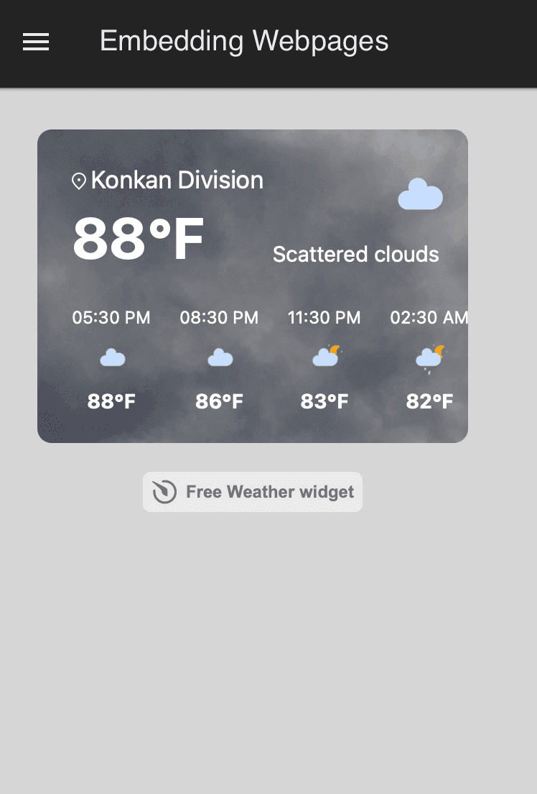

When you build a dashboard, sometimes you need more than just internal data. Maybe it’s a live map, a report hosted elsewhere, or another dashboard — whatever it is, having to switch tabs breaks the flow. FlowFuse lets you embed external content like web pages, dashboards, PDFs, and widgets right into your dashboard. This guide shows you how to do exactly that — step by step — so your team has everything they need, all in one place.

<!--more-->

## Why Embed Webpages in Your Dashboard?

Embedding external content directly into your FlowFuse dashboard can make your life a lot easier. Here’s why it’s worth considering:

- **Streamline Your Workflow:** No more hopping between tabs or switching apps. Everything you need can be in one place.
  
- **Save Time on Rework:** If you’ve already built a report, chart, or page somewhere else, just embed it into your dashboard. No need to start from scratch.
  
- **Quick Decisions:** Having all your key data together helps you see what’s important at a glance and act faster.

- **Cut Down on Clicks:** The fewer actions needed to get to your information, the more time you can spend on actually getting things done.

## How to Embed Webpages On your FlowFuse Dashboard

Embedding external content into your FlowFuse dashboard is straightforward and flexible. In this section, you'll learn two ways to do it: using a direct URL and using embed code. We’ll also cover common issues you might face and how to fix them. Lastly, you'll see how to embed one FlowFuse dashboard inside another, making it easier to centralize important views in one place.

### Prerequisites

Before you begin embedding webpages on FlowFuse Dashboard, make sure you have the following:

- **Running FlowFuse Instance:** Make sure you have a FlowFuse instance set up and running. If you don't have an account, check out our [free trial]({{ site.onboardingURL }}).
- **FlowFuse Dashboard:** Ensure you have [FlowFuse Dashboard](https://flows.nodered.org/node/@flowfuse/node-red-dashboard) (also known as Node-RED Dashboard 2.0 in the community) installed and properly configured on your instance.
- **@flowfuse/node-red-dashboard-2-ui-iframe:** Ensure you have [node-red-dashboard-2-ui-iframe](https://flows.nodered.org/node/@flowfuse/node-red-dashboard-2-ui-iframe) installed.

#### Step 1: Obtain the URL or Embed Code of the Webpage You Want to Embed

The first step is identifying and grabbing the URL of the webpage or external content you want to embed into your FlowFuse dashboard. This could be a live dashboard, report, Google Maps, video, or any other type of content.

When embedding content from third-party sources, make sure the following conditions the page or content you're embedding should be publicly accessible or have the proper permissions for embedding. For example, private reports or webpages require login credentials or an API key, which should be handled securely.

Some websites may restrict embedding through iframes due to [Cross-Origin Resource Sharing (CORS)](https://developer.mozilla.org/en-US/docs/Web/HTTP/Guides/CORS) policies. Check whether the external site allows embedding if the content doesn’t load properly.

Many platforms, such as YouTube and Google Maps, provide a specific "embed code or URL" that is more suitable for embedding. Ensure you use the correct embed link or code these platforms offer to guarantee smooth integration.

Once the URL or embed code is ready, move on to the next step.

#### Step 2: Embedding the Webpage on FlowFuse Dashboard

Now that you’ve gathered the URL or embed code for the external content you want to embed, it’s time to add it to your FlowFuse dashboard. Below are two methods for embedding external content:

##### 2.1 Embed via URL 

The easiest and most straightforward way to embed external content is by using the URL. FlowFuse's iframe node allows you to use an external URL directly. Here’s how to do it:

1. Drag the ui_iframe widget onto the canvas.
2. Double-click the widget to open its configuration dialog.
   - Create a new group for it to render in.
   - Set the size (width and height).
   - Enter the URL you want to embed.

{data-zoomable}
_iframe widget configuration_

3. Click Done and then Deploy.

For a quick hands-on practice, you can try embedding a weather widget, Google Maps, Google Calendar, or a hosted PDF on your dashboard.


_Weather widget embedded in FlowFuse Dashboard_


_Google Map embedded in FlowFuse Dashboard_


_PDF embedded in FlowFuse Dashboard_


_Google Calendar embedded in FlowFuse Dashboard_

##### 2.2 Embed via HTML Embed Code

If you have an embed code from third-party services, you can use this code to embed the content into your FlowFuse dashboard. Here’s how to do it:

1. Drag the **ui-template** widget onto the canvas.
2. Double-click on it to open its configuration dialog.
   - Create a new group for it to render in.
   - Set the size (width and height).
3. Paste your embed code into the template widget. Most embed codes include both HTML and JavaScript, so follow this structure:

```html
<template>
  <!-- Paste your HTML code here -->
</template>
<script>
  // Paste your JavaScript code here
</script>
```

Some services provide an **iframe** tag. In this case, you need only copy the URL and use the embedding via the URL method.

4. Click **Done** and **Deploy** to save your changes once you've added the code.

{data-zoomable}
_Animated weather widget on the Flowfuse dashboard, embedded with code._

Now that you’ve learned how to embed external content into your FlowFuse dashboard, one day you may need to embed your FlowFuse dashboard elsewhere—either on another FlowFuse dashboard or an external site. If you’ve tried and found that it’s not working as expected.

This is a security feature designed to protect your data. FlowFuse dashboards, like many other web applications, implement security policies such as Cross-Origin Resource Sharing (CORS) and the X-Frame-Options header. These policies ensure that your dashboard is only viewed in trusted environments, preventing malicious sites from tampering with your data or exposing it to unauthorized users.

However, if you need to embed your FlowFuse dashboard into other websites or on another FlowFuse dashboard, it’s possible to do so with some configuration changes. Below is a section on how to enable embedding securely of FlowFuse Dashboard:

### Enabling Embedding of FlowFuse Dashboards

1. Go to your FlowFuse instance settings.
2. Switch to the **editor** settings and enable **"Allow Dashboard to be embedded in an iFrame"**

{data-zoomable}
_FlowFuse instance settings showing the option to allow dashboard embedding in an iframe._

3. Click **Save Settings and restart** your instance for the changes to take effect.

[{data-zoomable}](https://flowfuse.com/blueprints/manufacturing/oee-dashboard/)
_FlowFuse OEE Dashboard embedded in another FlowFuse dashboard._

FlowFuse dashboards offer great flexibility, making it easy to embed external content like weather widgets, maps, and PDFs directly into your workspace. With a few simple steps, you can also embed FlowFuse dashboards into other websites, ensuring everything you need is in one place.

## Up Next 

If you're interested in learning more about embedding webpages or enhancing your FlowFuse dashboards, check out the following blogs:

- [Mapping Location on Dashboard](/blog/2024/05/mapping-location-on-dashboard-2/): In this article, we dive into how you can embed location maps into your FlowFuse dashboard. Learn how to map locations, track real-time data, and make your dashboards more interactive and informative.
- [Generating PDF Reports with Node-RED and FlowFuse](#): This guide explains how to generate PDF reports directly with Node-RED and FlowFuse and how to preview these reports within your FlowFuse dashboards.
