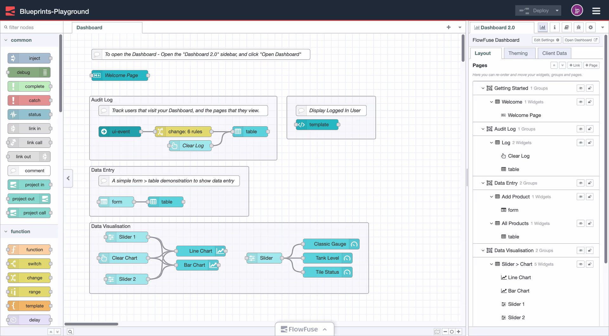
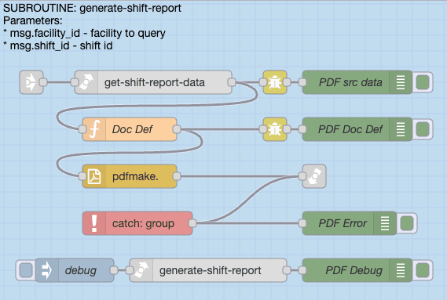

This release is focused on improvements that help you get up and running with FlowFuse much more quickly. Our vision is that you can get started with FlowFuse and have a successful application up and running, from scratch, in hours, not days, weeks or months. This release gets us closer to that vision by focusing on improvements to the installation process for the Device Agent, and two new Blueprints.

<!--more-->

## Device Agent onboarding

If you already had a Node-RED instance running on a device, it was a bit of a hassle to get it connected to FlowFuse as a remote instance. You had to install the Device Agent, find that it clashed with your existing instance, turn off that instance, run the Device Agent again, find that you can't import your existing instance...and so on, until finally getting copies of your flows and adding them to FlowFuse manually.

Lots of friction. We heard you. 

Now, when you install the Device Agent, it will automatically scan for an existing Node-RED instance running locally and help you import its flows into FlowFuse.

This streamlines the whole process, saving you valuable time and effort. It ensures you can manage the Node-RED flows running on your edge device as quickly as possible.

## Blueprint: Getting Started with Dashboard

_Screenshot of Getting Started with Dashboard_

One of the most popular features of Node-RED is Dashboard 2.0. And starting now, getting started with Dashboard is as simple as one click.

Our new Getting Started with Dashboard Blueprint deploys to a new Node-RED instance in a single click and demonstrates several examples of how to use Dashboard. These include various ways of visualizing data, the data entry widget that allows direct entry to a table, and audit log creation.

New Dashboard nodes are added on a regular basis, and we will keep in mind which ones users would like help using as we iterate on this Blueprint.

To put this Blueprint to use, check out the Blueprint page for [Getting Started with Dashboard.](https://flowfuse.com/blueprints/getting-started/dashboard/)

## Blueprint: PDF Report Generator

_Screenshot of PDF Report Generator_

Until now, creating a presentable report using data accessed in your Node-RED instance was a manual effort.

This new Blueprint makes it very easy to create PDF reports from your data. Using SQLite nodes and connecting to your database, this Blueprint  enables drag-and-drop field selection.

To get you started using this Blueprint, we've included sample data that is generated automatically. 

Instructions for using this Blueprint, including how to map fields from your database to our preconfigured fields, [check out the Blueprint page.](https://flowfuse.com/blueprints/manufacturing/pdf-report-generator/)

## Where are we headed?

We are focused on making it as easy as possible to get started with Node-RED, to manage Node-RED instances, and start building applications quickly. Some improvements on the way include [pulling from a Git repo](https://github.com/FlowFuse/flowfuse/issues/5415) (we shipped Git push last release), including [Blueprints for self-hosted installations](https://github.com/FlowFuse/flowfuse/issues/5179), and [better information about resource usage](https://github.com/FlowFuse/flowfuse/issues/223). We're also busy at work on a number of core Node-RED items for the forthcoming 4.1.0 release.

With this work and more on the way, we are continuing to deliver our vision of FlowFuse being the best way to unlock your industrial data, integrate everything and optimize faster.

## What else is new?

For a full list of everything that went into our 2.17 release, you can check out the [release notes](https://github.com/FlowFuse/flowfuse/releases/).

We're always working to enhance your experience with FlowFuse. We're always interested in your thoughts about FlowFuse too. Your feedback is crucial to us, and we'd love to hear about your experiences with the new features and improvements. Please share your thoughts, suggestions, or report any [issues on GitHub](https://github.com/FlowFuse/flowfuse/issues/new/choose). 

Together, we can make FlowFuse better with each release!

## Try FlowFuse

### Self-Hosted

We're confident you can have self managed FlowFuse running locally in under 30 minutes. You can install FlowFuse using [Docker](/docs/install/docker/) or [Kubernetes](/docs/install/kubernetes/).

### FlowFuse Cloud

The quickest and easiest way to get started with FlowFuse is FlowFuse Cloud.

[Get started for free]() now, and you'll have your own Node-RED instances running in the Cloud within minutes.