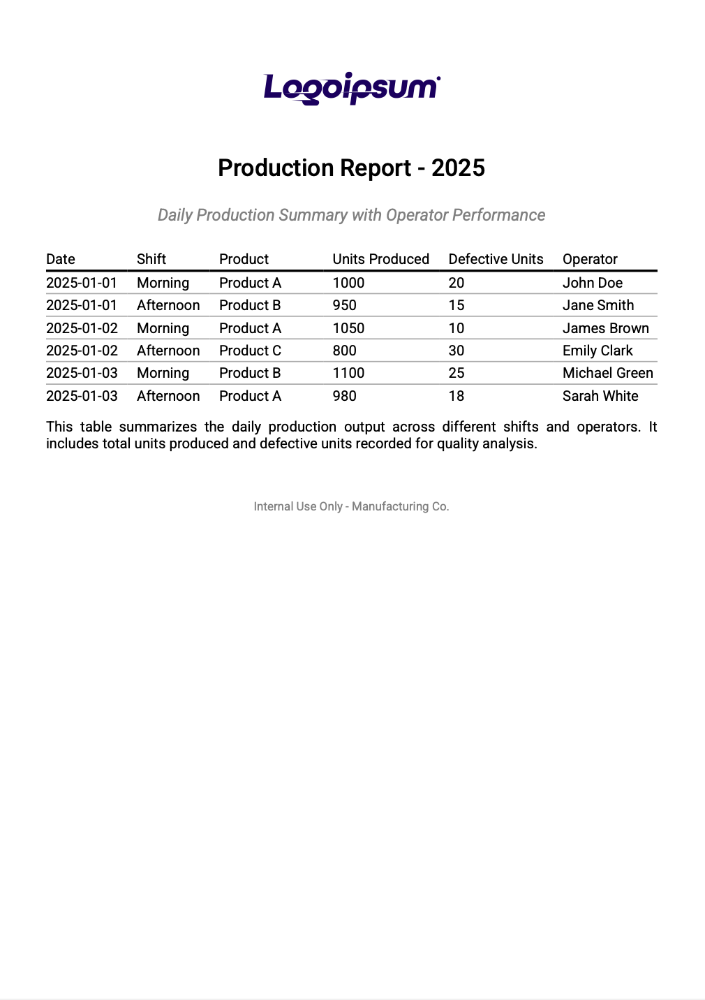
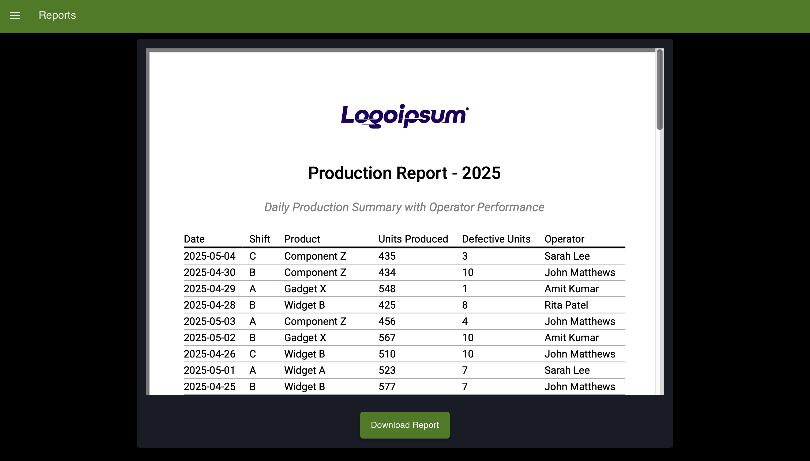

Generating PDF reports is a common need in many workflows—whether you're logging data, sharing results, or creating summaries. With Node-RED and FlowFuse, you can easily automate turning your data into well-structured PDF files. This guide will show you how to set up step-by-step PDF report generation using simple tools and flows.
<!--more-->
Generating reports allows you to capture snapshots of critical data, summarize system activities, and distribute insights in an easy-to-read and stored format. PDF is one of the most universally accepted formats for sharing documents, making it ideal for delivering structured information from your Node-RED flows.

## Prerequisites

Before you begin, make sure the following requirements are met:

- You have an active [FlowFuse account](https://app.flowfuse.com) and a running FlowFuse instance.
- You are familiar with creating and deploying basic flows in Node-RED. If not, consider taking the [Node-RED Fundamentals Course](https://node-red-academy.learnworlds.com/course/node-red-getting-started) sponsored by FlowFuse.
- Ensure you have installed `flowfuse/node-red-dashboard` `@flowfuse/node-red-dashboard-2-ui-iframe` and `node-red-contrib-sqlite` (The SQLite node is required for the demo data generation flow we provided. If you're not using that flow, you can skip this.).

## Setting Up PDF Generation in Node-RED

Once the prerequisites are in place, the next step is setting up your Node-RED environment to generate PDF reports. In this section, we will go over how to install the necessary Node-RED node and configure a flow to generate PDF reports.

### Step 1: Install the @platmac/node-red-pdfbuilder

The [platmac/node-red-pdfbuilder](https://flows.nodered.org/node/@platmac/node-red-pdfbuilder) node is the primary node for creating PDF reports in Node-RED. To install this node:

1. Open your Node-RED editor.
2. Navigate to the "Manage palette" section from the top-right menu.
3. Click on the "Install" tab and search for `@platmac/node-red-pdfbuilder`.
4. Click "Install" to add the node to your palette.

This node allows you to dynamically generate PDFs from various inputs, which is exactly what you will need to generate reports.

If you haven't installed the `@flowfuse/node-red-dashboard`, `@flowfuse/node-red-dashboard-2-ui-iframe` and `node-red-contrib-sqlite` nodes, you can install them similarly.

### Step 2: Understanding How to Use the Pdfbuilder Node

Now that the required node is installed, let's dive into how to use it and how to leverage the different attributes to customize your PDF reports. The pdfbuilder node in Node-RED simplifies generating PDFs by allowing you to define content, layout, and styling directly in your flow.

The key advantage of using pdfbuilder node is that it operates server-side, meaning PDFs can be generated automatically without a browser or manual interaction. This makes it ideal for automated workflows where consistent, programmatically created documents are needed.

When working with this node, you can use various attributes to customize the content and layout of the PDF, such as text, tables, images, page sizes, margins, headers, footers, and more. Below are the most commonly used attributes:

| **Attribute**     | **Description**                                                                 | **Example**                                              |
|-------------------|---------------------------------------------------------------------------------|----------------------------------------------------------|
| `content`         | Defines the content of the PDF (text, tables, images, etc.).                    | `{ "content": "Hello, World!" }`                         |
| `style`           | Specifies the style for content (font size, font family, etc.).                 | `{ "style": "headerStyle" }`                              |
| `layout`          | Defines the layout of a table (e.g., 'lightHorizontalLines', 'noBorders').      | `{ "layout": "lightHorizontalLines" }`                    |
| `pageSize`        | Defines the page size for the PDF.                                              | `{ "pageSize": "A4" }`                                    |
| `pageMargins`     | Sets the margins for the PDF (left, top, right, bottom).                        | `{ "pageMargins": [40, 60, 40, 60] }`                     |
| `header`          | Specifies a header for the PDF. Can be a static text or dynamic content.        | `{ "header": "My PDF Report" }`                           |
| `footer`          | Specifies a footer for the PDF. Can be a static text or dynamic content.        | `{ "footer": "Page {PAGE_NUM} of {PAGE_COUNT}" }`         |
| `defaultStyle`    | Defines the default style for all content in the PDF.                           | `{ "defaultStyle": { "font": "Helvetica", "fontSize": 12 } }` |
| `background`      | Adds a background to the page or content area.                                  | `{ "background": { "image": "imageData" } }`             |
| `width`           | Sets the width of table cells or other elements.                                | `{ "width": 150 }`                                        |
| `height`          | Sets the height of table cells or other elements.                               | `{ "height": 50 }`                                        |
| `alignment`       | Specifies the text alignment (left, center, right).                             | `{ "alignment": "center" }`                               |
| `border`          | Defines the border for tables or table cells (style, width, and color).         | `{ "border": [true, true, true, true] }`                   |

For additional attributes and information, refer to the [pdfmake documentation](https://pdfmake.github.io/docs/0.1/document-definition-object/), as pdfbuilder-node uses this library to generate PDFs.

Here’s a simple example of how you can use these attributes to create a basic PDF:

```json
{
  "content": [
    {
      "svg": "logoDataHere",
      "width": 150,
      "alignment": "center",
      "margin": [0, 0, 0, 20]
    },
    {
      "text": "Production Report - 2025",
      "style": "header"
    },
    {
      "text": "Daily Production Summary with Operator Performance",
      "style": "subheader",
      "alignment": "center",
      "margin": [0, 10, 0, 20]
    },
    {
      "layout": "lightHorizontalLines",
      "table": {
        "headerRows": 1,
        "widths": ["auto", "auto", "*", "auto", "auto", "*"],
        "body": [
          ["Date", "Shift", "Product", "Units Produced", "Defective Units", "Operator"],
          ["2025-01-01", "Morning", "Product A", "1000", "20", "John Doe"],
          ["2025-01-01", "Afternoon", "Product B", "950", "15", "Jane Smith"],
          ["2025-01-02", "Morning", "Product A", "1050", "10", "James Brown"],
          ["2025-01-02", "Afternoon", "Product C", "800", "30", "Emily Clark"],
          ["2025-01-03", "Morning", "Product B", "1100", "25", "Michael Green"],
          ["2025-01-03", "Afternoon", "Product A", "980", "18", "Sarah White"]
        ]
      }
    },
    {
      "text": "This table summarizes the daily production output across different shifts and operators. It includes total units produced and defective units recorded for quality analysis.",
      "fontSize": 12,
      "alignment": "justify",
      "margin": [0, 10, 0, 20]
    },
    {
      "text": "Internal Use Only - Manufacturing Co.",
      "style": "footer",
      "alignment": "center",
      "margin": [0, 20, 0, 0]
    }
  ],
  "styles": {
    "header": {
      "fontSize": 20,
      "bold": true,
      "alignment": "center",
      "margin": [0, 20, 0, 10]
    },
    "subheader": {
      "fontSize": 14,
      "italics": true,
      "color": "grey",
      "margin": [0, 10, 0, 20]
    },
    "footer": {
      "fontSize": 10,
      "color": "grey"
    }
  },
  "pageSize": "A4",
  "pageMargins": [40, 60, 40, 60]
}
```

This example creates a simple PDF featuring a centered logo, a title, a subtitle, a table with a light horizontal line layout, a paragraph of text, and a footer at the end. The following screenshot shows how it looks. You can customize it by adjusting the styles, layout, and content.

{data-zoomable}
_Example pdf result_

### Step 3: Creating a Flow to Generate a PDF

Let's learn how to generate a PDF using dynamic inputs. For this, we’ll use the same example PDF report shown earlier—but this time, we’ll replace the hardcoded values with dynamic input data.

1. For this guide's practical example, we will use the following SQLite flow that generates simulated production data. If you don't have the data source, you can import the flow below to follow along. After importing, deploy the flow and click the Inject node button to generate and insert the data.

When generating PDFs for your specific data, start by creating a flow to collect the information you want in the report. This data can come from sensors, databases, APIs, or even manual inputs.


[{"id":"1e73fef718bb4876","type":"group","z":"b37428694e90b2c5","style":{"stroke":"#b2b3bd","stroke-opacity":"1","fill":"#f2f3fb","fill-opacity":"0.5","label":true,"label-position":"nw","color":"#32333b"},"nodes":["5169b96ad66dcff6","b75fde37ea431d84","a571bbd7b0c0cb25"],"x":14,"y":59,"w":812,"h":82},{"id":"5169b96ad66dcff6","type":"inject","z":"b37428694e90b2c5","g":"1e73fef718bb4876","name":"Create Table","props":[{"p":"payload"},{"p":"topic","vt":"str"}],"repeat":"","crontab":"","once":true,"onceDelay":0.1,"topic":"","payload":"","payloadType":"date","x":130,"y":100,"wires":[["b75fde37ea431d84"]]},{"id":"b75fde37ea431d84","type":"sqlite","z":"b37428694e90b2c5","g":"1e73fef718bb4876","mydb":"1ae6d7f7fdb60191","sqlquery":"fixed","sql":"CREATE TABLE IF NOT EXISTS production_report (\n    id INTEGER PRIMARY KEY AUTOINCREMENT,\n    date TEXT NOT NULL,\n    shift TEXT NOT NULL,\n    product TEXT NOT NULL,\n    units_produced INTEGER NOT NULL,\n    defective_units INTEGER NOT NULL,\n    operator TEXT NOT NULL\n);","name":"","x":440,"y":100,"wires":[["a571bbd7b0c0cb25"]]},{"id":"a571bbd7b0c0cb25","type":"debug","z":"b37428694e90b2c5","g":"1e73fef718bb4876","name":"debug 2","active":true,"tosidebar":true,"console":false,"tostatus":false,"complete":"false","statusVal":"","statusType":"auto","x":720,"y":100,"wires":[]},{"id":"1ae6d7f7fdb60191","type":"sqlitedb","db":"productiondata.sqlite","mode":"RWC"},{"id":"ccca7810c6b3db41","type":"group","z":"b37428694e90b2c5","style":{"stroke":"#b2b3bd","stroke-opacity":"1","fill":"#f2f3fb","fill-opacity":"0.5","label":true,"label-position":"nw","color":"#32333b"},"nodes":["19ad08d3015ef8f2","b706e4aa8a2d0740","f32cdc1dd16b56b7","3708b00ae17defa5","c4464e3454a8805e","2df338e18c9a60d5"],"x":14,"y":179,"w":1332,"h":82},{"id":"19ad08d3015ef8f2","type":"sqlite","z":"b37428694e90b2c5","g":"ccca7810c6b3db41","mydb":"1ae6d7f7fdb60191","sqlquery":"prepared","sql":"INSERT INTO production_report (\n    date,\n    shift,\n    product,\n    units_produced,\n    defective_units,\n    operator\n) VALUES (\n    $date,\n    $shift,\n    $product,\n    $units_produced,\n    $defective_units,\n    $operator\n);\n","name":"","x":1060,"y":220,"wires":[["2df338e18c9a60d5"]]},{"id":"b706e4aa8a2d0740","type":"inject","z":"b37428694e90b2c5","g":"ccca7810c6b3db41","name":"Click to generate and insert data","props":[{"p":"payload"},{"p":"topic","vt":"str"}],"repeat":"","crontab":"","once":false,"onceDelay":0.1,"topic":"","payload":"","payloadType":"date","x":190,"y":220,"wires":[["f32cdc1dd16b56b7"]]},{"id":"f32cdc1dd16b56b7","type":"function","z":"b37428694e90b2c5","g":"ccca7810c6b3db41","name":"Generate Simulated Production Data","func":"const products = [\"Widget A\", \"Widget B\", \"Gadget X\", \"Component Z\"];\nconst operators = [\"John Matthews\", \"Sarah Lee\", \"Amit Kumar\", \"Rita Patel\"];\nconst shifts = [\"A\", \"B\", \"C\"];\n\nfunction getRandomInt(min, max) {\n    return Math.floor(Math.random() * (max - min + 1)) + min;\n}\n\nconst data = [];\n\nfor (let i = 0; i < 10; i++) {\n    const date = new Date();\n    date.setDate(date.getDate() - i); // Last 10 days\n\n    data.push({\n        date: date.toISOString().split('T')[0],\n        shift: shifts[getRandomInt(0, shifts.length - 1)],\n        product: products[getRandomInt(0, products.length - 1)],\n        units_produced: getRandomInt(400, 600),\n        defective_units: getRandomInt(0, 10),\n        operator: operators[getRandomInt(0, operators.length - 1)]\n    });\n}\n\nmsg.payload = data;\nreturn msg;\n","outputs":1,"timeout":0,"noerr":0,"initialize":"","finalize":"","libs":[],"x":490,"y":220,"wires":[["3708b00ae17defa5"]]},{"id":"3708b00ae17defa5","type":"split","z":"b37428694e90b2c5","g":"ccca7810c6b3db41","name":"","splt":"\\n","spltType":"str","arraySplt":1,"arraySpltType":"len","stream":false,"addname":"","property":"payload","x":710,"y":220,"wires":[["c4464e3454a8805e"]]},{"id":"c4464e3454a8805e","type":"change","z":"b37428694e90b2c5","g":"ccca7810c6b3db41","name":"","rules":[{"t":"set","p":"params","pt":"msg","to":"{}","tot":"json"},{"t":"set","p":"params.$date","pt":"msg","to":"payload.date","tot":"msg"},{"t":"set","p":"params.$shift","pt":"msg","to":"payload.shift","tot":"msg"},{"t":"set","p":"params.$product","pt":"msg","to":"payload.product","tot":"msg"},{"t":"set","p":"params.$units_produced","pt":"msg","to":"payload.units_produced","tot":"msg"},{"t":"set","p":"params.$defective_units","pt":"msg","to":"payload.defective_units","tot":"msg"},{"t":"set","p":"params.$operator","pt":"msg","to":"payload.operator","tot":"msg"}],"action":"","property":"","from":"","to":"","reg":false,"x":860,"y":220,"wires":[["19ad08d3015ef8f2"]]},{"id":"2df338e18c9a60d5","type":"debug","z":"b37428694e90b2c5","g":"ccca7810c6b3db41","name":"debug 3","active":true,"tosidebar":true,"console":false,"tostatus":false,"complete":"false","statusVal":"","statusType":"auto","x":1240,"y":220,"wires":[]}]


2. Drag an **Inject** node onto the canvas.
3. Drag an **SQLite** node and connect it to the Inject node. Configure the **SQLite** node with the same database to generate the simulated data. Set the SQL Query type to "fixed statement" and use the following query:

```sql
SELECT * FROM production_report;
```

4. Drag a **Function** node onto the canvas and paste the following JavaScript code. When generating PDFs for your specific data, make sure to adjust the code to match your data structure.

```javascript
// Initialize table body with headers
const tableBody = [
    ['Date', 'Shift', 'Product', 'Units Produced', 'Defective Units', 'Operator']
];

const logo = `<replace-this-your-logo-svg`

// Loop through data rows from SQLite (msg.payload)
for (const row of msg.payload) {
    tableBody.push([
        row.date,
        row.shift,
        row.product,
        row.units_produced.toString(),
        row.defective_units.toString(),
        row.operator
    ]);
}

const docDefinition = {
    content: [
        {
            svg: logo,
            width: 150, // Adjust the logo size as needed
            alignment: 'center',
            margin: [0, 0, 0, 20]
        },
        // Header
        {
            text: 'Production Report - 2025',
            style: 'header'
        },

        // Subheader
        {
            text: 'Daily Production Summary with Operator Performance',
            style: 'subheader',
            alignment: 'center',
            margin: [0, 10, 0, 20]
        },

        // Table
        {
            layout: 'lightHorizontalLines',
            table: {
                headerRows: 1,
                widths: ['auto', 'auto', '*', 'auto', 'auto', '*'],
                body: tableBody
            }
        },

        // Description
        {
            text: 'This table summarizes the daily production output across different shifts and operators. It includes total units produced and defective units recorded for quality analysis.',
            fontSize: 12,
            alignment: 'justify',
            margin: [0, 10, 0, 20]
        },

        // Footer
        {
            text: 'Internal Use Only - Manufacturing Co.',
            style: 'footer',
            alignment: 'center',
            margin: [0, 20, 0, 0]
        }
    ],

    styles: {
        header: {
            fontSize: 20,
            bold: true,
            alignment: 'center',
            margin: [0, 20, 0, 10]
        },
        subheader: {
            fontSize: 14,
            italics: true,
            color: 'grey',
            margin: [0, 10, 0, 20]
        },
        footer: {
            fontSize: 10,
            color: 'grey'
        }
    },

    pageSize: 'A4',
    pageMargins: [40, 60, 40, 60]
};

msg.payload = docDefinition;
return msg;
```

5. Drag a **pdfbuilder** node onto the canvas. Set the input property to `msg.payload`, set output type to Buffer, and output property to `msg.payload`.
6. Drag a **Write File** node, configure it with:
   - Filename: test.pdf
   - Action: Overwrite file
   - Add newline (\n) to each payload?: Checked
7. Connect the **SQLite** node to the **Function** node, then to the **pdfbuilder** node, and finally to the **Write File** node.
8. Deploy the flow and click inject node to generate the pdf.

Once the PDF is generated, you can find it in the `.node-red` directory.

However, if you want to share the PDF with others, display it on the dashboard, and provide a download button, you can use the HTTP API, an iframe, and a few supporting nodes. Let's walk through how to do that next.

### Step 4: Serving the PDF via HTTP and Previewing It on the Dashboard

In this step, we’ll make the generated PDF accessible through a web interface. You’ll be able to preview the PDF directly in the browser and embed it in your FlowFuse dashboard for a smooth, integrated experience. We’ll also add a download button so users can easily save the report. Instead of manually retrieving the file, we’ll create an HTTP endpoint to serve the PDF and use an iframe to display it.

#### Exposing the PDF via HTTP

1. Drag the **http-in** node onto the canvas. Set the method to 'GET' and the URL to `/report.pdf`. This will create an HTTP endpoint for retrieving the generated PDF.
2. Connect the **http-in** node to the **SQLite** node. This ensures that when a request is made to this endpoint, the necessary data is fetched from the database.
3. After the **Write File** node in your flow, add a **Change** node. Connect it to the **Write File** node, and configure it to set the following headers for the HTTP response:
   
   - Set `msg.headers` to:
   ```json
   {   
      'Content-Type': 'application/pdf',   
      'Content-Disposition': 'inline; filename="report.pdf"' 
   }
   ```
4. Drag the **HTTP-response** node onto the canvas and connect it to the Change node.
5. Deploy the flow 

Now, this will send the generated PDF as a response to the incoming HTTP request, allowing it to be previewed in the browser. You can check by entering the URL:

`https://<your-instance-name>.flowfuse.cloud/report.pdf`

### Embedding the PDF on the Dashboard and Adding the Download Button

Now, let's embed the PDF into the dashboard:

1. Drag a **ui-event** node onto the canvas and configure it with the appropriate UI base settings.

2. Next, drag an **iframe** node onto the canvas.  
   - Select the correct group where the PDF should be displayed.  
   - Adjust the size according to your preferences.  
   - In the URL field, enter:

   ```
   https://<your-instance-name>.flowfuse.cloud/report.pdf
   ```

3. Click Done and Deploy the flow.

Once deployed, when you open the dashboard, the generated PDF will be embedded and displayed directly on the dashboard page.

Now, let's add a download button:

4. Drag a **ui-template** widget onto the canvas and paste the following HTML code into it:

```html
<div style="text-align:center; margin-top: 20px;">
    <a href="https://<your-instance-name>.flowfuse.cloud/report.pdf" download="report.pdf"
        style="display: inline-block; background-color: #4f7a28; color: white; padding: 14px 20px; text-align: center; text-decoration: none; font-size: 16px; border-radius: 5px; box-shadow: 0 4px 8px rgba(0, 0, 0, 0.2); transition: background-color 0.3s ease;">
        Download Report
    </a>
</div>
```

5. Deploy the flow.

{data-zoomable}
_[Dashboard displaying embedded PDF with a download button]_

## Final thought

Automating PDF report generation in Node-RED is a great way to save time and effort. Using tools like the node-red-contrib-pdfmake node, you can quickly turn your data into well-designed PDFs without manual work. If you want to save time and avoid the setup process, you can directly use our ready-made [PDF generation blueprint](https://flowfuse.com/blueprints/manufacturing/pdf-report-generator/). It’s an easy way to get started and generate professional reports quickly.
