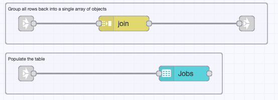
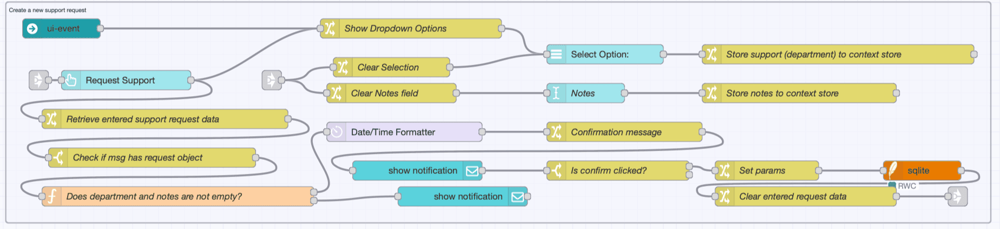
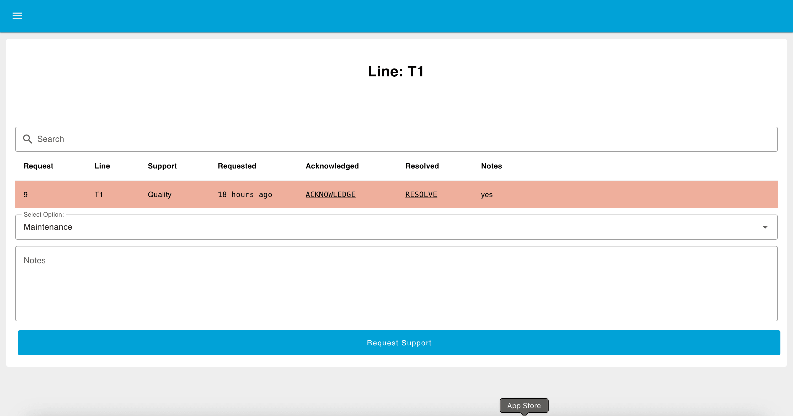

In [Part 1](/blog/2025/05/building-andon-task-manager-with-ff/), we introduced the concept of an Andon Task Manager—designed to streamline issue reporting and resolution on the factory floor—and outlined the system’s key features, user roles, and dashboard layout.

<!--more-->

In this part 2, we move from planning to implementation. The focus now shifts to building the actual system using [FlowFuse Dashboard](https://dashboard.flowfuse.com) (Node-RED Dashboard 2.0), hosted on the FlowFuse platform. We will begin by developing the **Lines view** for regular users, along with a line selection menu. The Department View and Admin interface will follow in a later part of the series.

## Getting Started

To simplify the development process, the implementation is divided into the following key sections:

- Initialize SQLite Database
- Seed Demo Data: Departments & Lines
- Build Line Selection Menu
- Enable URL-Based Dashboard Access
- Create Live Request Fetch Flow (Per Line)
- Render Request Data in a Table
- Setting Up Visual Alerts and Timestamp Formatting
- Highlight Requests with CSS & Add Buttons to Update Request Status
- Create New Request Submission Flow

Before proceeding, a basic understanding of Node-RED is recommended. If you are new to Node-RED, consider going through this [free Node-RED Fundamentals Course](https://node-red-academy.learnworlds.com/course/node-red-getting-started) to get started.

> **Tip:** Organize your flows into clearly defined groups. For reference, images of each flow are provided. Please use the exact names given to each flow—this will help ensure consistency and make it easier to navigate back to specific flows when referenced later.

### Prerequisites

Before you begin building the Andon Task Manager with FlowFuse, make sure you have the following:

- **Running FlowFuse Instance:** Make sure you have a FlowFuse instance set up and running. If you don't have an account, check out the [free trial]({{ site.onboardingURL }}) and [learn](/docs/user/introduction/#creating-a-node-red-instance) how to create an instance.
- **@flowfuse/node-red-dashboard:** Ensure you have FlowFuse Dashboard (also known as Node-RED Dashboard 2.0 in the community) installed.
- **SQLite Contrib Node:** Install `node-red-contrib-sqlite` to handle local data storage.
- **FlowFuse Multi-user Andon:** Install `@flowfuse/node-red-dashboard-2-user-addon` to enable multi-user support.
- **Enable FlowFuse User Authentication:** [Enable FlowFuse User Authentication](/blog/2024/04/displaying-logged-in-users-on-dashboard/#enabling-flowfuse-user-authentication) on your FlowFuse instance.
- **Moment Contrib Node:** Install `node-red-contrib-moment` for date and time formatting.

### Initialize SQLite Database

The first step is to set up a database to store requests and their updates.

1. Drag an **Inject** node onto the canvas and configure it to trigger on Deploy, after a delay of 0.1 seconds.  
2. Drag an **SQLite** node onto the canvas. Double-click and click the **+** icon to add a new database configuration.  
3. Give the database a name and set the mode to **Read-Write-Create**. Click **Add** to save.
4. Set **SQL Query** to **Fixed statement** and enter:

   ```sql
   CREATE TABLE IF NOT EXISTS requests (
     rowid INTEGER PRIMARY KEY,
     line TEXT NOT NULL,
     support TEXT NOT NULL,
     requested TEXT NOT NULL,
     acknowledged TEXT,
     resolved TEXT,
     notes TEXT
   );
   ```

5. Connect the **Inject** node to the SQLite node.
6. Click **Deploy**.

{data-zoomable}
_Flow to initialize the SQLite database and create the requests table._

Once deployed, this will create the SQLite database and `requests` table if it does not already exist.

### Seed Demo Data: Departments & Lines

As discussed in the planning section, only the admin role will have the ability to add new departments and lines. Since the admin feature is not yet available, we will populate demo data using a predefined flow to allow ourself to test the application while the standard user interface is being developed.


[{"id":"d5dd9bfc599374d4","type":"tab","label":"Populate with demo support areas and lines","disabled":false,"info":"","env":[]},{"id":"6471824e24f18939","type":"group","z":"d5dd9bfc599374d4","name":"Add demo production line and department","style":{"label":true},"nodes":["34c733b480e41a13","4e46ae25d198fd1b","882e29d2dcc9326c","399bd159f46c7427","5001c1cdf6661f88"],"x":34,"y":39,"w":1302,"h":122},{"id":"34c733b480e41a13","type":"inject","z":"d5dd9bfc599374d4","g":"6471824e24f18939","name":"Add production lines and department for testing","props":[],"repeat":"","crontab":"","once":true,"onceDelay":0.1,"topic":"","x":260,"y":100,"wires":[["4e46ae25d198fd1b","399bd159f46c7427"]]},{"id":"4e46ae25d198fd1b","type":"switch","z":"d5dd9bfc599374d4","g":"6471824e24f18939","name":"Is lines undefined?","property":"#:(persistent)::lines","propertyType":"global","rules":[{"t":"istype","v":"undefined","vt":"undefined"}],"checkall":"true","repair":false,"outputs":1,"x":770,"y":80,"wires":[["882e29d2dcc9326c"]]},{"id":"882e29d2dcc9326c","type":"change","z":"d5dd9bfc599374d4","g":"6471824e24f18939","name":"Store lines to context store","rules":[{"t":"set","p":"#:(persistent)::lines","pt":"global","to":"[{\"value\":\"T1\",\"label\":\"T1\"},{\"value\":\"T2\",\"label\":\"T2\"}]","tot":"json"}],"action":"","property":"","from":"","to":"","reg":false,"x":1140,"y":80,"wires":[[]]},{"id":"399bd159f46c7427","type":"switch","z":"d5dd9bfc599374d4","g":"6471824e24f18939","name":"Is departments undefined?","property":"#:(persistent)::departments","propertyType":"global","rules":[{"t":"istype","v":"undefined","vt":"undefined"}],"checkall":"true","repair":false,"outputs":1,"x":800,"y":120,"wires":[["5001c1cdf6661f88"]]},{"id":"5001c1cdf6661f88","type":"change","z":"d5dd9bfc599374d4","g":"6471824e24f18939","name":"Store departments to context store","rules":[{"t":"set","p":"#:(persistent)::departments","pt":"global","to":"[{\"value\":\"Maintenance\",\"label\":\"Maintenance\"},{\"value\":\"Stores\",\"label\":\"Stores\"},{\"value\":\"Quality\",\"label\":\"Quality\"}]","tot":"json"}],"action":"","property":"","from":"","to":"","reg":false,"x":1170,"y":120,"wires":[[]]}]


1. Import the provided demo flow.  
2. **Deploy** the flow.

This will store demo lines and departments in the global context as `global.lines` if not already present.

### Build Line Selection Menu

Now, let us create a new page and menu item for Production Lines. This page will list all currently available production lines, making it easier to navigate through them.

1. Drag a **ui-event** node onto the canvas to detect page navigation.
2. Drag a **change** node and configure it to:
   - Set `msg.payload.lines` to `global.get("lines")`
3. Drag a **ui-template** node onto the canvas. Create a new page with name “Line Menu” and a group.
4. Paste the following into the template:

```html
<template>
  <v-container>
    <v-row>
      <v-col>
        <h3>Production Lines</h3>
      </v-col>
    </v-row>

    <v-row class="scrollable-row" no-gutters>
      <v-col v-for="(btn, index) in lines" :key="index" cols="auto">
        <v-btn :href="`/dashboard/lines?line=${btn.value}`" class="custom-btn" rounded>
          {{ btn.label }}
        </v-btn>
      </v-col>
    </v-row>

    <v-alert v-if="selectedLine" type="success" class="mt-3">
      Selected Line: {{ selectedLine }}
    </v-alert>
  </v-container>
</template>

<script>
export default {
  data() {
    return {
      selectedLine: '',
      lines: []
    };
  },
  methods: {
    updateButtonContent(data) {
      this.lines = (data.lines || []).sort((a, b) => a.label.localeCompare(b.label));
    }
  },
  mounted() {
    this.lines = [];
    this.$socket.on('msg-input:' + this.id, (msg) => {
      this.updateButtonContent(msg.payload);
    });
  }
};
</script>

<style scoped>
.scrollable-row {
  display: flex;
  overflow-x: auto;
  padding: 10px 0;
  flex-wrap: wrap;
}
.scrollable-row .v-col {
  flex-shrink: 0;
  margin-bottom: 10px;
}
.scrollable-row {
  min-height: 60px;
}
.custom-btn {
  background-color: rgb(32, 44, 52) !important;
  color: white !important;
  margin-right: 12px;
  padding: 8px 16px;
}
.custom-btn:hover {
  background-color: rgb(54, 70, 86) !important;
}
</style>
```

5. Deploy the flow.

Once deployed, the dashboard will show buttons for each production line. Clicking a line redirects the user to a page with following url:

```
https://<your-instance-name>/dashboard/lines?line=T1
```

{data-zoomable}
_Node-RED flow to create a dynamic menu for production lines on the dashboard._

{data-zoomable}
_Dashboard view showing production line buttons generated from the flow._

The "line" URL parameter will be used in the next section to store the user's selected production line.

### Enable URL-Based Dashboard Access

In this section, we’ll build a flow that allows users to directly access the dashboard using a URL with a line parameter (e.g., ?line=T1). The flow will validate this parameter and store the selected line for each user session. If the parameter is missing or invalid, the user will be redirected to a Not Found page.

To achieve this, we need to:

- Configure the dashboard to expose client-specific metadata.
- Create a flow that validates the line parameter from the URL.
- Store the user’s selected line using session-aware context data.

#### Configuring Dashboard Widgets to Include Client Information

To ensure client data is available in your flows, follow these steps:

1. Open the **Dashboard 2.0** sidebar.
2. Switch to the **Client Data** tab.
3. Enable the option **“Include client data”**.
4. Tick the checkbox in front of:
   - ui-control
   - ui-template
   - ui-button
   - ui-text-input
   - ui-dropdown
   - ui-notification
5. **Deploy** the updated configuration.

{data-zoomable}
_Dashboard 2.0 settings to include client metadata from selected widgets like buttons and templates._

With this setting enabled, the selected widgets will include client-related metadata in their output messages under the `msg._client` property. This metadata is essential for building session-aware features in the Dashboard.

#### Building a Dashboard Flow for URL Access, Line Validation, and User Selection

In this section, we'll build a Node-RED flow that handles dashboard access via direct URLs, validates the line parameter, and stores the selected line per user session using client metadata. This ensures that each user's line selection is tracked independently and that invalid or missing parameters are handled gracefully.

The flow performs the following key tasks:

- Detects when a user accesses the dashboard using a URL containing a line parameter.
- Validates the parameter against a list of predefined production lines.
- Stores the selected line using session-aware (client-specific) data.
- Redirects the user appropriately based on the validity of the parameter.

**Steps to Build the Flow:**

1. Drag a **ui-event node** onto the canvas and configure it with the correct UI base path.
   
2. Drag a **switch node** and name it "Is it a pageview event?" and configure it with the property `msg.topic` and add the following condition:
   - `== $pageview`

3. Drag another **switch node** and name it "Has line key?" and configure it with the property `msg.payload.page.params.line`, with two conditions:
   - has key `line`
   - is empty

4. Connect the **ui-event node** to the first switch node (labeled Is it a pageview event?). Then, connect the first output of this switch node to the second switch node (labeled Has line key?). This checks whether the page was accessed via URL and if a line parameter is present.

5. Drag a `function` node and name it "Extract Labels from Lines" and paste the following code:

   ```javascript
   let lines = global.get('lines', 'persistent') || [];
   let labels = [
      ...lines.map(obj => obj.label),
   ];
   msg.payload.labels = labels;
   return msg;
   ```

This retrieves the list of available lines from the persistent global context, extracts their labels, and creates an array for easier verification of whether the user selected line is present.

6. Drag a **change node** and name it "Store line selection":
   - Set `global.store[msg._client.socketId].line` to `msg.payload`.
7. Drag another **switch node** and name it "Is the currently accessed page 'Lines'?":
  - is equal to "Lines"
8. Connect the **function node** (Extract Labels from Lines) and the **change node** (Store line selection) to the first output of the **switch node** (Has line key?).
9. Drag another `switch` node and name it "Is line valid?" and set the property to `msg.payload.labels` and add following conditions:  
     - contains `global.store[msg._client.socketId].line`
10. For the first output of the `switch` node (Is the currently accessed page 'Lines'?), drag a **change** node and name it "Redirect the user to the All Lines menu" and Configure it to:  
    - Set `msg.payload` to `"All Lines"`
11.  Drag a **ui-control node** onto the canvas and connect it to the **change node** (Redirect the user to the All Lines menu). This node will handle the redirection or display feedback on the dashboard.

This checks whether the selected line is valid by comparing it with the list of known line labels.

12. For the second output of the switch node (Is line valid?), drag a switch node and give it name "Is the currently accessed page 'Lines'?" and Set property to `msg.payload.page.name` and add following condition to check against:
  - == "Lines"
  - Otherwise
13.  For the first output of the switch node ((Is the currently accessed page 'Lines'?), drag a change node and configure it to:
    - Set `msg.payload` to "Incorrect Link"
14.  Drag a ui-control node onto the canvas and configure it with the correct UI base path and connect it the change node (Redirect to Not found page).
15.  Deploy the changes.

{data-zoomable}
_Flow for managing URL-based access, validating line parameters, and storing client-specific selections on the OEE dashboard._

### Create Live Request Flow (Per Line)

Let’s build the flow to retrieve the data now based on the user selection.

1. Drag a `Template` widget onto the canvas.  
2. Double-click the Template widget to open its configuration.  
3. Set the scope to `ui` and select the appropriate UI Base.  
4. Paste the following script into the content field. This script triggers every second and sends a message that includes the current user's client data:

   ```html
   <script>
     export default {
       mounted() {
         // Set an interval to update the message every second
         this.intervalId = setInterval(() => {
           this.send('Component has loaded');
         }, 1000);
       },
       beforeUnmount() {
         // Clear the interval when the component is about to be destroyed
         clearInterval(this.intervalId);
       },
     };
   </script>
   ```

5. Drag a `Change` node and name it "Set params".  
6. Configure the Change node with the following rules:
   - Set `msg.params.$line` to `global.store[msg._client.socketId].line`
   - Set `msg.query` to `"line"`

7. Drag a `Template` node onto the canvas.  
8. Double-click the Template node and set the property to `msg.topic`.  
9. Paste the following SQL query into the content field:

   ```sql
   SELECT * FROM requests WHERE "{{query}}" = "{{line}}" AND resolved IS NULL
   ```

10. Drag a `Markdown` widget and name it "Show currently selected line".  
11. Create a new group in the UI for the Markdown widget to render into.  
12. Enter the following content into the Markdown widget:

    ```html
    <h1 style="text-align: center;">Line: {{ msg?.line }}</h1>
    ```

{data-zoomable}
_The dashboard displays the selected production line name, retrieved from the client context, rendered using a Markdown widget._

13. Drag a `SQLite` node onto the canvas.  
14. Select the appropriate database configuration.  
15. Set the node to use the SQL query via "Prepared Statement".  
16. Connect the `Template` widget to `Change` node and `Template` node to `SQLite` node.  
17. Drag a `link-out` node onto the canvas and connect it to the `SQLite` node.  
18. Deploy the changes.

{data-zoomable}
_Flow that triggers periodic queries for open requests specific to the user’s selected line using the client session and a SQLite database._

### Preparing Data Rendering it in a Table

Once the data is retrieved, it needs to be validated, formatted, and routed appropriately for display. In this section, a flow will be built to check whether any unresolved requests exist for the selected production line. If there are no requests, a message will be shown to the user. Otherwise, the data will be processed and rendered in a table format using Dashboard widgets.

1. Drag a **link-in node** onto the canvas and connect it to the last **link-out node**.

2. Add a **switch node** to check whether the `msg.payload` is empty, name it "Is Payload empty?".  
   - Configure the switch with the following conditions:
     - `msg.payload is empty`
     - `Otherwise`

3. Drag a **change node**, name it "Show 'no outstanding request' message" and configure it to set a message when the payload is empty:  
   - Set `msg.payload` to `"There are no outstanding requests"`
   
4. Connect this **change node** to the first output of the switch node ("Is Payload empty?").

5. Drag another **change node**, name it "Remove 'no outstanding request' message" and configure it as follows:  
   - Set `msg.payload` to an empty string `""`

6. Connect this second **change node** to the second output of the switch node ("Is Payload empty?").

7. Drag a **text widget**, name it "Text Widget for Message", onto the canvas, double-click it, and add a new group in the "Lines" page to render the message.

8. Connect the **text widget** ("Text Widget for Message") to both **change nodes** that are setting the text message ("Show 'no outstanding request' message" and "Remove 'no outstanding request' message").

9. Drag another **link-out node** onto the canvas and connect it to the second output of the switch node ("Is Payload empty?") that checks whether `msg.payload` is empty.

10. Drag another **link-in** onto the canvas.

11. Drag a **split node**, name it "Split Node", onto the canvas and connect it to the **link-in node**.

12. Drag a **link-out node** and connect it to the **split node**.

13. Deploy the changes.

{data-zoomable}
_Flow that checks if unresolved requests exist, sends an appropriate message when none are found, or prepares the data for tabular rendering._

### Setting Up Visual Alerts and Timestamp Formatting

To enhance the visibility of production line requests, this section focuses on setting up visual alerts based on the age of each request and formatting timestamps in a user-friendly way. The created timestamp is always shown using relative time (e.g., "5 minutes ago"). For acknowledged and resolved, relative formatting is applied only when those timestamps are available. This improves readability and makes it easier to identify requests that are pending action.

1. Drag a **link-in node** and a **function node** onto the canvas. Name the **function node** as "Highlight Old Requests" and open it.

2. Paste the following JavaScript code into the **function node**:

```javascript
const requested = msg.payload.requested;
const now = Date.now();

const requestedTime = new Date(requested).getTime();
const difference = now - requestedTime;

const oldRequestThreshold = global.get('oldRequestThreshold');
const veryOldRequestThreshold = global.get('veryOldRequestThreshold');
const alertActivationThreshold = global.get('alertActivationThreshold');

if (difference > (veryOldRequestThreshold * 60 * 1000)) {
   msg.payload.class = 'older';
   if (difference > (alertActivationThreshold * 60 * 1000)) {
       msg.payload.alert = true;
   }
   return msg;
}
else if (difference > (oldRequestThreshold * 60 * 1000)) {
   msg.payload.class = 'old';
   if (difference > (alertActivationThreshold * 60 * 1000)) {
       msg.payload.alert = true;
   }
   return msg;
}
else {
   if (difference > (alertActivationThreshold * 60 * 1000)) {
       msg.payload.alert = true;
   }
   msg.payload.class = 'normal';
   return msg;
}
```

3. Connect the link-in node to the function node.
4. Drag a date time formatter node onto the canvas. Name it "Format Requested Time" and double-click it to configure.
   - Set outputFrom to fromNow.
   - Set both input and output to `msg.payload.requested`.
5. Connect the function node to the date time formatter node.
6. Drag a link-out node and connect it to the function node.
7. Drag a switch node onto the canvas. Name it "Check if Acknowledged is null". Set the property to `msg.payload.acknowledged`, and add the following conditions:
   - is null
   - Otherwise
8. Connect the function node to the switch node.
9. Drag a second date time formatter node onto the canvas. Name it "Format Acknowledged Time".
   - Set outputFrom to fromNow.
   - Set both input and output to `msg.payload.acknowledged`.
11. Connect the second date time formatter node to the second output of the switch node ("Check if Acknowledged is null").
12. Drag another switch node onto the canvas. Name it "Check if Resolved is null". set the property to `msg.payload.resolved`. Add the following conditions:
   - is null
   - Otherwise
12. Connect this switch node ("Check if Resolved is null") to the output of the second date time formatter ("Format Acknowledged Time") node and to the first output of the first switch node ("Check if Acknowledged is null").
13. Drag a third date time formatter node onto the canvas. Name it "Format Resolved Time" and set outputFrom to fromNow. Set both input and output to `msg.payload.resolved`.
14. Connect this third date time formatter node to the second output of the second switch node ("Check if Resolved is null") .
15. Drag a link-out node and connect it to the third date time formatter node.
16. Drag another link-out node and connect it to the first output of the second switch node. Name it "Link to First Switch Output".
17. Deploy the changes.

{data-zoomable}
_Dashboard showing a request visually highlighted based on how long ago it was made, with applied styling and alert classification._

{data-zoomable}
_Flow for setting visual alert classes and formatting timestamps like "5 minutes ago" to enhance clarity and urgency of displayed requests._

## Highlight Requests with CSS & Add Buttons to Update Request Status

We have the data prepared, the class property added to each request message, and the timestamp formatted for better readability. In this section, we will add **'Resolve'** and **'Acknowledge'** buttons for each request to update its status and apply CSS classes based on the `status` property for visual highlighting.

1. Drag a **link-in** node onto the canvas and connect it to the last **link-out** node.
2. Drag a switch node, name it "Is acknowledged null?", and set the property to `msg.payload.acknowledged`. Add the following conditions:
   - is null
   - otherwise
3. Drag a **template node**, name it **"Build ack link"**, set the property to `msg.payload.acknowledged`, and add the following Mustache:
   ```html
   <a href="/dashboard/lines?line={{line}}&action=ack&request={{payload.rowid}}" style="color: #000000" class="{{payload.class}}">ACKNOWLEDGE</a>
   ```
4. Connect the **link-in** node to the **switch** node. Connect the **first output** of the switch node ("Is acknowledged null?") to the input of the **template** node.

5. Drag another switch node, name it "Is resolved null?", set the property to `msg.payload.resolved`, and add the following conditions:
   - is null
   - otherwise
6. Drag a **template node**, give it name "Build res link",  set the property to `msg.payload.resolved`, and add the following Mustache:
   ```html
   <a href="/dashboard/lines?line={{line}}&action=res&request={{payload.rowid}}" style="color: #000000">RESOLVE</a>
   ```

7. Connect the input of this second switch node ("Is resolved null?") to the **second output** of the previous switch node (`acknowledged` switch), then connect the **first output** of the `resolved` switch node to the input of the second **template** node.

8. Drag a **link-out** node and connect both outputs of the `resolved` switch node to this link-out.
9. Deploy the changes.

{data-zoomable}
_Adding action buttons to update the status of each request directly from the dashboard table._

### Adding a Mechanism to Update the Status of a Request in the Database

1. Drag **ui event widget** onto the canvas and configure it with the correct ui base.  
2. Drag **change node** onto the canvas and add the following element:  
   - Set `msg.params` to `{}` 
   - Set `msg.params.$request` to `msg.payload.query.request` 
3. Drag **Date/Time Formatter node** onto the canvas and set input format to "timestamp: milliseconds since epoch" and output to `msg.now`.  
4. Drag **switch node** onto the canvas, set property to `msg.query.action`, and add the following conditions to check against:
   - == ack  
   - == res  
   - otherwise  
5. Drag two SQLite nodes onto the canvas, select the correct database configuration for both, and set the query type to 'Prepared Statement'.
6. For the **first**, set the following sql query:

   ```sql
   UPDATE requests 
   SET acknowledged = $now
   WHERE rowid = $request 
   AND acknowledged IS NULL
   ```

7. For the **second**, set the following sql query:

   ```sql
   UPDATE requests 
   SET resolved = $now
   WHERE rowid = $request 
   AND resolved IS NULL 
   ``` 
8.  Connect the **ui event widget** to **change node**, **change node** to **date/time formatter node**, **date/time formatter** to **switch node**, and:  
   - **switch node first output** to first **first sqlite node**  
   - **switch node second output** to second **second sqlite node**  

{data-zoomable}  
_Flow that handles the update of request status based on user actions (Acknowledged or Resolved)._

### Render Request Data in a Table

Now, let's display the prepared data in a table. To do this, we'll use a **ui_table** widget. However, before displaying, we need to convert the data back into an array, as we are currently spilling array data retrieved from the database into a single message.

1. Drag a **link-in** node onto the canvas and connect it to the **last link-out** node.

2. Drag a **join** node onto the canvas and connect it to the **link-in** node. Double-click on the join node and set the mode to **automatic**.

3. Drag another **link-out** node and connect it to the **join** node.

4. Drag a **link-in** node and connect it to the **last link-out** node.

5. Drag a **ui_table** widget onto the canvas and double-click to configure.

6. Create a **new group** on the *lines* page.

7. Set **Action** to `replace` and **Interaction** to `none`.

8. Untick the **Auto Calculate Columns** option.

9. Add the following column elements:
   - Key: rowid, Label: Request, Align: Left, Type: Text
   - Key: line, Label: Line, Align: Left, Type: Text
   - Key: support, Label: Support, Align: Left, Type: Text
   - Key: requested, Label: Requested, Align: Left, Type: HTML
   - Key: acknowledged, Label: Acknowledged, Align: Left, Type: HTML
   - Key: resolved, Label: Resolved, Align: Left, Type: HTML
   - Key: notes, Label: Notes, Align: Left, Type: Text

10. Deploy the changes.

{data-zoomable}
_Render Data on table._

## Create New Request Submission Flow

To create a flow that allows users to submit a request, follow these steps to set up the necessary UI elements, store the request details, validate input, and store the data in a database.

1. Drag the **ui-event** widget onto the canvas and configure it with the correct UI settings.

2. Drag a **change node** to retrieve the department list and name it "Show Dropdown Options". Add the following:
   - Set `msg.ui_update.options` to `global.departments`.

3. Create a new group for the dropdown widget on the lines page. Connect the **change node** to the input of the dropdown widget, then link it to the **ui-event** node.

4. Drag another **change node** and set `msg.payload` to `msg.store[msg._client.socketId].support`. Name it "Store support (department) to context store".

5. Drag a **text input widget** for the notes field. Create a group for it in the lines page.

6. Add another **change node** to store the notes in the global context and name it "Store notes to context store":
   - Set `msg.payload` to `msg.store[msg._client.socketId].notes`.

7. Connect the change node ("Store support (department) to context store") to the input of the dropdown widget and connect the change node ("Store notes to context store") to the text input widget.

8. Drag the **button widget**, label it "Request Support," and connect it to the **change node** that updates the UI with the department list.

9. Add a **change node** to store the request details in the global context and name it "Retrieve entered support request data":
   - Set `msg.request` to `{}`.
   - Set `msg.request.support` to the value `msg.store[msg._client.socketId].support`.
   - Set `msg.request.notes` to the value `msg.store[msg._client.socketId].notes`.
   - Set `msg.request.line` to the value `msg.store[msg._client.socketId].line`.
   - Set `msg.request.reference` to the value `msg.store[msg._client.socketId].reference`.
10. Drag the switch node onto the canvas and set property to `msg.request` and add condtion to check "is not null".
11. Drag a **function node** and add the following code. Name it "Does department and notes are not empty?":

```javascript
let request = msg.request;
if (typeof request !== "object" || request === null) {
   msg.payload = "Request must be an object.";
   return [null, null, msg];
} else if (!request.hasOwnProperty("support")) {
   msg.payload = "Please select the appropriate department for the request.";
   return [null, msg, null];
} else if (!request.hasOwnProperty("notes") || typeof request.notes !== "string" || request.notes.trim() === "") {
   msg.payload = "Please add notes to provide more context on the request.";
   return [null, null, msg];
} else {
   return [msg, null, null];
}
```

12.  Connect the change node to switch node and switch node to function node. Connect the function node's first output to a **Date/Time Formatter** node. Set the input to 'Timestamp (milliseconds since epoch)' and the output to `msg.request.time`.

13.  Drag a **change node** and set `msg.payload` to "Are you sure you want to submit a request?". Name it "Set Confirmation message".

14.  Connect the change node ("Set Confirmation message") to the **Date/Time Formatter** node.

15.  Drag a **ui-notification widget**, configure it with the correct UI, and set the position to center, checked the checkbox for both allow mnaual dismisal and all amnual confirmation, change close to "Cancel".

16.  Connect the change node ("Set Confirmation message") to the **ui-notification** widget.
17.  Drag another **ui-notification widget**, configure it with the correct UI, and set the position to center.
18.  connect it to the second output of the function node.

19.  Add a **switch node** and set the property to `msg.payload` with the condition:
   - == `confirm_clicked`
   Name it "Is confirm clicked?"

20.  Drag a **change node** and add the following elements and give it name "Set Params":

   - Set `msg.params` to `{}`.
   - Set `msg.params.$line` to the value `msg.request.linet`.
   - Set `msg.params.$support` to the value `msg.request.support`.
   - Set `msg.params.$time` to the value `msg.request.time`.
   - Set `msg.params.$notes` to the value `msg.request.notes`.

21. Connect the change node ("Set Params") to the switch node ("Is confirm clicked?").

22. Drag a **sqlite node**, select the correct database configuration, and choose SQL Query via "Prepared Statement" and connect that sqlite node to the input change node ("Set Params")

23. Drag a **change node** and set the following, give it name "Clear entered request data":
   - Delete `msg.store[msg._client.socketId].support`.
   - Delete `msg.store[msg._client.socketId].notes`.

24. Connect the **change node*** ("Clear entered request data") to the **sqlite node**.

25. Drag a **link-out node** and connect it to the last change node.

26. Drag a **link-in node** and connect it to the last link-out node.

27. Drag two **change nodes** and configure them as follows:
   - First change node: Set `msg.payload` to an empty array `[]`.
   - Second change node: Set `msg.payload` to an empty string `""`.

28. Connect the change nodes to the link-in node to complete the flow.

29. Connect the first change node to the **ui dropdown widget** and the second to the **text input widget**.

30. Deploy the changes.


{data-zoomable}
_Node-RED flow to handle request submission, including form validation, timestamp formatting, and SQL database insertion._

We have now successfully built one part of the Andon task dashboard. You can open the line view in the dashboard and check whether you can submit a request, mark it as acknowledged, and resolve it.

{data-zoomable}
_Dashboard UI where users select a department, enter notes, and submit a support request for the production line._

## Up Next

Up until now, the focus has been on building the core functionality of the Andon Task Manager dashboard, including the Lines page. Design and layout have not been the priority. In the next part, you will learn how to enhance the visual design, improve usability, and create a dedicated page and menu for departments.

Later, we will guide you through building the Admin page for the Andon Task Manager dashboard—enabling request management, department configuration, and overall system control.