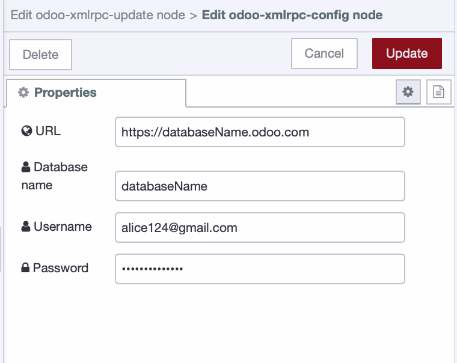

A major problem in manufacturing today is when your ERP system isn't getting real-time information from the factory floor. This gap causes big issues, like ordering too much material because inventory numbers are old, or missing important production deadlines. This lack of instant, correct information directly leads to higher costs and lost opportunities for your business.

<!--more-->

This problem often comes from old ways of recording data. Many factories still rely on paperwork, which takes up valuable space, and manual entries. These methods require extra human effort, causing big delays and added costs. These old, error-prone ways are simply not sustainable for modern manufacturing.

This post gives you a vital solution. We'll show you how to connect your factory floor directly to your ERP system using FlowFuse. This way, you'll see near real-time data in your ERP, helping you avoid issues such as costly over-orders, missed deadlines, and the burdens of excessive paperwork. For this article, we'll focus on integrating with the popular ERP system, Odoo.

## Basic Demo: Automating Production Data from the Shop Floor to Odoo with FlowFuse

Before we start diving into how you can connect your shop floor to ERP, let's first see a simple demo. This basic demo shows how FlowFuse acts as a smart link, making sure your production line data is always accurate in your ERP. We're doing this with a Raspberry Pi running the [FlowFuse Agent](/platform/device-agent/), which talks to a Siemens S7 PLC. A counter in the PLC, which ticks up every second to act like products being made, is precisely read using the [S7 protocol](/blog/2025/01/integrating-siemens-s7-plcs-with-node-red-guide/) through FlowFuse. This accurate count is then automatically sent to Odoo as the quantity for a "table leg product," keeping your inventory data always up-to-date.

This is just a simple example of what FlowFuse can do. But it has much more power! Imagine FlowFuse also checking your production orders (MOs) in your ERP to see what you need to make. It can look at your Bills of Material (BOMs) in your ERP to figure out all the parts required. If it sees you're short on something, it can automatically create purchase orders in your ERP to buy the missing parts. It can even make new manufacturing orders for components you need to build.

<lite-youtube videoid="bxVq_8m-GOk" params="rel=0" style="margin-top: 20px; margin-bottom: 20px; width: 100%; height: 480px;" title="YouTube video player"></lite-youtube>

Below is the complete flow for this demo, in case you would like to explore it further or try it out yourself after reading the article


[{"id":"cab977c8e0d1c054","type":"group","z":"FFF0000000000001","style":{"stroke":"#b2b3bd","stroke-opacity":"1","fill":"#f2f3fb","fill-opacity":"0.5","label":true,"label-position":"nw","color":"#32333b"},"nodes":["6ba9343481e3b041","8a3adb31adbb7475","bfe37a946a6ed20a","304719d8be3f5694"],"x":664,"y":399,"w":732,"h":122},{"id":"6ba9343481e3b041","type":"odoo-xmlrpc-update","z":"FFF0000000000001","g":"cab977c8e0d1c054","name":"","host":"18818bdefd1f27ce","model":"product.template","filter":"","offset":0,"limit":100,"x":1270,"y":480,"wires":[[]]},{"id":"8a3adb31adbb7475","type":"change","z":"FFF0000000000001","g":"cab977c8e0d1c054","name":"","rules":[{"t":"set","p":"payload","pt":"msg","to":"[[38],{\"qty_available\":payload}]","tot":"jsonata"}],"action":"","property":"","from":"","to":"","reg":false,"x":1020,"y":480,"wires":[["6ba9343481e3b041"]]},{"id":"bfe37a946a6ed20a","type":"debug","z":"FFF0000000000001","g":"cab977c8e0d1c054","name":"Good Product Produced","active":true,"tosidebar":true,"console":false,"tostatus":false,"complete":"payload","targetType":"msg","statusVal":"","statusType":"auto","x":1050,"y":440,"wires":[]},{"id":"304719d8be3f5694","type":"s7 in","z":"FFF0000000000001","g":"cab977c8e0d1c054","endpoint":"142c103a7735ea99","mode":"single","variable":"Counter","diff":true,"name":"S7 ","x":740,"y":480,"wires":[["8a3adb31adbb7475","bfe37a946a6ed20a"]]},{"id":"18818bdefd1f27ce","type":"odoo-xmlrpc-config","url":"","db":"","username":"","password":""},{"id":"142c103a7735ea99","type":"s7 endpoint","transport":"iso-on-tcp","address":"192.168.1.6","port":"102","rack":"0","slot":"1","localtsaphi":"01","localtsaplo":"00","remotetsaphi":"01","remotetsaplo":"00","connmode":"rack-slot","adapter":"","busaddr":2,"cycletime":1000,"timeout":2000,"name":"","vartable":[{"addr":"DB1,X4.0","name":"Trigger"},{"addr":"DB1,DW0","name":"Counter"}]}]


## Getting Data Into and Out of Odoo with FlowFuse

In this section, we will show you how you can connect your ERP (Odoo) with your shop floor using FlowFuse. This connection lets you read information, create new records, update existing ones, and search for specific data, bringing real-time factory insights right into your business system.

### Prerequisites

Before you begin, make sure you have the following:

- **Running FlowFuse Instance:** Make sure you have a FlowFuse instance set up and running. If you don't have an account, check out our [free trial]({{ site.onboardingURL }}).
- **node-red-contrib-odoo-xmlrpc-filters-fields:** Ensure you have [node-red-contrib-odoo-xmlrpc-filters-fields](https://flows.nodered.org/node/node-red-contrib-odoo-xmlrpc-filters-fields) installed. This package will enable operations like reading, creating, updating, and searching data, with specific capabilities for filtering records and selecting precise fields.

### Configuring the Odoo Connection Node

Before you can send or receive any data from Odoo, FlowFuse needs to know how to connect to your Odoo instance. This is a one-time setup for your connection details, which can then be reused across all your Odoo nodes in FlowFuse.

1.  Drag any `odoo-xmlrpc` node (like `odoo-xmlrpc-read` or `odoo-xmlrpc-create`) onto your Node-RED canvas.
2.  Double-click on the node to open its configuration.
3.  Next to the "Host" field, click the pencil icon to add a new Odoo connection.
4.  In the configuration dialog, you'll need to enter your Odoo instance's details:
- Host URL: This is the web address of your Odoo instance (e.g., `https://databaseName.odoo.com`).
- Database: The name of your Odoo database.
- Username: Your Odoo login username (e.g., your email address).
- Password: Your Odoo login password.
5.  Click "Add" to save this configuration.


_Configuring Odoo Node_

Now, any `odoo-xmlrpc` node you use can select this saved host configuration, meaning you only have to enter your credentials once.

*Note: These configuration details (Host, Database, Username, Password) are confidential. To prevent exposing them when sharing your flows, it's crucial to use **FlowFuse Environment Variables**. These variables allow you to store sensitive information securely outside of your flow code. For more information, refer to our guide on [Environment Variables in Node-RED](/blog/2023/01/environment-variables-in-node-red/).*

### Understanding Odoo Models

Once your connection is set up, the next key concept for interacting with Odoo is understanding **Models**. In Odoo, a "model" represents a specific type of business object or data record, much like a table in a traditional database. Every piece of data you want to read, create, update, or delete belongs to a specific model.

Common Odoo models relevant to manufacturing include:

- `product.template`: For general product information (e.g., product names, descriptions).
- `stock.quant`: For inventory quantities and locations.
- `mrp.production`: For manufacturing orders/production orders.
- `res.partner`: For contacts (customers, suppliers).
- `stock.picking`: For internal transfers or delivery orders.

When you use an `odoo-xmlrpc` node in FlowFuse, you'll always need to specify which `model` you want to work with. If you're unsure of a specific model's name, you can often find it by enabling "Developer Mode" in your Odoo instance and hovering over fields in the Odoo interface.

Let’s get started. When explaining each operation, I will demonstrate it using different models such as `product.product` or `mrp.production`. This is just for demonstration and your understanding. You can perform these operations in the same way with other models—just make sure to pass the correct parameters according to the model and its data.

### Reading Data from Odoo

To read data from Odoo, you'll use the `odoo-xmlrpc-search_read` node. This node requires you to send the id (or ids) of the record(s) you wish to read to this node with `msg.payload`. The `msg.payload` should contain an array of the IDs you want to read.

Here is how you can read products data:

1. Drag an inject node onto your canvas.
2. Connect it to a change node. Here, you'll set the query details:
- Set `msg.payload` to the following array:

```json
[ID]
```

Replace ID with the actual product ID you want to read. You can include multiple IDs, for example:

```json
[1, 5, 12]
```

4. Connect the change node to an odoo-xmlrpc-search_read node. Select your Odoo connection, enter model to `product.product` (or the Odoo model you want to query).
5. Connect to a debug node to view the data.
6. Deploy the flow and click the inject node button to see the result.

<lite-youtube videoid="9CdVOp_bDMk" params="rel=0" style="margin-top: 20px; margin-bottom: 20px; width: 100%; height: 480px;" title="YouTube video player"></lite-youtube>


[{"id":"4f2bd9814f07c6a6","type":"odoo-xmlrpc-read","z":"295d40790bd21f48","name":"","host":"18818bdefd1f27ce","model":"product.template","x":1190,"y":280,"wires":[["5601affdba752326"]]},{"id":"5601affdba752326","type":"debug","z":"295d40790bd21f48","name":"debug 6","active":true,"tosidebar":true,"console":false,"tostatus":false,"complete":"true","targetType":"full","statusVal":"","statusType":"auto","x":1500,"y":280,"wires":[]},{"id":"4e8b22877e33b496","type":"inject","z":"295d40790bd21f48","name":"Read products with id 23 and 39","props":[],"repeat":"","crontab":"","once":false,"onceDelay":0.1,"topic":"","x":570,"y":280,"wires":[["b21cdd78ad81d65a"]]},{"id":"b21cdd78ad81d65a","type":"change","z":"295d40790bd21f48","name":"","rules":[{"t":"set","p":"payload","pt":"msg","to":"[39,23]","tot":"json"}],"action":"","property":"","from":"","to":"","reg":false,"x":900,"y":280,"wires":[["4f2bd9814f07c6a6"]]},{"id":"18818bdefd1f27ce","type":"odoo-xmlrpc-config","url":"${HOST}","db":"${DB_NAME}","username":"${USERNAME} ","password":"${PASSWORD}"}]


### Creating New Record in Odoo

To create new records in Odoo using FlowFuse, use the `odoo-xmlrpc-create` node. This node requires you to send an array of objects containing the record information as `msg.payload`. The array can include multiple objects, allowing you to create multiple records at once.

Here is how you can create manufacturing order:

1. Drag an inject node onto your canvas and set it to trigger manually.
2. Connect it to a change node. Configure it to set `msg.payload` with the details for your new Odoo manufacturing order:
- Set `msg.payload` to:
```json
[{
    "product_id": 39,      
    "product_qty": 500,     
    "product_uom_id": 1 
}]
```

3. Connect the change node to an `odoo-xmlrpc-create` node. Select your configured Odoo connection for its Host and enter model to `mrp.production`
4. Connect the `odoo-xmlrpc-create node` to a debug node to see the ID of the new record Odoo creates.

<lite-youtube videoid="bq_yaF8etmw" params="rel=0" style="margin-top: 20px; margin-bottom: 20px; width: 100%; height: 480px;" title="YouTube video player"></lite-youtube>


[{"id":"d89d98a5ec9a8733","type":"odoo-xmlrpc-create","z":"295d40790bd21f48","name":"","host":"18818bdefd1f27ce","model":"mrp.production","filter":"","offset":0,"limit":100,"x":1200,"y":380,"wires":[["ea101f5cab65a241"]]},{"id":"99ba2ffda10cf2d9","type":"inject","z":"295d40790bd21f48","name":"Create New MO","props":[],"repeat":"","crontab":"","once":false,"onceDelay":0.1,"topic":"","x":620,"y":380,"wires":[["33e0301b6e8f7838"]]},{"id":"ea101f5cab65a241","type":"debug","z":"295d40790bd21f48","name":"debug 5","active":true,"tosidebar":true,"console":false,"tostatus":false,"complete":"true","targetType":"full","statusVal":"","statusType":"auto","x":1500,"y":380,"wires":[]},{"id":"33e0301b6e8f7838","type":"change","z":"295d40790bd21f48","name":"","rules":[{"t":"set","p":"payload","pt":"msg","to":"[{\"product_id\":30,\"product_qty\":200,\"product_uom_id\":1}]","tot":"json"}],"action":"","property":"","from":"","to":"","reg":false,"x":900,"y":380,"wires":[["d89d98a5ec9a8733"]]},{"id":"18818bdefd1f27ce","type":"odoo-xmlrpc-config","url":"${HOST}","db":"${DB_NAME}","username":"${USERNAME} ","password":"${PASSWORD}"}]


### Updating Existing Data in Odoo

To modify existing records in Odoo using FlowFuse, you'll use the `odoo-xmlrpc-update` node. This node requires the ID of the record(s) you want to update and the new values for the fields you wish to change. The `msg.payload` should contain an array, where the first element is a list of record IDs and the second element is an object with the fields to update.

Here is how you can update the status of manufacturing order:

1. Drag an inject node onto your canvas. Configure it to trigger manually.
2. Connect it to a change node. This node will prepare the `msg.payload` with the order ID and the new status.

- Set `msg.payload` to :
```json
[
    [13],
    {"state": "progress"}
]
```

3. Connect the change node to an `odoo-xmlrpc-update` node. Select your configured Odoo connection for its Host and enter model to `mrp.production`.
4. Connect the `odoo-xmlrpc-update` node to a debug node to confirm the update operation. (A successful update typically returns true or an empty payload).
5. Deploy the flow and click the inject node button to see the result.

<lite-youtube videoid="SsPfHxCwMI8" params="rel=0" style="margin-top: 20px; margin-bottom: 20px; width: 100%; height: 480px;" title="YouTube video player"></lite-youtube>


[{"id":"e43dc05eb7df7ecf","type":"inject","z":"295d40790bd21f48","name":"Update MO Status","props":[],"repeat":"","crontab":"","once":false,"onceDelay":0.1,"topic":"","x":610,"y":540,"wires":[["11bbd21f1314b839"]]},{"id":"47b01f56b4800c5c","type":"debug","z":"295d40790bd21f48","name":"debug 3","active":true,"tosidebar":true,"console":false,"tostatus":false,"complete":"true","targetType":"full","statusVal":"","statusType":"auto","x":1500,"y":540,"wires":[]},{"id":"bd9de404f2ac1a2e","type":"odoo-xmlrpc-update","z":"295d40790bd21f48","name":"","host":"18818bdefd1f27ce","model":"mrp.production","filter":"","offset":0,"limit":100,"x":1200,"y":540,"wires":[["47b01f56b4800c5c"]]},{"id":"11bbd21f1314b839","type":"change","z":"295d40790bd21f48","name":"","rules":[{"t":"set","p":"payload","pt":"msg","to":"[     [18],     {\"state\": \"progress\"} ]","tot":"json"}],"action":"","property":"","from":"","to":"","reg":false,"x":900,"y":540,"wires":[["bd9de404f2ac1a2e"]]},{"id":"18818bdefd1f27ce","type":"odoo-xmlrpc-config","url":"${HOST}","db":"${DB_NAME}","username":"${USERNAME} ","password":"${PASSWORD}"}]


### Deleting Records from Odoo (Unlink)

To delete records in Odoo using FlowFuse, you'll use the `odoo-xmlrpc-unlink` node. This node requires you to send the id (or ids) of the record(s) you wish to remove. The `msg.payload` should contain an array of the IDs you want to delete.

Here is how you can delete product from inventory:

1. Drag an inject node onto your canvas. Configure it to trigger manually.
2. Connect the inject node to a change node. This node will prepare the msg.payload with the ID(s) of the record(s) to delete.
- Set `msg.payload` to a JSON array containing the ID of the manufacturing order to delete:

```json
[16]
```

3. Connect the change node to an `odoo-xmlrpc-unlink`. Select your configured Odoo connection for its Host and enter model to `mrp.production`.
4. Connect the `odoo-xmlrpc-unlink` to a debug node to confirm the unlink operation.
5. Deploy the flow and click the inject node button to see the result.

<lite-youtube videoid="1O1JYRtX-Sg" params="rel=0" style="margin-top: 20px; margin-bottom: 20px; width: 100%; height: 480px;" title="YouTube video player"></lite-youtube>


[{"id":"f14241bb24af8dc8","type":"odoo-xmlrpc-unlink","z":"295d40790bd21f48","name":"","host":"18818bdefd1f27ce","model":"product.template","x":1190,"y":700,"wires":[["231e32e70753ab22"]]},{"id":"9452d125fd059f79","type":"inject","z":"295d40790bd21f48","name":"Delete the product with ID 60","props":[],"repeat":"","crontab":"","once":false,"onceDelay":0.1,"topic":"","x":580,"y":700,"wires":[["cfcabeae8b291a9c"]]},{"id":"231e32e70753ab22","type":"debug","z":"295d40790bd21f48","name":"debug 7","active":true,"tosidebar":true,"console":false,"tostatus":false,"complete":"true","targetType":"full","statusVal":"","statusType":"auto","x":1500,"y":700,"wires":[]},{"id":"cfcabeae8b291a9c","type":"change","z":"295d40790bd21f48","name":"","rules":[{"t":"set","p":"payload","pt":"msg","to":"[60]","tot":"json"}],"action":"","property":"","from":"","to":"","reg":false,"x":900,"y":700,"wires":[["f14241bb24af8dc8"]]},{"id":"18818bdefd1f27ce","type":"odoo-xmlrpc-config","url":"${HOST}","db":"${DB_NAME}","username":"${USERNAME} ","password":"${PASSWORD}"}]


### Advanced Search with Filters and Fields

For advanced queries, you'll use the `odoo-xmlrpc-search_read` node. This versatile node combines the ability to search for records using complex criteria (filters) and to retrieve only the specific data fields you need from those results.

#### Understanding Filters

Filters are conditions you apply to narrow down your search results. They are structured as a **list of lists**, where each inner list defines a single condition: `[field, operator, value]`.

-   `field`: The name of the Odoo field you want to filter by (e.g., `qty_available`, `state`, `name`).
-   `operator`: How you want to compare the field. Common operators include:
    -   `=`: Equal to
    -   `!=`: Not equal to
    -   `>`: Greater than
    -   `<`: Less than
    -   `>=`: Greater than or equal to
    -   `<=`: Less than or equal to
    -   `in`: Value is in a list (e.g., `[["id", "in", [1, 2, 3]]`)
    -   `not in`: Value is not in a list
    -   `ilike`: Case-insensitive "like" (contains substring)
    -   `=like`: Case-sensitive "like"
-   `value`: The value you're comparing against.

When you include multiple conditions within your filters list, Odoo treats them as an "AND" relationship by default. This means all conditions must be true for a record to be returned.

**Example Filters:**
-   `[[["list_price", "<", 10]]]`: Find products with less than 10 units in stock.
-   `[[["state", "=", "progress"], ["product_id", "=", 38]]]`: Find manufacturing orders for a specific product that are currently "in progress."
-   `[[["name", "ilike", "coating"]]]`: Find products where the name contains "coating" (case-insensitive).

#### Understanding Fields

The `fields` parameter allows you to specify exactly which columns or properties you want to retrieve for the matching records. This is important for efficiency, as it avoids pulling unnecessary data, making your flows faster and your payloads smaller.

-   **Structure:** A simple list of field names (e.g., `["name", "qty_available", "default_code"]`).

#### Controlling Results: Offset and Limit

For larger datasets, you'll want to control how many records are returned and where the results start.

- offset: This parameter specifies the number of records to skip from the beginning of the result set. It's useful for pagination.
- limit: This parameter specifies the maximum number of records to return in a single query. It's crucial for managing the amount of data you retrieve.

#### Example Flow

Here’s an example FlowFuse flow to find products with list price (more than 1000) that are also marked as "saleable" in Odoo, retrieving only their name, quantity, internal reference, and list price, and limiting the results.

1. Drag an inject node onto your canvas and configure it to trigger manually.
2. Connect it to a change node. This node will define your search criteria (filters and fields) and also set the offset and limit.
- Set `msg.filters` to JSON:

```json
[[
    ["list_price", ">", 1000],
    ["sale_ok", "=", true]
]]
```
- Set `msg.fields` to JSON:

```json
["name", "qty_available", "default_code", "standard_price"]
```
- Set `msg.offset` to Number 0 (Start from the first record).
- Set `msg.limit` to Number 5 (Retrieve a maximum of 10 records).

3. Connect the change node to an `odoo-xmlrpc-search_read` node. Select your configured Odoo connection.
4. Connect to a debug node to inspect the filtered and selected data in the debug sidebar.
5. Deploy the flow and click the inject node button to see the result.

<lite-youtube videoid="8Asa3z2VctQ" params="rel=0" style="margin-top: 20px; margin-bottom: 20px; width: 100%; height: 480px;" title="YouTube video player"></lite-youtube>


[{"id":"0cfe26fd5b4169e7","type":"debug","z":"295d40790bd21f48","name":"debug 4","active":true,"tosidebar":true,"console":false,"tostatus":false,"complete":"true","targetType":"full","statusVal":"","statusType":"auto","x":1500,"y":840,"wires":[]},{"id":"656023449ba5dee9","type":"inject","z":"295d40790bd21f48","name":"Read Top 5 Saleable Products >1000","props":[],"repeat":"","crontab":"","once":false,"onceDelay":0.1,"topic":"","x":550,"y":840,"wires":[["7f791bfc8caa0721"]]},{"id":"8ada5a972d94dd9d","type":"odoo-xmlrpc-search-read","z":"295d40790bd21f48","name":"","host":"18818bdefd1f27ce","model":"product.product","filter":"","offset":0,"limit":100,"x":1210,"y":840,"wires":[["0cfe26fd5b4169e7"]]},{"id":"7f791bfc8caa0721","type":"change","z":"295d40790bd21f48","name":"","rules":[{"t":"set","p":"filters","pt":"msg","to":"[[[\"list_price\",\">\",1000],[\"sale_ok\",\"=\",true]]]","tot":"json"},{"t":"set","p":"limit","pt":"msg","to":"5","tot":"num"},{"t":"set","p":"offset","pt":"msg","to":"0","tot":"num"},{"t":"set","p":"fields","pt":"msg","to":"[\"name\",\"qty_available\",\"default_code\",\"lst_price\"]","tot":"json"}],"action":"","property":"","from":"","to":"","reg":false,"x":900,"y":840,"wires":[["8ada5a972d94dd9d"]]},{"id":"18818bdefd1f27ce","type":"odoo-xmlrpc-config","url":"${HOST}","db":"${DB_NAME}","username":"${USERNAME} ","password":"${PASSWORD}"}]


## Final thought

So, we've talked about how those manual data methods—paper, spreadsheets—can really slow things down, cause mistakes, and cost money in your factory. And let's be honest, many digital fixes out there just add more complexity or demand specialized coding skills that your team might not have.

This is where FlowFuse comes in. FlowFuse is a platform made for factory floors that runs on your devices right there. It connects to all your machines, old or new, and even your ERP systems like Odoo. FlowFuse collects, cleans, and moves your data. It helps your engineers, who know your operations best, build industrial applications and solutions using simple drag-and-drop actions. This means they can link your factory data directly to your ERP, getting rid of all those manual steps and saving your IT team time and money.

What's the real payoff? You get to see less wasted time and money, fewer mistakes with accurate, real-time data, and simply better control over your whole factory. FlowFuse helps your entire operation run smarter and more reliably. If you're looking for a practical way to bring these kinds of improvements to your own manufacturing processes, we'd be glad to discuss how FlowFuse can assist. [Get in touch here](/contact-us/)
