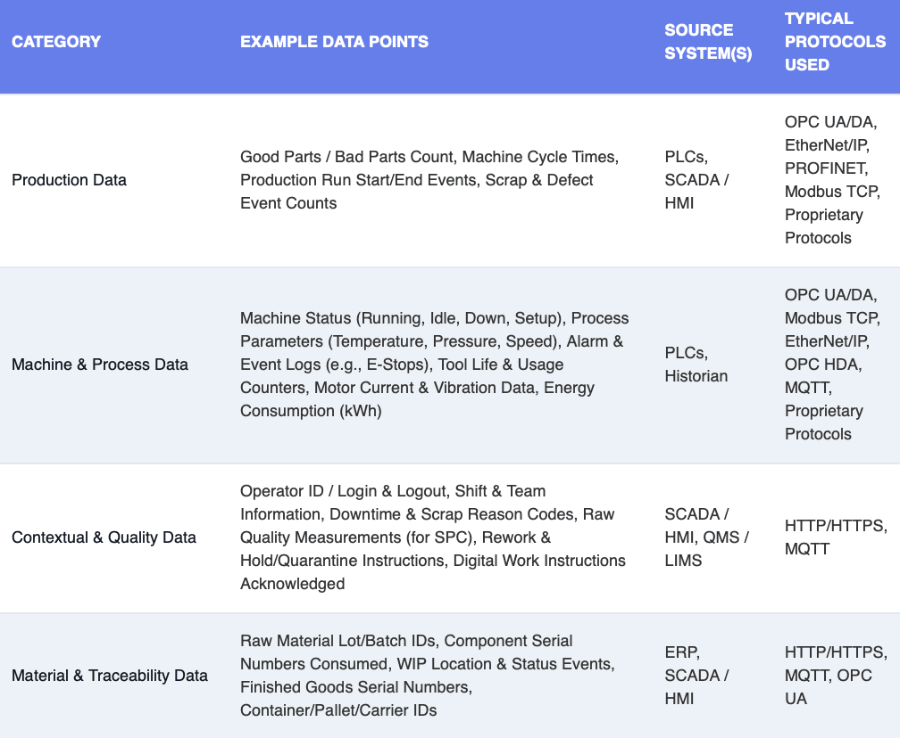

A Manufacturing Execution System (MES) is the central control system of a factory. To work properly, it needs a steady stream of real-time data from machines and systems on the factory floor. This data is essential for running operations smoothly. But in most factories, the hardest part is getting this data to the MES.

<!--more-->

This article dives into the data that fuels your MES and the complex web of sources it comes from. We'll explore the core challenge that keeps this data locked away in silos. Most importantly, we’ll show how **FlowFuse** acts as the catalyst to liberate this data, empowering you to get the right information to your MES, exactly when and where you need it most.

## The Operational Data Your MES Needs

For a factory's main computer system (the MES) to do its job, it needs a constant stream of information. Think of it like a control room that needs to see everything at once. This information can be grouped into four main types:

* **Production Information:** This tells the system how much is being made, how fast it's being made, and if any products had to be thrown out. It's the basic "are we winning?" data.

* **Machine Information:** This is like a live health report for your equipment. It tells the system if a machine is running or stopped, what its settings are (like temperature or speed), and how much power it's using.

* **Context and Quality Information:** This data adds the "why." It tells the system who is working, why a machine stopped, and if the products being made are good enough to sell.

* **Material Information:** This tells the full story of a product. It tracks all the raw materials and parts from start to finish, so you know exactly what went into every single item.

Once the system gets all this information, it does more than just track numbers. It becomes the factory's control center. It gives workers step-by-step instructions on their screens, makes sure rules are followed to prevent mistakes, and lets managers see exactly what’s happening everywhere so they can fix small problems before they become big ones.

## The Origins Of Your Operational Data

This critical operational data doesn't live in one place; it's generated across a diverse and complex digital ecosystem.

A vast amount comes directly from shop floor equipment—the PLCs that orchestrate your machines, the thousands of sensors measuring every variable, and the Historians that diligently archive past performance. Then you have your core business systems. The ERP provides the what and why through production orders, while Quality (QCS) and Maintenance (CMMS) systems add essential layers of inspection and machine health data.

Each of these sources speaks its own digital language. A single factory floor is a cacophony of `Modbus`, `OPC UA`, `EtherNet/IP`, and `MQTT`, etc all running simultaneously. This mix of protocols defines the communication architecture of the operation.

To better understand the data involved, its sources, and the common protocols used, let's look at a detailed breakdown:

{data-zoomable}
_A table showing the four main categories of data MES need_

## Why It's So Difficult, Slow, and Costly to Access Data

You know what data you need and where it is. The fundamental question is: can you actually get it from your machines and deliver it to your MES?

This is the central struggle where real-time decisions get delayed, opportunities are lost, and innovation is stifled. Your most valuable data is trapped. Because your factory’s systems don’t speak the same digital language, data is locked away in "silos," inaccessible and unusable. This isn't a technical inconvenience; it's a critical business problem.

Every new piece of equipment demands expensive, custom-coded integrations that are fragile and brittle. This necessitates a constant reliance on specialized programmers, driving up operational costs significantly. The result is a chaotic patchwork of inconsistent data flows, leaving you with a fragmented view of your operation instead of the unified intelligence you desperately need to make swift, informed decisions. This isn't just inefficient; it actively sabotages your agility, cripples your ability to innovate, and fundamentally undermines your competitive advantage.

## Orchestrate Your Factory's Data Flow with FlowFuse

It's frustrating to know the data is there but be unable to reach it. FlowFuse was built to solve this exact problem by acting as a data acquisition layer for your factory. It creates reliable pathways for information to get from your various machines and systems directly to your MES.

The power of FlowFuse lies in its foundation on the vast Node-RED ecosystem. This gives you immediate access to a library of over 5,000 pre-built connectors, or "nodes" ready to communicate with a massive array of industrial protocols. This eliminates the need for expensive, time-consuming custom code. The library includes robust nodes for standards like Modbus, OPC UA, and MQTT, as well as for specific controllers from Siemens, Mitsubishi, Omron, and more.

Following are some of the most commonly used protocol nodes:

- **Modbus:** <https://flows.nodered.org/node/node-red-contrib-modbus>
- **OPC UA:** <https://flows.nodered.org/node/node-red-contrib-opcua>
- **OPC DA:** <https://flows.nodered.org/node/node-red-contrib-opc-da>
- **MQTT:** <https://flowfuse.com/node-red/core-nodes/mqtt-in/>
- **Ethernet/IP:** <https://flows.nodered.org/node/node-red-contrib-ethernet-ip>
- **Siemens S7:** <https://flows.nodered.org/node/node-red-contrib-s7comm>
- **MITSUBISHI MC:** <https://flows.nodered.org/node/node-red-contrib-mcprotocol>
- **OMRON FINS:** <https://flows.nodered.org/node/node-red-contrib-omron-fins>
- **HTTP:** <https://flowfuse.com/node-red/core-nodes/http-in/>
- **LwM2M:** <https://flows.nodered.org/node/node-red-contrib-lwm2m>
- **AMQP:** <https://flowfuse.com/node-red/protocol/amqp/>
- **Serialport:** <https://flows.nodered.org/node/node-red-node-serialport>
- **GPIO:** <https://flows.nodered.org/node/node-red-contrib-gpio>
- **Lorawan:** <https://flows.nodered.org/node/node-red-contrib-lorawan>

This extensive library allows you to reliably acquire data from various assets using a simple drag-and-drop approach, bringing your factory's siloed data into a cohesive and manageable flow.

In addition to protocol connectors, there are also powerful database nodes available to integrate with systems such as InfluxDB, TimescaleDB, PostgreSQL, Microsoft SQL Server, and more—making it easy to store, query, and analyze your factory data.

So, With FlowFuse, you can:

* **Deploy intelligent agents** directly to the edge, all managed from a central platform remotely.
* **Connect to any industrial asset**—PLCs, sensors, SCADA—using ready-made nodes.
* **Transform raw data** with visual logic, so it’s perfectly structured for your MES.
* **Build custom operator dashboards** with pre-built UI widgets to visualize and act on data.
* **Automate data flows** based on schedules, machine events, or production states.
* **Secure the entire process** with enterprise-grade features like multi-user authentication and role-based access control.
* **Scale seamlessly** from a single line to your entire enterprise.

This isn't just about solving a technical challenge. It’s about driving business outcomes. When you can finally see your entire operation in one clear picture, your production lines run more efficiently. You'll see tangible savings as you reduce waste and catch errors before they become costly. When you are known for exceptional quality and effortless compliance, you win. You can turn the messy, trapped data that has been holding you back into the very asset that pushes you ahead of the competition.

## Your Next Step Towards Operational Excellence

Bridging the gap between your factory floor and your MES is a huge task. The sheer diversity of machines, systems, and protocols can seem impossible to overcome. But it doesn’t have to be a barrier to innovation.

This is precisely where FlowFuse shines. It acts as the universal translator, bringing all your systems together regardless of the language they speak. With thousands of ready-to-use connectors and an intuitive low-code interface, FlowFuse empowers you to get your data flowing exactly where it needs to go.

Once that live data starts moving, your MES becomes exponentially more powerful—helping you spot problems faster, plan smarter, and run your operations with confidence.

Want to see it in action? [Book a live demo](/book-demo/) and watch FlowFuse unlock your factory data—no custom code required.
