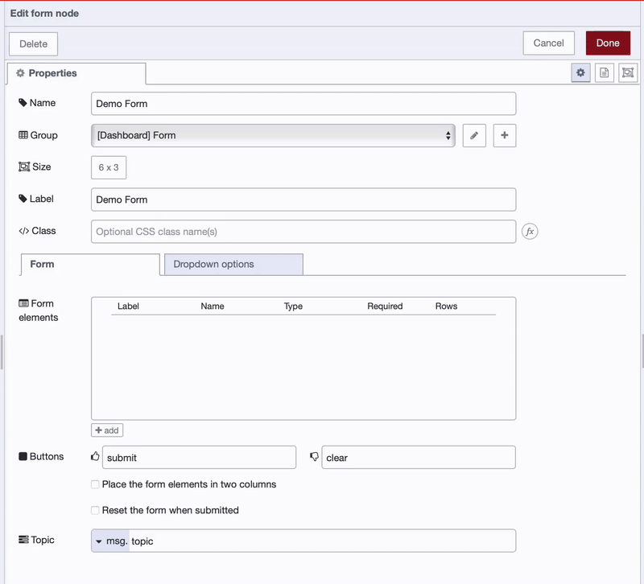
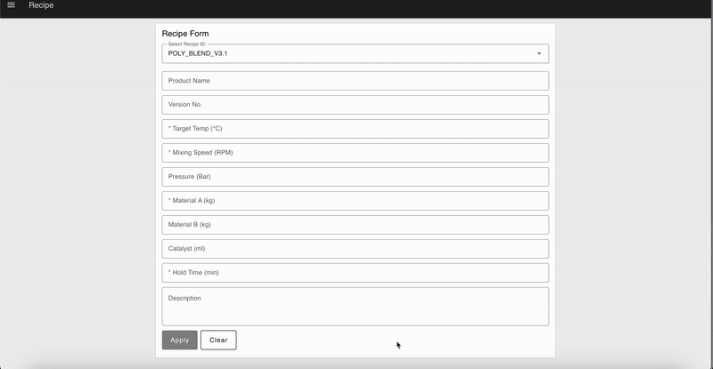

It's often a pain to get important data from the factory floor. Things like doing quality checks still rely on old methods like manual notes and slow spreadsheets. This can lead to delays, errors, and a lot of wasted time before anyone can actually use the information. It's especially tough when you need quick feedback from an operator.

<!--more-->

This article will show you an easy way to gather data via a form entry. We'll look at how forms in FlowFuse Dashboard can make collecting data from factory workers much simpler. You'll learn how to build useful forms that connects your team's knowledge directly to your industrial processes. As a practical example, we'll walk you through building a solution to digitize production recipe updates, showing you exactly how to implement it.

## Prerequisites

Before you begin, make sure you have the following:

- **Node-RED:** Make sure you have an instance of Node-RED up and running. The quickest way to do this is via FlowFuse. If you don't have an account, check out our [free trial]().

Then you'll need to add two more sets of nodes to your palette:

- **FlowFuse Dashboard:** Ensure you have [FlowFuse Dashboard](https://flows.nodered.org/node/@flowfuse/node-red-dashboard) (also known as Node-RED Dashboard 2.0 in the community) installed and properly configured on your instance.
- **SQLite:** Install the [node-red-node-sqlite](https://flows.nodered.org/node/node-red-node-sqlite) package, which will be used in the practical example.

and finally:

- **Basic Node-RED Knowledge:** You are familiar with creating and deploying basic flows in Node-RED. If not, consider taking the [Node-RED Fundamentals Course](https://node-red-academy.learnworlds.com/course/node-red-getting-started) *sponsored by FlowFuse.*

## Building Forms in FlowFuse Dashboard

The FlowFuse Dashboard makes it easy to build interactive industrial applications using drag-and-drop components — **no coding required**. 

One of these components is the [Form](https://dashboard.flowfuse.com/nodes/widgets/ui-form.html) widget, which allows you to create versatile forms within your applications. The Form widget supports a wide range of input types, including:

- Text Fields
- Number Inputs
- Date Pickers,
- Multi-line Text Areas
- Dropdown Selection
- Checkboxes

A key benefit of this widget is that you can configure the form fields either statically (with predefined values) or dynamically (updated through your Node-RED flow), depending on your application’s needs.

### Adding and Configuring the Form Widget

1. Drag the **Form** widget onto the canvas.
2. Double-click on the widget and create a new group for it with the correct page configuration to render it. (note: if this is the first widget you have, this will automatically be created for you)
3. Set an appropriate size (width and height) according to your preferences.
4. Enter the label for the form.

Now that we have completed all the basic and necessary configurations for the form, let’s add the input elements.

### Adding Input Fields to the Form Statically

{data-zoomable}
_Adding Form Elements_

The widget supports various input element types that can be tailored to specific use cases — from collecting simple text to selecting dates or choosing from predefined options.

**To add input elements:**

1. Click the **+ add** button in the widget’s configuration dialog.
2. A new configuration row will appear for the element.
3. Configure each input element with the following fields:

- **Label**: This is the visible label for the field shown to the user.
- **Name**: A unique key used in the message payload (e.g., `msg.payload.firstname`) when the form is submitted.
- **Type**: Select the input type. Supported types include:
  - **Text**: For short text inputs (e.g., name, city).
  - **Number**: For numeric inputs (e.g., age, price).
  - **Date**: For selecting a date.
  - **Text Area**: For longer free-form text.
  - **Dropdown**: For selecting from a list of predefined values.  
    _We will cover how to add options to the dropdown field in a later section._
  - **Checkbox**: For boolean values (checked or unchecked).
- **Required**: Check this box to make the field mandatory. The form cannot be submitted unless this field is filled.
- **Row**:: If Multiline is selected, this defines the number of visible rows in the text area.

### Adding Options to Dropdown Inputs Statically

When you add Dropdown type input element to the Form widget, you need to provide a list of `options` that the user can choose from. These options can be configured in the widget's configuration dialog.

1. In the widget's configuration dialog, switch to the "Dropdown Options" tab.
2. Click the **+ add** button to insert a new option row.
3. In the new row, fill in the following fields:
   - **Dropdown**: Select the dropdown input field you want to add options to.
   - **Value**: The internal value that will be sent in the form payload when this option is selected.
   - **Label**: The visible text shown to the user in the dropdown list.

Repeat this process for each option you want to add.

### Pre-filling Forms with Default Values

You can pre-fill forms with default values to streamline user input, reduce typing errors, and save time. This is especially useful in scenarios like editing an existing recipe, where the current details can be loaded directly into the form.

We can pass data to the `ui-form` node in our flow to set these values dynamically. To do this, send an object in `msg.payload` to the input of the relevant node. Each key of `msg.payload` corresponds to a form field and its value represents the pre-filled data.

For example, if your form includes fields for `product_name` and `target_temperature_c`, you can send a `msg.payload` like this:

```javascript
{
    "product_name": "Eco-Friendly Coating",
    "target_temperature_c": 120.0
};
```

### Add Form Input Elements Dynamically at Runtime

In some cases, you may need to define form elements dynamically based on real-time data. 

For example, you might want to show additional fields based on a user’s selection or load dropdown options from an external API. This dynamic capability adds a new level of flexibility and interactivity to your forms.

**To define form fields at runtime:**

1. Use the `msg.ui_update.options`.
2. `options` should contain an array of objects, where each object defines the new configuration for the element:

Below are the supported element types and their corresponding JSON configurations:

| **Element Type** | **JSON Configuration** |
|------------------|------------------------|
| **Text** | ```{ "type": "text", "label": "Name", "key": "name", "required": true }``` |
| **Multiline** | ```{ "type": "multiline", "label": "Name", "key": "name", "required": true, "rows": 4 } ``` |
| **Password** | ```{ "type": "password", "label": "Password", "key": "password", "required": true } ``` |
| **Email** | ```{ "type": "email", "label": "E-Mail Address", "key": "email", "required": true } ``` |
| **Number** | ```{ "type": "number", "label": "Age", "key": "age", "required": true }``` |
| **Checkbox** | ```{ "type": "checkbox", "label": "Subscribe to Newsletter", "key": "newsletter" } ``` |
| **Switch** | ```{ "type": "switch", "label": "Enable Notifications", "key": "notifications" }``` |
| **Date** | ```{ "type": "date", "label": "Date of Birth", "key": "dob", "required": true } ``` |
| **Time** | ```{ "type": "time", "label": "Time of Birth", "key": "tob", "required": true } ``` |
| **Dropdown** | ```{ "type": "dropdown", "label": "Dropdown", "key": "selection" } ``` |

### Adding Options to Dropdown Inputs Dynamically at Runtime

To update the options of a dropdown field at runtime, use the `msg.ui_update.dropdownOptions` property in your flow.

This is useful when you want to update just the dropdown options without changing the rest of the form.

**Example:**

```json
[
   {
        "dropdown": "Machine Type",
        "value": "A",
        "label": "Option A"
   },
   {
        "dropdown": "Machine Type",
        "value": "B",
        "label": "Option B"
   }
]
```

The "dropdown" refers to the name of the dropdown field you want to add options for. The "value" represents the internal value that is sent when the user selects the option. The "label" is the option displayed to the user in the dropdown.

## Handling Input Data Collected from the Dashboard Form

When a user submits the dashboard form, the input data is sent to Node-RED, where it can be accessed and processed. This enables you to perform tasks such as validating the data, transforming it, or sending it to other systems like databases or APIs.

### Retrieving Submitted Data

The data submitted from the form is transmitted to any nodes connected to the output of the `ui-from` node, and is contained within `msg.payload`. Each field’s value can be accessed using the field’s key or name as the property within `msg.payload`.

For example, let’s say the form includes the following fields:

- Device Name (key: `device_name`)  
- Device ID (key: `device_id`)  
- Device Serial Number (key: `serial_number`)  
- Country (key: `country`)  

After submission, you can access these values like this in your flow:

- Device Name: `msg.payload.device_name`  
- Device ID: `msg.payload.device_id`  
- Device Serial Number: `msg.payload.serial_number`  
- Country: `msg.payload.country`

You can use this data anywhere in your flow — for example, to save it in a database or store it in [FlowFuse’s context storage](/docs/user/persistent-context/#flowfuse-persistent-context). Crucially, this collected data can also directly instruct machines on the shop floor, with FlowFuse Device Agent managing that precise control.

## Building Your Dynamic Production Recipe Update Form

In this section, you will build an advanced flow for dynamically updating production recipes using FlowFuse Forms.

A production recipe, often referred to as a manufacturing recipe or master batch record, is a critical set of instructions that defines the precise parameters, ingredients, and steps required to produce a specific product consistently. This includes details like material quantities, temperature, mixing speeds, pressures, and hold times.

This setup uses a **ui-dropdown** for selecting recipes and a **ui-form** that dynamically populates and allows updates to recipe parameters. Everything you have learned so far will come together here to create a practical and interactive solution.

### Set Up Your SQLite Database

Use the following flow to quickly set up your SQLite database. It creates a recipes table and populates it with demo data.

**Steps:**

1. Import the flow into your Node-RED editor (from the example provided below).

2. Deploy the flow to activate it.

3. Click the Inject node labeled "Populate Demo Recipes" to insert the sample data.


[{"id":"d248b8387940a5bc","type":"group","z":"295d40790bd21f48","style":{"stroke":"#b2b3bd","stroke-opacity":"1","fill":"#f2f3fb","fill-opacity":"0.5","label":true,"label-position":"nw","color":"#32333b"},"nodes":["b9693cc84311ae8e","e7619cfe7c7fdaa9","f9e35c9c3b213d47","c719f2b43aef7d44","69a914bb0479925c","bb3da75dcf2b4cdd"],"x":54,"y":79,"w":752,"h":162},{"id":"b9693cc84311ae8e","type":"sqlite","z":"295d40790bd21f48","g":"d248b8387940a5bc","mydb":"5e345bf74f08f47c","sqlquery":"fixed","sql":"CREATE TABLE IF NOT EXISTS recipes (\n    recipe_id TEXT PRIMARY KEY NOT NULL,          -- Unique internal identifier (e.g., 'PX-BLEND-V3')\n    product_name TEXT NOT NULL,                   -- Human-readable product name (e.g., 'Premium Polymer Blend')\n    version_no TEXT NOT NULL,                     -- Recipe version (e.g., '3.1', 'A-Rev')\n    target_temperature_c REAL NOT NULL,           -- Target temperature in Celsius\n    mixing_speed_rpm INTEGER NOT NULL,            -- Mixing speed in Revolutions Per Minute\n    pressure_bar REAL,                            -- Pressure in Bar (more common than PSI in many regions)\n    material_a_kg REAL NOT NULL,                  -- Quantity of main material A in kilograms\n    material_b_kg REAL,                           -- Quantity of secondary material B in kilograms (optional for some recipes)\n    catalyst_ml REAL,                             -- Quantity of catalyst in milliliters (specific additive)\n    hold_time_min INTEGER NOT NULL,               -- Hold time in minutes at target temperature\n    description TEXT,                             -- Optional notes about the recipe\n    created_date TEXT NOT NULL                    -- Date recipe was created/last updated (ISO format)\n);","name":"","x":470,"y":120,"wires":[["f9e35c9c3b213d47"]]},{"id":"e7619cfe7c7fdaa9","type":"inject","z":"295d40790bd21f48","g":"d248b8387940a5bc","name":"Create Recipe table","props":[],"repeat":"","crontab":"","once":true,"onceDelay":0.1,"topic":"","x":200,"y":120,"wires":[["b9693cc84311ae8e"]]},{"id":"f9e35c9c3b213d47","type":"debug","z":"295d40790bd21f48","g":"d248b8387940a5bc","name":"debug 1","active":true,"tosidebar":true,"console":false,"tostatus":false,"complete":"false","statusVal":"","statusType":"auto","x":700,"y":120,"wires":[]},{"id":"c719f2b43aef7d44","type":"sqlite","z":"295d40790bd21f48","g":"d248b8387940a5bc","mydb":"5e345bf74f08f47c","sqlquery":"fixed","sql":"INSERT INTO recipes (recipe_id, product_name, version_no, target_temperature_c, mixing_speed_rpm, pressure_bar, material_a_kg, material_b_kg, catalyst_ml, hold_time_min, description, created_date)\nVALUES\n('POLY_BLEND_V3.1', 'Advanced Polymer Resin', '3.1', 195.0, 850, 1.5, 1250.0, 450.0, 15.0, 60, 'Improved tensile strength for injection molding. Requires high shear.', '2025-01-10'),\n('COATING_ECO_V1.2', 'Eco-Shield Protective Coating', '1.2', 110.0, 320, 0.8, 800.0, 200.0, 5.0, 30, 'Low VOC formulation, quick dry time. Mix gently.', '2024-11-22'),\n('ADHESIVE_FAST_CURE', 'Industrial Adhesive X-500', '1.0', 70.0, 550, 2.1, 300.0, 120.0, 10.0, 15, 'Fast-curing formulation for rapid assembly. Must maintain precise temperature.', '2025-03-01'),\n('FOOD_LIQUID_PURE', 'PureBev Beverage Base', '2.0', 85.0, 180, 0.5, 2000.0, 500.0, NULL, 45, 'Food-grade liquid base. Ensure sterile conditions. No catalyst used.', '2025-02-15'),\n('PHARMA_API_MIX', 'API Compound Blend Alpha', '1.0', 45.0, 400, 1.2, 50.0, 25.0, 2.0, 90, 'Active Pharmaceutical Ingredient blend. Temperature sensitive. Strict hold time.', '2025-04-05');","name":"","x":470,"y":200,"wires":[["bb3da75dcf2b4cdd"]]},{"id":"69a914bb0479925c","type":"inject","z":"295d40790bd21f48","g":"d248b8387940a5bc","name":"Populate Demo Recipes","props":[],"repeat":"","crontab":"","once":false,"onceDelay":0.1,"topic":"","x":210,"y":200,"wires":[["c719f2b43aef7d44"]]},{"id":"bb3da75dcf2b4cdd","type":"debug","z":"295d40790bd21f48","g":"d248b8387940a5bc","name":"debug 2","active":true,"tosidebar":true,"console":false,"tostatus":false,"complete":"false","statusVal":"","statusType":"auto","x":700,"y":200,"wires":[]},{"id":"5e345bf74f08f47c","type":"sqlitedb","db":"/tmp/sqlite","mode":"RWC"}]


### Initial Setup: Populate Dropdown and Define Form Structure

We want this flow to run when our dashboard page loads. It queries your exiting recipes and then dynamically defines both the **ui-dropdown's** options and the **ui-form's** structure.

1. Drag an Event node onto the canvas. This node send a message when the dashboard page loads.

2. Connect the **ui-event** node to an **sqlite** node. Configure it to connect to your SQLite database, set SQL Query to fixed, and enter `SELECT recipe_id FROM recipes;` as the query. Ensure Return Output is set to a "Parsed JSON Object".

3. Connect the **sqlite** node's output to a new **function** node. Name it "Generate Form & Dropdown Definition". In this function, you will write JavaScript to dynamically create the form's elements and populate the dropdown options. Set the function to have 2 outputs.

```javascript
// msg.payload contains the recipe_id and recipe_name from SQLite query.
let dropdownOptions = [];
if (msg.payload && Array.isArray(msg.payload)) {
    dropdownOptions = msg.payload.map(recipe => {
        return {
            value: recipe.recipe_id,        // Internal value for dropdown
            label: recipe.recipe_name       // Display text for dropdown
        };
    });
}

// --- Define the ui_form structure (all input elements) ---
let formElements = [
    { type: "text", label: "Recipe ID", key: "recipe_id_display", readOnly: true },
    { type: "text", label: "Product Name", key: "product_name", readOnly: true },
    { type: "text", label: "Version No.", key: "version_no", readOnly: true },
    { type: "number", label: "Target Temp (°C)", key: "target_temperature_c", required: true },
    { type: "number", label: "Mixing Speed (RPM)", key: "mixing_speed_rpm", required: true },
    { type: "number", label: "Pressure (Bar)", key: "pressure_bar" },
    { type: "number", "label": "Material A (kg)", "key": "material_a_kg", "required": true },
    { type: "number", "label": "Material B (kg)", "key": "material_b_kg" },
    { type: "number", "label": "Catalyst (ml)", "key": "catalyst_ml" },
    { type: "number", "label": "Hold Time (min)", "key": "hold_time_min", "required": true },
    { type: "multiline", "label": "Description", "key": "description", "readOnly": true, "rows": 3 }
];

// Output 1: For the ui_dropdown node (msg.options)
let msg1 = { options: dropdownOptions }; 

// Output 2: For the ui_form node (msg.ui_update.options)
let msg2 = { ui_update: { options: formElements } };

return [msg1, msg2]; // Send two separate messages
```

4. Drag a **ui-dropdown** node onto the canvas. Configure its dashboard group and label (Select Recipe ID:). Ensure its "Options" list is empty, as it will be populated dynamically. Connect the first output of the "Generate Form & Dropdown Definition" **function** to the input of this **ui_dropdown** node.

5. Drag a **ui-form** widget onto the canvas. Configure its dashboard group and label (Recipe Parameters). Crucially, leave its "Options" list completely empty in its properties. Set the "Submit" button text to Apply and "Cancel" to Clear.  Connect the second output of the "Generate Form & Dropdown Definition" **function** to the input of this **ui-form** node.

6. Deploy your flow and open the dashboard. You should now see your form with the "Select Recipe" dropdown populated.

### Populate Form on Recipe Selection

This flow segment pre-fills the form with recipe details when an operator selects a recipe from the dropdown.

1. Connect the output of your dropdown node (from Step 2). This output will carry the selected `recipe_id` in `msg.payload`.

2. Connect the **ui-dropdown** output to a **change** node. Name it Set Params & Flow Context. Set `msg.params.$recipe_id` to `msg.payload` and `flow.selected_recipe_id` to `msg.payload`.

3. Connect the **change** node to an **sqlite** node. Configure it for your database, set SQL Query to prepared statement, and enter `SELECT * FROM recipes WHERE recipe_id = $recipe_id;` as the prepared statement. Ensure you add a rule in change node:
   - `msg.params.$recipe_id` to `msg.payload.recipe_id`

4. Connect the **sqlite** node's output to a **function** node. Name it Show values to form fields. This function will format the retrieved recipe details to pre-fill the form.

```javascript
let recipeDetails = msg.payload[0]; // Get the first (and only) result

if (recipeDetails) {
    // Map recipe details to the keys of your form elements for pre-filling.
    msg.payload = {
        recipe_id_display: recipeDetails.recipe_id, // For the display field in ui_form
        product_name: recipeDetails.product_name,
        version_no: recipeDetails.version_no,
        target_temperature_c: recipeDetails.target_temperature_c,
        mixing_speed_rpm: recipeDetails.mixing_speed_rpm,
        pressure_bar: recipeDetails.pressure_bar,
        material_a_kg: recipeDetails.material_a_kg,
        material_b_kg: recipeDetails.material_b_kg,
        catalyst_ml: recipeDetails.catalyst_ml,
        hold_time_min: recipeDetails.hold_time_min,
        description: recipeDetails.description
    };
} else {
    // If selection is cleared, prepare an empty payload (except for selected_recipe_id)
    msg.payload = {}; 
}
return msg;
```

5. Connect the output of the Show values to form fields **function** node back to the input of your form widget (from Step 2).

### Handle Form Submission & Update Database

This flow segment processes the data when the operator clicks the "Apply" button, updating the recipe in your database and providing feedback.

1. Connect a new wire from the main output of your **ui-form** widget. This output fires when the form is submitted.

2. Connect the form's output to a **change** node. Name it Prepare Update Params. This node will prepare the `msg.params` object for the SQLite update.

- Rules:
   - set `msg.params` to JSON `{}`.
   - set `msg.params.$recipe_id` to `flow.selected_recipe_id`.

For each editable field in your form (e.g., target_temperature_c, mixing_speed_rpm), add a rule: set `msg.params.$[FIELD_NAME] to msg.payload.[FIELD_NAME]`.

3. Connect the **change** node to an **sqlite** node.
   - Configure it for your database, set SQL Query to prepared statement.
   - Paste your UPDATE SQL query into the "Prepared Statement" field, using the $parameters that match your msg.params.

4. Connect the **sqlite** node's output to a **switch** node. Name it Check for Update Success.

- Set Property to payload and Rules to is empty.
- Add 1 output.

5. Connect the **switch** node's output to a **change** node. Name it Success Message.
- Set `msg.payload` to str "Recipe updated successfully".

6. Connect the **change** node to a **ui-notification** node to display the success message on the dashboard.
7. Deploy the flow, open the dashboard, and try selecting different recipes and updating them.

For practice, we use an SQLite database. However, since your recipe is often used across an entire production line, it is recommended to store it in a dedicated database instead of locally in SQLite. This ensures it is accessible to all systems and can be utilized by other components in the workflow.

*Note: This is just a simple demo we built. When using it in a production environment, you might need to make additional considerations based on your specific requirements."*

{data-zoomable}
_A demonstration of the dynamic **form for recipe updates** in action, showing how it streamlines data entry and submission._

Below is the complete flow of the system we built.


[{"id":"a6eb2848159c68f4","type":"ui-form","z":"295d40790bd21f48","name":"Form","group":"83b5766434e42005","label":"","order":2,"width":0,"height":0,"options":[{"label":"demo","key":"demo","type":"text","required":false,"rows":null}],"formValue":{"demo":""},"payload":"","submit":"Apply","cancel":"Clear","resetOnSubmit":true,"topic":"topic","topicType":"msg","splitLayout":"","className":"","passthru":false,"dropdownOptions":[],"x":1170,"y":800,"wires":[["26303a8d6785dc68"]]},{"id":"5b2f1f1e42391625","type":"function","z":"295d40790bd21f48","name":"Generate Form & Dropdown Definition","func":"// msg.payload contains the recipe_id and recipe_name from SQLite query.\nlet dropdownOptions = [];\nif (msg.payload && Array.isArray(msg.payload)) {\n    dropdownOptions = msg.payload.map(recipe => {\n        return {\n            value: recipe.recipe_id,        // Internal value for dropdown\n            label: recipe.recipe_name       // Display text for dropdown\n        };\n    });\n}\n\n// --- Define the ui_form structure (all input elements) ---\nlet formElements = [\n    { type: \"text\", label: \"Product Name\", key: \"product_name\", readOnly: true },\n    { type: \"text\", label: \"Version No.\", key: \"version_no\", readOnly: true },\n    { type: \"number\", label: \"Target Temp (°C)\", key: \"target_temperature_c\", required: true },\n    { type: \"number\", label: \"Mixing Speed (RPM)\", key: \"mixing_speed_rpm\", required: true },\n    { type: \"number\", label: \"Pressure (Bar)\", key: \"pressure_bar\" },\n    { type: \"number\", \"label\": \"Material A (kg)\", \"key\": \"material_a_kg\", \"required\": true },\n    { type: \"number\", \"label\": \"Material B (kg)\", \"key\": \"material_b_kg\" },\n    { type: \"number\", \"label\": \"Catalyst (ml)\", \"key\": \"catalyst_ml\" },\n    { type: \"number\", \"label\": \"Hold Time (min)\", \"key\": \"hold_time_min\", \"required\": true },\n    { type: \"multiline\", \"label\": \"Description\", \"key\": \"description\", \"readOnly\": true, \"rows\": 3 }\n];\n\n// Output 1: For the ui_dropdown node (msg.options)\nlet msg1 = { options: dropdownOptions };\n\n// Output 2: For the ui_form node (msg.ui_update.options)\nlet msg2 = { ui_update: { options: formElements } };\n\nreturn [msg1, msg2]; // Send two separate messages","outputs":2,"timeout":0,"noerr":0,"initialize":"","finalize":"","libs":[],"x":870,"y":780,"wires":[["80a5a9f40e19f5a7"],["a6eb2848159c68f4"]]},{"id":"9038572da428216c","type":"sqlite","z":"295d40790bd21f48","mydb":"5e345bf74f08f47c","sqlquery":"prepared","sql":"SELECT * FROM recipes WHERE recipe_id = $recipe_id;","name":"","x":1610,"y":760,"wires":[["462db842ba535af6"]]},{"id":"c2536d7e7a260bc1","type":"change","z":"295d40790bd21f48","name":"","rules":[{"t":"set","p":"params","pt":"msg","to":"{}","tot":"json"},{"t":"set","p":"params.$recipe_id","pt":"msg","to":"payload","tot":"msg"},{"t":"set","p":"selected_recipe_id","pt":"flow","to":"payload","tot":"msg"}],"action":"","property":"","from":"","to":"","reg":false,"x":1420,"y":760,"wires":[["9038572da428216c"]]},{"id":"462db842ba535af6","type":"function","z":"295d40790bd21f48","name":"Show values to form fields","func":"// msg.payload will be an array with one object: [{ recipe_id: '...', recipe_name: '...', ... }]\nlet recipeDetails = msg.payload[0]; // Get the first (and only) result\n\nif (recipeDetails) {\n    // Map recipe details directly to the keys of your form elements\n    // This msg.payload will be sent to the ui_form to pre-fill its fields\n    msg.payload = {\n        selected_recipe_id: recipeDetails.recipe_id, // Keep the dropdown selected\n        product_name: recipeDetails.product_name,\n        version_no: recipeDetails.version_no,\n        target_temperature_c: recipeDetails.target_temperature_c,\n        mixing_speed_rpm: recipeDetails.mixing_speed_rpm,\n        pressure_bar: recipeDetails.pressure_bar,\n        material_a_kg: recipeDetails.material_a_kg,\n        material_b_kg: recipeDetails.material_b_kg,\n        catalyst_ml: recipeDetails.catalyst_ml,\n        hold_time_min: recipeDetails.hold_time_min,\n        description: recipeDetails.description\n    };\n} else {\n    // Clear non-dropdown fields if no recipe found (e.g., if dropdown cleared)\n    let currentSelection = msg.payload.selected_recipe_id;\n    msg.payload = { selected_recipe_id: currentSelection }; // Keep dropdown value but clear others\n}\n\nreturn msg;","outputs":1,"timeout":0,"noerr":0,"initialize":"","finalize":"","libs":[],"x":1840,"y":760,"wires":[["9ff423aae018ab04"]]},{"id":"e495f9bc79062be3","type":"sqlite","z":"295d40790bd21f48","mydb":"5e345bf74f08f47c","sqlquery":"fixed","sql":"SELECT recipe_id FROM recipes;","name":"","x":570,"y":780,"wires":[["5b2f1f1e42391625"]]},{"id":"9d6013fa166356cf","type":"ui-event","z":"295d40790bd21f48","ui":"ee052dbdb58cf632","name":"","x":400,"y":780,"wires":[["e495f9bc79062be3"]]},{"id":"80a5a9f40e19f5a7","type":"ui-dropdown","z":"295d40790bd21f48","group":"83b5766434e42005","name":"Dropdown","label":"Select Recipe ID:","tooltip":"","order":1,"width":0,"height":0,"passthru":false,"multiple":false,"chips":false,"clearable":false,"options":[{"label":"","value":"","type":"str"}],"payload":"","topic":"topic","topicType":"msg","className":"","typeIsComboBox":true,"msgTrigger":"onChange","x":1190,"y":760,"wires":[["c2536d7e7a260bc1"]]},{"id":"9ff423aae018ab04","type":"link out","z":"295d40790bd21f48","name":"link out 1","mode":"link","links":["a4c1676c7c656ff3"],"x":2025,"y":760,"wires":[]},{"id":"a4c1676c7c656ff3","type":"link in","z":"295d40790bd21f48","name":"link in 1","links":["9ff423aae018ab04"],"x":905,"y":820,"wires":[["a6eb2848159c68f4"]]},{"id":"26303a8d6785dc68","type":"change","z":"295d40790bd21f48","name":"","rules":[{"t":"set","p":"params","pt":"msg","to":"{}","tot":"json"},{"t":"set","p":"params.$recipe_id","pt":"msg","to":"selected_recipe_id","tot":"flow"},{"t":"set","p":"params.$product_name","pt":"flow","to":"payload.product_name","tot":"msg"},{"t":"set","p":"params.$version_no","pt":"msg","to":"payload.version_no","tot":"msg"},{"t":"set","p":"params.$target_temperature_c","pt":"msg","to":"payload.target_temperature_c","tot":"msg"},{"t":"set","p":"params.$mixing_speed_rpm","pt":"msg","to":"payload.mixing_speed_rpm","tot":"msg"},{"t":"set","p":"params.$pressure_bar","pt":"msg","to":"payload.pressure_bar","tot":"msg"},{"t":"set","p":"params.$material_a_kg","pt":"msg","to":"payload.material_a_kg","tot":"msg"},{"t":"set","p":"params.$material_b_kg","pt":"msg","to":"payload.material_b_kg","tot":"msg"},{"t":"set","p":"params.$catalyst_ml","pt":"msg","to":"payload.catalyst_ml","tot":"msg"},{"t":"set","p":"params.$hold_time_min","pt":"msg","to":"payload.hold_time_min","tot":"msg"},{"t":"set","p":"params.$description","pt":"msg","to":"payload.description","tot":"msg"}],"action":"","property":"","from":"","to":"","reg":false,"x":1420,"y":800,"wires":[["656fb4832e9224b7"]]},{"id":"656fb4832e9224b7","type":"sqlite","z":"295d40790bd21f48","mydb":"5e345bf74f08f47c","sqlquery":"prepared","sql":"-- Update key parameters for a specific recipe\nUPDATE recipes\nSET \n    target_temperature_c = $target_temperature_c,\n    mixing_speed_rpm = $mixing_speed_rpm,\n    pressure_bar = $pressure_bar,\n    material_a_kg = $material_a_kg,\n    material_b_kg = $material_b_kg,\n    catalyst_ml = $catalyst_ml,\n    hold_time_min = $hold_time_min,\n    description = $description,\n    version_no = $version_no\nWHERE recipe_id = $recipe_id","name":"","x":1610,"y":800,"wires":[["e82526d367b028b3"]]},{"id":"81a84dcab301a18f","type":"ui-notification","z":"295d40790bd21f48","ui":"ee052dbdb58cf632","position":"center center","colorDefault":true,"color":"#000000","displayTime":"3","showCountdown":true,"outputs":1,"allowDismiss":true,"dismissText":"Close","allowConfirm":false,"confirmText":"Confirm","raw":false,"className":"","name":"","x":2110,"y":800,"wires":[[]]},{"id":"e82526d367b028b3","type":"switch","z":"295d40790bd21f48","name":"","property":"payload","propertyType":"msg","rules":[{"t":"empty"}],"checkall":"true","repair":false,"outputs":1,"x":1770,"y":800,"wires":[["20e94224438447c1"]]},{"id":"20e94224438447c1","type":"change","z":"295d40790bd21f48","name":"","rules":[{"t":"set","p":"payload","pt":"msg","to":"Recipe updated successfully.","tot":"str"}],"action":"","property":"","from":"","to":"","reg":false,"x":1920,"y":800,"wires":[["81a84dcab301a18f"]]},{"id":"83b5766434e42005","type":"ui-group","name":"Recipe Form","page":"a9aa17e3cfcd76d0","width":6,"height":1,"order":1,"showTitle":true,"className":"","visible":"true","disabled":"false","groupType":"default"},{"id":"5e345bf74f08f47c","type":"sqlitedb","db":"/tmp/sqlite","mode":"RWC"},{"id":"ee052dbdb58cf632","type":"ui-base","name":"My Dashboard","path":"/dashboard","appIcon":"","includeClientData":true,"acceptsClientConfig":["ui-notification","ui-control"],"showPathInSidebar":false,"headerContent":"page","navigationStyle":"default","titleBarStyle":"default","showReconnectNotification":true,"notificationDisplayTime":1,"showDisconnectNotification":true,"allowInstall":true},{"id":"a9aa17e3cfcd76d0","type":"ui-page","name":"Recipe","ui":"ee052dbdb58cf632","path":"/recipe","icon":"home","layout":"notebook","theme":"326855cf654199bc","breakpoints":[{"name":"Default","px":"0","cols":"3"},{"name":"Tablet","px":"576","cols":"6"},{"name":"Small Desktop","px":"768","cols":"9"},{"name":"Desktop","px":"1024","cols":"12"}],"order":1,"className":"","visible":true,"disabled":false},{"id":"326855cf654199bc","type":"ui-theme","name":"Default Theme","colors":{"surface":"#222322","primary":"#222322","bgPage":"#eeeeee","groupBg":"#ffffff","groupOutline":"#cccccc"},"sizes":{"density":"default","pagePadding":"12px","groupGap":"12px","groupBorderRadius":"4px","widgetGap":"12px"}}]


## Conclusion

So, getting your factory data digital doesn't have to be a headache. Relying on paper or tricky old systems just causes slowdowns and mistakes. Plus, many digital form tools are too complicated or don't play nice with your current setup.

That's where FlowFuse comes in. It lets your engineers build exactly what they need for the factory, using simple drag-and-drop tools – no coding required. This means you can ditch the manual steps, cut down on errors, save time, and even lower your IT costs.

Also wiith FlowFuse, you get accurate, real-time data and better control, helping your factory run smarter and much more efficiently.

*Want to see how FlowFuse can reduce costs, boost profits, and increase production? [Get in touch with us.](/contact-us/)*
