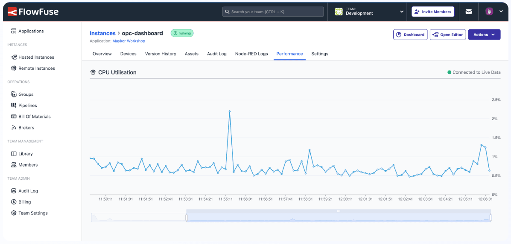
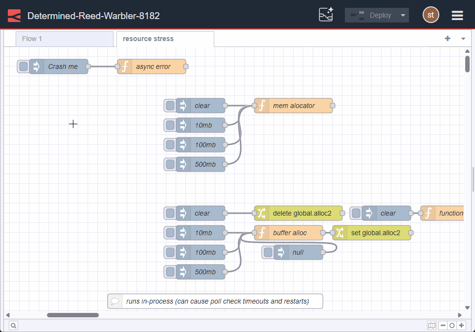

This release is focused on improvements that help you manage and optimize the performance of your Node-RED instances and takes an important step in integrating AI with FlowFuse so that you can build applications even more quickly.

<!--more-->

## Enhanced Observability for Better Performance Management

_Screenshot of Performance Feature_

Understanding how your Node-RED instances perform is crucial for maintaining reliable applications. Our new observability feature provides detailed CPU usage metrics at both the instance and team levels, giving you the visibility needed to optimize performance and troubleshoot issues before they impact your operations.

With these insights, you can make informed decisions about scaling your instances, identify performance bottlenecks, and ensure your Node-RED instances run smoothly in production environments. This feature is available exclusively for Enterprise customers, providing the enterprise-grade monitoring capabilities your organization needs.

## Blueprint: OpenAI LLM with Chat Agent

<video src="https://website-data.s3.eu-west-1.amazonaws.com/Blueprint+-+Open+AI+Chat.mp4" controls></video>
_Video of OpenAI LLM Blueprint demo_

We're bringing AI speed and power directly to your FlowFuse Dashboard. The new LLM Blueprint enables you to deploy an AI chat agent that can query and analyze data connected to your FlowFuse environment.

This Blueprint makes it simple to surface insights relevant to your Node-RED flows, allowing team members to ask natural language questions and get immediate answers about their connected systems and devices. Whether you're monitoring sensor data, analyzing trends, or troubleshooting issues, the AI chat agent will speed up your workflow.

Check out the video demo to see it in action, featuring the agent connected to a worldmap node!

To put this Blueprint to use, check out the Blueprint page for [OpenAI LLM Chat Agent.](https://flowfuse.com/blueprints/ai/llm-chat-agent/)

## Complete Git Integration with Pull Support

Building on our previous Git push functionality, we've now added Git pull support, completing the core Git integration experience within FlowFuse.

You can now seamlessly synchronize changes from your remote repositories, collaborate more effectively with team members, and maintain consistent version history across your Node-RED projects. 

More details are available in the [Git Integration changelog](/changelog/2025/06/git-integration/).

## Self-Hosted Blueprint Support

Organizations running self-hosted FlowFuse installations can now take advantage of the Blueprints we publish, bringing the same rapid development capabilities to on-premises and private cloud deployments. 

Self-hosted installations will automatically pull down the [blueprint library](https://flowfuse.com/blueprints/), and will stay up to date when we publish new blueprints.

This update ensures that all FlowFuse users, regardless of their deployment model, can benefit from our growing library of pre-built solutions.

## Where are we headed?

Our Engineering team is hard at work on the next major developments in bringing the speed of AI to FlowFuse, developing AI functionality that will be integrated directly into the Node-RED editor. This upcoming feature set will dramatically accelerate your development process, helping you build and deploy applications faster than ever before.

By combining AI assistance with Node-RED's visual programming approach, we're creating a development experience that's both more intuitive for newcomers and more powerful for experienced developers.

Here is a sneak peek of something we're working on: an AI chat in the Node-RED editor that allows you to ask questions about the instance you are working in. 

## What else is new?

For a full list of everything that went into our 2.18 release, you can check out the [release notes](https://github.com/FlowFuse/flowfuse/releases/).

We're always working to enhance your experience with FlowFuse. We're always interested in your thoughts about FlowFuse too. Your feedback is crucial to us, and we'd love to hear about your experiences with the new features and improvements. Please share your thoughts, suggestions, or report any [issues on GitHub](https://github.com/FlowFuse/flowfuse/issues/new/choose). 

Which feature do you think you're most likely to use? Email me directly and let me know! You can reach me at greg@flowfuse.com.

Together, we can make FlowFuse better with each release!

## Try FlowFuse

### Self-Hosted

We're confident you can have self managed FlowFuse running locally in under 30 minutes. You can install FlowFuse using [Docker](/docs/install/docker/) or [Kubernetes](/docs/install/kubernetes/).

### FlowFuse Cloud

The quickest and easiest way to get started with FlowFuse is FlowFuse Cloud.

[Get started for free]() now, and you'll have your own Node-RED instances running in the Cloud within minutes.