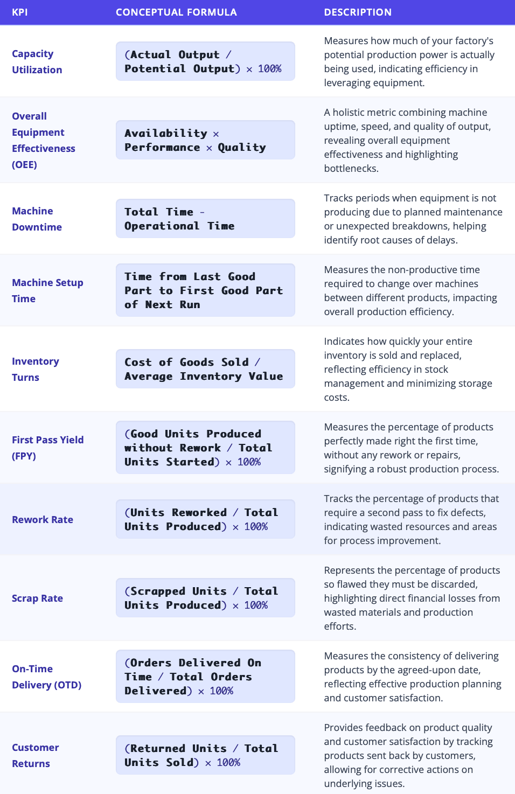
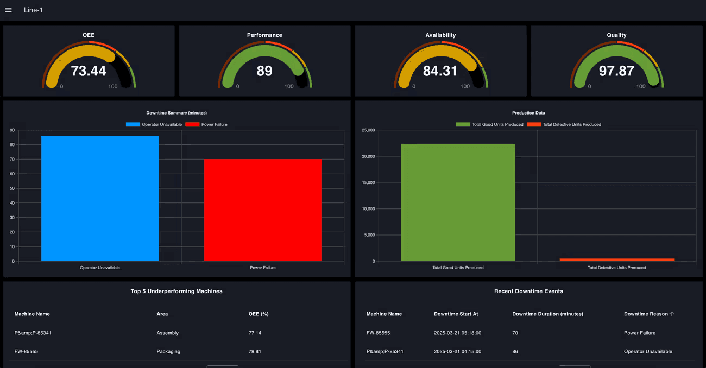
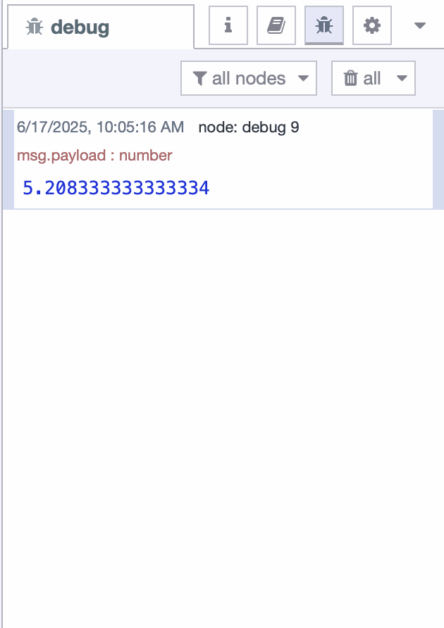

When discussing an MES, data is always at the core. In previous articles, we explored the crucial steps of collecting and structuring valuable operational data. But merely having data—or even cleaning, structuring, and contextualizing it—is not enough. Many manufacturers find themselves staring at thousands of records while trying to monitor equipment performance or track production, only to feel overwhelmed and unsure of what actions to take. This is not just time-consuming, it often leads to delayed decisions and missed opportunities.

<!--more-->

It is not the volume of data that drives improvement, it is clarity. What manufacturers need is a way to cut through the noise and highlight what truly matters. Factory KPIs do exactly that. By focusing attention on the metrics that reflect performance and progress, they turn complexity into clarity and enable faster, more confident decisions.

In this article, we will dive into the most critical factory KPIs that directly impact your bottom line and are a fundamental part of any effective MES implementation. These KPIs empower you to drive profit and eliminate waste.

## What Are Key Performance Indicators (KPIs)?

Key Performance Indicators (KPIs) are simply measurements that show how well your factory is reaching its goals. They turn lots of raw data into easy-to-understand information. KPIs help you see clearly, knowing exactly what's happening on your factory floor. They also allow you to find problems quickly, spotting areas that need attention.

With KPIs, you can make smart choices, deciding what to do next to improve things, and track progress, seeing if your changes are working over time. In short, KPIs are vital signs that tell you if your factory is performing at its best.

## Strategic KPI Categories for MES Success

There are hundreds of factory KPIs available, but not all are relevant for every MES implementation. To effectively leverage MES and improve factory operations, it is important to organize KPIs into logical categories that support its core objectives. These categories provide a holistic view of factory performance and align operational data with key manufacturing goals.

While many KPIs can be tracked, the most impactful ones in the context of MES typically fall into the following strategic categories:

- **Productivity**: Measuring the efficiency and output of production lines.  
- **Processes**: Assessing how reliably the production chain functions.  
- **Deadlines**: Tracking time-related performance metrics.  
- **Inventory Management**: Ensuring materials and products flow smoothly.  
- **Resources**: Evaluating equipment reliability and effectiveness.  
- **Quality**: Measuring consistency, conformance, and product standards.

## Key Factory KPIs

Here are some of the most crucial KPIs your **Manufacturing Execution System (MES)** should help you track:

{data-zoomable}
_KPIs Tables_

## How to Turn Your Data into KPIs

Now that you understand the critical factory KPIs, the next logical question is: How does your MES deliver these insights? It's not about manual calculations or picking up a calculator; it's the integrated pipeline within the MES that does all the work, from raw data collection to the clear, actionable KPIs displayed on your dashboards.

This pipeline can be broken down into several key stages:

- Connect to Systems: Establishing communication with machines, PLCs, sensors, ERP systems, and other data sources on the shop floor.
- Collect and Transform Data: Gathering the raw data, then cleaning, structuring, and contextualizing it to make it meaningful.
- Store Data: Saving the processed data in an easily accessible and usable format (typically a database) for reliable retrieval.
- Build Logic, Calculate KPIs, and Visualize: Developing the intelligence to retrieve stored data, perform the necessary calculations for each KPI, and present these insights on intuitive dashboards.

As discussed in previous articles, we've thoroughly covered the first three stages of this pipeline – connecting to systems, collecting and transforming data, and then storing it. This foundational work ensures your MES has high-quality, relevant data at its fingertips. Now, let's focus on the final and crucial stage: how your MES uses this prepared data to calculate and visualize your critical factory KPIs.

### Automated KPI Calculation with FlowFuse Low-code 

This is where the core of the MES pipeline operates. Leveraging the cleaned, structured, and contextualized data already available in its storage, your MES automatically performs all the necessary calculations behind the scenes. This automated process is continuously running, processing the incoming data streams and applying predefined mathematical formulas to derive the KPI values without any manual intervention.

To pull this data and perform these calculations, you need a solution with a powerful logic engine capable of processing high volumes of real-time operational data. If this solution also allows you to build the industrial applications that run your factory operations, you unlock an even higher level of efficiency and strategic advantage. This is precisely where a platform like FlowFuse, built on Node-RED, offers a significant advantage.

FlowFuse provides a robust, low-code environment that can be your all-in-one data platform for transforming raw factory data into strategic advantage. As detailed in our previous article, "MES Data Acquisition: How to Unlock Your Factory’s Hidden Data" and "Structuring and Storing Data for Effective MES Integration" FlowFuse excels at the foundational stages of the data pipeline, offering unparalleled connectivity to nearly all shop floor assets, and seamlessly structuring, cleaning, and contextualizing that raw data before routing it to the right storage solutions. Building on this comprehensive data foundation, FlowFuse then fully leverages its capabilities for automated KPI calculation and the rapid development of powerful industrial applications.

{data-zoomable}
_OEE Dashboard built with FlowFuse_

This screenshot above illustrates an OEE Dashboard effectively built using FlowFuse. Here, the process begins by designing a "flow" with a simple drag-and-drop approach within FlowFuse's low-code environment. This flow is configured to retrieve relevant operational data from your database, process it, and then automatically calculate the OEE every 10 seconds. Finally, using FlowFuse Dashboard capabilities, this processed data is transformed into a clear, intuitive display featuring engaging charts, gauges, tables, and other visual elements, providing a real-time pulse of your equipment's efficiency. 

The following is the flow powering this OEE Dashboard, which includes a set of nodes responsible for retrieving data, transforming it, and performing OEE calculations. As shown, this was built simply by dragging and dropping nodes within FlowFuse’s low-code editor—no complex coding required. Each node in the flow plays a specific role: some fetch data from databases or equipment, others clean and structure the data, and finally, a calculation node computes the OEE based on standard formulas. This flow runs automatically every 10 seconds, keeping the dashboard updated with the latest performance metrics in real time.

{data-zoomable}
_OEE Dashboard Flow_

### Build Your First KPI Flow: Calculating Machine Downtime with FlowFuse

Let’s see how easy it is to calculate a KPI with a practical example where we will calculate **Machine Downtime**, using demo data stored in an SQLite database.

### To Begin

1.  Login to the FlowFuse platform. If you don't have an account, you can register for a [free trial](https://app.flowfuse.com/account/create) to get started. Once logged in, create an instance and open its editor to begin.
2.  Install the `node-red-node-sqlite` from the Palette Manager.
3.  For the demo database, import the following database flow. Upon deployment, it will create an SQLite table and insert the demo data:


[{"id":"2b80c9ff5297fcf0","type":"inject","z":"fa7147e04d4d5ec3","name":"","props":[{"p":"payload"},{"p":"topic","vt":"str"}],"repeat":"","crontab":"","once":false,"onceDelay":0.1,"topic":"","payload":"","payloadType":"date","x":620,"y":1540,"wires":[["0e3ad13c7f083c30"]]},{"id":"a0a5bf61836aaaba","type":"debug","z":"fa7147e04d4d5ec3","name":"debug 6","active":false,"tosidebar":true,"console":false,"tostatus":false,"complete":"false","statusVal":"","statusType":"auto","x":1160,"y":1540,"wires":[]},{"id":"0e3ad13c7f083c30","type":"sqlite","z":"fa7147e04d4d5ec3","mydb":"0710931c9543fc07","sqlquery":"fixed","sql":"CREATE TABLE machine_runtime_logs (\n    id INTEGER PRIMARY KEY AUTOINCREMENT,\n    machine_id TEXT NOT NULL,\n    date DATE NOT NULL,\n    total_operational_time INTEGER NOT NULL,  -- in minutes, e.g., shift duration or planned availability\n    run_time INTEGER NOT NULL                 -- in minutes, actual machine active time\n);\n","name":"Create 'machine_runtime_logs' table","x":910,"y":1540,"wires":[["a0a5bf61836aaaba"]]},{"id":"d9b8478110727f43","type":"inject","z":"fa7147e04d4d5ec3","name":"","props":[{"p":"payload"},{"p":"topic","vt":"str"}],"repeat":"","crontab":"","once":false,"onceDelay":0.1,"topic":"","payload":"","payloadType":"date","x":620,"y":1620,"wires":[["65e503477a2e5349"]]},{"id":"65e503477a2e5349","type":"sqlite","z":"fa7147e04d4d5ec3","mydb":"0710931c9543fc07","sqlquery":"fixed","sql":"INSERT INTO machine_runtime_logs (machine_id, date, total_operational_time, run_time) VALUES\n('BX02', '2025-06-10', 480, 410),\n('AX01', '2025-06-10', 480, 465),\n('BX02', '2025-06-11', 480, 400),\n('AX01', '2025-06-12', 480, 455),\n('BX02', '2025-06-12', 480, 390),\n('AX01', '2025-06-11', 480, 470),\n('AX01', '2025-06-13', 480, 460),\n('BX02', '2025-06-13', 480, 420),\n('AX01', '2025-06-14', 480, 405),\n('AX01', '2025-06-14', 480, 450);\n","name":"Insert Demo Data","x":850,"y":1620,"wires":[["45f1950b01ebb3f3"]]},{"id":"45f1950b01ebb3f3","type":"debug","z":"fa7147e04d4d5ec3","name":"debug 7","active":true,"tosidebar":true,"console":false,"tostatus":false,"complete":"false","statusVal":"","statusType":"auto","x":1160,"y":1620,"wires":[]},{"id":"0710931c9543fc07","type":"sqlitedb","db":"/tmp/sqlite","mode":"RWC"}]


### Flow Setup

1. Drag an **Inject** node onto the canvas and configure it to trigger at your desired interval (e.g., every 10 seconds) to start the data retrieval process.

2. Drag a **Change** node and connect it to the Inject node, setting its payload to include query parameters as shown in the following image.

{data-zoomable}
_Change node setting parameters_

3. Drag an **SQLite** node (or your specific database node), connect it to the Change node, and configure it with following sql statement and select set query to "Prepared Statement"

```sql
SELECT *
FROM machine_runtime_logs
WHERE machine_id = $machine_id
  AND date BETWEEN $start_date AND $end_date;
```

4. Drag a **Split** node and connect it to the SQLite node to break down the returned array or multiple rows from the database.

5. Drag **two Join** nodes and connect them to the output of the Split node (or directly from SQLite if not splitting).

6. Configure the **first Join** node in *Reduce* mode to sum `total_operational_time` using the expression `$A + payload.total_operational_time`.

7. Configure the **second Join** node in *Reduce* mode to sum `run_time` using the expression `$A + payload.run_time`.

8. Drag a **Change** node and connect it to the first Join node to store `msg.payload` as `flow.total_operational_time`.

9. Drag another **Change** node and connect it to the second Join node to store `msg.payload` as `flow.run_time`.

10. Drag a **new Change** node and connect both previous Change nodes to it, then set `msg.payload` using the following JSONata expression to calculate Machine Downtime Percentage:

```json
(($flowContext("total_operational_time") - $flowContext("run_time")) / $flowContext("total_operational_time")) * 100
```

11.  Drag a **Debug** node onto the canvas, connect it to the last Change node, and configure it to display `msg.payload`.

12.  **Deploy** the flow to continuously calculate and output the Machine Downtime Percentage in real time.

After deploying the flow, observe the debug sidebar on the right. You'll see the calculated machine downtime percentage being continuously printed. To present this data visually, leverage [Flowfuse Dashboard](https://dashboard.flowfuse.com).

{data-zoomable}
_Downtime printed on debug panel_

You've just seen how easy it is to calculate a foundational KPI like machine downtime. But with FlowFuse's low-code environment, this is just the beginning.

Imagine scaling this across your entire factory. FlowFuse lets you seamlessly connect to all your machines and systems, transform raw data into actionable insights, and automate complex KPI calculations in real-time. You can then build intuitive dashboards to visualize performance instantly, empowering everyone from operators to plant managers.

**What does this mean for your factory??**

- You'll put more money in your pocket, by slashing hidden waste and squeezing every drop of efficiency out of your machines and time.
- You'll be in total control, ditching the daily firefighting for a clear view that lets you fix problems before they even start.
- You'll produce quality you're genuinely proud of, every single time, catching issues on the spot for fewer headaches and happier customers.
- You'll unleash the genius of your own team, giving them the insights they need to innovate and drive continuous improvement on the floor.
- You'll leap into tomorrow's factory, today, rapidly building powerful solutions that make your entire operation smarter, faster, and truly future-ready.

## Final Thought

We've talked a lot about Factory KPIs and how they're not just some numbers on a screen; they're your secret weapon. And we've seen how a powerful Manufacturing Execution System (MES), especially one built on something as flexible as FlowFuse, is the real workhorse, taking all that raw data and turning it into clear, actionable gold.

Forget about guessing games. With the right MES and smart KPIs, you get the full picture, right now. It's about knowing exactly what's going on, fixing problems fast, and making smart moves that truly count.

[Schedule a demo](/book-demo/) and we'll show you how FlowFuse transforms your operations.