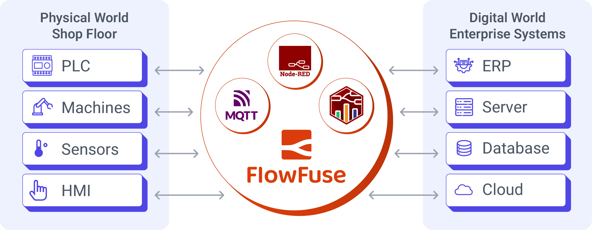

The announcement of our latest $7.25 million funding round isn't just a milestone for FlowFuse; it's a catalyst for our mission to revolutionize how industrial data is accessed and used.

<!--more-->

Thousands of IT professionals and citizen developers now collaborate with our product on their digital transformation, and we’re expecting hundreds of thousands more to join over the next few years. We're incredibly proud of our recent growth – nearly 5x in customers and revenue just last year, a trend that’s only accelerating. But more than that, we're thrilled by what this allows us to build for you.

Our focus has always been to empower engineers and operational managers to connect the physical shop floor with their digital enterprise systems. We see FlowFuse, powered by Node-RED, as that critical layer that makes data accessible, understandable, and actionable. And with this new investment, we're doubling down on making this experience even more powerful and intuitive.

## FlowFuse: The Low-Code Powerhouse for Industrial Data

FlowFuse is enabling customers to bridge the gap between their physical and digital operations. They are leveraging FlowFuse to extract the data required to implement new use-cases from a wide range of sources. FlowFuse spans both digital systems like ERPs and physical equipment on the shop floor. Using the low-code interface of Node-RED within the FlowFuse platform, this captured data is then transformed and efficiently transported to various destinations. Significantly, users are orchestrating multiple Node-RED instances through FlowFuse to collaboratively inform and automate operational decisions, even incorporating crucial operator feedback directly into the workflow.

FlowFuse creates a singular and unified platform for users that not only extracts and transports data but also actively utilizes it for decision-making and incorporates human expertise, effectively closing the loop through fusing your operations with the corporate systems. The void often filled by complex SCADA systems and disparate, siloed solutions can now be seamlessly integrated and managed with FlowFuse.

{data-zoomable}

## Where We're Going: Infusing AI for an Even Smarter Tomorrow

Over the past years we’ve been focused on augmenting Node-RED to enable it to scale better for an organization. This entails many facets: 
- Ensure companies that are in regulated industries meet their compliance frameworks.
- Make it easy to run and maintain hundreds or thousands of Node-REDs.
- Extend DevOps to operational technology teams, ensure development is done outside of production systems.

Our shift towards becoming an ***end to end*** platform to connect the physical world with your digital realm is next, and we’ve already started this journey. Over the past months we’ve enabled customers to store data long term by allowing them to store files on the platform. Also, we noticed that customers took longer than ideal to transport data between data consumers and producers and back again. Building a data orchestration layer, for example through a Unified Namespace (UNS), is vital to ensure data is available for building applications. So FlowFuse has allowed thousands of clients to send data through MQTT, a quick on-ramp to further the abilities for the platform of FlowFuse. Lastly, in the next FlowFuse release a data storage layer will be provided to persist and allow querying of events.

While we'll continue to enhance the core capabilities users already love, a significant portion of this new investment is earmarked for integrating AI more deeply into the FlowFuse platform. The FlowFuse Expert already has proven itself countless times. However, we believe improving our AI suggestions and capabilities are the key to unlocking the next level of low-code development.

While Node-RED is low-code and enables many engineers the power to integrate, automate, and interact with their operations, we want every engineer – mechanical, electrical, or operational – to harness its full potential quickly. AI will act as an intelligent guide, helping new users understand Node-RED's capabilities, learn best practices, and troubleshoot effectively. Imagine an assistant that helps you build your first flow, suggests optimal configurations, or explains complex functions in simple terms.

Furthermore, we see that AI can offer suggestions, identify potential optimizations, and even help generate partial flows in Node-RED. Allowing both new and experienced users to gain momentum.
FlowFuse is on a mission to get a billion people automating, having AI make suggestions allows more people to learn how, and get started, as well as advanced users remove boilerplate to create and get to brass tacks faster.

## The Vision: Everyone Can Increase Operational Excellence

There are millions of brilliant engineers and managers out there who understand their operations inside and out. They know what needs to be optimized, and have hunches to validate, but often lack the accessible tools to bridge the data gap. That’s what FlowFuse is for.

We are committed to making it super easy to get data, derive insight, and act on that insight to optimize operations. The infusion of AI into our low-code platform is the next logical step in this journey. We're incredibly excited about the path ahead and grateful to our customers, partners, and investors for their support. The future of industrial operations is intelligent, connected, and user-empowered – and we're building it, together.

Want to see how FlowFuse can help you optimize your operations? Let's talk about your specific needs and see our platform in action. [Schedule a demo](/book-demo/) with our team today.