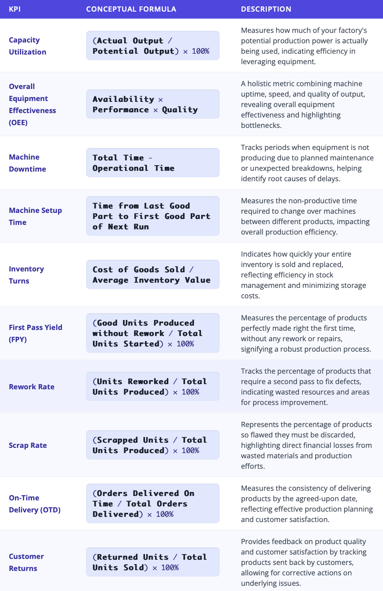
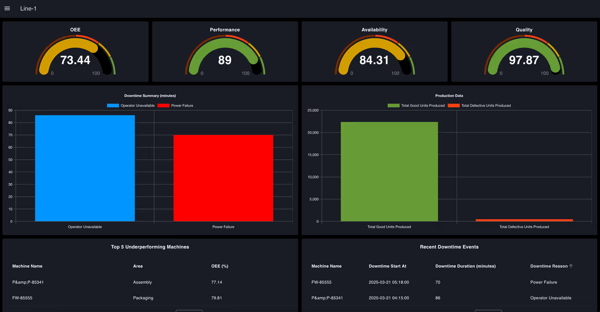
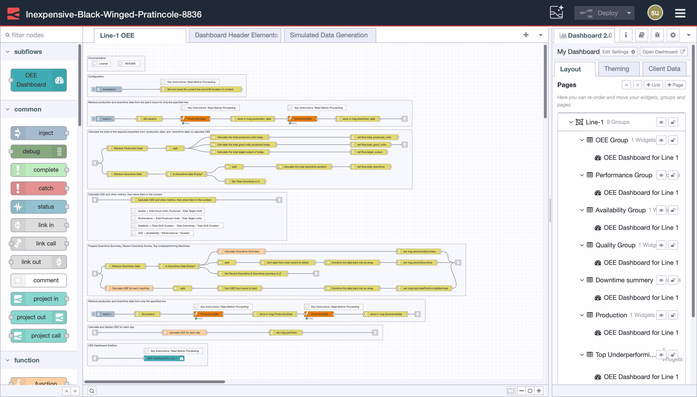
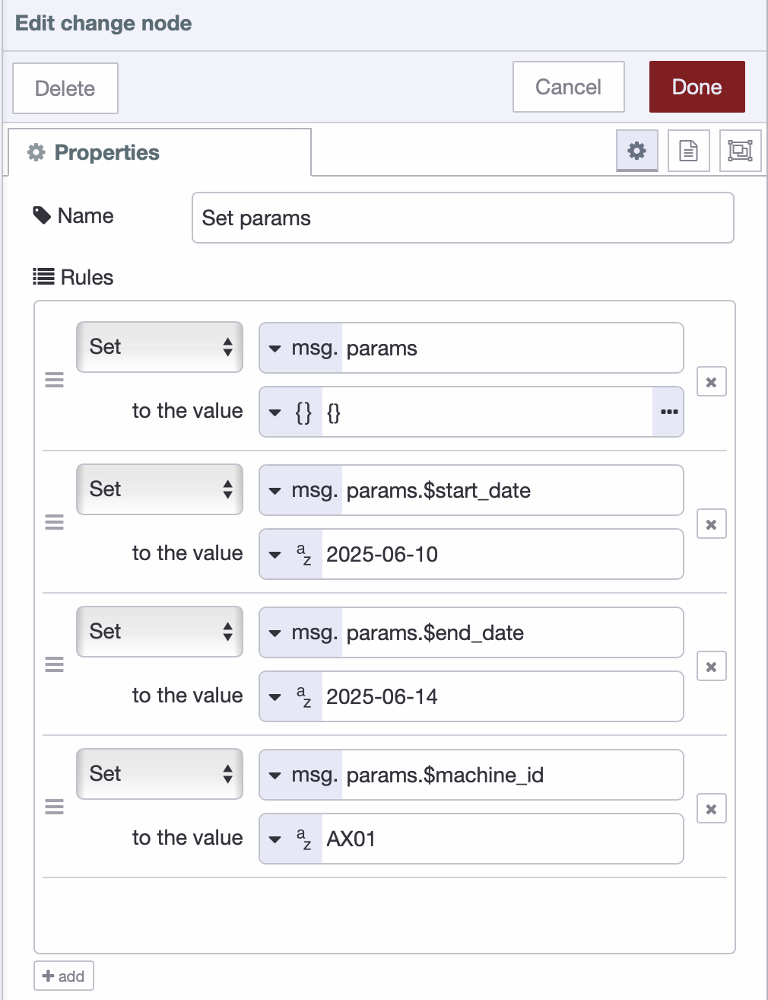
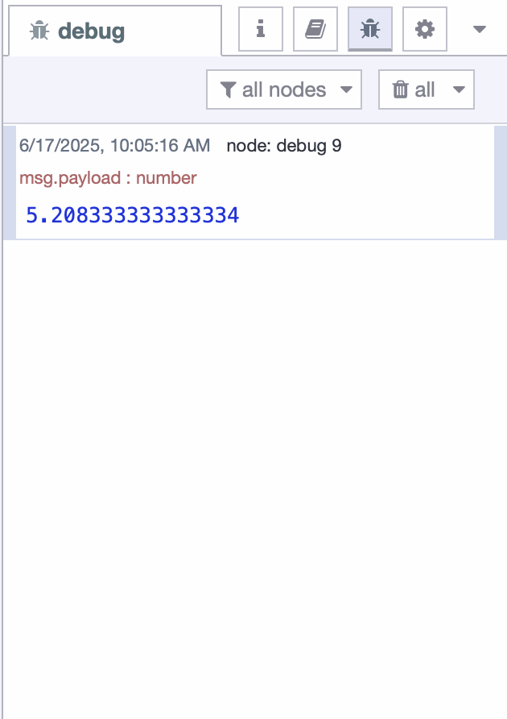

When discussing an [MES](/blog/2025/06/what-is-mes/), data is always at the core. In previous articles, we explored the crucial steps of collecting and structuring valuable operational data. However, merely having cleaned and structured data is not enough. Many manufacturers find themselves staring at thousands of records while trying to monitor equipment performance or track production, only to feel overwhelmed and unsure of what actions to take. This is not just time-consuming; it often leads to delayed decisions and missed opportunities.

<!--more-->

It is not the volume of data that drives improvement, it is clarity. What manufacturers need is a way to cut through the noise and highlight what truly matters. Factory KPIs (Key Performance Indicators) do exactly that. By focusing attention on the metrics that reflect performance and progress, they turn complexity into clarity and enable faster, more confident decisions.

In this article, we will dive into the most critical factory KPIs that directly impact your bottom line and are a fundamental part of any effective MES implementation. These KPIs empower you to drive profit and eliminate waste.

## Strategic KPI Categories for MES Success

There are hundreds of factory KPIs available, but not all are relevant for every MES implementation. To effectively leverage MES and improve factory operations, it is important to organize KPIs into logical categories that support its core objectives. These categories provide a holistic view of factory performance and align operational data with key manufacturing goals.

While many KPIs can be tracked, the most impactful ones in the context of MES typically fall into the following strategic categories:

- **Productivity**: Measuring the efficiency and output of production lines.  
- **Processes**: Assessing how reliably the production chain functions.  
- **Deadlines**: Tracking time-related performance metrics.  
- **Inventory Management**: Ensuring materials and products flow smoothly.  
- **Resources**: Evaluating equipment reliability and effectiveness.  
- **Quality**: Measuring consistency, conformance, and product standards.

### Key Factory KPIs

Here are some of the most crucial KPIs your **MES** should help you track:

{data-zoomable}
_KPIs Tables_

## Turning Your Data into KPIs

Now that you understand the critical factory KPIs, the next logical question is: How does your MES deliver these insights? It’s not about manual calculations or picking up a calculator. The MES should have an integrated pipeline that handles everything—from raw data collection to the clear, actionable KPIs displayed on your dashboards.

Once the data is collected and stored from the factory floor, this pipeline involves four essential stages:

- **Retrieve Data**: Pull the necessary stored data from the central database to perform KPI calculations.
- **Build Logic**: Define the rules, conditions, and formulas based on operational goals and KPI definitions.  
- **Calculate KPIs**: Execute real-time or scheduled computations to derive metric values from the retrieved data.  
- **Visualize**: Display the results using dashboards to provide clear insights for operators, supervisors, and decision-makers.

Once the workflow is set up, it should run automatically in the background—pulling in fresh data, applying the logic, and updating dashboards in real time. This ensures that performance metrics are always current and actionable.

### Building KPI Workflow with FlowFuse

To turn stored factory data into live KPIs, you need a solution with a powerful logic engine capable of processing at scale. Ideally, this solution should also support the rapid development of industrial applications. This is where **FlowFuse**, built on **Node-RED**, offers a clear advantage.

FlowFuse provides a low-code environment that unifies data connectivity, processing logic, and visualization. As covered in our previous articles—[MES Data Acquisition: How to Unlock Your Factory’s Hidden Data](/blog/2025/06/data-acquisition-for-mes/) and [Structuring and Storing Data for Effective MES Integration](/blog/2025/06/structuring-storing-data-mes-integration/)—FlowFuse connects seamlessly to nearly all shop floor assets, prepares the data, and stores it in an accessible format.

From there, KPI logic flows can be built visually, defining how and when data is retrieved, how calculations are applied, and how results are displayed. This enables continuous KPI updates without manual effort.

{data-zoomable}  
_OEE Dashboard built with FlowFuse_

The example above shows an [OEE Dashboard](https://flowfuse.com/blueprints/manufacturing/oee-dashboard/), updated every 10 seconds using FlowFuse. Operational data is automatically retrieved, processed, and visualized, delivering accurate, real-time metrics through gauges, charts, and tables.

The following flow powers this dashboard:

{data-zoomable}  
_OEE Dashboard Flow_

Each node in this flow performs a specific task: retrieving data, transforming it, applying OEE formulas, and delivering results to the dashboard. The entire process is automated and repeatable, providing a real-time view of equipment performance and production health.

#### Build Your First KPI Flow

Let’s see how easy it is to calculate a KPI with a practical example where we will calculate **Machine Downtime**, using demo data stored in an SQLite database.

##### To Begin

1.  Login to the FlowFuse platform. If you don't have an account, you can register for a [free trial]() to get started. Once registered, create a FlowFuse instance and open its editor.
2.  Install the `node-red-node-sqlite` from the Palette Manager.
3.  For the demo database, import the following database flow. Upon deployment, it will create an SQLite table and insert the demo data:


[{"id":"2b80c9ff5297fcf0","type":"inject","z":"fa7147e04d4d5ec3","name":"","props":[{"p":"payload"},{"p":"topic","vt":"str"}],"repeat":"","crontab":"","once":false,"onceDelay":0.1,"topic":"","payload":"","payloadType":"date","x":620,"y":1540,"wires":[["0e3ad13c7f083c30"]]},{"id":"a0a5bf61836aaaba","type":"debug","z":"fa7147e04d4d5ec3","name":"debug 6","active":false,"tosidebar":true,"console":false,"tostatus":false,"complete":"false","statusVal":"","statusType":"auto","x":1160,"y":1540,"wires":[]},{"id":"0e3ad13c7f083c30","type":"sqlite","z":"fa7147e04d4d5ec3","mydb":"0710931c9543fc07","sqlquery":"fixed","sql":"CREATE TABLE machine_runtime_logs (\n    id INTEGER PRIMARY KEY AUTOINCREMENT,\n    machine_id TEXT NOT NULL,\n    date DATE NOT NULL,\n    total_operational_time INTEGER NOT NULL,  -- in minutes, e.g., shift duration or planned availability\n    run_time INTEGER NOT NULL                 -- in minutes, actual machine active time\n);\n","name":"Create 'machine_runtime_logs' table","x":910,"y":1540,"wires":[["a0a5bf61836aaaba"]]},{"id":"d9b8478110727f43","type":"inject","z":"fa7147e04d4d5ec3","name":"","props":[{"p":"payload"},{"p":"topic","vt":"str"}],"repeat":"","crontab":"","once":false,"onceDelay":0.1,"topic":"","payload":"","payloadType":"date","x":620,"y":1620,"wires":[["65e503477a2e5349"]]},{"id":"65e503477a2e5349","type":"sqlite","z":"fa7147e04d4d5ec3","mydb":"0710931c9543fc07","sqlquery":"fixed","sql":"INSERT INTO machine_runtime_logs (machine_id, date, total_operational_time, run_time) VALUES\n('BX02', '2025-06-10', 480, 410),\n('AX01', '2025-06-10', 480, 465),\n('BX02', '2025-06-11', 480, 400),\n('AX01', '2025-06-12', 480, 455),\n('BX02', '2025-06-12', 480, 390),\n('AX01', '2025-06-11', 480, 470),\n('AX01', '2025-06-13', 480, 460),\n('BX02', '2025-06-13', 480, 420),\n('AX01', '2025-06-14', 480, 405),\n('AX01', '2025-06-14', 480, 450);\n","name":"Insert Demo Data","x":850,"y":1620,"wires":[["45f1950b01ebb3f3"]]},{"id":"45f1950b01ebb3f3","type":"debug","z":"fa7147e04d4d5ec3","name":"debug 7","active":true,"tosidebar":true,"console":false,"tostatus":false,"complete":"false","statusVal":"","statusType":"auto","x":1160,"y":1620,"wires":[]},{"id":"0710931c9543fc07","type":"sqlitedb","db":"/tmp/sqlite","mode":"RWC"}]


##### Flow Setup

1. Drag an **Inject** node onto the canvas and configure it to trigger at your desired interval (e.g., every 10 seconds) to start the data retrieval process.

2. Drag a **Change** node and connect it to the Inject node, adding elements to include query parameters for sql query as shown in the following image.

{data-zoomable}
_Change node setting parameters_

3. Drag an **SQLite** node, connect it to the Change node, and configure it with following sql statement and select set query to "Prepared Statement"

```sql
SELECT *
FROM machine_runtime_logs
WHERE machine_id = $machine_id
  AND date BETWEEN $start_date AND $end_date;
```

4. Drag a **Split** node and connect it to the SQLite node to break down the returned array or multiple rows from the database.

5. Drag **two Join** nodes and connect them to the output of the Split node.

6. Configure the **first Join** node in *Reduce* mode to sum `total_operational_time` using the expression `$A + payload.total_operational_time`.

7. Configure the **second Join** node in *Reduce* mode to sum `run_time` using the expression `$A + payload.run_time`.

8. Drag a **Change** node and connect it to the first Join node to store `msg.payload` as `flow.total_operational_time`.

9. Drag another **Change** node and connect it to the second Join node to store `msg.payload` as `flow.run_time`.

10. Drag a **new Change** node and connect both previous Change nodes to it, then set `msg.payload` using the following JSONata expression to calculate Machine Downtime Percentage:

```
(($flowContext("total_operational_time") - $flowContext("run_time")) / $flowContext("total_operational_time")) * 100
```

11.  Drag a **Debug** node onto the canvas, connect it to the last Change node, and configure it to display `msg.payload`.

12.  **Deploy** the flow to continuously calculate and output the Machine Downtime Percentage in real time.

After deploying the flow, observe the debug sidebar on the right. You'll see the calculated machine downtime percentage being continuously printed. To present this data visually, leverage [Flowfuse Dashboard](https://dashboard.flowfuse.com).

{data-zoomable}
_Downtime printed on debug panel_

You’ve just seen how easy it is to calculate a foundational KPI like machine downtime. But with FlowFuse’s low-code environment, this is just the beginning. You not only connect, collect, transform, and visualize data—but also scale effortlessly.

FlowFuse enables you to manage thousands of device instances remotely, with built-in security, access control, and version management. This level of control ensures consistency across your factory operations and allows you to deploy updates and changes quickly with confidence. 

There is much more to explore—FlowFuse gives you the flexibility and power to build a fully integrated, intelligent MES solution that grows with your manufacturing needs.

**What does this mean for your factory?**

- You'll put more money in your pocket, by slashing hidden waste and squeezing every drop of efficiency out of your machines and time.
- You'll be in total control, ditching the daily firefighting for a clear view that lets you fix problems before they even start.
- You'll produce quality you're genuinely proud of, every single time, catching issues on the spot for fewer headaches and happier customers.
- You'll unleash the genius of your own team, giving them the insights they need to innovate and drive continuous improvement on the floor.
- You'll leap into tomorrow's factory, today, rapidly building powerful solutions that make your entire operation smarter, faster, and truly future-ready.

## Final Thought

We've talked a lot about Factory KPIs and how they're not just some numbers on a screen; they're your secret weapon. And we've seen how a powerful MES, especially one built on something as flexible as FlowFuse, is the real workhorse, taking all that raw data and turning it into clear, actionable gold.

Forget about guessing games. With the right MES and smart KPIs, you get the full picture, right now. It means knowing what is happening on your floor, fixing issues fast, and making decisions that drive measurable impact.

[Schedule a demo](/book-demo/) and we'll show you how FlowFuse transforms your operations.
