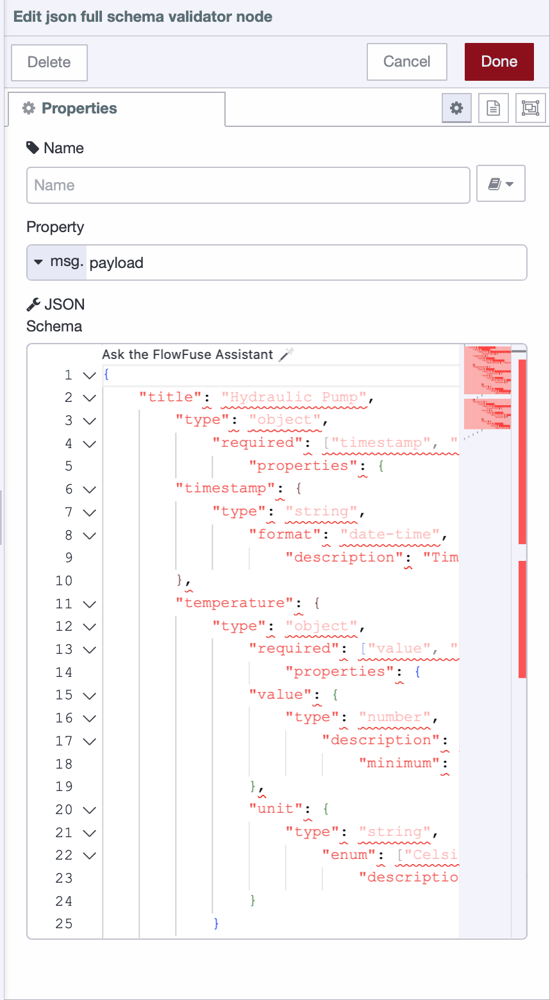
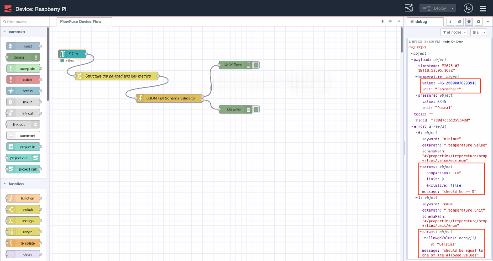
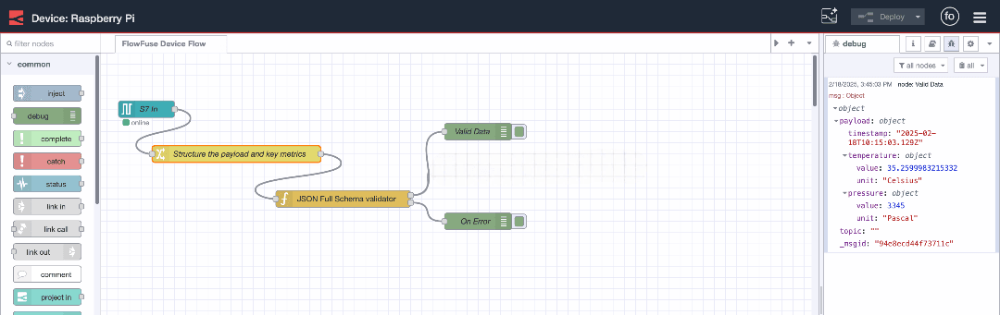

Collecting factory data for your MES is just the first step. If that data isn't properly organized, cleaned, and stored, it's a jumbled mess, leading to missed opportunities and wasted investments. Disorganized information prevents your MES from quickly finding, understanding, and comparing crucial data, directly impacting production, increasing errors, and hindering confident decision-making.

<!--more-->

FlowFuse simplifies [live factory data acquisition](/blog/2025/06/data-acquisition-for-mes/), and now it's time to make that data work harder. This article dives into best practices for structuring and storing factory data, helping you maximize your MES's performance and turn raw information into a powerful tool.

## Core Strategies for Structuring Your Factory Data

Now that we understand the importance of data structuring, let's explore how to achieve it. This involves giving your data a clear shape and defining rules, ensuring that every system, that is part of your MES, can easily interpret the meaning of each piece of information.

Here are some straightforward ways we get data structred:

* **Making a Plan for Your Data (Data Modeling):** This is like drawing a simple map for your data. It helps you decide exactly what pieces of information you'll collect (like machine temperature, how many items are made, or who operated the machine) and how they connect to each other. This keeps everything neat and consistent. For example, a data model might say that every "production run" must have a "start time" and an "end time." This makes sure your MES always gets the full picture and avoids confusing or incomplete information.

* **Speaking the Same Language (Standardizing):** Imagine if everyone in your factory used different words for the same thing. It would be confusing! Standardizing means always using the same names, units, and formats everywhere. For example, if you measure temperature, always use Celsius. If one machine sends "TempC" and another just "Temperature," standardizing ensures both are read as "Temperature in Celsius." This prevents your MES from getting confused by different terms for the same data.

* **Adding the Full Story (Contextulization):** A raw number like "100" by itself doesn't tell you much. But if you add "100 items made by Machine A on June 10th at 2:00 PM in Batch 123," suddenly you know the whole story! This means attaching important details like the exact time, the machine's name, the batch number, or who was working at that moment. This extra information makes raw numbers meaningful, so your MES can track things accurately and you can make smarter decisions based on the full picture.

## How FlowFuse Brings Your Data Strategy to Life

FlowFuse simplifies data structuring with its intuitive, drag-and-drop environment. Raw machine data—often just numeric signals—can be enriched, formatted, and organized in real time, **without writing any code**.

You can easily:

* Add timestamps to readings
* Associate data with specific machines or lines
* Convert units (e.g., Fahrenheit to Celsius)
* Rename fields for consistency

FlowFuse comes with standard nodes, like `split`, `change`, `join`, and `switch`. These let you visually tell FlowFuse how to transform your data. These nodes handle all the technical work for you. You just connect the blocks that clean your data, add context, and prepare it for use in monitoring dashboards or other industrial applications.

There's another simple and powerful node to tell you about. It lets you handle data modeling, standardization, and contextualization, plus it checks your data to make sure it's in the correct range or type. We call this method JSON Schema validation.

> **JSON Schema** is a vocabulary that allows you to annotate and validate JSON documents. It defines the structure, data types, and validation rules, ensuring consistency and interoperability across different applications and systems.

### Setting Up JSON Schema Validation

To get started, open your **FlowFuse instance editor**.

Next, you'll need to install the specific node for JSON Schema validation. Search for and install `node-red-contrib-json-full-schema-validator`.

Once the node is installed, your next step is to **plan your data schema**. This involves deciding:

* **Which properties are essential** for your data.
* **What data types** these properties should have (e.g., number, string, boolean).
* **The units** for numerical data (e.g., if it's temperature, should it be Celsius or Fahrenheit?).
* **Valid ranges** for your data (e.g., a temperature range of -40°C to 150°C).
* Other factors like **precision**, **mandatory fields**, and any **additional attributes**.

After planning, you'll prepare this schema in **JSON format**. For a comprehensive guide on how to define your JSON Schemas, check out this helpful: [Getting Started Guide](https://json-schema.org/learn/getting-started-step-by-step).

```json
{
  "title": "Hydraulic Pump",
  "type": "object",
  "required": ["timestamp", "temperature", "pressure"],
  "properties": {
    "timestamp": {
      "type": "string",
      "format": "date-time",
      "description": "Timestamp of when the data was recorded."
    },
    "temperature": {
      "type": "object",
      "required": ["value", "unit"],
      "properties": {
        "value": {
          "type": "number",
          "description": "The temperature value.",
          "minimum": 0
        },
        "unit": {
          "type": "string",
          "enum": ["Celsius"],
          "description": "The unit of the temperature value."
        }
      }
    },
    "pressure": {
      "type": "object",
      "required": ["value", "unit"],
      "properties": {
        "value": {
          "type": "number",
          "description": "The pressure value.",
          "minimum": 0
        },
        "unit": {
          "type": "string",
          "enum": ["Pascal"],
          "description": "The unit of the pressure value."
        }
      }
    }
  }
}
```

This JSON schema defines the structure for data related to a hydraulic pump. It includes three key properties: `timestamp`, `temperature`, and `pressure`. The `timestamp` must be in a valid date-time format. Both `temperature` and `pressure` require two properties: value (a number representing the actual measurement) and `unit` (which must be Celsius for `temperature` and Pascal for `pressure`). Both values must be greater than or equal to zero. This schema ensures that all data is recorded with the correct units and valid values, maintaining consistency and reliability.

### Implementing Data Schema Validation

Let's implement the data schema validation mechanism to ensure each incoming data adheres to the specified JSON schema.

1. Drag the **JSON Full Schema Validator** node onto the Node-RED canvas.
2. Double-click the node to open its settings.
3. Copy and paste your schema into the node’s schema field.

{data-zoomable}
_Configuring "JSON Full Schema Validator" node with JSON schema for our data_

4. Click **Done** to save the changes.
5. Connect the input of the **JSON Full Schema Validator** node to the data source from where your data is coming.
6. Connect the node's first output to another node to process or handle the validated data (e.g., an MQTT node, a database node, or any other destination).
7. Connect the second output to the flow that will handle the situation where data does not meet the schema. This could be a notification flow sending an email or Telegram to your team or a dashboard alert.
8. Deploy the flow.

Now, let's understand this with an example. Below is the data that we are receiving from the PLC. After transforming it, we’ve added essential properties such as unit and value. However, notice that the data doesn't meet the schema definition because the temperature is given in Fahrenheit and is a negative number, which isn't within the expected range.

{data-zoomable}
_Message passes through the second output and includes errors when it does not align with the data schema._

If the data doesn't align with the data schema, it will pass through the "JSON Full Schema Validator" node and flow through the second output. The message will contain an error array with detailed information about what is wrong with the data (e.g., incorrect unit or out-of-range value). From this output, you can easily connect email or Telegram nodes to send alert notifications.

When the data meets the schema, it passes through the first output without errors. The validated data is then sent to the next stage in the flow.

{data-zoomable}
_Message passes through the first output and does not include errors when it aligns with the data schema._

## Where to Keep All That Factory Data

Once your factory data is structured and validated, you need a smart place to store it. Different kinds of information often require different storage types to be most useful for your MES.

Here are the main types of storage typically used for factory data:

* **Time-Series Databases (TSDBs):** Perfect for constantly changing data like sensor readings (temperature, machine speed). They handle massive updates efficiently, ideal for spotting trends over time. Think of them as a super-efficient diary recording every moment. **InfluxDB** and **TimescaleDB** are good examples.

* **Standard Databases (SQL Databases):** Best for structured information with clear connections, such as production orders, material usage per batch, or quality check results. They keep data organized and ensure correct links between pieces of information, like a well-organized spreadsheet. You'll often see **PostgreSQL** or **MySQL** used here.

* **Data Lakes or Cloud Storage:** Use these for vast amounts of diverse data, even if it's not perfectly organized. They're great for long-term historical records or data you'll analyze later with advanced tools. Imagine them as a huge warehouse for anything, ready when you need to sort through it. **Amazon S3** and **Azure Data Lake Storage** are common examples.

When choosing storage, consider your data volume and speed, how often you need to access it (real-time vs. historical), cost, scalability, system connectivity, and data security.

## FlowFuse Also Helps with Data Routing to Storage

FlowFuse isn't just for changing and cleaning data; it also makes sure your data gets to the right storage spot.

It has tons of nodes for almost every database and cloud storage system you'll find in a factory today.

This includes direct **connections** to normal databases like [MySQL](https://flows.nodered.org/node/node-red-node-mysql) and [PostgreSQL](https://flows.nodered.org/node/node-red-contrib-postgresql) for your organized production data.

It also has special nodes for time-series databases like [InfluxDB](https://flows.nodered.org/node/node-red-contrib-influxdb) and [TimescaleDB](/node-red/database/timescaledb/) to handle fast sensor and machine data.

Plus, FlowFuse **connects** to big Data Lakes and Cloud Storage services like [Amazon S3](https://flows.nodered.org/node/node-red-node-aws), [Google Cloud Storage](https://flows.nodered.org/node/node-red-contrib-google-cloud), and [Microsoft Azure](https://flows.nodered.org/node/node-red-contrib-azure-storage).

**FlowFuse Fuels Your MES Dashboards and Applications**

Once your factory data is effectively structured, validated, and routed by FlowFuse to the right place, it becomes an incredibly powerful asset for your MES.

FlowFuse doesn't just manage your data; it also empowers you to easily build the user interface (UI) for your MES. You can create insightful dashboards and industrial applications using a no-code, drag-and-drop approach with components from [FlowFuse Dashboard](https://dashboard.flowfuse.com/). This allows you to design the screens operators use to visualize critical information and control processes, all built upon the reliable data foundation you've established.

## Final Thought

Your factory's success hinges on smart decisions, and smart decisions need good data. It's not enough to just collect information from your machines; you need to make sense of it.

That means organizing your data so it's clear and consistent. Think of it like putting all your tools in the right place – easy to find when you need them. You also need to clean up the data, getting rid of errors so you can trust what you see. Finally, you need to store it smartly, choosing the best spot for different types of information so it's always ready for use.

FlowFuse helps with all of this. It's like your data's personal assistant, collecting raw information, tidying it up, and sending it to the right storage, all without complicated coding. This ensures your Manufacturing Execution System (MES) gets the accurate, reliable data it needs to help you run your factory smoother and make better choices. Hundreds of other manufacturing companies are already using FlowFuse to transform their data into a powerful asset.

If you want to see FlowFuse in action, [book a demo](/book-demo/) today!
