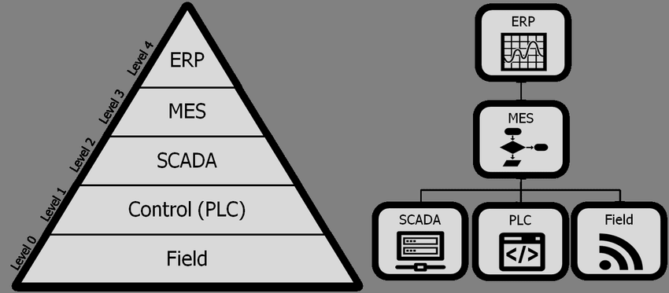

Running a factory means constantly pushing for better production. You want to make more products, make them faster, and ensure they're all high quality. But often, the challenge is simply knowing what's actually happening on the factory floor, right now. Is a machine broken? Are we on track with our orders? Is the quality holding up? Getting these answers often involves manual checks, waiting for reports, or just guessing.

<!--more-->

A [Manufacturing Execution System (MES)](/solutions/mes/) solves this. It's the central system that connects your factory's production to its plans. It gives you clear, instant visibility and control over every step on your shop floor.

Whether you've managed factory operations for years or are just starting to understand how they work, the need for this kind of clarity is universal.

In this article, our goal is to make sure you clearly understand exactly what an MES is and, just as importantly, what it isn't. We'll explore why it's a critical tool for any modern factory that wants to produce better, faster, and with fewer problems, and we'll look at its major components.

## What is MES?

A Manufacturing Execution System (MES) is the operational backbone of a modern factory. It's not merely a software program, but a dynamic, integrated system designed to bridge the crucial gap between your enterprise-level business planning and the real-time execution of production on the shop floor.

Think of MES as the intelligent conductor of your manufacturing orchestra. It orchestrates all the elements of production – machines, materials, people, and processes – in real-time, ensuring that your strategic plans translate into tangible products efficiently and effectively.

The MES collects real-time information to tell you:

- What products are currently being built.
- How many of them are finished.
- Which machines are working, and if any are having issues.
- What materials are being used up.
- If the quality of the products is good, right as they're being made.

This means you always know the exact status of your production, live. Such real-time insights and operational control are at the core of what a modern MES delivers, often leveraging flexible platforms like FlowFuse to connect diverse factory data and orchestrate workflows.

## What MES is NOT 

It's easy to get confused about all the different computer systems in a factory. To really get what a MES does, it helps to know what it isn't.

Many people think an MES is the same as their ERP system. But that's not quite right. Your ERP (Enterprise Resource Planning) handles the big company plans like money, sales orders, and buying materials for the long run. An MES doesn't do this planning. Its job is focused purely on the factory floor, managing what's happening right now to build products. It makes sure the production plans actually get done.

Another common confusion is that an MES is like a [SCADA](/solutions/scada/) or PLC system. Again, this isn't accurate. SCADA (Supervisory Control and Data Acquisition) and [PLC](/blog/2025/12/what-is-plc/) (Programmable Logic Controller) systems are connected directly to individual machines. They tell machines what to do—like turning them on or off—and collect basic data from them. An MES doesn't control machines directly. Instead, the MES acts like the main manager for the whole factory's production. It gathers information from those machine controllers (SCADA/PLCs) and uses it to oversee the entire process, including guiding workers, checking quality, and making sure all the machines work together to finish an order.

So, while ERP plans the business, and SCADA/PLC run the machines, the MES is the crucial system that manages the actual production process that happens in between.

## Where Does MES Sit in Your Factory?

To truly get the clear view and control you need over your factory's operations, it helps to understand exactly where a MES fits. Your factory's computer systems are often set up in different layers, a common way to organize them is by following the ISA-95 standard.

Your MES sits right in the crucial middle layer. It acts as the key link between the big plans made higher up and the actual machines doing the work.

{data-zoomable}
_[MES System in the isa-95 layers]_

At the very top, you have your main planning system, usually an ERP. The MES takes the plans from this ERP. Its job is to ensure they are carried out perfectly on the factory floor, moment by moment, guiding and watching every single step of making your products. Below the MES are systems like SCADA. The MES tells these systems what to do with the machines, and they send live information back, giving you an instant picture of production.

So, the MES is the central connection. It joins your company's big plans with the exact, real-time work on the factory floor

## Why Your Factory Needs MES

Your factory needs to do more than just make products. It needs to stay ahead of rivals, innovate, and boost profits. An MES helps your factory achieve these important goals.

Here's why an MES is vital for your factory:

- **You'll always be ready:** Instead of just fixing problems, you'll see them coming. This helps you make things better and react quickly to changes.
- **Top quality, every time:** An MES helps you check and control quality at each step. This means fewer mistakes, and customers will trust your brand more.
- **Make the most of everything:** You'll use your machines, materials, and people better. This cuts down on waste and makes sure every part of your factory works at its best.
- **Easier to innovate:** With good data and clear processes, you can try new ideas and bring better products to market faster.
- **Increased profits:** By making things more efficiently, cutting errors, and delivering on time, an MES directly helps your factory earn more money and grow.

An MES isn't just another system. It's a key tool that helps your factory become smarter, more responsive, and more profitable.

## Essential Modules of MES

As mentioned earlier, MES isn't just one big piece of software; it's made up of several important parts that work together to manage your factory floor.

One key part helps with **scheduling and dispatching production** – it decides what specific jobs need to be done, when, and on which machines. Another important piece is for **managing all your resources**, meaning it keeps track of your equipment, tools, and even your people, making sure everything is available when needed.

Then there's the part that handles **data collection**, gathering all the live information directly from machines and sensors on the floor. This ties into **quality management**, which makes sure products meet standards at every step by guiding checks and recording results. An MES also includes **product traceability**, building a complete history for every item, so you always know what went into it and how it was made. Finally, there are components for **performance analysis**, showing you how well your production is running, and often for **maintenance management** to help keep machines in good working order.

These parts all connect to give you full control and insight into your manufacturing process.

## Major Challenges with MES

While an MES offers huge benefits, putting one in place and getting the most out of it can have its challenges. It's important to know what these might be so you can plan for them.

First and foremost challenge is cost and time to implement MES. Investing in an MES can be expensive upfront, including the software, hardware, and the considerable time it takes to set it up correctly across your factory. Beyond that, getting all your machines to talk to the MES can be complex, especially with older equipment from different manufacturers – it's like getting everyone to speak a single language. Another hurdle is changing how people work; employees may need significant training and can resist new ways of doing things. Also, choosing the right MES system from many options to perfectly fit your factory's unique needs can be tough. Finally, an MES needs ongoing care, updates, and adjustments as your factory changes. Without this, it might become outdated. Plus, the system is only as good as the data it gets; if the information isn't accurate, the MES won't provide reliable insights, making data quality a continuous effort.

## How FlowFuse Solves These Challenges

So, how can we solve these problems, especially the ones related to getting started, integrating machines, and training people? This is exactly where FlowFuse steps in as a powerful solution. FlowFuse is a platform which directly addresses several of the major challenges we just discussed. Its visual, "drag and drop" interface means that engineers and factory personnel can build and deploy solutions much faster, significantly cutting down on the time and specialized talent usually needed for MES implementation and customization. This reduces the need for complex coding or developing deep programming skills.

FlowFuse also excels at connecting diverse systems. Its vast library of nodes allows for easy integration with a wide range of industrial equipment, sensors, and existing IT systems, solving the complex problem of getting older machines or systems from different vendors to "talk" to each other without extensive custom development. This also enhances flexibility, as you can easily adapt and extend your MES functionality as your factory needs evolve. Furthermore, ensuring good data quality is made easier with the platform's powerful data transformation capabilities, allowing you to clean, filter, and structure raw data effortlessly, ensuring your MES always operates with accurate insights. By simplifying integration and development, and reducing the reliance on highly specialized coders, FlowFuse can dramatically lower the overall cost of implementing and maintaining an MES.

In our upcoming articles, we will go deeper. We plan to explain and practically demonstrate how FlowFuse can be used to build your own MES, giving you the control and flexibility you need without the typical high investment or the need to buy a pre-packaged system. Stay tuned to see how you can create a tailored MES solution for your factory with FlowFuse.

If you're ready to explore how FlowFuse can help you build a modern MES tailored to your factory, [get in touch](/contact-us/) with our team today. We'd love to learn about your needs and help you take the next step toward a more efficient and profitable factory.
