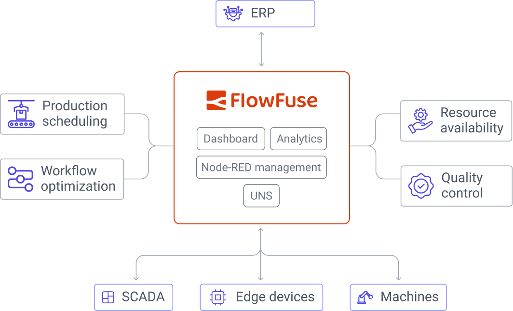

Ask three people on the same shop floor whether an order is on track and you might get three different answers. One is looking at a whiteboard. Another is checking an hour-old spreadsheet. The plans live in the ERP system, while machines run under SCADA and PLC control—but the layer connecting the two is often missing. That gap is where a manufacturing execution system belongs.

<!--more-->

A Manufacturing Execution System (MES) connects live shop-floor activity with the production plan. It tracks the work order, materials, quality checks, and output as production happens, rather than requiring teams to reconstruct what occurred at the end of a shift.

::cta-image{src="/blog/2025/06/images/mes-blog-cta.png" alt="Build, Scale, and Manage the MES Capabilities You Need" cta="sign-up"}
::

## How does an MES system work on the shop floor?

An MES pulls live data from machines, sensors, and operators, then uses it to guide and confirm each step of production. As a work order runs, it can track which machine is handling it, how much material is used, and whether output is meeting specification in real time.

The hard part is rarely the concept. It is [getting data out of equipment that was never built to share it](/blog/2025/06/data-acquisition-for-mes/). A decade-old PLC may expose raw, uncontextualized tags over a vendor-specific protocol, while the SCADA system reading that data was designed to present it to an operator, not publish it upward. [Modbus](/node-red/protocol/modbus/), EtherNet/IP, Profinet, [S7comm](/blog/2025/01/integrating-siemens-s7-plcs-with-node-red-guide/), and [OPC UA](/blog/2025/07/reading-and-writing-plc-data-using-opc-ua/) can coexist on the same floor, and none inherently carry the order context an ERP system needs.

In a brownfield environment spanning several sites, that becomes a standing integration problem rather than a one-time project. [IT/OT connectivity](/use-cases/it-ot-middleware/) moves production events and quality checks between [PLCs](/landing/plc/), [SCADA](/use-cases/scada/), and [enterprise systems](/landing/enterprise-integration/) without relying on brittle point-to-point integrations.

Each new plant usually means remapping equipment, because legacy systems rarely match exactly from location to location. FlowFuse lets teams standardize operational applications and deploy them across sites, so they can reuse the logic while adapting connections for the equipment at each location.

{data-zoomable}

## MES vs. SCADA: where each system's job ends

Both MES and SCADA deal with real-time data, but they sit at different levels of the [ISA-95 stack](/blog/2023/08/isa-95-automation-pyramid-to-unified-namespace/): PLCs at Level 1, SCADA at Level 2, MES at Level 3, and ERP at Level 4. Each answers a different question.

### What SCADA controls, and where it stops

PLCs execute deterministic machine control: starting and stopping equipment and enforcing interlocks. SCADA sits above them, aggregating sensor readings, presenting them to operators, distributing setpoints, logging to a historian, and raising alarms when something is out of range.

SCADA does not track work orders, manage quality checks across a batch, or connect machine activity to the wider production plan. It reports on the machine, not the order.

### What MES manages that SCADA cannot

An MES applies raw machine data to the production plan: which order is running, whether the output meets specification, and what remains to complete a shift. It also manages work-order dispatch, material genealogy and traceability, and the sequence in which steps happen. Manufacturers weighing an [MES build-versus-buy](/blog/2023/10/mes-build-buy/) decision should look beyond machine monitoring alone.

### How data moves between the two systems

MES and SCADA depend on a steady, two-way flow of data. SCADA reports machine and sensor states upward; MES sends work instructions, recipes, and quality parameters back down as supervisory setpoints. The MES never sits inside the control loop—interlocks and safety logic stay in the PLC.

When data moves through brittle custom integrations, a change to a machine or protocol can ripple through the whole system. Publishing data once to a broker, such as through [MQTT with Sparkplug B](/blog/2024/08/using-mqtt-sparkplugb-with-node-red/), gives each layer a consistent way to subscribe to the information it needs.

## The real benefits of MES software

The return on MES is clearest when it is tied to measurable operational outcomes, not general claims about efficiency. Real-time production visibility can help teams spot issues before a batch or shift is complete.

### Fewer defects and less scrap

Real-time operational monitoring can catch quality issues as they happen instead of after a batch is finished. With live production data, teams can identify deviations early enough to correct them before more material is wasted.

### Faster time from idea to deployed application

Adding a quality check, connecting a new data point, or changing an operational workflow often means waiting on a development backlog. A low-code platform can shorten that cycle by helping engineers build, test, and deploy the needed logic with less custom code.

### Standardization without rebuilding at every site

Multi-site manufacturers can lose time rebuilding MES logic at every plant because equipment and legacy systems differ. FlowFuse supports reusable operational applications, so teams can [structure and store shop-floor data](/blog/2025/06/structuring-storing-data-mes-integration/) consistently and deploy the same core integration pattern across sites.

## Final thoughts

An MES earns its place by closing the gap between what machines are doing and what the business needs to know. That depends far more on connectivity than on any single feature list. The distinction between SCADA and MES matters in practice because it defines how cleanly data can move from the machine to the production plan and back again.

For manufacturers managing several plants with different equipment and legacy systems, the real test is whether the MES logic has to be reinvented at every location. FlowFuse gives industrial teams a way to build operational applications once and deploy them where they are needed, without starting the integration work from scratch each time.
