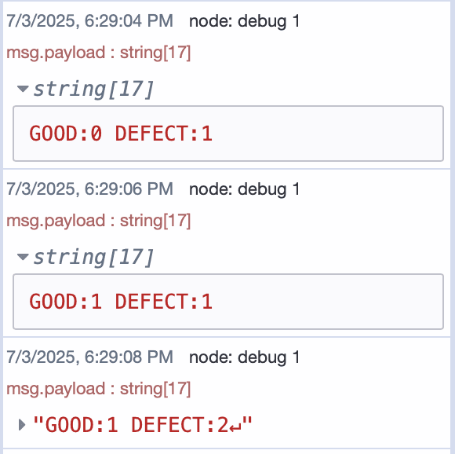

Many factories still use legacy machines that communicate via serial ports such as RS-232 or RS-485. These machines remain reliable but are difficult to connect with modern systems due to limited connectivity.

This blog shows how to use FlowFuse to connect legacy manufacturing equipment to collect data, enable monitoring without modifying the original hardware.

## Understanding Serial Communication

Serial communication has been the silent workhorse behind industrial machines for decades. Long before Ethernet and wireless networks, factories relied on simple, robust serial links to move data between devices. And even today, many of those machines still speak that same language — **bit by bit, over a single wire**.

To connect with these machines, it helps to first understand how serial communication actually works — and why it has stood the test of time.

### How Data Moves: Direction of Flow

Not all serial communication works the same way. The way data travels depends on the device and the protocol it follows:

- **Simplex** – Data moves in just one direction. Think of it like a broadcast — your machine talks, you just listen.
- **Half-Duplex** – Data moves both ways, but only one side can speak at a time. It’s like using a walkie-talkie — you talk, then wait for a reply.
- **Full-Duplex** – Data flows in both directions simultaneously. More like a phone call — smooth, uninterrupted conversation.

Most industrial machines use **half-duplex (RS-485)** or **full-duplex (RS-232)**, depending on whether they're designed for multi-device networks or direct communication.

### How Data Is Structured: Timing and Format

Every machine expects the data it receives to follow a certain structure — just like how we expect words to follow grammar rules.

Here are the key pieces:

- **Baud Rate** – How fast data is sent, measured in bits per second. Common rates are `9600`, `19200`, or `115200`. If this setting doesn’t match on both sides, the result is gibberish.
- **Data Bits** – Usually 7 or 8 bits — this is the actual data being sent.
- **Parity Bit** – Optional error-checking. Helps detect if data got scrambled during transmission.
- **Stop Bits** – Marks the end of a message (1 or 2 bits).

These form what's called a **frame**. A common frame format like `8N1` means:
> 8 data bits, No parity, 1 stop bit.

It might look like a small detail, but getting this frame structure right is critical. One mismatch, and your flow will be filled with noise or nothing at all.

### Common Interfaces You’ll Encounter

So, how do machines actually connect? Here are the most common physical standards used:

- **RS-232** – A classic. Full-duplex, point-to-point communication. Best for short distances between two devices.
- **RS-485** – Built for industrial networks. Half-duplex, supports multiple devices on a shared line, and works well over long distances.
- **USB (via adapter)** – Most modern systems do not have built-in serial ports. USB-to-serial adapters (like FTDI) are commonly used to bridge that gap.

Knowing which interface your machine uses — and matching the electrical standard, connector type, and pinout — is the first real step in bringing it online.

## Setting Up Serial Communication in Node-RED with FlowFuse

Once you have identified the interface your legacy machine uses—such as RS-232 or RS-485—the next step is to establish communication using Node-RED. With FlowFuse, you can build, deploy, and manage these Node-RED flows in a controlled, cloud-connected environment.

### Prerequisites

Before configuring serial communication, ensure the following prerequisites are met:

- **Hardware Connection:** The legacy machine must be physically connected to your system using a serial interface:

- **Node-RED Instance:** Make sure you have an instance of Node-RED up and running. The quickest way to do this is via FlowFuse. If you don't have an account, check out our free trial.

- **Serialport Node:** Install the [node-red-node-serialport](https://flows.nodered.org/node/node-red-node-serialport) package if it is not already available in your palette.

### Configuring the Serial Port Node

After installing the `node-red-node-serialport` package, follow these steps to configure serial communication in your Node-RED flow:

1. Drag a **Serial In** node from the Node-RED palette onto the canvas.
2. Double-click the node to open the configuration dialog.
3. Click the pencil icon next to the **Serial Port** field to add a new port configuration.
4. Enter the serial port path (e.g., `/dev/ttyUSB0` on Linux or `COM3` on Windows). You can also click the **search** option to list available ports.

{data-zoomable}  
_Screenshot of Node-RED serial port node configuration showing available serial ports after clicking the search option._

5. Set the **baud rate**, **data bits**, **stop bits**, and **parity** according to your machine’s specifications. These values must match the device exactly, or communication will fail or result in corrupted data.

6. Optionally, define an **input delimiter**, such as `\n` or `\r`, to segment incoming messages if your device sends data in lines or chunks.  
   If the output is fixed-length, you can configure it to wait for a specific number of characters. You can also set a **timeout** to receive data at regular intervals.  
   Later in the output section, you can choose to **add characters** back to the message, such as restoring the line break.

{data-zoomable}  
_Screenshot of input and output settings in the Node-RED serial port node, showing options like delimiter, character count, and timeout._

7. Click **Done** to save the configuration.

Once the serial port is correctly configured and the device is connected, the `serial in` node will show a "connected" status below the node with small green square. This confirms that Node-RED has successfully opened the serial port and is ready to send and recive data.

{data-zoomable}  
_Screenshot of the Serial In node in Node-RED showing a green square that indicates a successful connection to the serial port._

### Writing to Serial Port

To send data to a legacy machine, you use the `serial out` node in Node-RED. This is often necessary to trigger actions such as starting a process, requesting a reading, or changing an internal state.

In our case, we are working with a real machine connected via a serial interface. To begin production simulation on the machine, it expects a `START` command to be sent over the serial port.

1. Drag an `inject` node onto the canvas.
2. Set the **payload type** to `string` and enter the value to "START".
3. Add a `serial out` node and select the configured serial port.
4. Connect the `inject` node to the `serial out` node.

Once deployed, clicking the inject button will send the command to the machine. This starts the simulated production process, after which the machine begins transmitting data over the same serial connection.

### Reading and Processing Serial Data

After the machine receives the `START` command and begins its operation, it starts sending real-time data through the serial connection. You can use the `serial in` node to capture and process this incoming data in Node-RED.

Follow these steps to read and handle the serial data:

1. Drag a `serial in` node onto the canvas and configure it to use the same serial port.
2. Add a `debug` node and connect it to the output of the `serial in` node. This helps you inspect the raw payload and confirm that data is being received correctly.
3. Once you confirm the format of the incoming data, use a any of node change, json, function node to parse and convert it into a structured format, here we have used function.

In our case, the machine sends production data every 2 seconds in the following format:

{data-zoomable}  
_Screenshot of Node-RED debug panel showing temperature and humidity data sent from the machine every 2 seconds._

To convert this into a structured JSON object, add a function node with the following code:

```javascript
let parts = msg.payload.trim().split(' ');
let result = {};

parts.forEach(part => {
    let [key, value] = part.split(':');
    result[key.trim()] = parseInt(value);
});

msg.payload = result;
return msg;
```

This transforms the string object similar to below:

```json
{
  "GOOD": 214,
  "DEFECT": 22
}
```

### Handling Request-Response Serial Communication

Not all machines stream data continuously. Some expect a command first, and only then respond with data. In these cases, using a combination of `inject`, `serial out`, and `serial in` nodes can become tricky — especially if you need to match each request with exactly one response. That is where the `serial request` node becomes useful.

The `serial request` node handles this entire pattern for you. Internally, it combines the logic of sending a message and waiting for a single reply, working in a **first-in, first-out** manner. This means it will only send the next request after receiving a response (or timeout) for the previous one, making it ideal for synchronous devices.

To use it:

1. Drag a `serial request` node from the palette.
2. Double-click to configure the port — use the same path and settings as your other serial nodes.
3. Connect it to an `inject` node configured with the command your machine expects, such as `"READ"` or `"STATUS"`.
4. On the output side, connect a `debug` or `function` node to handle the response.

Each time you trigger the inject, the command will be sent over the serial port, and the response will be delivered to the output — ready to be parsed just like before. This approach is clean, predictable, and removes the guesswork from matching writes with reads.

The output message includes `msg.payload` containing the response (if any), `msg.status` with the result status, and `msg.port` for reference.

This node is especially useful for polling machines that respond with production counts, part IDs, temperature readings, or system status — but only when asked.

### Dynamically Managing Serial Ports

In a perfect setup, the serial device is connected, the port is stable, and everything just works. But in practice, hardware is not always so predictable.

You might disconnect and reconnect a USB-to-serial adapter — and now the device shows up as `/dev/ttyUSB1` instead of `/dev/ttyUSB0`. Or maybe you need to temporarily release the serial port to flash new firmware onto an Arduino. In some environments, the port assignment could change on every reboot, making it difficult to hardcode anything.

Rather than redeploying or editing your flow every time, Node-RED gives you a more flexible option: the **serial control** node.

This node lets your flow adjust serial communication settings on the fly. You can:

- Stop the serial connection when needed.
- Start it again later.
- Even switch to a different port entirely — without touching the Node-RED editor.

All of this happens by sending a simple message to the control node.

To stop communication:

```json
{ "enabled": false }
```

To start it again:

```json
{ "enabled": true }
```

And if the port changes or needs reconfiguration, you can send everything in one message:

```json
{
  "serialport": "/dev/ttyUSB1",
  "serialbaud": 9600,
  "databits": 8,
  "parity": "none",
  "stopbits": 1,
  "enabled": true
}
```

This is especially useful when your flow needs to recover automatically — for example, after a USB reconnection — or if you want to let a user select the correct port from a dashboard interface.

Each time a message is received, the node also outputs the current port configuration. This allows you to log or verify changes as part of your flow — making it easy to track what the system is doing behind the scenes.

In short, the `serial control` node adds a layer of resilience and flexibility that is often essential in real-world deployments — where devices come and go, ports are never quite consistent, and downtime is not an option.

## Conclusion

Connecting legacy machines is no longer a barrier — it is an opportunity. With FlowFuse, serial-connected equipment can become part of a connected, automated workflow without altering the hardware or disrupting production.

Whether you need real-time visibility, remote diagnostics, or smarter event handling, FlowFuse gives you the tools to turn reliable machines into valuable data sources. It is a scalable, cloud-managed approach to modernizing operations — starting with the equipment you already trust.

**Have questions or a project in mind? [Get in touch with us](/contact-us/) — we’d be happy to help you connect your legacy systems the right way.**
