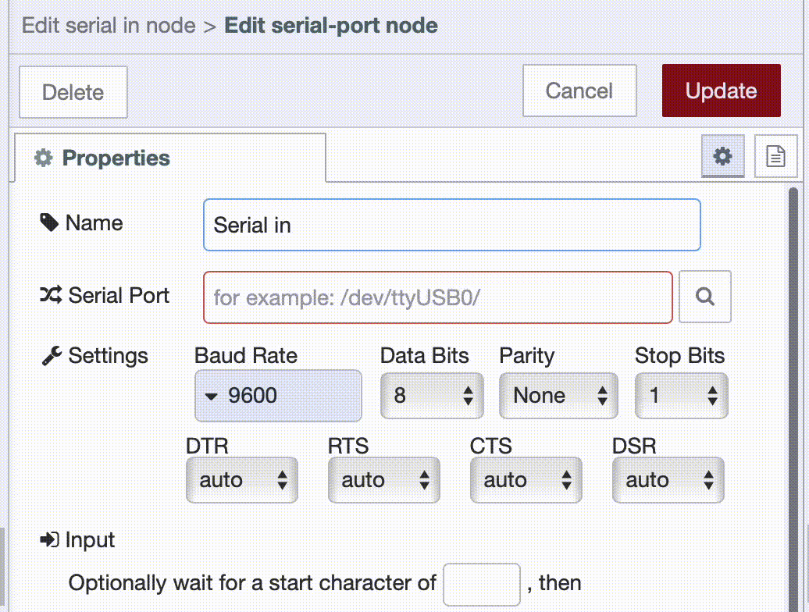
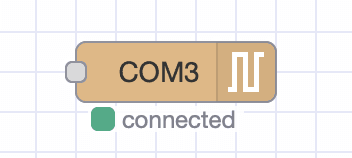

Many factories still use legacy machines that communicate via serial ports such as RS-232 or RS-485. These machines remain reliable but are difficult to connect with modern systems due to limited connectivity.

<!--more-->

This blog shows how to use FlowFuse to connect legacy manufacturing equipment to collect data, enable monitoring without modifying the original hardware.

## Making Sense of Serial Communication

Before diving into the wiring and flow configuration, it helps to understand how serial communication works — and why it is still relevant in industrial settings.

Serial ports move data one bit at a time, like passing beads on a string. This may sound old-fashioned, but it remains one of the most reliable and predictable ways to connect machines.

### Data Direction: Which Way Does It Flow?

Not all serial connections behave the same. Think of them like conversations — some talk, some listen, and some take turns:

- **Simplex**: One-way only. Like a speaker giving a lecture — the machine talks, you just listen.
- **Half-Duplex (RS-485)**: Two-way, but only one side at a time. Like using a walkie-talkie.
- **Full-Duplex (RS-232)**: Two-way, simultaneous. Like a phone call — talk and listen at once.

Most legacy industrial setups use **RS-485** or **RS-232**, depending on the wiring and number of connected devices.

### Data Format: How Is It Structured?

Machines are picky — they expect data to arrive in a specific format. Here are the key pieces that make up a serial data **frame**:

| Setting      | What It Means                                 |
|--------------|-----------------------------------------------|
| **Baud Rate**| Speed of transmission (e.g., 9600 or 115200)  |
| **Data Bits**| The actual data, usually 7 or 8 bits          |
| **Parity**   | Optional error check — even, odd, or none     |
| **Stop Bits**| Marks the end of each message                 |

Important: If the frame settings do not match on both sides, your data will appear garbled or not arrive at all.

### Interface Types: How Devices Physically Connect

Different machines use different physical standards. The most common are:

- **RS-232**: Full-duplex, one-to-one. Good for short-distance device communication.
- **RS-485**: Half-duplex, multi-device. Ideal for networks and longer cable runs.
- **USB (via adapter)**: Most modern PCs and gateways use USB-to-Serial adapters to talk to RS-232/485 devices.

## Setting Up Serial Communication with FlowFuse

Now that you understand how serial communication works and what kind of interfaces your machine might use, the next step is to put that knowledge into practice.

Using **FlowFuse**, you can easily establish serial communication, process the data, and integrate it into dashboards or automated workflows, all without modifying the original hardware.

Let us walk through how to set this up.

### Prerequisites

Before we start, ensure the following prerequisites are met:

- **Hardware Connection:** The legacy machine must be physically connected to your system using a serial interface:

- **Node-RED Instance:** Make sure you have an instance of Node-RED up and running. The quickest way to do this is via FlowFuse. If you don't have an account, check out our free trial.

- **Serialport Node:** Install the [node-red-node-serialport](https://flows.nodered.org/node/node-red-node-serialport) package if it is not already available in your palette.

### Configuring the Serial Port Node

After installing the `node-red-node-serialport` package, follow these steps to configure serial communication in your Node-RED flow:

1. Drag a **Serial In** node from the Node-RED palette onto the canvas.
2. Double-click the node to open the configuration dialog.
3. Click the pencil icon next to the **Serial Port** field to add a new port configuration.
4. Enter the serial port path (e.g., `/dev/ttyUSB0` on Linux or `COM3` on Windows). You can also click the **search** option to list available ports.

{data-zoomable}  
_Screenshot of Node-RED serial port node configuration showing available serial ports after clicking the search option._

5. Set the **baud rate**, **data bits**, **stop bits**, and **parity** according to your machine’s specifications. These values must match the device exactly, or communication will fail or result in corrupted data.

6. Optionally, define an **input delimiter**, such as `\n` or `\r`, to segment incoming messages if your device sends data in lines or chunks.  
   If the output is fixed-length, you can configure it to wait for a specific number of characters. You can also set a **timeout** to receive data at regular intervals.  
   Later in the output section, you can choose to **add characters** back to the message, such as restoring the line break.

{data-zoomable}  
_Screenshot of input and output settings in the Node-RED serial port node, showing options like delimiter, character count, and timeout._

7. Click **Done** to save the configuration.

Once the serial port is correctly configured and the device is connected, the `serial in` node will show a "connected" status below the node with small green square.

{data-zoomable}  
_Screenshot of the Serial In node in Node-RED showing a green square that indicates a successful connection to the serial port._

### Writing to Serial Port

To send data to a legacy machine, use the `serial out` node in Node-RED. This is often necessary to trigger actions such as starting a process, requesting a reading, or changing an internal state.

Follow these steps to send a command:

1. Drag an `inject` node onto the canvas.
2. Set the **payload type** appropriate to your machine’s requirements. This could be a string, number, raw buffer, or JSON object.
3. Add a `serial out` node and select the configured serial port.
4. Connect the `inject` node to the `serial out` node.

Once deployed, clicking the inject button will send the specified data to the machine via the serial interface.

In this guide, we are using a real machine connected via a serial interface. The machine is programmed to simulate a production process when it receives the `"START"` command (sent as a string). Once triggered, it begins incrementing the count of good and defect products and sends this data back over the same serial connection.

The next section demonstrates how to read and process this simulated production data using the `serial in` node.

### Reading and Processing Serial Data

Follow these steps to read and handle the serial data:

1. Drag a `serial in` node onto the canvas and configure it to use the same serial port.
2. Add a `debug` node and connect it to the output of the `serial in` node. This helps you inspect the raw payload and confirm that data is being received correctly.
3. Once you confirm the format of the incoming data, use any of the change, JSON, or function node to parse and convert it into a structured format, here we have used function.

In our case, the machine sends production data every 2 seconds in the following format:

{data-zoomable}  
_Screenshot of Node-RED debug panel showing temperature and humidity data sent from the machine every 2 seconds._

To convert this string into a structured JSON object, you can use a `function` node with the following code:

```javascript
let parts = msg.payload.trim().split(' ');
let result = {};

parts.forEach(part => {
    let [key, value] = part.split(':');
    result[key.trim()] = parseInt(value);
});

msg.payload = result;
return msg;
```

This transforms the string into a JSON object like:

```json
{
  "GOOD": 214,
  "DEFECT": 22
}
```

> **Tip**: You do not need to know JavaScript to use the `function` node.  
> If you are using FlowFuse, the built-in [FlowFuse Assistant](/docs/user/assistant/) can help you write function code using natural language. Simply provide a sample of the data received from your machine and describe the output you expect — the Assistant will generate the function for you.

### Handling Request-Response Serial Communication

Not all machines stream data continuously. Some expect a request command, and only then respond with data. In these cases, using a combination of `inject`, `serial out`, and `serial in` nodes can become tricky — especially if you need to match each request with exactly one response. That is where the `serial request` node becomes useful.

The `serial request` node handles this entire pattern for you. Internally, it combines the logic of sending a message and waiting for a single reply, working in a **first-in, first-out** manner. This means it will only send the next request after receiving a response (or timeout) for the previous one, making it ideal for synchronous devices.

To use it:

1. Drag a `serial request` node from the palette.
2. Double-click to configure the port — use the same path and settings as your other serial nodes.
3. Connect it to an `inject` node configured with the command your machine expects, such as `"READ"` or `"STATUS"`.
4. On the output side, connect a `debug` or `function` node to handle the response.

Each time you trigger the inject, the command will be sent over the serial port, and the response will be delivered to the output — ready to be parsed just like before. This approach is clean, predictable, and removes the guesswork from matching writes with reads.

The output message includes `msg.payload` containing the response (if any), `msg.status` with the result status, and `msg.port` for reference.

This node is especially useful for polling machines that respond with production counts, part IDs, temperature readings, or system status — but only when asked.

### Dynamically Managing Serial Ports

In a perfect setup, the serial device is connected, the port is stable, and everything just works. But in practice, hardware is not always so predictable.

You might disconnect and reconnect a USB-to-serial adapter — and now the device shows up as `/dev/ttyUSB1` instead of `/dev/ttyUSB0`. Or maybe you need to temporarily release the serial port to flash new firmware onto an Arduino. In some environments, the port assignment could change on every reboot, making it difficult to hardcode anything.

Rather than redeploying or editing your flow every time, Node-RED gives you a more flexible option: the **serial control** node.

This node lets your flow adjust serial communication settings on the fly. You can:

- Stop the serial connection when needed.
- Start it again later.
- Even switch to a different port entirely — without touching the Node-RED editor.

All of this happens by sending a simple message to the control node.

To stop communication:

```json
{ "enabled": false }
```

To start it again:

```json
{ "enabled": true }
```

And if the port changes or needs reconfiguration, you can send everything in one message:

```json
{
  "serialport": "/dev/ttyUSB1",
  "serialbaud": 9600,
  "databits": 8,
  "parity": "none",
  "stopbits": 1,
  "enabled": true
}
```

This is especially useful when your flow needs to recover automatically — for example, after a USB reconnection — or if you want to let a user select the correct port from a dashboard interface.

Each time a message is received, the node also outputs the current port configuration. This allows you to log or verify changes as part of your flow — making it easy to track what the system is doing behind the scenes.

In short, the `serial control` node adds a layer of resilience and flexibility that is often essential in real-world deployments — where devices come and go, ports are never quite consistent, and downtime is not an option.

## Conclusion

Legacy machines may be decades old, but their role in production is still vital. Instead of replacing reliable equipment, FlowFuse empowers you to extend its value — by making it visible, connected, and part of your modern workflows.

With just a serial cable and a few nodes, you can monitor production, trigger processes, or collect real-time data, all without touching the original hardware. And with FlowFuse’s cloud-managed platform, your setup remains robust, scalable, and ready for the future, already equipped with AI capabilities.

**If you're exploring ways to connect your legacy equipment or want to see how FlowFuse can fit into your operations, [reach out to us](/contact-us/) — we’re here to help you take the next step.**
