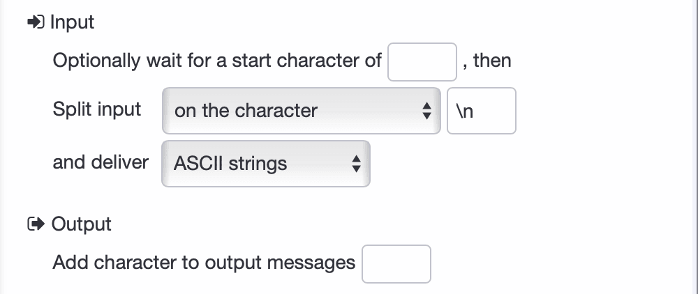

Many factories still use legacy machines that communicate via serial ports such as RS-232 or RS-485. These machines remain reliable but are difficult to connect with modern systems due to limited connectivity.

This blog shows how to use FlowFuse to connect legacy manufacturing equipment to collect real-time data, enable monitoring, and trigger automated actions—without modifying the original hardware.

## Understanding Serial Communication

Serial communication is a fundamental method for transmitting data one bit at a time over a single channel. While modern networking technologies have become standard, many reliable legacy and semi-modern industrial machines still depend on serial interfaces for control and data exchange.

Here are some of the most common interfaces you'll encounter:

- RS-232
- RS-485
- USB (Universal Serial Bus)
- Parallel Port
- Ethernet
- GPIB (General Purpose Interface Bus)

Among these options, RS-232 and RS-485 remain the most prevalent and critical interfaces for connecting to and monitoring legacy manufacturing equipment.

## Setting Up Serial Communication in Node-RED with FlowFuse

Once you have identified the interface your legacy machine uses—such as RS-232 or RS-485—the next step is to establish communication using Node-RED. With FlowFuse, you can build, deploy, and manage these Node-RED flows in a controlled, cloud-connected environment.

## Prerequisites

Before configuring serial communication, ensure the following prerequisites are met:

- **Hardware Connection:** The legacy machine must be physically connected to your system using a serial interface:

- **Node-RED Instance:** Make sure you have an instance of Node-RED up and running. The quickest way to do this is via FlowFuse. If you don't have an account, check out our free trial.

- **Serialport Node:** Install the [node-red-node-serialport](https://flows.nodered.org/node/node-red-node-serialport) package if it is not already available in your palette.

## Configuring the Serial Port Node

After installing the `node-red-node-serialport` package, follow these steps to configure serial communication in your Node-RED flow:

1. Drag a **Serial In** node from the Node-RED palette onto the canvas.
2. Double-click the node to open the configuration dialog.
3. Click the pencil icon next to the **Serial Port** field to add a new port configuration.
4. Enter the serial port path (e.g., `/dev/ttyUSB0` on Linux or `COM3` on Windows). You can also click the **search** option to list available ports.

{data-zoomable}  
_Screenshot of Node-RED serial port node configuration showing available serial ports after clicking the search option._

5. Set the **baud rate**, **data bits**, **stop bits**, and **parity** according to your machine’s specifications. These values must match the device exactly, or communication will fail or result in corrupted data.

6. Optionally, define an **input delimiter**, such as `\n` or `\r`, to segment incoming messages if your device sends data in lines or chunks.  
   If the output is fixed-length, you can configure it to wait for a specific number of characters. You can also set a **timeout** to receive data at regular intervals.  
   Later in the output section, you can choose to **add characters** back to the message, such as restoring the line break.

{data-zoomable}  
_Screenshot of input and output settings in the Node-RED serial port node, showing options like delimiter, character count, and timeout._

7. Click **Done** to save the configuration.

Once the serial port is correctly configured and the device is connected, the `serial in` node will show a "connected" status below the node with small green square. This confirms that Node-RED has successfully opened the serial port and is ready to send and recive data.

{data-zoomable}  
_Screenshot of the Serial In node in Node-RED showing a green square that indicates a successful connection to the serial port._

## Writing to Serial Port

To send data to a legacy machine, you use the `serial out` node in Node-RED. This is often necessary to trigger actions such as starting a process, requesting a reading, or changing an internal state.

In our case, we are working with a real machine connected via a serial interface. To begin production simulation on the machine, it expects a `START` command to be sent over the serial port.

1. Drag an `inject` node onto the canvas.
2. Set the **payload type** to `string` and enter the value to "START".
3. Add a `serial out` node and select the configured serial port.
4. Connect the `inject` node to the `serial out` node.

Once deployed, clicking the inject button will send the command to the machine. This starts the simulated production process, after which the machine begins transmitting data over the same serial connection.

## Reading and Processing Serial Data

After the machine receives the `START` command and begins its operation, it starts sending real-time data through the serial connection. You can use the `serial in` node to capture and process this incoming data in Node-RED.

Follow these steps to read and handle the serial data:

1. Drag a `serial in` node onto the canvas and configure it to use the same serial port.
2. Add a `debug` node and connect it to the output of the `serial in` node. This helps you inspect the raw payload and confirm that data is being received correctly.
3. Once you confirm the format of the incoming data, use a any of node change, json, function node to parse and convert it into a structured format, here we have used function.

In our case, the machine sends production data every 2 seconds in the following format:

{data-zoomable}  
_Screenshot of Node-RED debug panel showing temperature and humidity data sent from the machine every 2 seconds._

To convert this into a structured JSON object, add a function node with the following code:

```javascript
let parts = msg.payload.trim().split(' ');
let result = {};

parts.forEach(part => {
    let [key, value] = part.split(':');
    result[key.trim()] = parseInt(value);
});

msg.payload = result;
return msg;
```

This transforms the string object similar to below:

```
{
  "GOOD": 214,
  "DEFECT": 22
}
```


