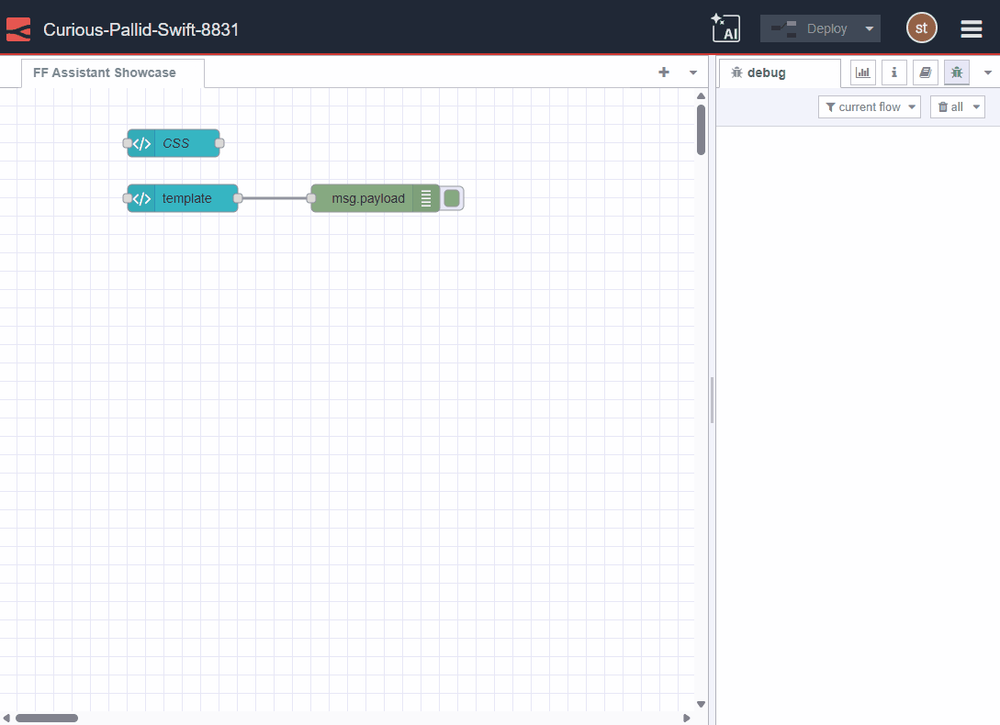

Every manufacturing engineer knows this scenario: Node-RED's visual programming handles most of your automation needs brilliantly. Connect to PLCs, route data, trigger actions—all with drag-and-drop simplicity. But then you hit the wall. Your machine outputs data in a proprietary format. You need a custom dashboard widget that doesn't exist. You're manually creating test data for hours. Or worse, you're trying to understand a complex flow built by someone who left last year.

<!--more-->

These tasks demand coding skills—JavaScript for parsing data, Vue.js for custom widgets, CSS for styling. Skills your automation engineers might not have. Skills that pull them away from what they do best: optimizing production.

FlowFuse's AI Assistant changes this dynamic completely. Describe what you need in plain English—get working code instantly. No more hours lost to syntax errors or Stack Overflow searches. Let's look at how manufacturing teams can use it to solve real problems.

## Parsing Machine Data Without the JavaScript Struggle

While Node-RED low-code standard nodes cover most scenarios, every production line has unique quirks. Complex data parsing, multi-step calculations, proprietary protocols—these all demand JavaScript. Engineers who should be optimizing processes end up googling regex patterns and debugging syntax errors.

Consider this output from a CNC machine that's been reliable for 15 years:

```text
-- CYCLE END REPORT --
ID: M-45B / PART: XF-201
TIMESTAMP: 2025-07-09T14:22:01Z
SERIAL: 2025-0001547
OPERATOR: JONES, M
STATS ---
PART_COUNT: 481
CYCLE_TIME (S): 114.72
MAX_TEMP (C): 85.3
TOOL_WEAR_IDX: 0.73
COOLANT_LEVEL: OK
ALERTS: NONE
-- END --
```

The traditional approach means spending 30-50 minutes writing regex patterns, handling edge cases, and testing thoroughly. Your engineer needs to remember JavaScript string methods, debug regex syntax, and account for variations in the output format.

With AI Assistant, the process changes completely. Your engineer opens a function node, clicks the AI Assistant button, and types: "Parse this CNC report format. Extract PART_COUNT as integer, CYCLE_TIME as float, TOOL_WEAR_IDX as float, OPERATOR name, and ALERTS. Return as JSON." They paste the sample data and get working code in under two minutes:

The engineer reviews the code, tests it with their data, and moves on to solving actual manufacturing problems instead of wrestling with syntax.

{data-zoomable}
_FlowFuse AI Assistant generating a Node-RED function node to extract data from a CNC text report._

## Creating Test Data in Seconds, Not Hours

Before connecting to live equipment, you need test data that looks real. Making it by hand is boring and wastes lots of time. You're copying rows, changing timestamps, tweaking numbers.

With AI Assistant, just ask: "Generate 20 machine records with machine_id, production_count, efficiency_percentage, downtime_minutes, and last_maintenance_date. Show realistic variations." Simple as that.

{data-zoomable}
_FlowFuse AI Assistant creating realistic test data for manufacturing dashboards—complete with machine IDs, production metrics, and maintenance dates._

## Building Custom Dashboards Without Web Development

Standard dashboard widgets cover most UI needs, but manufacturing often demands more. Custom visualizations for specific KPIs require Vue.js templates. Matching components to your HMI design standards takes CSS expertise. Whether you're building new widgets or styling existing ones, you're suddenly in web development territory—far from where most automation engineers want to be.

Take a Pareto chart for defect analysis—essential for quality teams but not available as a standard widget. Building it requires Vue.js knowledge, Chart.js integration, and responsive design skills.

With AI Assistant, just describe what you need: "Create a Pareto chart widget showing defect counts as bars with a cumulative percentage line. Include the 80% threshold."

{data-zoomable}
_FlowFuse AI Assistant building both custom widgets and styling existing components for manufacturing dashboards._

Or consider input boxes for operator data entry that look too modern. Your team prefers the familiar green LCD screens they've used for decades.

Tell AI Assistant: "Add CSS that makes the input with classes 'calculator' and 'text-input' look like an old green LCD calculator screen."

{data-zoomable}
_AI Assistant creating CSS that transforms standard input boxes into retro LCD displays with glowing green text._

Whether creating new widgets or styling existing ones, AI Assistant handles the Vue.js and CSS complexity. You describe the outcome—it generates the code.

## Documenting Complex Flows Before Knowledge Walks Out

Production flows evolve over years into complex systems. Hundreds of nodes, critical logic buried in functions, intricate routing between tabs. When knowledge walks out the door, new team members face weeks of detective work trying to understand what does what and why.

AI Assistant's Flow Explainer solves this. Select any flow or group of nodes, click "Explain," and get instant documentation. It analyzes connections, reads function code, and generates clear explanations of what everything does and why.

{data-zoomable}
_FlowFuse AI Assistant turning complex flows into clear documentation for easy knowledge transfer._

## Start Building Today

AI Assistant is just one way FlowFuse helps manufacturing teams work faster.

Teams collaborate on flows in real-time. Version control with snapshots means you can always go back if something breaks. Remote device management handles edge devices across your factory floor. Deploy to one machine or a thousand with a single click. Built-in DevOps pipelines streamline your workflow from development to production.

For production reliability, high availability keeps systems running 24/7. The integrated MQTT broker handles all your device messaging. Enterprise security includes SSO, multi-factor authentication, role-based access control, and complete audit logs.

FlowFuse gives you everything you need to build, deploy, and manage Node-RED at scale.

[Try FlowFuse free →](https://app.flowfuse.com/account/create)