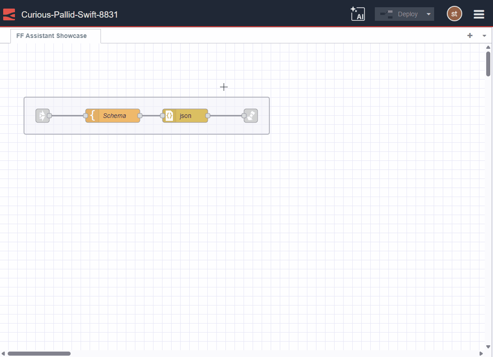
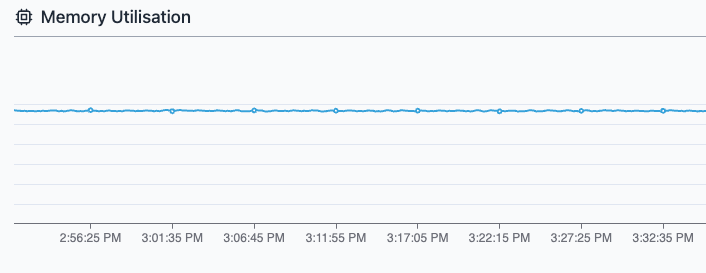
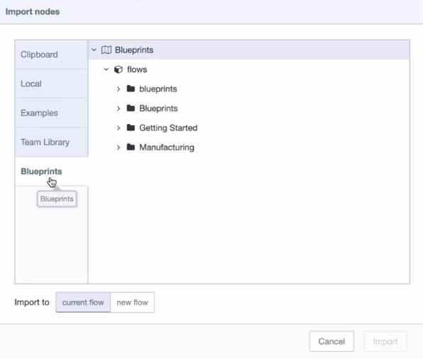
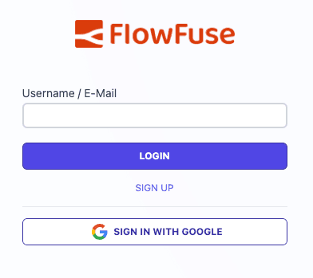
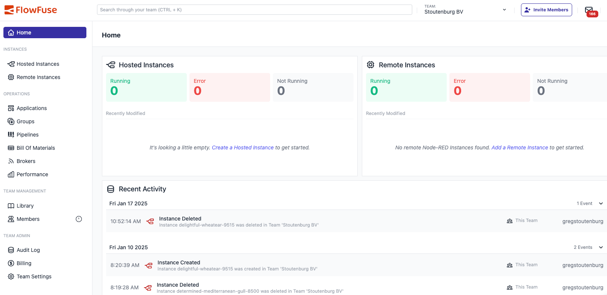

This release focuses on speeding time to value with more powerful AI functionality within Node-RED, along with reducing friction for new users while enhancing the experience for existing users through improved Blueprint functionality, comprehensive performance monitoring, and a modernized interface that reflects FlowFuse's evolution.

<!--more-->

## AI Enhancements to Node-RED

_GIF of AI Flow Explainer_

The FlowFuse Expert can now do more than create a Function node based on your text instructions. With this release, you can highlight a flow in the Node-RED editor and ask the FlowFuse Expert to explain the purpose of the flow. This new functionality is perfect for learning and collaboration.

You can also use the FlowFuse Expert to create Dashboard templates with HTML, VUE, Vuetify, and CSS, allowing you to build even faster.

Stay tuned for more developments as we continue to add enhancements to the Node-RED editor in FlowFuse to enable even faster development.

## Comprehensive Performance Monitoring

_Screenshot of Memory Monitoring_
Building on our existing CPU monitoring capabilities, we've added memory usage tracking to the Performance feature. This enhancement provides:

- Complete visibility into both CPU and memory utilization
- Better understanding of instance resource consumption
- More informed decision-making for scaling and optimization

With these features, you can now get a holistic view of your instance performance and make informed decisions about resource allocation.

## Add Blueprints to Existing Instances

_Screenshot of Blueprint Import_

Previously, Blueprints could only be used when creating new instances. Now you can import Blueprints into existing instances, making them much more versatile. Blueprints now appear as an option in the Import menu.

And if you're running Node-RED version 4.1, when you select a Blueprint to import that uses nodes not in your current palette, it will offer to install them automatically. 

This change transforms Blueprints from a one-time instance creation tool into a constantly useful resource to speed your development with Node-RED.

## Social Sign-in for Easy Onboarding

_Screenshot of Google Signin_

To make it easier than ever to create a FlowFuse account, we've introduced social sign-in options that allow users to create FlowFuse Cloud accounts using their Google credentials.

This enhancement removes multiple steps from the onboarding process, making it significantly easier for new users to get started with FlowFuse.

## Enhanced Device Agent Flow Selection

Connecting your existing Node-RED instances running on remote devices is now even easier with the new Device Agent terminal file browser. When installing the Device Agent, you can now easily navigate your file system and select existing Node-RED instances through an interactive interface directly in the terminal.

This improvement replaces the previous manual file path entry process with:

- An intuitive file browser that works directly in your terminal
- Easy navigation through your file system to locate flows
- Contextual information about flows including file size and modification dates
- A streamlined selection process that reduces setup friction

## Modernized User Interface

_Screenshot of Homepage_

The FlowFuse user interface was due for a restructuring in light of what users are looking for, along with a visual touchup. This release introduces a dedicated landing page that focuses on what we've learned users want to do when they first access FlowFuse. The new homepage provides:

- Direct access to relevant hosted and remote instances
- Smart prioritization based on recent activity and deployments
- Prominent display of issues requiring attention (performance alerts, errors)
- Recent team activity overview through audit log integration
- Improved layout and visual hierarchy  
- Updated color scheme and styling

These changes make it easier to find what you are looking for within FlowFuse, address issues that may arise, and creates a more pleasant workspace.

## What's Next?

Our development team continues to focus on AI integration and workflow optimization. The upcoming releases will build on these foundational improvements while introducing more intelligent automation and development assistance features.

We're also working on expanding our Blueprint library and improving the overall development experience within the Node-RED editor, with several exciting features planned for the coming months.

## What else is new?

For a complete list of everything included in our 2.19 release, check out the [release notes](https://github.com/FlowFuse/flowfuse/releases/).

Your feedback continues to be invaluable in shaping FlowFuse's development. We'd love to hear your thoughts on these new features and any suggestions for future improvements. Please share your experiences or report any [issues on GitHub](https://github.com/FlowFuse/flowfuse/issues/new/choose).

Which of these new features are you most excited to try? Email me directly at greg@flowfuse.com - I'd love to hear from you!

## Try FlowFuse

### FlowFuse Cloud

The quickest way to get started is with FlowFuse Cloud.

[Get started for free]() and have your Node-RED instances running in the cloud within minutes.

### Self-Hosted

Get FlowFuse running locally in under 30 minutes using [Docker](/docs/install/docker/) or [Kubernetes](/docs/install/kubernetes/).