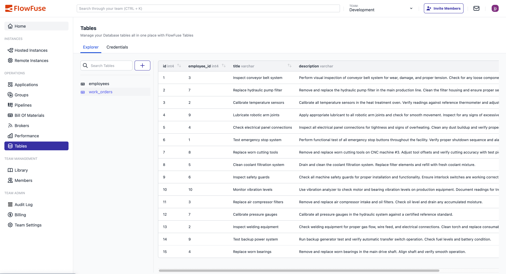

This release represents a major leap forward in FlowFuse's data management and AI capabilities, introducing our new FlowFuse Tables database feature, along with enhanced AI assistance features and a streamlined user interface. These improvements make FlowFuse a complete solution for building industrial applications, even while reducing development time.

<!--more-->

## Introducing: FlowFuse Tables

{data-zoomable}
_A screenshot of the new "Tables" view, now available in FlowFuse_

FlowFuse Tables is our brand new database offering that provides a simple way to store your data, all within the FlowFuse ecosystem. This comprehensive database offering comes with FlowFuse's enterprise-grade security and unlocks the ability to seamlessly build critical systems like MES and ERP.

FlowFuse Tables eliminates the complexity of setting up and managing separate database infrastructure, allowing you to focus on building applications that drive operational efficiency.

FlowFuse Tables is available now for all Enterprise users running on FlowFuse Cloud.

### New Node: Query

{data-zoomable}
_A flow in Node-RED that uses the new FlowFuse "Query" node_

Alongside the new Tables offering, we have shipped a new node that you can find in your Node-RED Editor - "Query". This will automatically connect to any associated database you have with your team, saving you time in manually configuring nodes and credentials, giving you more time to just focus on the fun of building your flows, and making it really easy to start storing and querying your data.

## AI-Assisted Node-RED with Smart Suggestions

{data-zoomable}
_GIF of Smart Suggestions in Action_

Development in Node-RED is now even faster with Smart Suggestions, an agent that runs in-browser and offers intelligent flow completion for next-node recommendations. With Smart Suggestions, as you place a node, the agent will automatically calculate the most likely next node to place, and will offer suggestions for the node's configuration. It present up to 5 options, so even if the first suggestion isn't correct, it's very likely that the correct choice is only a quick keyboard shortcut away.

This work extends the functionality of the in-built FlowFuse Expert and it's MCP server that runs behind the Node-RED Editor to provide power additional development enhancements.
 

## New Blueprint: Agentic AI with Retrieval Augmented Generation

<video src="https://website-data.s3.eu-west-1.amazonaws.com/Blueprint+-+Open+AI+RAG.mp4" controls=""></video>

The new RAG (Retrieval Augmented Generation) Blueprint enables you to train your own LLM agents, combining your own data with natural language capabilities.

This Blueprint provides two flows: one that adds text into Node-RED's flow context store and uses it to train an OpenAI agent, so you can query the content of the flow directly; and one flow that scrapes websites to train an OpenAI agent so that content can be queried and used as well.

The RAG Blueprint makes it easy to create intelligent agents that leverage your organizational knowledge without requiring deep AI expertise. [Try it out for yourself here.](https://flowfuse.com/blueprints/ai/rag-chat-agent/)

## Refined Applications Page

{data-zoomable}
_Screenshot of Redesigned Applications Page_

With the new FlowFuse Home page in place, we have greatly streamlined the Applications page. The new structure includes:

- **Streamlined Navigation**: Applications now appear under Instances in the navigation hierarchy
- **Reduced Cognitive Load**: Eliminated the overwhelming number of buttons and links in the previous design
- **Focus on Important Information**: The newly refined design focusses on giving you a clear overview of the status of your Hosted and Remote Instances, split by Application.
- **Performance Optimizations**: The above has also lead to faster page loading and improved responsiveness

This redesign creates a more intuitive workflow that aligns with how teams actually use FlowFuse, reducing clicks and improving productivity.

## More Powerful "Small" Instances

Based on user feedback and our own review of instance performance, we have increased the CPU and memory of all "small" Node-RED instances running on FlowFuse. This will have the immediate benefit of preventing slowdowns and loading issues for all Starter and Team customers. 

## What's Next?

Our development roadmap continues to focus on AI integration and enterprise data management. Upcoming releases will expand FlowFuse Tables with additional database types and analytics capabilities, while our FlowFuse Expert will gain more sophisticated workflow automation features.

We're also working on enhanced Blueprint offerings and deeper integration between our AI capabilities and industrial data sources, with several exciting announcements planned for the coming months!

## What else is new?

For a complete list of everything included in our 2.20 release, check out the [release notes](https://github.com/FlowFuse/flowfuse/releases/tag/v2.20.0).

Your feedback continues to be invaluable in shaping FlowFuse's development. We'd love to hear your thoughts on these new features and any suggestions for future improvements. Please share your experiences or report any [issues on GitHub](https://github.com/FlowFuse/flowfuse/issues/new/choose).

Which of these new features are you most excited to try? Email me directly at greg@flowfuse.com - I'd love to hear from you!

## Try FlowFuse

### FlowFuse Cloud

The quickest way to get started is with FlowFuse Cloud.

[Get started for free]() and have your Node-RED instances running in the cloud within minutes.

### Self-Hosted

Get FlowFuse running locally in under 30 minutes using [Docker](/docs/install/docker/) or [Kubernetes](/docs/install/kubernetes/).