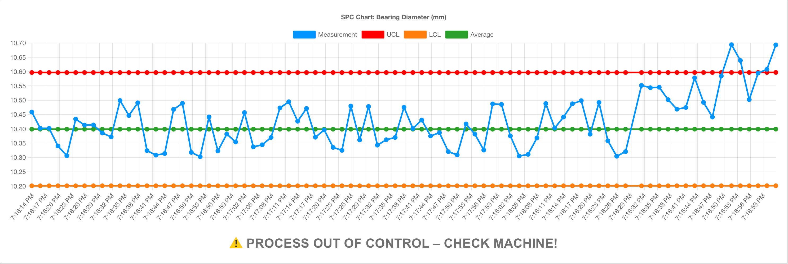

Leading manufacturers are quietly saving thousands, sometimes millions, of dollars annually with a quality control method that's been proven since the 1920s. The difference today? Modern tools make it simple to implement.

<!--more-->

Consider this real example: A manufacturer shared on Practical Machinist forum that they process 400,000 parts per year with a 4% scrap rate. That's 16,000 parts discarded annually. At even a conservative $10 per part, this represents $160,000 in direct losses from a single production line. They accepted this as normal because industry reports confirm 4-5% scrap rates are standard.

What separates industry leaders from the rest? They refuse to accept "normal" waste. Using Statistical Process Control (SPC), they detect problems as they occur, not after producing defective parts. When a process begins drifting, they receive immediate alerts and correct it before generating scrap.

This guide shows you exactly how to build a real-time SPC system using FlowFuse. You'll create a live dashboard that tracks measurements and alerts operators the moment something goes wrong. No statistics degree needed, just practical steps you can implement today.

## Why Traditional Quality Control Falls Short                   

Most manufacturers still rely on end-of-line inspection. Make parts, check parts, scrap the bad ones. This reactive approach creates three expensive problems:

**Problem 1: You're always too late**
When inspection finds a defect, you've already invested in material, machine time, labor, and energy. That investment is now scrap. Worse, how many parts did you make between when the problem started and when you caught it?

**Problem 2: The borderline parts you miss**
Not all defects are obvious. Parts that barely pass inspection today might fail in the field tomorrow. These marginal parts slip through because traditional inspection only catches clear failures, not process degradation.

**Problem 3: No insight into root causes**
Finding bad parts tells you nothing about why they're bad. Was it temperature drift? Tool wear? Material variation? Without process data, you're guessing at solutions.

**The Proactive Alternative: Statistical Process Control**

SPC flips the entire approach. Instead of checking parts after production, it monitors your process during production. The NIST Engineering Statistics Handbook explains it simply:

> "The underlying concept of statistical process control is based on a comparison of what is happening today with what happened previously."

When your process starts to drift from its normal behavior, SPC alerts you immediately. You fix the issue before making defective parts, not after.

Walter Shewhart developed this method at Bell Labs in the 1920s, proving its effectiveness across industries. Today, FlowFuse makes it accessible to any manufacturer, regardless of size or technical expertise.

## Building Your First SPC System with FlowFuse

Let's build a real example. This guide shows you how to create a SPC control chart for individual measurements - perfect for monitoring critical dimensions in real-time.

First, open your FlowFuse Node-RED instance. If you don't have one yet, you can [sign up for a free account]() and have an instance running in minutes.

### What We're Building

A real-time SPC control chart that monitors individual measurements and automatically calculates control limits. Perfect for scenarios where you measure one part at a time - like bearing dimensions on a CNC line. When measurements drift outside the calculated limits, you'll know instantly.

### Step 1: Get Your Tools Ready

First, we need two nodes for SPC monitoring.

1. Open FlowFuse's palette manager (hamburger menu → Manage palette)

2. Go to the Install tab

3. Search for and install these nodes:
   - `node-red-contrib-simple-spc` - This is your statistics engine
   - `@flowfuse/node-red-dashboard` - For that slick real-time chart

4. Click Install for each node and wait for completion

### Step 2: Simulate Your Machine Data

In production, you'd connect to your PLC. For now, let's simulate a bearing measurement around 10mm nominal.

1. Drag an **inject** node onto your canvas. This is your "sensor."

2. Double-click it and set:
   - Repeat: `interval` → `2 seconds` (mimics real sensor timing)
   - Payload: switch to JSONata mode and enter: `$random() * 0.2 + 10`

This generates readings like 10.05, 9.98, 10.11 - realistic variation around 10mm.

### Step 3: Add the Statistical Brain

Find the **spc** node in your palette (it'll be under "function" category after install).

1. Drag it over and wire your inject node to it.

2. Double-click to configure:
   - Control Limit Multiplier: `3` (for 3-sigma limits)
   - Timer: `10` (seconds before alerting out-of-control)
  
Once configured, the node outputs an object like this:

```javascript
{
    value: 10.020214950604476,      // Current measurement
    avg: 10.089877376434453,         // Running average
    ucl: 10.344067494423967,         // Upper control limit
    lcl: 9.835687258444938,          // Lower control limit
    outOfControl: false              // Alert status
}
```

### Step 4: Make the Data Chart-Ready

Charts need data in a specific format. Add a **change** node between SPC and your chart.

1. Drag a **change** node onto the canvas

2. Wire it between the SPC node and where your chart will go

3. Double-click to configure and set one rule: `Set msg.payload` to this JSONata expression:
```json
[
    {"series": "Measurement", "x": $millis(), "y": payload.value},
    {"series": "UCL", "x": $millis(), "y": payload.ucl},
    {"series": "LCL", "x": $millis(), "y": payload.lcl},
    {"series": "Average", "x": $millis(), "y": payload.avg}
]
```

This creates four lines on your chart, your actual measurements plus the three control lines.

### Step 5: Build Your Control Room Dashboard

Now we'll create the dashboard that displays your SPC control chart. This is what operators will watch to spot problems in real-time.

1. Drag a **chart** widget from the dashboard section and set:
   - Type: `Line Chart` 
   - X-axis: `HH:mm:ss` (shows time)
   - Series: Set to `series` (as key)
   - X: Set to `x` (as key)
   - Y: Set to `y` (as key)
   - Legend: `Show`
   - Label: "SPC Chart: Bearing Diameter (mm)"

2. Connect the change node to it.

3. Deploy the flow.

{data-zoomable}
_Complete SPC monitoring flow with real-time chart display_

### Step 6: Add the Alert System

A chart is nice, but you need immediate alerts. Here's the clever bit:

1. Add a **switch** node connected to your SPC output

2. Set it to check `msg.payload.outOfControl`

3. Create two outputs: true and false

4. Now add a **text** nodes from dashboard. Wire it to your switch outputs.

For the "true" path, set the text to something attention-grabbing using change node:
`⚠️ PROCESS OUT OF CONTROL - CHECK MACHINE!`

For the "false" path:
`✓ Process Stable`

5. Deploy the flow.

{data-zoomable}
_Node-RED alert system with switch node: Process stable_

### Step 7: Test Your SPC System

Open your dashboard (switch to the Dashboard 2.0 tab → click Open Dashboard button on the top-right of the right sidebar).

**What you'll see initially:**
- First 20 measurements: Chart builds up baseline data
- After 20 points: Control limits appear automatically
- Blue line bouncing between red lines: Process is stable

Let the system run for a minute to establish your baseline. The control limits aren't arbitrary - they're calculated from your actual process data.

**Now test it with a simulated process shift:**

1. Double-click the Inject node

2. Change the formula to `$random() * 0.2 + 10.5` (this shifts the mean up by 0.5mm)

3. Click Done to close the node

4. Deploy only the modified nodes:
   - Click the down arrow next to the **Deploy** button
   - Select **Modified Nodes**
   - Click the **Deploy** button 

{data-zoomable}
_Deploy menu with Modified Nodes option for updating only changed nodes_

Once done You will see the chart detect the change within seconds.

{data-zoomable}
_SPC chart detecting process shift - measurements above UCL trigger immediate alert_


[{"id":"124f531365b82e1c","type":"group","z":"071524a8fd482116","style":{"stroke":"#b2b3bd","stroke-opacity":"1","fill":"#f2f3fb","fill-opacity":"0.5","label":true,"label-position":"nw","color":"#32333b"},"nodes":["4082f89605793666","2ec8351f01f957a4","c90d67c57d1af3bd","53ef849a41aee2b3","d78ff3dbe97a5be9","98e76616c28ed9ca","5fd3415ef4c36b6e","9763632606c2a165"],"x":214,"y":159,"w":872,"h":162},{"id":"4082f89605793666","type":"inject","z":"071524a8fd482116","g":"124f531365b82e1c","name":"","props":[{"p":"payload"}],"repeat":"2","crontab":"","once":false,"onceDelay":0.1,"topic":"","payload":"$random() * 0.2 + 10.5","payloadType":"jsonata","x":310,"y":240,"wires":[["2ec8351f01f957a4"]]},{"id":"2ec8351f01f957a4","type":"spc","z":"071524a8fd482116","g":"124f531365b82e1c","name":"","limitMultiplier":"3","timer":"10","x":430,"y":240,"wires":[["c90d67c57d1af3bd","d78ff3dbe97a5be9"]]},{"id":"c90d67c57d1af3bd","type":"change","z":"071524a8fd482116","g":"124f531365b82e1c","name":"","rules":[{"t":"set","p":"payload","pt":"msg","to":"[     {\"series\": \"Measurement\", \"x\": $millis(), \"y\": payload.value},     {\"series\": \"UCL\", \"x\": $millis(), \"y\": payload.ucl},     {\"series\": \"LCL\", \"x\": $millis(), \"y\": payload.lcl},     {\"series\": \"Average\", \"x\": $millis(), \"y\": payload.avg} ]","tot":"jsonata"}],"action":"","property":"","from":"","to":"","reg":false,"x":600,"y":200,"wires":[["53ef849a41aee2b3"]]},{"id":"53ef849a41aee2b3","type":"ui-chart","z":"071524a8fd482116","g":"124f531365b82e1c","group":"3af21cf2cea638c8","name":"","label":"I-MR Chart: Bearing Diameter (mm)","order":1,"chartType":"line","category":"series","categoryType":"property","xAxisLabel":"","xAxisProperty":"x","xAxisPropertyType":"property","xAxisType":"time","xAxisFormat":"","xAxisFormatType":"auto","xmin":"","xmax":"","yAxisLabel":"","yAxisProperty":"y","yAxisPropertyType":"property","ymin":"","ymax":"","bins":10,"action":"append","stackSeries":false,"pointShape":"circle","pointRadius":4,"showLegend":true,"removeOlder":1,"removeOlderUnit":"3600","removeOlderPoints":"","colors":["#0095ff","#ff0000","#ff7f0e","#2ca02c","#a347e1","#d62728","#ff9896","#9467bd","#c5b0d5"],"textColor":["#666666"],"textColorDefault":true,"gridColor":["#e5e5e5"],"gridColorDefault":true,"width":"12","height":"7","className":"","interpolation":"linear","x":840,"y":200,"wires":[[]]},{"id":"d78ff3dbe97a5be9","type":"switch","z":"071524a8fd482116","g":"124f531365b82e1c","name":"","property":"payload.outOfControl","propertyType":"msg","rules":[{"t":"true"},{"t":"false"}],"checkall":"true","repair":false,"outputs":2,"x":570,"y":260,"wires":[["98e76616c28ed9ca"],["5fd3415ef4c36b6e"]]},{"id":"98e76616c28ed9ca","type":"change","z":"071524a8fd482116","g":"124f531365b82e1c","name":"","rules":[{"t":"set","p":"payload","pt":"msg","to":"⚠️ PROCESS OUT OF CONTROL - CHECK MACHINE!","tot":"str"}],"action":"","property":"","from":"","to":"","reg":false,"x":780,"y":240,"wires":[["9763632606c2a165"]]},{"id":"5fd3415ef4c36b6e","type":"change","z":"071524a8fd482116","g":"124f531365b82e1c","name":"","rules":[{"t":"set","p":"payload","pt":"msg","to":"✓ Process Stable","tot":"str"}],"action":"","property":"","from":"","to":"","reg":false,"x":780,"y":280,"wires":[["9763632606c2a165"]]},{"id":"9763632606c2a165","type":"ui-text","z":"071524a8fd482116","g":"124f531365b82e1c","group":"3af21cf2cea638c8","order":2,"width":0,"height":0,"name":"Visual Alert","label":"","format":"{{msg.payload}}","layout":"col-center","style":true,"font":"Arial,Arial,Helvetica,sans-serif","fontSize":"24","color":"#717171","wrapText":false,"className":"","x":990,"y":260,"wires":[]},{"id":"3af21cf2cea638c8","type":"ui-group","name":"Group 1","page":"735102f229f1a45b","width":"12","height":"7","order":1,"showTitle":false,"className":"","visible":"true","disabled":"false","groupType":"default"},{"id":"735102f229f1a45b","type":"ui-page","name":"SPC","ui":"3c2e7c6f438349e4","path":"/page1","icon":"home","layout":"grid","theme":"daff84b6f7fe1f97","breakpoints":[{"name":"Default","px":"0","cols":"3"},{"name":"Tablet","px":"576","cols":"6"},{"name":"Small Desktop","px":"768","cols":"9"},{"name":"Desktop","px":"1024","cols":"12"}],"order":1,"className":"","visible":"true","disabled":"false"},{"id":"3c2e7c6f438349e4","type":"ui-base","name":"My Dashboard","path":"/dashboard","appIcon":"","includeClientData":true,"acceptsClientConfig":["ui-notification","ui-control"],"showPathInSidebar":false,"headerContent":"page","navigationStyle":"default","titleBarStyle":"default","showReconnectNotification":true,"notificationDisplayTime":1,"showDisconnectNotification":true,"allowInstall":true},{"id":"daff84b6f7fe1f97","type":"ui-theme","name":"Default Theme","colors":{"surface":"#ffffff","primary":"#0094CE","bgPage":"#eeeeee","groupBg":"#ffffff","groupOutline":"#cccccc"},"sizes":{"density":"default","pagePadding":"12px","groupGap":"12px","groupBorderRadius":"4px","widgetGap":"12px"}}]


## SPC Chart Rules That Actually Matter

Control limits catch obvious problems. But subtle issues need pattern recognition. Here are the four rules that catch 95% of real problems:

- **Rule 1: Any point outside limits**
This one is fairly obvious:  If a measurement point falls outside of the established upper or lower limits, something is wrong.

- **Rule 2: Seven points on one side**
Seven consecutive points above or below the center line means your process has shifted. Maybe a new material lot, maybe tool wear.

- **Rule 3: Seven points trending**
Seven points in a row going up or down. Classic sign of tool wear or temperature drift.

- **Rule 4: Repeating and Cyclical Patterns**
This rule is for recurring behaviors that the other rules miss. Cycles that repeat over time, like a regular pattern that appears at the start of every shift change or every Monday. Speak with your operators, they will likely know what these mean.

Here's how to implement these rules in FlowFuse:

1. Drag a **Function** node onto the workspace and add the following JavaScript code to it.
2. Replace switch node with this **Function** node.
3. Deploy the flow.

```javascript
const buffer = context.get('measurements') || [];
const current = msg.payload;

// Rule 1: Out-of-control point (handled by SPC node)
if (msg.payload.outOfControl) {
    msg.payload = "⚠️ PROCESS OUT OF CONTROL – CHECK MACHINE!";
    return msg;
}

// Store the current measurement
buffer.push({
    value: current.value,
    avg: current.avg,
    timestamp: new Date()
});

// Keep only the last 20 measurements
if (buffer.length > 20) {
    buffer.shift();
}
context.set('measurements', buffer);

// Initialize alert message
let alertMessage = "✓ Process Stable";

// Check rules if we have enough data
if (buffer.length >= 7) {
    const recent = buffer.slice(-7);
    const values = recent.map(r => r.value);

    // Rule 2: Seven points on one side of the center line
    const allAbove = values.every(v => v > current.avg);
    const allBelow = values.every(v => v < current.avg);
    if (allAbove || allBelow) {
        alertMessage = "⚠️ Process shift detected – 7 points on one side of center";
    }

    // Rule 3: Seven points trending up or down
    let trending = true;
    const increasing = values[1] > values[0];
    for (let i = 2; i < values.length; i++) {
        if ((increasing && values[i] <= values[i - 1]) ||
            (!increasing && values[i] >= values[i - 1])) {
            trending = false;
            break;
        }
    }
    if (trending) {
        alertMessage = increasing
            ? "⚠️ Increasing trend – check for tool wear"
            : "⚠️ Decreasing trend – check material quality";
    }
}

msg.payload = alertMessage;
return msg;
```

The following image demonstrates the advanced alerting system in action, detecting specific patterns beyond simple control limit violations:

{data-zoomable}
_Real-time SPC monitoring detecting process drift and triggering appropriate alerts based on trend analysis_

## Connecting to Real Equipment

Time to connect your actual machines. The approach depends on what equipment you have.

For modern PLCs - anything from the last decade like Siemens S7-1200/1500, Allen-Bradley ControlLogix, or Omron NX - you'll use OPC UA. It's already built into these PLCs. Enable it in the configuration, install `node-red-contrib-opcua` from the FlowFuse palette, and point it at your PLC. The endpoint looks like `opc.tcp://192.168.1.100:4840`. Browse for your measurement tags and connect them to your SPC flow. [Full OPC UA guide here](/blog/2025/07/reading-and-writing-plc-data-using-opc-ua/).

Older equipment speaks Modbus TCP. Check your manual's appendix for the register map. Install `node-red-contrib-modbus`, configure it with your device's IP address and the register holding your measurement (like 40001 for holding registers). Almost every industrial device from the last 30 years supports this. [Modbus tutorial here](/node-red/protocol/modbus/).

For everything else, get creative. Old gauges with RS-232 ports work fine with a USB adapter and the serial node - [see our serial port guide](/blog/2025/07/connect-legacy-equipment-serial-flowfuse/). Machines that dump CSV files can be monitored with the watch node. Manual measurements need just a simple dashboard form, one input field, one submit button. Don't overcomplicate it.

Before connecting to SPC, always test with inject → protocol node → debug to make sure data flows. Once you see measurements in the debug panel, wire it to your SPC node and you're monitoring real processes.

## The Money You're Leaving on the Table

Remember that manufacturer from the forum processing 400,000 parts annually with a 4% scrap rate? That's 16,000 parts straight to the trash. At just $10 per part, that's $160,000 in annual waste. Cut that rate to 2% with SPC and you save $80,000 yearly.

But here's what most people miss - the $10 part cost is just the beginning. Consider what every defective part also burned through:
- **Machine time**: Say 3 minutes at $200/hour = another $10 gone
- **Labor**: About 15 minutes handling the defect at $30/hour = $7.50 more
- **Materials**: The raw stock you'll never get back

That "$10 part" actually cost you around $27.50 to scrap. Those 16,000 defects? Try $440,000 in real losses.

SPC attacks all of this simultaneously. When your process stays in control, you're not just saving parts - you're saving machine capacity, labor hours, and materials. Plus stable processes need less inspection, letting you redeploy quality staff to improvement projects instead of firefighting.

**Quick ROI calculation**: Take your annual defect count, multiply by your true cost per defect (part + machine + labor), then multiply by 0.5 for a conservative estimate. That's your yearly savings potential with SPC. Most manufacturers see payback in under 3 months.

SPC works. It's not magic, it's not complicated, and it doesn't have to be expensive. It's just math applied to manufacturing data in real-time.

The tools exist. Node-RED gets you started, but FlowFuse keeps you running in production. With built-in high availability, your SPC charts stay live even if a server fails. Multiple engineers can work on the same flows without conflicts. Deploy updates to 50 production lines with one click. When downtime costs thousands per hour, you need a platform built for manufacturing.

## Start Preventing Defects Today

Every day without SPC is money left on the table. Those 16,000 scrapped parts per year? The warranty claims from undetected drift? All preventable.

Here's your path to production-ready SPC:

1. **[Start Free with FlowFuse]()** - Get your instance running in minutes
2. **Follow this tutorial** - Build your first SPC chart today
3. **Connect one machine** - Start with your most critical measurement
4. **Expand gradually** - Add more parameters as you prove value

Don't wait for the perfect plan. Don't form another committee. Pick one measurement that matters and start monitoring it today. Need help getting started? [Book a demo](/book-demo/) to discuss your specific requirements or [contact our team](/contact-us/) for enterprise deployment guidance.

Because somewhere right now, one of your machines is drifting out of spec. The only question is whether you'll catch it in time.

**[Build Your First SPC Dashboard Now →]()**

## References

1. [Six Sigma Online - Statistical Process Control](https://www.sixsigmaonline.org/six-sigma-statistical-process-control/) - Background on manufacturers saving thousands with quality control methods
2. [Practical Machinist Forum - Scrap Rates Discussion](https://www.practicalmachinist.com/forum/threads/scrap-rates.234251/) - Real manufacturer example: 400,000 parts/year with 4% scrap rate
3. [ServiceChannel - Industry Scrap Rate Report](https://servicechannel.com/reports/scrap-rate/) - Industry data confirming 4-5% scrap rates are standard
4. [NIST Engineering Statistics Handbook - Statistical Process Control](https://www.itl.nist.gov/div898/handbook/pmc/section1/pmc12.htm) - Official definition and explanation of SPC principles
5. [Walter Shewhart - Wikipedia](https://en.wikipedia.org/wiki/Walter_A._Shewhart) - SPC creator at Bell Labs in the 1920s
