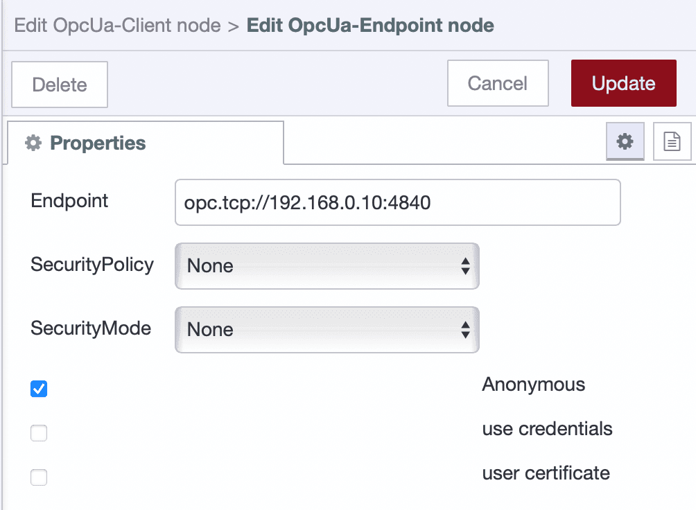

Modern industrial systems rely on efficient, secure, and interoperable communication between machines and software. OPC UA (Open Platform Communications Unified Architecture) has become a widely adopted standard for achieving exactly that. It provides a unified way to exchange data between PLCs, SCADA systems, and industrial applications.

<!--more-->

This guide walks you through how to connect to a PLC using OPC UA, browse available tags, and read and write tag values using FlowFuse’s Node-RED-based platform. Whether you're building proof-of-concept flows or production-ready integrations, this tutorial gives you the foundation needed to work confidently with OPC UA.

## Why OPC UA?

OPC UA is a vendor-neutral, cross-platform protocol built to handle real-time data exchange in industrial environments. It provides built-in security, supports structured data, and allows access to variables and control logic inside a PLC.

By using OPC UA in your Node-RED flows, you unlock the ability to integrate and automate industrial operations without needing specialized tools or complex middleware.

## What You’ll Need

Before diving into the flow-building process, make sure you have the following:

- A PLC with OPC UA server enabled and tags exposed for access.
- A Node-RED instance running on your edge device.
- Both PLC and Edge Device should be on the same network.

While Node-RED is widely used for industrial and IoT applications, running it in production environments requires additional tooling for DevOps, rapid deployment, scalability, high security, version control, remote access, team collaboration, and device management. **FlowFuse builds on top of Node-RED to provide exactly that, a platform designed for professional and scalable deployments.** If you do not have an account yet, you can [sign up here](/account/create) to get started.

## Installing OPC UA Support in FlowFuse

To work with OPC UA in Node-RED, you will first need to install the required nodes.

### Install the OPC UA Node Package

1. Open the **FlowFuse Node-RED editor**.
2. Click the menu in the top-right and choose **Manage palette**.
3. Navigate to the **Install** tab and search for `node-red-contrib-opcua`.
4. Click **Install**.

Once installed, you will find new nodes for OPC UA communication in your palette, including **Client**, **Item**, and **Browser** and other OPC UA nodes.

## Connecting to the PLC

To begin communicating with the PLC, create a client connection using the OPC UA Client node.

### Set Up the OPC UA Client

1. Drag an **OPC UA Client** node onto the canvas.
2. Double-click to configure it.
3. Click the **+** icon to create a new endpoint configuration.
4. Enter your PLC’s address, for example: `opc.tcp://192.168.0.10:4840`.
5. Set the security mode to **None** (you can add security later).
6. Click **Add**, then **Done**.

{data-zoomable}

With the connection now defined, you’re ready to explore what tags are available.

## Browsing Tags (Optional)

If you do not already know the Node IDs of the tags you want to access, use the OPC UA Browser node to explore the tag structure.

### Explore Available Tags

1. Drag an **Inject**, **OPC UA Browser**, and **Debug** node onto the canvas.
2. Wire them in the following order: Inject → Browser → Debug.
3. In the **Browser** node, set the topic to `ns=0;i=85` (the root *Objects* folder).
4. Configure the Inject node to send a timestamp.
5. Deploy the flow and click the Inject node.

Tag information will be printed to the debug sidebar. You can now identify the exact Node IDs to use in your reads or writes.

{data-zoomable}  
{data-zoomable}


[{"id":"c3a8303048e6588f","type":"OpcUa-Browser","z":"85ee0f7701aef489","endpoint":"c0f8c79fc00845c8","item":"","datatype":"","topic":"ns=0;i=85","items":[],"name":"","x":750,"y":180,"wires":[["3428199852f9fcdc"]]},{"id":"1549f797c58ba667","type":"inject","z":"85ee0f7701aef489","name":"","props":[{"p":"payload"},{"p":"topic","vt":"str"}],"repeat":"","crontab":"","once":false,"onceDelay":0.1,"topic":"","payload":"","payloadType":"date","x":500,"y":180,"wires":[["c3a8303048e6588f"]]},{"id":"3428199852f9fcdc","type":"debug","z":"85ee0f7701aef489","name":"debug 1","active":true,"tosidebar":true,"console":false,"tostatus":false,"complete":"false","statusVal":"","statusType":"auto","x":960,"y":180,"wires":[]},{"id":"c0f8c79fc00845c8","type":"OpcUa-Endpoint","endpoint":"","secpol":"None","secmode":"None","none":true,"login":false,"usercert":false,"usercertificate":"","userprivatekey":""}]


## Reading Tag Values

Once you know the Node IDs, you can begin reading values from the PLC.

### Reading a Single Tag

Here’s how to read a single value from the PLC in real time:

1. Drag an **Inject** node (used to trigger the read).
2. Add an **OPC UA Item** node and enter:
   - The **Node ID** (e.g., `ns=3;s="Temperature"`)
   - The **Data Type** (e.g., Double)
3. Connect the Inject node to the Item node.
4. Drag an **OPC UA Client** node and set its **Action** to `read`.
5. Select the correct endpoint configuration.
6. Connect the Item node to the Client node, and then to a **Debug** node.
7. Deploy the flow and trigger the Inject node.

You should see the tag value appear in the debug panel. This confirms that communication is working correctly.

You can also pass the Node ID dynamically using `msg.topic` from the Inject node if you prefer not to use an Item node.


[{"id":"e2a81e2ded6c1bf7","type":"OpcUa-Client","z":"add95e226507ec34","endpoint":"","action":"read","deadbandtype":"a","deadbandvalue":1,"time":10,"timeUnit":"s","certificate":"n","localfile":"","localkeyfile":"","securitymode":"None","securitypolicy":"None","useTransport":false,"maxChunkCount":1,"maxMessageSize":8192,"receiveBufferSize":8192,"sendBufferSize":8192,"setstatusandtime":false,"keepsessionalive":false,"name":"","x":600,"y":320,"wires":[["7f87d386f87b5c24"],[],[]]},{"id":"7f87d386f87b5c24","type":"debug","z":"add95e226507ec34","name":"debug 2","active":true,"tosidebar":true,"console":false,"tostatus":false,"complete":"false","statusVal":"","statusType":"auto","x":800,"y":320,"wires":[]},{"id":"1d081f02f709edfc","type":"OpcUa-Item","z":"add95e226507ec34","item":"ns=3;i=1001","datatype":"Boolean","value":"true","name":"","x":400,"y":320,"wires":[["e2a81e2ded6c1bf7"]]},{"id":"5cf4b77f2dfe9f0a","type":"inject","z":"add95e226507ec34","name":"Read tag","props":[{"p":"payload"},{"p":"topic","vt":"str"}],"repeat":"","crontab":"","once":false,"onceDelay":0.1,"topic":"","payload":"","payloadType":"date","x":200,"y":320,"wires":[["1d081f02f709edfc"]]}]


### Reading Multiple Tags

Reading multiple tags is just as simple and useful for real-time monitoring or logging.

1. Drag an **OPC UA Client** node and set its **Action** to `readmultiple`.
2. Select the endpoint configuration.
3. Add an **OPC UA Item** node for each tag you want to read.
4. Add an **Inject** node for each Item node to trigger it.
5. Connect each Inject node to its corresponding Item node.
6. Wire all Item nodes into the OPC UA Client node.
7. Add a **Debug** node to the output of the client.
8. Deploy the flow.
9. Click each Inject node once, the client node will store the tag definitions.
10. Send a message with `msg.topic = "readmultiple"` to trigger the actual read.
11. To clear stored items, send `msg.topic = "clearitems"`.

You now have a flexible setup for reading multiple values from your PLC on demand.


[{"id":"6f5e2b1cbce15025","type":"OpcUa-Client","z":"add95e226507ec34","endpoint":"","action":"readmultiple","deadbandtype":"a","deadbandvalue":1,"time":10,"timeUnit":"s","certificate":"n","localfile":"","localkeyfile":"","useTransport":false,"maxChunkCount":"","maxMessageSize":"","receiveBufferSize":"","sendBufferSize":"","setstatusandtime":false,"keepsessionalive":false,"name":"","x":571,"y":97.80000305175781,"wires":[["82daaf6a7bcc8368"],[],[]]},{"id":"4daa958d34c648c5","type":"OpcUa-Item","z":"add95e226507ec34","item":"ns=5;s=Counter1","datatype":"Int32","value":"","name":"","x":316,"y":50.19999694824219,"wires":[["6f5e2b1cbce15025"]]},{"id":"baa2733ca1fcb69d","type":"inject","z":"add95e226507ec34","name":"Add item","repeat":"","crontab":"","once":false,"onceDelay":0.1,"topic":"","payload":"","payloadType":"str","x":127,"y":49,"wires":[["4daa958d34c648c5"]]},{"id":"82daaf6a7bcc8368","type":"debug","z":"add95e226507ec34","name":"","active":true,"tosidebar":true,"console":false,"tostatus":false,"complete":"false","x":783.9999847412109,"y":100.39999389648438,"wires":[]},{"id":"dfd96a4dfe6330af","type":"OpcUa-Item","z":"add95e226507ec34","item":"ns=5;s=Random1","datatype":"Double","value":"","name":"","x":320.20001220703125,"y":116.19999694824219,"wires":[["6f5e2b1cbce15025"]]},{"id":"b8d5e40a98b1fb9f","type":"inject","z":"add95e226507ec34","name":"Add item","repeat":"","crontab":"","once":false,"onceDelay":0.1,"topic":"","payload":"","payloadType":"str","x":131.20001220703125,"y":115,"wires":[["dfd96a4dfe6330af"]]},{"id":"3f63c46f499c3bca","type":"inject","z":"add95e226507ec34","name":"w multiple items","props":[{"p":"payload"},{"p":"topic","vt":"str"}],"repeat":"","crontab":"","once":false,"onceDelay":0.1,"topic":"readmultiple","payload":"","payloadType":"str","x":326.99998474121094,"y":183,"wires":[["6f5e2b1cbce15025"]]},{"id":"75c7927996cf44c2","type":"inject","z":"add95e226507ec34","name":"Clear nodeId array","repeat":"","crontab":"","once":false,"onceDelay":0.1,"topic":"clearitems","payload":"","payloadType":"str","x":339.20001220703125,"y":229.1999969482422,"wires":[["6f5e2b1cbce15025"]]}]


## Writing Values to the PLC

In addition to reading values, OPC UA allows you to write control signals or parameters directly to the PLC.

### Writing a Single Tag

To write a single value:

1. Drag an **Inject** node (used to trigger the write).
2. Add an **OPC UA Item** node and define:
   - The **Node ID**
   - The **Data Type**
   - The **Value** to write
3. Connect the Inject node to the Item node.
4. Add an **OPC UA Client** node and set its **Action** to `write`.
5. Select the endpoint configuration.
6. Connect the Item node to the Client node, and then to a **Debug** node.
7. Deploy the flow and trigger the Inject node.

The client node will confirm the operation with a status like **"values written"**.


[{"id":"6f5e2b1cbce15025","type":"OpcUa-Client","z":"add95e226507ec34","endpoint":"","action":"write","deadbandtype":"a","deadbandvalue":1,"time":10,"timeUnit":"s","certificate":"n","localfile":"","localkeyfile":"","useTransport":false,"maxChunkCount":"","maxMessageSize":"","receiveBufferSize":"","sendBufferSize":"","setstatusandtime":false,"keepsessionalive":false,"name":"","x":571,"y":97.80000305175781,"wires":[["82daaf6a7bcc8368"],[],[]]},{"id":"4daa958d34c648c5","type":"OpcUa-Item","z":"add95e226507ec34","item":"ns=5;s=Counter1","datatype":"Int32","value":"20","name":"","x":320,"y":100,"wires":[["6f5e2b1cbce15025"]]},{"id":"baa2733ca1fcb69d","type":"inject","z":"add95e226507ec34","name":"Write","props":[{"p":"payload"},{"p":"topic","vt":"str"}],"repeat":"","crontab":"","once":false,"onceDelay":0.1,"topic":"","payload":"","payloadType":"str","x":110,"y":100,"wires":[["4daa958d34c648c5"]]},{"id":"82daaf6a7bcc8368","type":"debug","z":"add95e226507ec34","name":"","active":true,"tosidebar":true,"console":false,"tostatus":false,"complete":"false","x":783.9999847412109,"y":100.39999389648438,"wires":[]}]


### Writing Multiple Tags

For writing multiple values at once, follow this pattern:

1. Add an **OPC UA Client** node and set its **Action** to `writemultiple`.
2. Select the endpoint configuration.
3. Add multiple **OPC UA Item** nodes, each with Node ID, Data Type, and Value.
4. Add an **Inject** node for each Item node.
5. Connect Inject → Item for each, and all Items → Client.
6. Add a **Debug** node to the client output.
7. Deploy and click all Inject nodes to load the values.
8. Send a message with `msg.topic = "writemultiple"` to execute the write.
9. To reset the stored items, send `msg.topic = "clearitems"`.

This setup gives you precise control over multiple values with a single command.


[{"id":"ed421a9.d6319e8","type":"OpcUa-Client","z":"d85dd4e7.e244b","endpoint":"","action":"writemultiple","deadbandtype":"a","deadbandvalue":1,"time":10,"timeUnit":"s","certificate":"n","localfile":"","localkeyfile":"","useTransport":false,"maxChunkCount":"","maxMessageSize":"","receiveBufferSize":"","sendBufferSize":"","setstatusandtime":false,"keepsessionalive":false,"name":"","x":580,"y":120,"wires":[["f993fd12.db5e98"],[],[]]},{"id":"96bd763.14a9308","type":"OpcUa-Item","z":"d85dd4e7.e244b","item":"ns=3;i=1007","datatype":"Double","value":"1.0","name":"","x":316,"y":50.19999694824219,"wires":[["ed421a9.d6319e8"]]},{"id":"d8a68c7a.a73008","type":"inject","z":"d85dd4e7.e244b","name":"Add item","repeat":"","crontab":"","once":false,"onceDelay":0.1,"topic":"","payload":"","payloadType":"str","x":127,"y":49,"wires":[["96bd763.14a9308"]]},{"id":"f993fd12.db5e98","type":"debug","z":"d85dd4e7.e244b","name":"","active":true,"tosidebar":true,"console":false,"tostatus":false,"complete":"true","targetType":"full","statusVal":"","statusType":"auto","x":763.9999847412109,"y":100.39999389648438,"wires":[]},{"id":"8ae51c8c.20bd3","type":"OpcUa-Item","z":"d85dd4e7.e244b","item":"ns=3;i=1008","datatype":"Int32","value":"50","name":"","x":320.20001220703125,"y":116.19999694824219,"wires":[["ed421a9.d6319e8"]]},{"id":"1335adce.7f46ba","type":"inject","z":"d85dd4e7.e244b","name":"Add item","repeat":"","crontab":"","once":false,"onceDelay":0.1,"topic":"","payload":"","payloadType":"str","x":131.20001220703125,"y":115,"wires":[["8ae51c8c.20bd3"]]},{"id":"2c050a3d.91f496","type":"inject","z":"d85dd4e7.e244b","name":"Write multiple items","props":[{"p":"payload"},{"p":"topic","vt":"str"}],"repeat":"","crontab":"","once":false,"onceDelay":0.1,"topic":"writemultiple","payload":"","payloadType":"str","x":336.99998474121094,"y":183,"wires":[["ed421a9.d6319e8"]]},{"id":"690e4f9f.faeca","type":"inject","z":"d85dd4e7.e244b","name":"Clear nodeId array","props":[{"p":"payload"},{"p":"topic","vt":"str"}],"repeat":"","crontab":"","once":false,"onceDelay":0.1,"topic":"clearitems","payload":"","payloadType":"str","x":339.20001220703125,"y":229.1999969482422,"wires":[["ed421a9.d6319e8"]]}]


## What’s Next

Now that you have learned how to connect to an OPC UA-enabled PLC, browse available tags, and securely read and write tag values, you have a solid foundation for building industrial automation solutions with FlowFuse.

In this guide, we used **Inject** nodes to manually trigger read and write operations for demonstration purposes. But that is just the beginning.

With **FlowFuse Dashboards**, you can turn these test flows into full-fledged operator interfaces. Visualize real-time tag values using charts, gauges, and indicators. Set up alerts when values cross critical thresholds. Add buttons and input fields to control equipment directly from the dashboard. This transforms your OPC UA-connected flows into interactive, user-friendly control panels.

FlowFuse also integrates easily with cloud platforms, databases, and third-party services, making it simple to build complete, end-to-end industrial applications.

While this guide focused on the basics of OPC UA, including connecting, reading, and writing, it is worth noting that OPC UA supports far more powerful features. These include user authentication, encryption, access control, historical data access, method execution, and real-time event subscriptions. These capabilities are essential for secure, scalable industrial systems.

We will explore these advanced OPC UA features in upcoming articles to help you unlock the full potential of industrial connectivity.

When you are ready to scale your solution, **FlowFuse** provides all the tools you need to manage your automation platform in production:

- **Remote device management** to deploy and monitor flows across your device fleet  
- **Version control and audit logs** to track every change  
- **Secure remote access** to edge devices via encrypted tunnels  
- **Role-based collaboration** to enable teamwork on industrial projects  
- **Environment variables, flow backups, and health monitoring** to maintain stability and uptime

Whether you are digitizing one machine or rolling out to hundreds of devices, FlowFuse makes it possible to do it with speed, confidence, and control. Companies across manufacturing, energy, and industrial automation are already building powerful real-time systems with FlowFuse, and we would love to show you how.

**Let’s talk about your use case and how FlowFuse can help you accelerate industrial transformation.**  
[Book a demo with our team](/book-demo/) and see it in action.