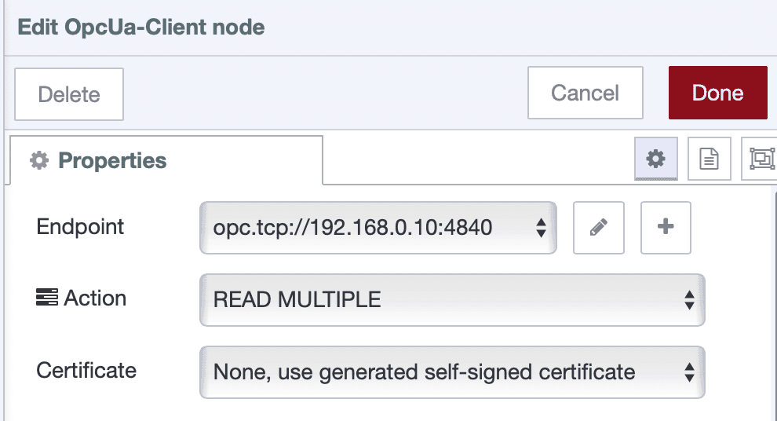

Modern industrial systems rely on efficient, secure, and interoperable communication between machines and software. OPC UA (Open Platform Communications Unified Architecture) has become a widely adopted standard for achieving exactly that. It provides a unified way to exchange data between PLCs, SCADA systems, and industrial applications.

<!--more-->

This guide walks you through connecting to industrial equipment via OPC UA servers, browsing available tags, and reading and writing data using FlowFuse's Node-RED-based platform.

## Why OPC UA?

OPC UA has become the backbone of modern industrial connectivity. Unlike proprietary protocols that lock you into specific vendors, OPC UA is an open standard that works across different manufacturers and platforms. A single OPC UA server can connect to equipment from multiple vendors—your Siemens PLCs, Allen-Bradley controllers, and Modbus devices all become accessible through one standardized interface. Beyond just reading values, OPC UA provides rich context including engineering units, data quality, timestamps, and relationships between data points.

With built-in security featuring encryption and certificate-based authentication, it's trusted by thousands of manufacturing facilities for mission-critical operations. By integrating OPC UA with Node-RED, you get industrial-grade connectivity combined with visual, low-code automation—no more wrestling with proprietary software or maintaining complex middleware.

## What You’ll Need

Before diving into the flow-building process, make sure you have the following:

- An OPC UA server (like Kepware, MatrikonOPC, or built into your PLC)
- A FlowFuse Node-RED instance running on your edge device.
- Both PLC and Edge Device should be on the same network.

For production OPC UA deployments, we recommend using FlowFuse. When connecting to industrial systems, you need more than just Node-RED—you need team collaboration so multiple engineers can work on flows safely, audit logs for compliance tracking, high availability to prevent downtime, and remote device management for edge deployments. 

FlowFuse provides these enterprise features plus automatic backups, one-click rollbacks, environment variables for different sites, and DevOps pipelines for testing changes before they reach production.

[Get started →](https://app.flowfuse.com/account/create)

## Installing OPC UA Support in FlowFuse

To work with OPC UA in Node-RED, you will first need to install the required nodes.

### Install the OPC UA Node Package

1. Open the **FlowFuse Node-RED editor**.
2. Click the menu in the top-right and choose **Manage palette**.
3. Navigate to the **Install** tab and search for `node-red-contrib-opcua`.
4. Click **Install**.

Once installed, you will find new nodes for OPC UA communication in your palette, including **Client**, **Item**, and **Browser** and other OPC UA nodes.

## Connecting to Your OPC UA Server

To begin accessing industrial data, create a client connection using the OPC UA Client node.

### Set Up the OPC UA Client

1. Drag an **OPC UA Client** node onto the canvas.
2. Double-click to configure it.
3. Click the **+** icon to create a new endpoint configuration.
4. Enter your OPC UA server address, for example: `opc.tcp://192.168.0.10:4840`
5. Set the security mode to **None** (you can add security later).

> **Security Note:** This tutorial uses **"None"** for the security setting to keep things simple.
> In production environments, always use appropriate security—typically **"Sign & Encrypt"** with certificates.

6. Click **Add**, then **Done**.

{data-zoomable}
_OPC UA endpoint configuration_

With the connection now defined, you’re ready to explore what tags are available.

## Browsing Tags (Optional)

If you do not already know the Node IDs of the tags you want to access, use the OPC UA Browser node to explore the tag structure.

### Explore Available Tags

1. Drag an **Inject**, **OPC UA Browser**, and **Debug** node onto the canvas.
2. Connect the output of the Inject node to the input of the **Browser** node, then connect the Browser's output to the Debug node.
3. In the **Browser** node, set the topic to `ns=0;i=85` (the root *Objects* folder).
4. Configure the Inject node to send a timestamp.
5. Deploy the flow and click the Inject node.

Tag information will be printed to the debug sidebar. You can now identify the exact Node IDs to use in your reads or writes.

{data-zoomable} 
_OPC UA Browser node_


[{"id":"c3a8303048e6588f","type":"OpcUa-Browser","z":"f66e9c91c269e7fb","endpoint":"c0f8c79fc00845c8","item":"","datatype":"","topic":"ns=0;i=85","items":[],"name":"","x":510,"y":300,"wires":[["3428199852f9fcdc"]]},{"id":"1549f797c58ba667","type":"inject","z":"f66e9c91c269e7fb","name":"","props":[{"p":"payload"},{"p":"topic","vt":"str"}],"repeat":"","crontab":"","once":false,"onceDelay":0.1,"topic":"","payload":"","payloadType":"date","x":280,"y":300,"wires":[["c3a8303048e6588f"]]},{"id":"3428199852f9fcdc","type":"debug","z":"f66e9c91c269e7fb","name":"debug 1","active":true,"tosidebar":true,"console":false,"tostatus":false,"complete":"false","statusVal":"","statusType":"auto","x":740,"y":300,"wires":[]},{"id":"c0f8c79fc00845c8","type":"OpcUa-Endpoint","endpoint":"","secpol":"None","secmode":"None","none":true,"login":false,"usercert":false,"usercertificate":"","userprivatekey":""}]


## Reading Tag Values

Once you know the Node IDs, you can start reading data from your industrial equipment through the OPC UA server.

### Reading a Single Tag

Here’s how to read a single value in real time:

1. Drag an **Inject** node onto the canvas (this will trigger the read operation).
2. Add an **OPC UA Item** node and configure:
   - **Node ID**: Enter the tag’s identifier (e.g., `ns=3;i=1003`)
   - **Data Type**: Select the appropriate type (e.g., `Boolean`)

   {data-zoomable}

3. Connect the output of the **Inject** node to the input of the **Item** node.
4. Add an **OPC UA Client** node and set its **Action** to `read`.

   {data-zoomable}

5. Select the endpoint configuration you created earlier.
6. Connect the output of the **Item** node to the input of the **Client** node, then connect the **Client** node's top output to a **Debug** node.

> The **OPC UA Client** node has three outputs: the top carries the data payload, the middle indicates connection status, and the bottom provides raw responses for debugging.

7. Deploy the flow and click the **Inject** button to trigger the read.

You should see the tag value appear in the debug panel. This confirms that communication is working correctly.

You can also pass the Node ID dynamically using `msg.topic` from the Inject node if you prefer not to use an Item node.


[{"id":"e2a81e2ded6c1bf7","type":"OpcUa-Client","z":"f66e9c91c269e7fb","endpoint":"a4df18253e5a79a0","action":"read","deadbandtype":"a","deadbandvalue":1,"time":10,"timeUnit":"s","certificate":"n","localfile":"","localkeyfile":"","securitymode":"None","securitypolicy":"None","useTransport":false,"maxChunkCount":1,"maxMessageSize":8192,"receiveBufferSize":8192,"sendBufferSize":8192,"setstatusandtime":false,"keepsessionalive":false,"name":"","x":580,"y":300,"wires":[["7f87d386f87b5c24"],["105fcf81921c122b"],["fe0f4fb1d4d5894e"]]},{"id":"7f87d386f87b5c24","type":"debug","z":"f66e9c91c269e7fb","name":"Tag Value","active":true,"tosidebar":true,"console":false,"tostatus":false,"complete":"payload","targetType":"msg","statusVal":"","statusType":"auto","x":740,"y":260,"wires":[]},{"id":"1d081f02f709edfc","type":"OpcUa-Item","z":"f66e9c91c269e7fb","item":"ns=3;i=1001","datatype":"Boolean","value":"","name":"OPC UA Item Node","x":390,"y":300,"wires":[["e2a81e2ded6c1bf7"]]},{"id":"5cf4b77f2dfe9f0a","type":"inject","z":"f66e9c91c269e7fb","name":"Read tag","props":[{"p":"payload"},{"p":"topic","vt":"str"}],"repeat":"","crontab":"","once":false,"onceDelay":0.1,"topic":"","payload":"","payloadType":"date","x":220,"y":300,"wires":[["1d081f02f709edfc"]]},{"id":"105fcf81921c122b","type":"debug","z":"f66e9c91c269e7fb","name":"Errors","active":true,"tosidebar":true,"console":false,"tostatus":false,"complete":"payload","targetType":"msg","statusVal":"","statusType":"auto","x":730,"y":300,"wires":[]},{"id":"fe0f4fb1d4d5894e","type":"debug","z":"f66e9c91c269e7fb","name":"Raw Respons","active":true,"tosidebar":true,"console":false,"tostatus":false,"complete":"payload","targetType":"msg","statusVal":"","statusType":"auto","x":760,"y":340,"wires":[]},{"id":"a4df18253e5a79a0","type":"OpcUa-Endpoint","endpoint":"opc.tcp://192.168.0.10:4840","secpol":"None","secmode":"None","none":true,"login":false,"usercert":false,"usercertificate":"","userprivatekey":""}]


### Reading Multiple Tags

Batch reading improves performance when you need multiple data points from your equipment

1. Drag an **OPC UA Client** node and set its **Action** to "READ MULTIPLE".

{data-zoomable}  
_Screenshot showing OPC UA Client node with "READ MULTIPLE" action selected_

2. Select the endpoint configuration.
3. Add an **OPC UA Item** node for each tag you want to read.
4. Add an **Inject** node for each Item node to trigger it.
5. Connect each Inject node to its corresponding Item node.
6. Wire all Item nodes into the OPC UA Client node.
7. Add a **Debug** node to the top output of the **Client** node.
8. Deploy the flow.
9. Click each Inject node once, the client node will store the tag definitions.
10.  Send a message with `msg.topic = "readmultiple"` to trigger the actual read.
11. To clear stored items, send `msg.topic = "clearitems"`.

You now have a flexible setup for reading multiple values from your PLC on demand.


[{"id":"6f5e2b1cbce15025","type":"OpcUa-Client","z":"f66e9c91c269e7fb","endpoint":"","action":"readmultiple","deadbandtype":"a","deadbandvalue":1,"time":10,"timeUnit":"s","certificate":"n","localfile":"","localkeyfile":"","useTransport":false,"maxChunkCount":"","maxMessageSize":"","receiveBufferSize":"","sendBufferSize":"","setstatusandtime":false,"keepsessionalive":false,"name":"","x":600,"y":520,"wires":[["28b575f06bbbe7a7"],["139d346aab204f2f"],["3497d5566fb78f5f"]]},{"id":"4daa958d34c648c5","type":"OpcUa-Item","z":"f66e9c91c269e7fb","item":"ns=5;s=Counter1","datatype":"Int32","value":"","name":"","x":400,"y":500,"wires":[["6f5e2b1cbce15025"]]},{"id":"baa2733ca1fcb69d","type":"inject","z":"f66e9c91c269e7fb","name":"Add item","repeat":"","crontab":"","once":false,"onceDelay":0.1,"topic":"","payload":"","payloadType":"str","x":220,"y":500,"wires":[["4daa958d34c648c5"]]},{"id":"dfd96a4dfe6330af","type":"OpcUa-Item","z":"f66e9c91c269e7fb","item":"ns=5;s=Random1","datatype":"Double","value":"","name":"","x":400,"y":540,"wires":[["6f5e2b1cbce15025"]]},{"id":"b8d5e40a98b1fb9f","type":"inject","z":"f66e9c91c269e7fb","name":"Add item","repeat":"","crontab":"","once":false,"onceDelay":0.1,"topic":"","payload":"","payloadType":"str","x":220,"y":540,"wires":[["dfd96a4dfe6330af"]]},{"id":"3f63c46f499c3bca","type":"inject","z":"f66e9c91c269e7fb","name":"Write multiple items","props":[{"p":"payload"},{"p":"topic","vt":"str"}],"repeat":"","crontab":"","once":false,"onceDelay":0.1,"topic":"readmultiple","payload":"","payloadType":"str","x":390,"y":460,"wires":[["6f5e2b1cbce15025"]]},{"id":"75c7927996cf44c2","type":"inject","z":"f66e9c91c269e7fb","name":"Clear nodeId array","repeat":"","crontab":"","once":false,"onceDelay":0.1,"topic":"clearitems","payload":"","payloadType":"str","x":390,"y":580,"wires":[["6f5e2b1cbce15025"]]},{"id":"28b575f06bbbe7a7","type":"debug","z":"f66e9c91c269e7fb","name":"Tag Value","active":true,"tosidebar":true,"console":false,"tostatus":false,"complete":"payload","targetType":"msg","statusVal":"","statusType":"auto","x":780,"y":480,"wires":[]},{"id":"139d346aab204f2f","type":"debug","z":"f66e9c91c269e7fb","name":"Errors","active":true,"tosidebar":true,"console":false,"tostatus":false,"complete":"payload","targetType":"msg","statusVal":"","statusType":"auto","x":770,"y":520,"wires":[]},{"id":"3497d5566fb78f5f","type":"debug","z":"f66e9c91c269e7fb","name":"Raw Respons","active":true,"tosidebar":true,"console":false,"tostatus":false,"complete":"payload","targetType":"msg","statusVal":"","statusType":"auto","x":800,"y":560,"wires":[]}]


## Writing Values

In addition to reading data, OPC UA also allows you to write control signals or parameters to your equipment.

### Writing a Single Tag

To write a single value:

1. Drag an **Inject** node onto the canvas (used to trigger the write operation).
2. Add an **OPC UA Item** node and configure:
   - **Node ID**: Enter the target identifier.
   - **Data Type**: Choose the appropriate type (e.g., `Boolean`, `Double`).
   - **Value**: Enter the value to write.

   {data-zoomable}  
   _OPC UA Item node configured for a write operation_

3. Connect the **Inject** node to the **Item** node.
4. Add an **OPC UA Client** node and set its **Action** to `WRITE`.

   {data-zoomable}  
   _OPC UA Client node with "WRITE" action selected_

5. Select the endpoint configuration you created earlier.
6. Connect the **Item** node to the **Client** node, then connect the **Client** node's top output to a **Debug** node.
7. Deploy the flow and click the **Inject** button to trigger the write.

The OPC UA Client node will confirm the operation with a status like **"values written"**.


[{"id":"c922a70d48ecba6f","type":"OpcUa-Client","z":"f66e9c91c269e7fb","endpoint":"","action":"write","deadbandtype":"a","deadbandvalue":1,"time":10,"timeUnit":"s","certificate":"n","localfile":"","localkeyfile":"","useTransport":false,"maxChunkCount":"","maxMessageSize":"","receiveBufferSize":"","sendBufferSize":"","setstatusandtime":false,"keepsessionalive":false,"name":"","x":620,"y":1140,"wires":[["7eb010a4671ac181"],["392bb1fd60c29baf"],["e9d279677dbc87e8"]]},{"id":"5ff1e3c2d5977a34","type":"OpcUa-Item","z":"f66e9c91c269e7fb","item":"ns=5;s=Counter1","datatype":"Int32","value":"20","name":"","x":440,"y":1140,"wires":[["c922a70d48ecba6f"]]},{"id":"8cdd141dbdb350c7","type":"inject","z":"f66e9c91c269e7fb","name":"Write","props":[{"p":"payload"},{"p":"topic","vt":"str"}],"repeat":"","crontab":"","once":false,"onceDelay":0.1,"topic":"","payload":"","payloadType":"str","x":290,"y":1140,"wires":[["5ff1e3c2d5977a34"]]},{"id":"7eb010a4671ac181","type":"debug","z":"f66e9c91c269e7fb","name":"Tag Value","active":true,"tosidebar":true,"console":false,"tostatus":false,"complete":"payload","targetType":"msg","statusVal":"","statusType":"auto","x":780,"y":1100,"wires":[]},{"id":"392bb1fd60c29baf","type":"debug","z":"f66e9c91c269e7fb","name":"Errors","active":true,"tosidebar":true,"console":false,"tostatus":false,"complete":"payload","targetType":"msg","statusVal":"","statusType":"auto","x":770,"y":1140,"wires":[]},{"id":"e9d279677dbc87e8","type":"debug","z":"f66e9c91c269e7fb","name":"Raw Respons","active":true,"tosidebar":true,"console":false,"tostatus":false,"complete":"payload","targetType":"msg","statusVal":"","statusType":"auto","x":800,"y":1180,"wires":[]}]


### Writing Multiple Tags

To write multiple values at once, follow this pattern:

1. Add an **OPC UA Client** node and set its **Action** to `WRITE MULTIPLE`.

   {data-zoomable}  
   _OPC UA Client node configured for writing multiple values_

2. Select the appropriate endpoint configuration.
3. Add multiple **OPC UA Item** nodes, each configured with a **Node ID**, **Data Type**, and **Value** to be written.
4. Add an **Inject** node for each **Item** node.
5. Connect each **Inject** node to its corresponding **Item** node, then connect all **Item** nodes to the **Client** node.
6. Add a **Debug** node to the top output of the **Client** node.
7. Deploy the flow and trigger all **Inject** nodes to load the values.
8. To execute the write operation, send a message with `msg.topic = "writemultiple"`.
9. To clear the stored items, send a message with `msg.topic = "clearitems"`.

This setup allows you to prepare multiple tag values and write them all at once, giving you precise control through a single command.


[{"id":"ed421a9.d6319e8","type":"OpcUa-Client","z":"f66e9c91c269e7fb","endpoint":"","action":"writemultiple","deadbandtype":"a","deadbandvalue":1,"time":10,"timeUnit":"s","certificate":"n","localfile":"","localkeyfile":"","useTransport":false,"maxChunkCount":"","maxMessageSize":"","receiveBufferSize":"","sendBufferSize":"","setstatusandtime":false,"keepsessionalive":false,"name":"","x":620,"y":1620,"wires":[["b0788fb9285c48ea"],["bde690208cbf2c4c"],["0883826b4a0ca030"]]},{"id":"96bd763.14a9308","type":"OpcUa-Item","z":"f66e9c91c269e7fb","item":"ns=3;i=1007","datatype":"Double","value":"1.0","name":"","x":420,"y":1600,"wires":[["ed421a9.d6319e8"]]},{"id":"d8a68c7a.a73008","type":"inject","z":"f66e9c91c269e7fb","name":"Add item","repeat":"","crontab":"","once":false,"onceDelay":0.1,"topic":"","payload":"","payloadType":"str","x":240,"y":1600,"wires":[["96bd763.14a9308"]]},{"id":"8ae51c8c.20bd3","type":"OpcUa-Item","z":"f66e9c91c269e7fb","item":"ns=3;i=1008","datatype":"Int32","value":"50","name":"","x":420,"y":1640,"wires":[["ed421a9.d6319e8"]]},{"id":"1335adce.7f46ba","type":"inject","z":"f66e9c91c269e7fb","name":"Add item","repeat":"","crontab":"","once":false,"onceDelay":0.1,"topic":"","payload":"","payloadType":"str","x":240,"y":1640,"wires":[["8ae51c8c.20bd3"]]},{"id":"2c050a3d.91f496","type":"inject","z":"f66e9c91c269e7fb","name":"Write multiple items","props":[{"p":"payload"},{"p":"topic","vt":"str"}],"repeat":"","crontab":"","once":false,"onceDelay":0.1,"topic":"writemultiple","payload":"","payloadType":"str","x":410,"y":1560,"wires":[["ed421a9.d6319e8"]]},{"id":"690e4f9f.faeca","type":"inject","z":"f66e9c91c269e7fb","name":"Clear nodeId array","props":[{"p":"payload"},{"p":"topic","vt":"str"}],"repeat":"","crontab":"","once":false,"onceDelay":0.1,"topic":"clearitems","payload":"","payloadType":"str","x":410,"y":1680,"wires":[["ed421a9.d6319e8"]]},{"id":"b0788fb9285c48ea","type":"debug","z":"f66e9c91c269e7fb","name":"Tag Value","active":true,"tosidebar":true,"console":false,"tostatus":false,"complete":"payload","targetType":"msg","statusVal":"","statusType":"auto","x":800,"y":1580,"wires":[]},{"id":"bde690208cbf2c4c","type":"debug","z":"f66e9c91c269e7fb","name":"Errors","active":true,"tosidebar":true,"console":false,"tostatus":false,"complete":"payload","targetType":"msg","statusVal":"","statusType":"auto","x":790,"y":1620,"wires":[]},{"id":"0883826b4a0ca030","type":"debug","z":"f66e9c91c269e7fb","name":"Raw Respons","active":true,"tosidebar":true,"console":false,"tostatus":false,"complete":"payload","targetType":"msg","statusVal":"","statusType":"auto","x":820,"y":1660,"wires":[]}]


## What’s Next

You’ve now mastered the fundamentals of OPC UA integration—connecting to servers, browsing tags, and reading or writing data. These core building blocks lay the foundation for powerful industrial automation.

In real deployments, you will want more than Inject nodes and debug panels. With **FlowFuse Dashboard 2.0**, you can build full operator interfaces—live gauges, control buttons, trend charts—fully connected to your OPC UA data.

This guide covered the basics, but OPC UA offers far more. In the next article, we will explore:

* Subscriptions for real-time monitoring without polling
* Events and alarms directly from equipment
* Historical data queries for trend analysis
* Method calls to execute functions on your devices

When it is time to move beyond prototypes, **FlowFuse** delivers what industrial systems truly need—remote device management, instant rollbacks with full version control, built-in team collaboration, and high availability you can trust.

You are not starting over. You are scaling up—on the Node-RED foundation your team already knows, with the enterprise-grade power that keeps production running.

[Start with FlowFuse](https://app.flowfuse.com/account/create)
