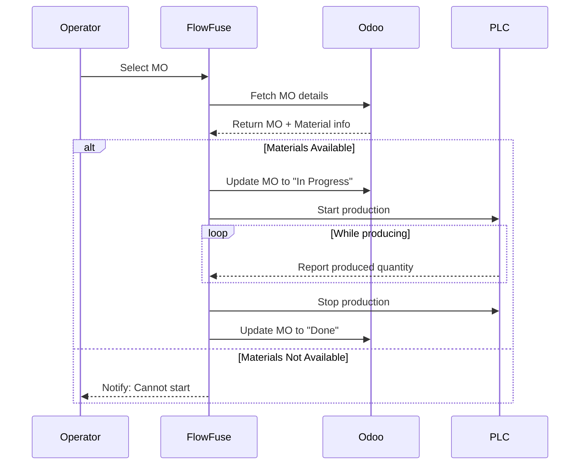

A few days ago, I had a conversation with a solution architect about how the lack of integration between the shop floor and business systems often leads to missed opportunities and financial losses. He also mentioned that while many manufacturers want to bridge this gap, they often hesitate — mostly due to concerns about complexity of integration or fear of disrupting existing operations.

<!--more-->

But there is no need to be afraid. In this blog, I will walk you through a simple demo that shows how easy it can be to connect production systems with your ERP. With just a small integration, you can improve visibility, avoid manual errors, and prevent unnecessary losses.

To demonstrate this, I built a smart Manufacturing Order (MO) execution panel using FlowFuse, connected to ERP.

Let’s take a closer look.

## Demo: Smart Manufacturing Order Execution Panel in Action

<lite-youtube videoid="M_CIoHiSW6s" params="rel=0" style="margin-top: 20px; margin-bottom: 20px; width: 100%; height: 480px;" title="YouTube video player"></lite-youtube>

In this demonstration, an operator starts by selecting a Manufacturing Order (MO) from a list pulled directly from Odoo ERP. The system immediately checks if enough raw materials are available for that specific order.

If the materials are ready, production begins, and the MO status in Odoo is automatically updated to In Progress. The system then tracks the production count in real time. However, if materials are missing, production won’t start, and the operator is notified instantly. Once the produced quantity matches the target, the system automatically stops the line and marks the MO as Done in Odoo, completing the cycle without manual intervention.

## How It Works: Behind the Scenes

To build this system, I used **FlowFuse** to create a Node-RED flow that connects to **Odoo ERP** and controls a simulated production line.

### System Components

- **Odoo ERP**  
  Holds Manufacturing Orders, product details, and inventory data. This integration allows for a two-way conversation between the shop floor and the business's core planning system. For a detailed guide on how to read from and write to Odoo, you can read our article, [Connect Your Shop Floor to Your ERP – Odoo Edition](/blog/2025/06/connect-shop-floor-to-odoo-erp-flowfuse/)

- **FlowFuse**  
  Executes logic such as fetching manufacturing orders, checking material availability, updating statuses, controlling production, and building the operator interface.

- **Simulated Production Line (Factory I/O)**  
  Acts as the shop floor. Starts and stops production based on FlowFuse commands.

- **PLC**  
  Receives commands from FlowFuse and controls the actual machinery or simulated production environment.

- **S7 Protocol (S7Comm)**  
  This is the protocol used to communicate with Siemens S7 series PLCs. We use Node-RED nodes within FlowFuse to send control commands (e.g., start/stop production) and read critical data (e.g., produced quantity, machine status) directly from the PLC’s memory blocks. To learn exactly how to set this up, check out our step-by-step tutorial, [Getting Started: Integrating Siemens S7 PLCs with Node-RED](/blog/2025/01/integrating-siemens-s7-plcs-with-node-red-guide/)

Below is the full Node-RED flow that powers this smart manufacturing execution panel.



[{"id":"FFF0000000000001","type":"tab","label":"Manufacturing Order Execution Panel","disabled":false,"info":""},{"id":"9aad63553d0d5812","type":"group","z":"FFF0000000000001","style":{"stroke":"#b2b3bd","stroke-opacity":"1","fill":"#f2f3fb","fill-opacity":"0.5","label":true,"label-position":"nw","color":"#32333b"},"nodes":["4e8b22877e33b496","a0e5e90344e88702","16744562f37152fd","f44680e87cdce3ac","b04986985da9af6d"],"x":14,"y":99,"w":1272,"h":82},{"id":"283e4560434b3d9d","type":"group","z":"FFF0000000000001","style":{"stroke":"#b2b3bd","stroke-opacity":"1","fill":"#f2f3fb","fill-opacity":"0.5","label":true,"label-position":"nw","color":"#32333b"},"nodes":["13462b8b0f1607f7","8a482fd274547e0f","3efb1c1f34d51979","41b87ca07226c044","dda4ef8740ffb258","226fe05ccb3626e4","51a994a919a9ef23","4556a1575a3c8cf0","e23884a220043451","9df108ae0c62ee39"],"x":14,"y":179,"w":1272,"h":162},{"id":"8df3544692ccd8d8","type":"group","z":"FFF0000000000001","style":{"stroke":"#b2b3bd","stroke-opacity":"1","fill":"#f2f3fb","fill-opacity":"0.5","label":true,"label-position":"nw","color":"#32333b"},"nodes":["0ce2a3c49003ca9f","b11dfaf019777940"],"x":14,"y":359,"w":572,"h":82},{"id":"0a5f467b0d3f15a9","type":"group","z":"FFF0000000000001","style":{"stroke":"#b2b3bd","stroke-opacity":"1","fill":"#f2f3fb","fill-opacity":"0.5","label":true,"label-position":"nw","color":"#32333b"},"nodes":["e079fb2baac0a769","e8069c4a2b3f5457","1f9227a4cad571bd","c81b1fb4e1b78f64","befaaf0dd824e0e9","8f4dbf296b38a3c3"],"x":14,"y":559,"w":912,"h":122},{"id":"b9d1401e33f657a5","type":"group","z":"FFF0000000000001","style":{"stroke":"#b2b3bd","stroke-opacity":"1","fill":"#f2f3fb","fill-opacity":"0.5","label":true,"label-position":"nw","color":"#32333b"},"nodes":["67598322bfa17031","2c3da53c9785237d"],"x":14,"y":459,"w":352,"h":82},{"id":"c85a3940e02e9d05","type":"ui-theme","name":"Default Theme","colors":{"surface":"#1a1c25","primary":"#0094ce","bgPage":"#000102","groupBg":"#1a1c25","groupOutline":"#000000"},"sizes":{"density":"default","pagePadding":"12px","groupGap":"12px","groupBorderRadius":"4px","widgetGap":"12px"}},{"id":"18818bdefd1f27ce","type":"odoo-xmlrpc-config","url":"${URL}","db":"${DB_NAME}","username":"${EMAIL}","password":"${PASSWORD}"},{"id":"e70720e10a4d3490","type":"ui-page","name":"Manufacturing Order Execution Panel\t","ui":"127331d7913b7654","path":"/page1","icon":"home","layout":"grid","theme":"c85a3940e02e9d05","breakpoints":[{"name":"Default","px":"0","cols":"3"},{"name":"Tablet","px":"576","cols":"6"},{"name":"Small Desktop","px":"768","cols":"9"},{"name":"Desktop","px":"1024","cols":"12"}],"order":1,"className":"","visible":true,"disabled":false},{"id":"127331d7913b7654","type":"ui-base","name":"My Dashboard","path":"/dashboard","appIcon":"","includeClientData":true,"acceptsClientConfig":["ui-notification","ui-control"],"showPathInSidebar":false,"headerContent":"page","navigationStyle":"default","titleBarStyle":"default","showReconnectNotification":true,"notificationDisplayTime":1,"showDisconnectNotification":true,"allowInstall":true},{"id":"9beea4acdde08f57","type":"ui-group","name":". ","page":"e70720e10a4d3490","width":"3","height":"2","order":1,"showTitle":true,"className":"","visible":"true","disabled":"false","groupType":"default"},{"id":"2aabe3e541e4ba61","type":"ui-group","name":"Running Order Summary","page":"e70720e10a4d3490","width":"9","height":1,"order":2,"showTitle":true,"className":"","visible":"true","disabled":"false","groupType":"default"},{"id":"9dc2b3b0074096ee","type":"ui-group","name":"Manufacturing Orders","page":"e70720e10a4d3490","width":"12","height":1,"order":3,"showTitle":true,"className":"","visible":"true","disabled":"false","groupType":"default"},{"id":"a75a1ee3b5119c06","type":"s7 endpoint","transport":"iso-on-tcp","address":"192.168.1.10","port":"102","rack":"0","slot":"1","localtsaphi":"01","localtsaplo":"00","remotetsaphi":"01","remotetsaplo":"00","connmode":"rack-slot","adapter":"","busaddr":2,"cycletime":1000,"timeout":2000,"name":"","vartable":[{"addr":"QD30","name":"Lid Counter"},{"addr":"Q1.3","name":"STOP"},{"addr":"DB4,X192.0","name":"START"}]},{"id":"13462b8b0f1607f7","type":"ui-button","z":"FFF0000000000001","g":"283e4560434b3d9d","group":"9beea4acdde08f57","name":"","label":"START","order":1,"width":"0","height":"0","emulateClick":false,"tooltip":"","color":"","bgcolor":"","className":"","icon":"","iconPosition":"left","payload":"","payloadType":"str","topic":"topic","topicType":"msg","buttonColor":"green","textColor":"white","iconColor":"","enableClick":true,"enablePointerdown":false,"pointerdownPayload":"","pointerdownPayloadType":"str","enablePointerup":false,"pointerupPayload":"","pointerupPayloadType":"str","x":90,"y":260,"wires":[["51a994a919a9ef23"]]},{"id":"4e8b22877e33b496","type":"inject","z":"FFF0000000000001","g":"9aad63553d0d5812","name":"","props":[{"p":"payload"}],"repeat":"10","crontab":"","once":false,"onceDelay":0.1,"topic":"","payload":"[]","payloadType":"json","x":110,"y":140,"wires":[["a0e5e90344e88702"]]},{"id":"a0e5e90344e88702","type":"odoo-xmlrpc-search-read","z":"FFF0000000000001","g":"9aad63553d0d5812","name":"","host":"18818bdefd1f27ce","model":"mrp.production","filter":"","offset":0,"limit":100,"x":350,"y":140,"wires":[["16744562f37152fd"]]},{"id":"16744562f37152fd","type":"function","z":"FFF0000000000001","g":"9aad63553d0d5812","name":"getActiveOrdersSummary","func":"const simplifiedOrders = msg.payload\n    .filter(order => order.state === \"confirmed\" || order.state === \"progress\")\n    .map(order => {\n        return {\n            id: order.id,\n            name: order.name,\n            product: order.product_id?.[1] || \"Unknown\",\n            quantity: order.product_qty,\n            state: order.state,\n            availability: order.components_availability || \"Unknown\"\n        };\n    });\n\nmsg.payload = simplifiedOrders;\nreturn msg;\n","outputs":1,"timeout":0,"noerr":0,"initialize":"","finalize":"","libs":[],"x":590,"y":140,"wires":[["f44680e87cdce3ac"]]},{"id":"f44680e87cdce3ac","type":"ui-table","z":"FFF0000000000001","g":"9aad63553d0d5812","group":"9dc2b3b0074096ee","name":"","label":"","order":1,"width":0,"height":0,"maxrows":0,"passthru":false,"autocols":false,"showSearch":false,"deselect":true,"selectionType":"click","columns":[{"title":"ID","key":"id","keyType":"key","type":"text","width":"","align":"start"},{"title":"Ref No ","key":"name","keyType":"key","type":"text","width":"","align":"start"},{"title":"Production Item","key":"product","keyType":"key","type":"text","width":"","align":"start"},{"title":"Target Quantity","key":"quantity","keyType":"key","type":"text","width":"","align":"start"},{"title":"Order Status","key":"state","keyType":"key","type":"text","width":"","align":"start"}],"mobileBreakpoint":"sm","mobileBreakpointType":"defaults","action":"replace","x":870,"y":140,"wires":[["b04986985da9af6d"]]},{"id":"8a482fd274547e0f","type":"odoo-xmlrpc-update","z":"FFF0000000000001","g":"283e4560434b3d9d","name":"","host":"18818bdefd1f27ce","model":"mrp.production","filter":"","offset":0,"limit":100,"x":1160,"y":260,"wires":[[]]},{"id":"3efb1c1f34d51979","type":"change","z":"FFF0000000000001","g":"283e4560434b3d9d","name":"","rules":[{"t":"set","p":"payload","pt":"msg","to":"[     [payload.id],     {\"state\": \"progress\"} ]","tot":"jsonata"}],"action":"","property":"","from":"","to":"","reg":false,"x":900,"y":260,"wires":[["8a482fd274547e0f"]]},{"id":"41b87ca07226c044","type":"switch","z":"FFF0000000000001","g":"283e4560434b3d9d","name":"Does the MO have a material shortage?","property":"payload.availability","propertyType":"msg","rules":[{"t":"eq","v":"Not Available","vt":"str"},{"t":"else"}],"checkall":"true","repair":false,"outputs":2,"x":640,"y":240,"wires":[["226fe05ccb3626e4"],["3efb1c1f34d51979","9df108ae0c62ee39"]]},{"id":"dda4ef8740ffb258","type":"ui-notification","z":"FFF0000000000001","g":"283e4560434b3d9d","ui":"127331d7913b7654","position":"center center","colorDefault":true,"color":"#000000","displayTime":"3","showCountdown":true,"outputs":1,"allowDismiss":true,"dismissText":"Close","allowConfirm":false,"confirmText":"Confirm","raw":false,"className":"","name":"","x":1150,"y":220,"wires":[[]]},{"id":"226fe05ccb3626e4","type":"change","z":"FFF0000000000001","g":"283e4560434b3d9d","name":"","rules":[{"t":"set","p":"payload","pt":"msg","to":"Production cannot begin for this order— required materials are not available.","tot":"str"},{"t":"set","p":"orderSelected","pt":"flow","to":"{}","tot":"json"}],"action":"","property":"","from":"","to":"","reg":false,"x":900,"y":220,"wires":[["dda4ef8740ffb258"]]},{"id":"b04986985da9af6d","type":"change","z":"FFF0000000000001","g":"9aad63553d0d5812","name":"","rules":[{"t":"set","p":"orderSelected","pt":"flow","to":"payload","tot":"msg"}],"action":"","property":"","from":"","to":"","reg":false,"x":1160,"y":140,"wires":[[]]},{"id":"51a994a919a9ef23","type":"change","z":"FFF0000000000001","g":"283e4560434b3d9d","name":"","rules":[{"t":"set","p":"payload","pt":"msg","to":"orderSelected","tot":"flow"}],"action":"","property":"","from":"","to":"","reg":false,"x":320,"y":260,"wires":[["41b87ca07226c044","4556a1575a3c8cf0"]]},{"id":"4556a1575a3c8cf0","type":"ui-template","z":"FFF0000000000001","g":"283e4560434b3d9d","group":"2aabe3e541e4ba61","page":"","ui":"","name":"Running Order Summary","order":1,"width":0,"height":0,"head":"","format":"<template>\n  
\n    
\n      
Reference
\n      
{{ data?.name || '--' }}
\n    
\n    
\n      
Product
\n      
{{ data?.product || '--' }}
\n    
\n    
\n      
Target
\n      
{{ data?.quantity ?? '--' }}
\n    
\n    
\n      
Produced
\n      
{{ data?.producedQuantity ?? '--' }}
\n    
\n  
\n</template>\n\n\n\n","storeOutMessages":true,"passthru":true,"resendOnRefresh":true,"templateScope":"local","className":"","x":590,"y":280,"wires":[[]]},{"id":"e23884a220043451","type":"s7 out","z":"FFF0000000000001","g":"283e4560434b3d9d","endpoint":"a75a1ee3b5119c06","variable":"Start","name":"","x":1110,"y":300,"wires":[]},{"id":"9df108ae0c62ee39","type":"change","z":"FFF0000000000001","g":"283e4560434b3d9d","name":"","rules":[{"t":"set","p":"payload","pt":"msg","to":"true","tot":"bool"}],"action":"","property":"","from":"","to":"","reg":false,"x":900,"y":300,"wires":[["e23884a220043451"]]},{"id":"0ce2a3c49003ca9f","type":"s7 in","z":"FFF0000000000001","g":"8df3544692ccd8d8","endpoint":"a75a1ee3b5119c06","mode":"single","variable":"Lid Counter","diff":true,"name":"","x":110,"y":400,"wires":[["b11dfaf019777940"]]},{"id":"b11dfaf019777940","type":"change","z":"FFF0000000000001","g":"8df3544692ccd8d8","name":"","rules":[{"t":"set","p":"orderSelected.producedQuantity","pt":"flow","to":"payload","tot":"msg"}],"action":"","property":"","from":"","to":"","reg":false,"x":400,"y":400,"wires":[[]]},{"id":"e079fb2baac0a769","type":"inject","z":"FFF0000000000001","g":"0a5f467b0d3f15a9","name":"","props":[{"p":"payload"}],"repeat":"1","crontab":"","once":false,"onceDelay":0.1,"topic":"","payload":"orderSelected","payloadType":"flow","x":150,"y":620,"wires":[["befaaf0dd824e0e9"]]},{"id":"91158f2206527fc0","type":"ui-template","z":"FFF0000000000001","group":"","page":"e70720e10a4d3490","ui":"","name":"CSS","order":0,"width":0,"height":0,"head":"","format":".v-card-title{\n    text-align:center;\n}\nth,td{\n    border: 1px solid white;\n}\n.nrdb-ui-led-bulb{\n    height:85px !important;\n    margin-left:auto;\n    margin-right:auto;\n}","storeOutMessages":true,"passthru":true,"resendOnRefresh":true,"templateScope":"page:style","className":"","x":90,"y":60,"wires":[[]]},{"id":"e8069c4a2b3f5457","type":"odoo-xmlrpc-update","z":"FFF0000000000001","g":"0a5f467b0d3f15a9","name":"","host":"18818bdefd1f27ce","model":"mrp.production","filter":"","offset":0,"limit":100,"x":800,"y":640,"wires":[[]]},{"id":"1f9227a4cad571bd","type":"change","z":"FFF0000000000001","g":"0a5f467b0d3f15a9","name":"","rules":[{"t":"set","p":"payload","pt":"msg","to":"[     [data.id],     {\"state\": \"done\"} ]","tot":"jsonata"}],"action":"","property":"","from":"","to":"","reg":false,"x":580,"y":640,"wires":[["e8069c4a2b3f5457"]]},{"id":"67598322bfa17031","type":"ui-button","z":"FFF0000000000001","g":"b9d1401e33f657a5","group":"9beea4acdde08f57","name":"","label":"STOP","order":2,"width":"0","height":"0","emulateClick":false,"tooltip":"","color":"","bgcolor":"","className":"","icon":"","iconPosition":"left","payload":"","payloadType":"str","topic":"topic","topicType":"msg","buttonColor":"red","textColor":"white","iconColor":"","enableClick":true,"enablePointerdown":false,"pointerdownPayload":"","pointerdownPayloadType":"str","enablePointerup":false,"pointerupPayload":"","pointerupPayloadType":"str","x":90,"y":500,"wires":[["2c3da53c9785237d"]]},{"id":"2c3da53c9785237d","type":"s7 out","z":"FFF0000000000001","g":"b9d1401e33f657a5","endpoint":"a75a1ee3b5119c06","variable":"STOP","name":"","x":290,"y":500,"wires":[]},{"id":"c81b1fb4e1b78f64","type":"change","z":"FFF0000000000001","g":"0a5f467b0d3f15a9","name":"","rules":[{"t":"set","p":"payload","pt":"msg","to":"true","tot":"bool"}],"action":"","property":"","from":"","to":"","reg":false,"x":580,"y":600,"wires":[["8f4dbf296b38a3c3"]]},{"id":"befaaf0dd824e0e9","type":"function","z":"FFF0000000000001","g":"0a5f467b0d3f15a9","name":"checkIfOrderIsComplete","func":"let data = msg.payload;\nif (Number(data.quantity) === Number(data.producedQuantity)) {\n    msg.payload = true;\n    msg.data = data\n    return msg;\n}\nreturn null;\n","outputs":1,"timeout":0,"noerr":0,"initialize":"","finalize":"","libs":[],"x":370,"y":620,"wires":[["1f9227a4cad571bd","c81b1fb4e1b78f64"]]},{"id":"8f4dbf296b38a3c3","type":"s7 out","z":"FFF0000000000001","g":"0a5f467b0d3f15a9","endpoint":"a75a1ee3b5119c06","variable":"STOP","name":"","x":750,"y":600,"wires":[]}]



### Workflow Breakdown

1. **Fetch Manufacturing Orders**  
   The system pulls a list of *confirmed* or *in progress* MOs from Odoo using HTTP requests with help of Odoo node.

2. **Check Raw Material Availability**  
   When an operator selects an MO, FlowFuse checks if enough raw materials are available in Odoo.

3. **Start Production**  
   If materials are available:  
   - The MO status is updated to *In Progress*  
   - The simulated line starts producing

4. **Track Quantity in Real Time**  
   As the line runs, FlowFuse keeps track of the produced quantity.

5. **Stop and Complete the MO**  
   When the produced quantity matches the MO target:  
   - FlowFuse sends a stop command to the PLC  
   - The MO status in Odoo is updated to *Done*

### Why This Matters for Business

This demo might seem simple, but it solves some of the most common and expensive problems on the shop floor. Think about the daily headaches: an operator starts a big job, only to find out halfway through that a key material is missing, forcing the entire line to stop. Or, they produce 10% more than the order required, creating waste that just sits in inventory.

This smart panel is designed to prevent those exact scenarios. By connecting your production line directly to your business systems, it:

* **Prevents material shortages** by automatically checking for raw materials before a job can even start.
* **Eliminates overproduction** by stopping the line the moment the target quantity is hit.
* **Gets rid of manual data entry** by instantly updating the order status in the ERP.

This means managers get a live, accurate view of what’s happening on the floor, not data from hours ago. The best part is that you don't need to overhaul your entire operation or buy a huge, complex system to get these benefits. A smart, focused integration like this can deliver real results, quickly.

## Ready to Connect Your Shop Floor?

This demo shows how even a small, targeted integration between your production line and ERP can eliminate manual errors, reduce waste, and improve visibility — without overhauling your entire system.

If you are exploring how to bring these kinds of improvements to your manufacturing operations, let’s talk.

We’d be happy to discuss how FlowFuse can help you build custom, scalable solutions tailored to your factory’s needs.

👉 [Get in touch with us](/contact-us/)
