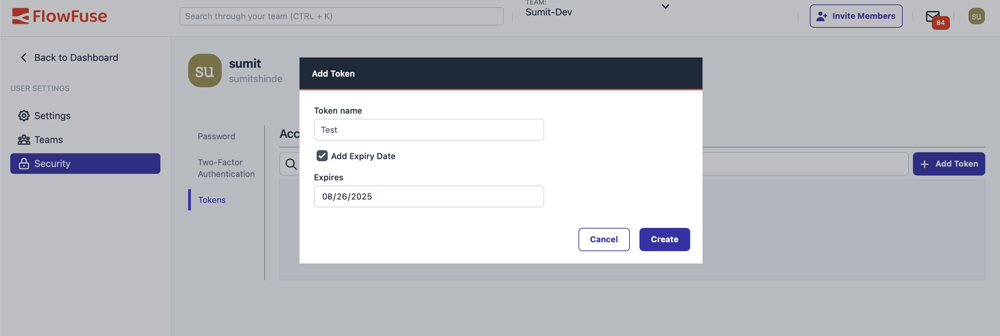
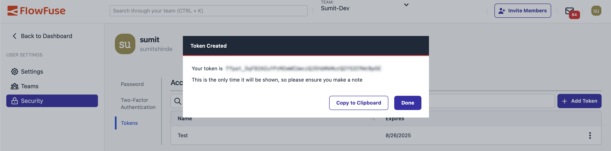

FlowFuse includes an API that lets you manage Node-RED instances, edge devices, and deployments directly from your scripts or applications. While most people use the web interface, the API is a great option if you want to automate tasks or connect FlowFuse with other tools.

<!--more-->

In this guide, you’ll learn the basics of the FlowFuse API, along with practical examples you can start using right away.

## What is the FlowFuse API and Why Use It?

The FlowFuse API is a **REST-based interface** fully described using the **OpenAPI 3.0 Specification**, allowing you to explore its capabilities, test endpoints, and even auto-generate client libraries in multiple programming languages. It provides programmatic control over everything available in the FlowFuse platform, so instead of navigating the dashboard, you can manage Node-RED instances, devices, and deployments directly from scripts or applications.

This is particularly useful when you want to:

* Manage **multiple Node-RED instances or devices** simultaneously.
* **Automate repetitive tasks** such as starting, stopping, or updating instances.
* Build **custom notifications or alerts**.
* Implement **CI/CD pipelines** for testing and deploying flows automatically.
* Integrate FlowFuse with **external systems** like monitoring, alerting, or scheduling tools.

In short, the API provides greater flexibility, simplifies automation, and allows FlowFuse to fit seamlessly into your existing workflows.

## Getting Started with the FlowFuse API

Before you can use the API, you need:

1. **Your FlowFuse account**  
   You will need to authenticate using an API token, which you can generate from the FlowFuse platform.

### Generating an API Token

1. Log in to the FlowFuse platform.  
2. Open **User Settings → Security**.  
3. Switch to the **Tokens** tab and click **Add Token**.  
4. In the form that opens:  
   - Give the token a descriptive name (e.g., `automation-script`).  
   - (Optional) Check **Add Expiry Date** and choose a date if you want the token to automatically expire.  
   - Click **Create Token** to generate it.  

{data-zoomable}
*FlowFuse platform token creation form showing fields for token name, expiry date, and create button.*

After creation, a dialog will open showing your **secret token**.  
Click **Copy to Clipboard** and store this token securely. It will only be shown once and provides full access to your account.

{data-zoomable}
*Dialog showing the generated FlowFuse API token with copy-to-clipboard option.*

### Exploring the FlowFuse API with Swagger

FlowFuse provides **Swagger/OpenAPI documentation** that gives you a complete overview of all available endpoints, along with request and response formats.

> **Note:** The Swagger UI is **read-only**. You cannot execute API calls directly from it. Its purpose is to **display all endpoints** after visiting the page, so you can plan and structure your API calls in Node-RED flows, scripts, or other applications.

{data-zoomable}
*FlowFuse Swagger/OpenAPI documentation interface displaying endpoints for users, Node-RED instances, devices, deployments, and much more.*

#### How to Use the Swagger Docs

1. Open the [FlowFuse API documentation](https://app.flowfuse.com/api/static/index.html) in your browser.

2. Once loaded, you will see **all available endpoints**, organized by category:

   * **`/api/v1/user/`** – Retrieve user details
   * **`/api/v1/instances/`** – List and manage Node-RED instances
   * **`/api/v1/devices/`** – Manage edge devices
   * **`/api/v1/deployments/`** – Trigger or monitor deployments

3. **Click on each endpoint** to expand it and review the details, including:

   * Required parameters
   * Headers
   * Response schemas

4. Use this information to construct actual API requests in **Node-RED HTTP Request nodes**, `curl`, or other scripts.

### Making Your First API Call

Once you have your API token, you can start interacting with the FlowFuse API. Every request must include your token in the **Authorization** header.

#### Example: Get User Information

A good first step is to fetch your user details to verify that your token works. You can use `curl`, any HTTP client in your preferred programming language, or even do it directly within Node-RED using an **HTTP Request** node, as shown below.

**Steps in Node-RED:**

1. Drag an **Inject** node onto the canvas.
2. Drag an **HTTP Request** node and connect it to the Inject node.
3. Double-click the HTTP Request node and configure it:

   * Method: **GET**
   * URL: `https://app.flowfuse.com/api/v1/user/`
   * Check **Use authentication**, select **Bearer Authentication**, and enter your API token.
4. Connect a **Debug** node to the HTTP Request node to see the response.
5. Deploy the flow and click the Inject button.

> **Note:** When using API tokens in Node-RED flows, always store them in **environment variables** instead of directly in the node to prevent accidental exposure when sharing flows. See [FlowFuse Environment Variables](/blog/2023/01/environment-variables-in-node-red/) for more details.


[{"id":"6fa44538b934438b","type":"inject","z":"5027784675bcf4ee","name":"Get User Details","props":[],"repeat":"","crontab":"","once":false,"onceDelay":0.1,"topic":"","x":180,"y":740,"wires":[["8c7f13373e29c907"]]},{"id":"8c7f13373e29c907","type":"http request","z":"5027784675bcf4ee","name":"","method":"GET","ret":"txt","paytoqs":"ignore","url":"https://app.flowfuse.com/api/v1/user/","tls":"","persist":false,"proxy":"","insecureHTTPParser":false,"authType":"bearer","senderr":false,"headers":[],"x":390,"y":740,"wires":[["3a54169dc737b475"]]},{"id":"3a54169dc737b475","type":"debug","z":"5027784675bcf4ee","name":"Result","active":true,"tosidebar":true,"console":false,"tostatus":false,"complete":"payload","targetType":"msg","statusVal":"","statusType":"auto","x":570,"y":740,"wires":[]}]


Once triggered, the debug panel will show your user information as shown below with status code 200, confirming that your token works and your API connection is successful.

```json
{
  "email": "john.doe@example.com",
  "email_verified": true,
  "sso_enabled": true,
  "mfa_enabled": false,
  "tcs_accepted": "2024-01-01T00:00:00.000Z",
  "id": "john12345",
  "username": "johndoe",
  "name": "John Doe",
  "avatar": "https://app.flowfuse.com/avatar/john-avatar",
  "admin": false,
  "createdAt": "2024-01-01T00:00:00.000Z",
  "suspended": false
}
```

## Automating DevOps Pipelines with the FlowFuse API

One of the most powerful features of the FlowFuse API is its ability to integrate directly with CI/CD pipelines. This makes it possible to trigger builds, deployments, or pipeline stages automatically—either from scripts or directly within Node-RED flows—reducing manual effort and accelerating development cycles.

To trigger a pipeline stage, you will use the following endpoint:

```
PUT /api/v1/pipelines/{pipelineId}/stages/{stageId}/deploy
```

This requires two pieces of information: the **pipeline ID** and the **stage ID**.
Before triggering a deployment, you first need to retrieve the list of pipelines for your application:

```
GET /api/v1/applications/{applicationId}/pipelines
```

This request returns all pipelines for the given application, including their **pipelineId** and the stages associated with them. Once you identify the correct **pipelineId** and **stageId**, you can use them in the `deploy` request to trigger the stage automatically.

### API Steps

Before triggering a stage, we first need to retrieve the pipeline details for the application. This will give us both the pipeline ID and the stage ID required for deployment.

**Step 1: Get Your Application ID**

1. Navigate to your application in **FlowFuse**.
2. Open the **Settings** page.
3. Copy the **Application ID** (you will need this in later steps).

**Step 2: Retrieve Pipelines for an Application**

1. Drag an **Inject** node to manually trigger the request.

2. Add an **HTTP Request** node and configure it as follows:

   * **Method:** `GET`
   * **URL:**

     ```
     /api/v1/applications/{applicationId}/pipelines
     ```

     Replace `{applicationId}` with the actual Application ID you copied in Step 1.
   * **Authentication:** Enable **Bearer Authentication** and set it to use your API token from the environment.

3. Connect the **Inject** node to the **HTTP Request** node, and then connect the **HTTP Request** node to a **Debug** node.

4. Deploy the flow and click the Inject button to retrieve the pipelines.

*The response will return a list of pipelines, each containing a unique **pipelineId**.*


[{"id":"7ad2c2d998c60b39","type":"inject","z":"5027784675bcf4ee","name":"Get Pipelines","props":[],"repeat":"","crontab":"","once":true,"onceDelay":0.1,"topic":"","x":240,"y":480,"wires":[["dda168427fc847df"]]},{"id":"dda168427fc847df","type":"http request","z":"5027784675bcf4ee","name":"","method":"GET","ret":"txt","paytoqs":"ignore","url":"https://app.flowfuse.com/api/v1/applications/{applicationID}/pipelines","tls":"","persist":false,"proxy":"","insecureHTTPParser":false,"authType":"bearer","senderr":false,"headers":[],"x":430,"y":480,"wires":[["4a8c8520e2d33e37"]]},{"id":"4a8c8520e2d33e37","type":"debug","z":"5027784675bcf4ee","name":"Result","active":true,"tosidebar":true,"console":false,"tostatus":false,"complete":"payload","targetType":"msg","statusVal":"","statusType":"auto","x":590,"y":480,"wires":[]}]


**Step 3: Identify the Stage**

1. Review the pipeline details returned from Step 2.
2. Note the **pipelineId** and the **stageId** of the stage you want to trigger.

**Step 4: Trigger the Stage Deployment**

Once you have the `pipelineId` and `stageId`, you can trigger the deployment stage with a `PUT` request.

1. Add another **Inject** node to trigger the deployment.
2. Connect it to a new **HTTP Request** node and configure it as follows:

   * **Method:** `PUT`
   * **URL:**

     ```
     /api/v1/pipelines/{pipelineId}/stages/{stageId}/deploy
     ```

     Replace `{pipelineId}` and `{stageId}` with the values from Step 3.
   * **Authentication:** Use **Bearer Authentication** with your API token.
3. Connect the HTTP Request node to a **Debug** node to view the response.
4. Deploy the flow and click Inject.

If successful, you will receive a JSON response confirming that the deployment stage has been triggered.


```json
{"status":"importing"}
```

The FlowFuse API allows you to deploy a specific stage of a pipeline. While it does not automatically proceed to the next stage, you can set up a workflow that monitors each stage’s status and triggers the next stage once the current one is complete. The following flow demonstrates this: it first deploys the development stage every day at 10 PM, then checks the status of the next stage, the staging instance, before proceeding.


[{"id":"1ab940eb2ef10760","type":"http request","z":"5027784675bcf4ee","name":"Deploy Development Stage","method":"PUT","ret":"txt","paytoqs":"ignore","url":"https://app.flowfuse.com/api/v1/pipelines/${pipelineId}/stages/{$stageId}/deploy","tls":"","persist":false,"proxy":"","insecureHTTPParser":false,"authType":"bearer","senderr":false,"headers":[],"x":400,"y":180,"wires":[["1c13b0d508913f6d"]]},{"id":"293221e2fafef9ff","type":"http request","z":"5027784675bcf4ee","name":"Check Staging Status","method":"GET","ret":"obj","paytoqs":"ignore","url":"https://app.flowfuse.com/api/v1/projects/${instanceId}/status","tls":"","persist":false,"proxy":"","insecureHTTPParser":false,"authType":"bearer","senderr":false,"headers":[],"x":360,"y":300,"wires":[["24192bf21e52edd2"]]},{"id":"6f94bfb0d3198597","type":"http request","z":"5027784675bcf4ee","name":"Deploy Staging Stage","method":"PUT","ret":"txt","paytoqs":"ignore","url":"https://app.flowfuse.com/api/v1/pipelines/${pipelineId}/stages/{$stageId}/deploy","tls":"","persist":false,"proxy":"","insecureHTTPParser":false,"authType":"bearer","senderr":false,"headers":[],"x":780,"y":300,"wires":[["b267c3b0ecbbf0bd"]]},{"id":"24192bf21e52edd2","type":"switch","z":"5027784675bcf4ee","name":"Is Running?","property":"payload.meta.state","propertyType":"msg","rules":[{"t":"eq","v":"running","vt":"str"}],"checkall":"true","repair":false,"outputs":1,"x":570,"y":300,"wires":[["6f94bfb0d3198597","9cf7ccb7e740b39e"]]},{"id":"7ace2bed48a14cda","type":"inject","z":"5027784675bcf4ee","name":"Trigger Pipeline","props":[],"repeat":"","crontab":"00 22 * * *","once":false,"onceDelay":"30","topic":"","x":140,"y":180,"wires":[["1ab940eb2ef10760"]]},{"id":"b267c3b0ecbbf0bd","type":"debug","z":"5027784675bcf4ee","name":"Result","active":true,"tosidebar":true,"console":false,"tostatus":false,"complete":"payload","targetType":"msg","statusVal":"","statusType":"auto","x":730,"y":360,"wires":[]},{"id":"1c13b0d508913f6d","type":"function","z":"5027784675bcf4ee","name":"Wait for Stage Complete","func":"// Get any existing interval and timeout from context\nlet id = context.get(\"intervalId\");\nlet timeoutId = context.get(\"timeoutId\");\n\n// If state = \"running\", stop polling immediately\nif (msg.payload?.meta?.state === \"running\") {\n    if (id) {\n        clearInterval(id);\n        context.set(\"intervalId\", null);\n    }\n    if (timeoutId) {\n        clearTimeout(timeoutId);\n        context.set(\"timeoutId\", null);\n    }\n    node.status({ fill: \"green\", shape: \"dot\", text: \"Stage running\" });\n    return null; // stop completely\n}\n\n// Start polling only if not already started\nif (!id) {\n    // Create polling interval (send msg every 2 seconds)\n    id = setInterval(() => {\n        node.send(msg);\n    }, 2000);\n\n    // Auto-clear interval after 60 seconds to avoid leaks\n    timeoutId = setTimeout(() => {\n        clearInterval(id);\n        context.set(\"intervalId\", null);\n        node.status({ fill: \"red\", shape: \"dot\", text: \"Polling stopped (timeout)\" });\n    }, 60000);\n\n    // Save interval and timeout IDs in context\n    context.set(\"intervalId\", id);\n    context.set(\"timeoutId\", timeoutId);\n\n    node.status({ fill: \"yellow\", shape: \"ring\", text: \"Polling...\" });\n}\n\nreturn null;\n","outputs":1,"timeout":0,"noerr":0,"initialize":"","finalize":"","libs":[],"x":430,"y":240,"wires":[["293221e2fafef9ff"]]},{"id":"9cf7ccb7e740b39e","type":"link out","z":"5027784675bcf4ee","name":"link out 1","mode":"link","links":["a58e64a12df0c55e"],"x":695,"y":260,"wires":[]},{"id":"a58e64a12df0c55e","type":"link in","z":"5027784675bcf4ee","name":"link in 1","links":["9cf7ccb7e740b39e"],"x":275,"y":240,"wires":[["1c13b0d508913f6d"]]}]


## Conclusion

The FlowFuse API puts you in control of your Node-RED infrastructure through code. Instead of managing instances manually, you can automate repetitive tasks, integrate with existing tools, and build custom workflows that fit your exact needs.

Whether you're managing a handful of instances or thousands of edge devices, the API scales with you. It's straightforward to get started—generate a token, make your first API call, and gradually automate more of your workflow as you go.

The real value comes from the time you save and the consistency you gain. Let the API handle the routine work while you focus on building great Node-RED applications.

[Sign up for FlowFuse](https://app.flowfuse.com) to start building Node-RED applications, automate workflows, manage and scale your instances and devices, and secure them efficiently.
