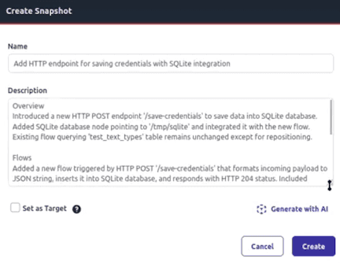

This release is focused on better integrating the Node-RED experience with FlowFuse features and accelerated application-building with AI features. With this release, you can more easily work with the FlowFuse Tables feature from within Node-RED, build a more comprehensive Unified Namespace, get automatically-generated Snapshot summaries, and more! These improvements make FlowFuse more accessible for enterprise adoption while providing better insights into distributed deployments.

<!--more-->

## Assistant Functionality in Tables Nodes

_AI Assistant in Tables recognizes table schema and turns natural language prompts into SQL queries_

Building on our successful Tables launch in 2.20, we've now integrated AI assistance directly into Tables nodes, making database operations more intuitive and efficient. With this, you can type a natural language prompt that will be interpreted in light of the structure of tables in your FlowFuse Tables, which enables an AI-supported autocomplete and assists with writing SQL specifically for connected FlowFuse tables. 

This integration makes working with FlowFuse Tables even more accessible, allowing developers to leverage AI guidance for database operations without requiring deep SQL expertise.

## Summarize Snapshots

{data-zoomable}
_New snapshot summarization provides clear, AI-generated descriptions of changes between versions_

Managing instance versions becomes more intuitive with our new Snapshot Summarization feature. When creating snapshots, FlowFuse now automatically generates intelligent summaries that describes which changes were made and when. This makes it much easier for teams to understand project evolution and quickly identify the right version for deployment or rollback scenarios.

Available for Pro and Enterprise.

## Team Broker Nodes

Easily publish and subscribe to topics in the FlowFuse Broker using new Team Broker nodes. Send a message from a Node-RED flow directly into the FlowFuse Broker. These new nodes extend the Unified Namespace capabilities of FlowFuse and provide:

- **Publish Node**: Send messages to any topic on your team broker with configurable retention settings
- **Subscribe Node**: Receive messages from specified topics with flexible output formatting
- **Auto-Configuration**: Nodes automatically use your team's broker settings
- **TypedInput Support**: Dynamic topic configuration using message properties or static values

These nodes make working between Node-RED and the FlowFuse Broker much simpler and easier.

## SubFlow Version Control

SubFlows now have comprehensive version control capabilities, enabling teams to manage reusable components across multiple applications. With this feature, you can turn a subflow into a new node that is shared in your internal Team Library, providing for easy use and reuse of the same subflow in any Node-RED instance. You can now track changes to SubFlows separately from parent applications and other Node-RED instances.

Available for Enterprise customers.

## Remote Instance Observability

_Remote Instance monitoring in the Performance view provides usage insights_

Following the success of our hosted instance performance monitoring, we've extended observability capabilities to remote instances. This extension gives insight into CPU usage, memory usage, and disk usage for your remote instances.

This enhancement is particularly valuable for industrial deployments where remote instances run critical processes across multiple locations.

## Blueprint: Energy Monitoring Dashboard

_Energy Monitoring Dashboard provides realtime usage and cost insights_

This Blueprint provides a real-time energy monitoring dashboard template for industrial facilities. It features live consumption tracking, cost analytics, spike detection, and historical trending with an integrated energy rate display. Perfect for demonstrating IoT energy management capabilities, and with Node-RED, it is fully customizable.

## Annual Billing Option

{data-zoomable}
_New annual billing options provide cost savings and simplified budget planning_

Self-service customers on Starter and Pro plans can now choose to subscribe on a yearly basis and receive a free month for doing so. This allows teams to save money compared to a monthly subscription and lock in current pricing.

## What's Next?

For the next release, we're working on features that will enable you to connect your own AI models with Node-RED and FlowFuse, paving the way to create AI-supported automations in your applications. We're excited about it -- stay tuned!

## What else is new?

For a complete list of everything included in our 2.21 release, check out the [release notes](https://github.com/FlowFuse/flowfuse/releases/tag/v2.21.0).

Your feedback continues to be invaluable in shaping FlowFuse's development. We'd love to hear your thoughts on these new features and any suggestions for future improvements. Please share your experiences or report any [issues on GitHub](https://github.com/FlowFuse/flowfuse/issues/new/choose).

Which of these new features are you most excited to try? Email me directly at greg@flowfuse.com - I'd love to hear from you!

## Try FlowFuse

### FlowFuse Cloud

The quickest way to get started is with FlowFuse Cloud.

[Get started for free]({{ site.appURL }}/account/create) and have your Node-RED instances running in the cloud within minutes.

### Self-Hosted

Get FlowFuse running locally in under 30 minutes using [Docker](/docs/install/docker/) or [Kubernetes](/docs/install/kubernetes/).