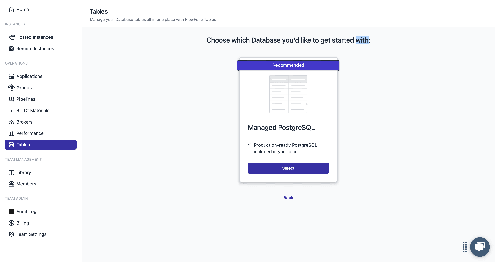
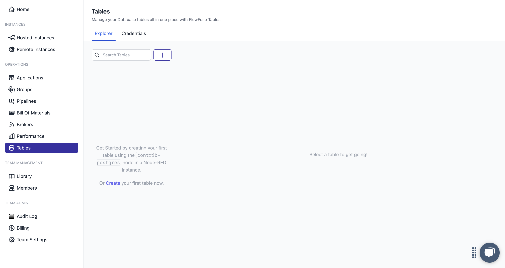
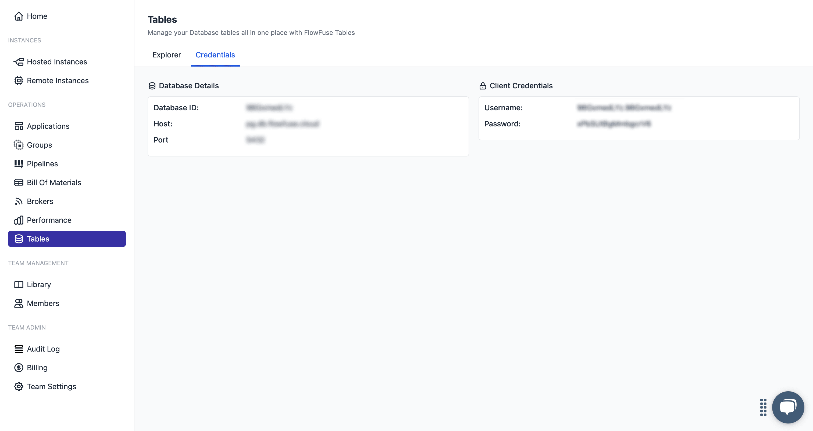
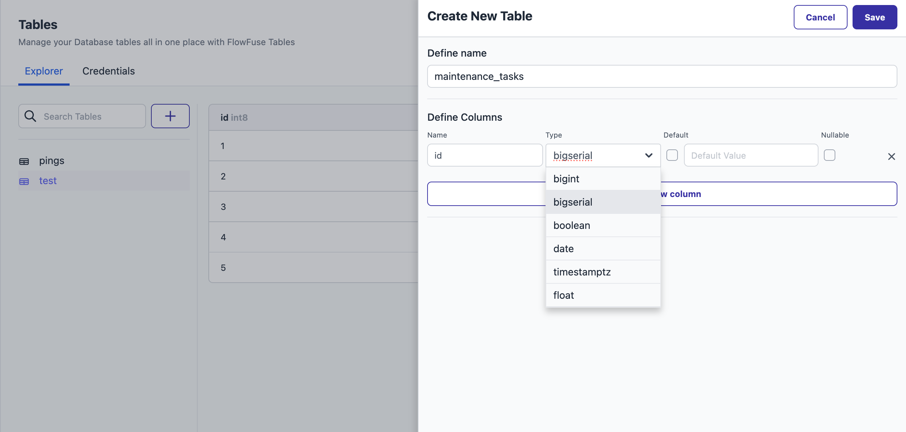
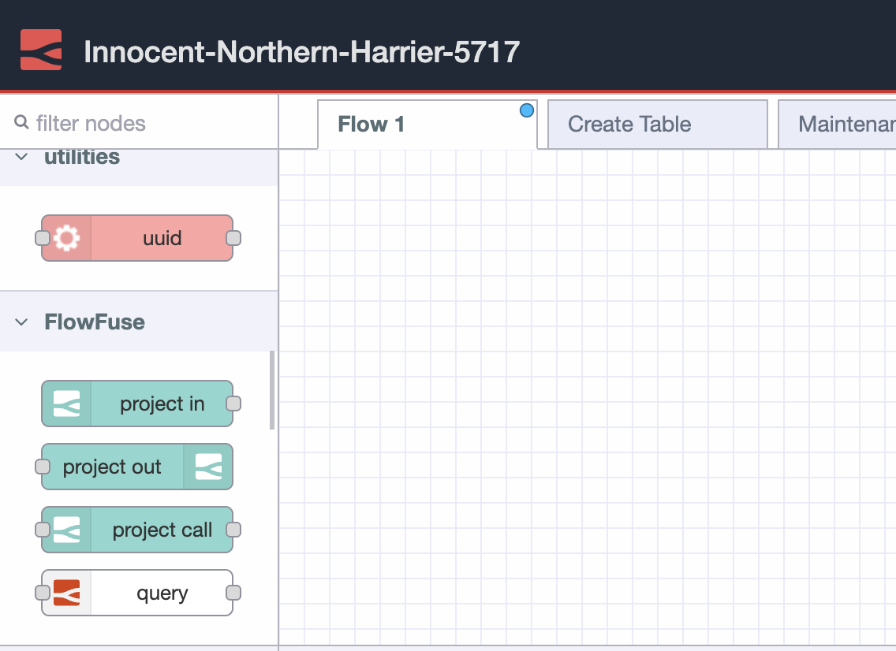

FlowFuse recently introduced a [beta release](/handbook/engineering/releases/#beta-release) built-in database service to their platform, making it easier than ever to store Industrial IoT data. In a typical setup, you would need to provision a database, manage connection strings and credentials, configure nodes, and handle security settings. The goal of this new feature is to simplify or even eliminate those steps entirely. In this article, you will learn how it works and how to get started.

<!--more-->

## Getting Started

FlowFuse Tables is available for Enterprise users. If you do not have an Enterprise FlowFuse account and are interested in trying it out, [contact us](/contact-us/) to get started.

### Step 1: Enable the Database in Your Project

Once the database feature is active on your account, the first step is to create a database instance for your team to use.

1. Log in to your FlowFuse platform.
2. In the navigation menu on the left, select the Tables option.
3. On the next screen, you will be prompted to "Choose which Database you'd like to get started with."
4. Currently, only Managed PostgreSQL is available. Click on Managed PostgreSQL to proceed.

{data-zoomable}
_FlowFuse Tables_

After you make your selection, FlowFuse will begin provisioning your dedicated database in the background. This process typically takes only a few moments. 

Once the provisioning is complete, you will see two tabs in the Tables section:

- **Explorer** – Allows you to manage your tables through the user interface. You can create tables, add columns, and view stored data.

{data-zoomable}
_FlowFuse Tables: Explorer Tab_

- **Credentials** – Provides the database connection details such as host, port, username, and password. These credentials allow you to access the FlowFuse-managed database from outside FlowFuse as well.

{data-zoomable}
_FlowFuse Tables: Credentials Tab_

### Step 2: Create Your First Table

With your database instance provisioned, you can now create a table to start storing data.

FlowFuse offers two ways to create a table:

#### Option 1: Using the Table Explorer (UI)

Navigate to the Explorer tab under the Tables section.

1. Click the **+** button.
2. A form will slide in from the right side of the screen.
3. In the first input field, enter the name of your table.
4. Click Add New Column to start defining the structure of your table:
   - Column Name: Enter the name of the column.
   - Type: Select the appropriate data type (e.g., text, bigint, boolean).
   - Default: Check this if you want to set a default value for the column and Once checked, enter the default value in the input field that appears next.
   - Nullable: Check this if the column can contain empty (null) values.

{data-zoomable}
_Interface for creating FlowFuse tables_

5. Click Save once your columns are defined.

#### Option 2: Using SQL via the Query Node

If you prefer writing raw SQL or need more control over your table structure, you can use the Query node in Node-RED.

1. Go to your FlowFuse instance where you plan to build the flow and use this table.
2. Once you're in the Node-RED editor, look at the left-side node palette. You will find the Query node under the FlowFuse category.

{data-zoomable}
_FlowFuse Query Node_

3. Drag the Query node into your flow.

>The Query node uses standard SQL syntax and is pre-configured to connect to your FlowFuse-managed database automatically — you do not need to manually enter any database credentials when working inside a FlowFuse Node-RED instance. 

4. Double-click the Query node and write your SQL command in the Query field.

Note: Table names and column names are case-sensitive in SQL when using certain databases like PostgreSQL. To avoid unexpected errors, it is recommended to wrap them in double quotes in your queries.: 

For example:
```sql
CREATE TABLE "maintenance_tasks" (
  "id" SERIAL PRIMARY KEY,
  "title" TEXT NOT NULL,
  "description" TEXT,
  "assigned_to" TEXT NOT NULL,
  "due_date" DATE NOT NULL,
  "status" TEXT NOT NULL CHECK ("status" IN ('pending', 'in_progress', 'completed')),
  "priority" TEXT NOT NULL CHECK ("priority" IN ('low', 'medium', 'high'))
);
```

> If you want to send the SQL query dynamically at runtime, you can pass it through `msg.query` instead of hardcoding it in the node configuration.

5. Add an Inject node to trigger the query and optionally connect a Debug node to see the output.
6. Deploy and click the inject button to create the table.

### Step 3: Performing Operations with Your Table

Once your table is ready, you can start interacting with it using the **Query** node. This node allows you to run SQL queries directly—whether it is inserting new data, retrieving records, updating rows, or deleting entries. You can perform all standard operations just as you would with the other database nodes. For this demonstration, you will see how to insert data into your table.

> For a complete walkthrough of CRUD operations, you can try out the flow provided at the end of this guide.

#### Inserting a New Record

1. In your Node-RED editor, drag a **Query** node from the FlowFuse category.

2. Add an **Inject** node.

3. Drag a Change node and place it between the Inject and **Query** nodes. Connect the Inject node to the Change node, and then connect the Change node to the Query node. Double-click the Change node and configure the following properties based on your SQL query requirements. For example:

   - `msg.title` = `"Check motor status"`
   - `msg.description` = `"Routine check of motor and related sensors"`
   - `msg.assigned_to` = `"technician_1"`
   - `msg.due_date` = `"2025-08-10"`
   - `msg.status` = `"pending"`
   - `msg.priority` = `"medium"`

4. Double-click the Query node and write the SQL command in the **Query** field, For example:


```mustache
INSERT INTO "maintenance_tasks" (
  "title",
  "description",
  "assigned_to",
  "due_date",
  "status",
  "priority"
) VALUES (
  {{{msg.title}}},
  {{{msg.description}}},
  {{{msg.assigned_to}}},
  {{{msg.due_date}}},
  {{{msg.status}}},
  {{{msg.priority}}}
);
```


> This node uses the [Mustache template system](https://github.com/janl/mustache.js) to dynamically generate queries based on message properties, using the `{{{ msg.property }}}` syntax.
>
> While convenient for quick testing and prototyping, this method is **not recommended for production use**. For better reliability and maintainability, consider using parameterized queries, for that follow [Using Parameters in Your Queries](#using-parameters-in-your-queries).

5. Optionally, connect a **Debug** node to the output of the Query node to inspect the result.

6. Deploy the flow and click the **Inject** button to execute the query.

Upon a successful insert operation, the Query node will output a `msg.payload` containing an empty array, and a `msg.pgsql` object that includes the executed command and a `rowCount` indicating the number of rows affected.

For update or delete operations, the behavior is the same. For select operations, the `msg.payload` will contain an array of the returned rows.

### Using Parameters in Your Queries

As mentioned earlier, placing Mustache-style strings directly into SQL queries is not considered a best practice. Instead, you should use parameterized queries to keep your queries cleaner, more reliable, and easier to maintain while following best practices.

The FlowFuse Query node supports both **numbered parameters** and **named parameters**, making your SQL queries more flexible, secure, and reusable.

#### Option 1: Numbered Parameters

Numbered parameters let you define placeholders in the SQL string and then pass actual values through `msg.params` as an array.

1. Drag an **Inject** node.

2. Drag a **Change** node and set properties based on your SQL command requirements. For example:

   - Set `msg.payload.priority` to 'high'
   - Set `msg.payload.status` to 'pending'

3. Add a **Change** node and set `msg.params` to `[msg.payload.priority, msg.payload.status]`.
4. Add a **Query** node and write an SQL query with numbered parameters. For example:

```sql
SELECT * FROM "maintenance_tasks"
WHERE "priority" = $1 AND "status" = $2;
```

5. Optionally, add a **Debug** node to view the output.
6. Connect the Inject node to the Change node that sets the payload values, then connect it to another Change node that sets the query parameters. Next, connect it to the Query node, and finally connect the Query node to the Debug node.
7. Deploy the flow and trigger the Inject node.

This query will retrieve rows where `priority` and `status` match the specified values. When you click the Inject node, the actual values from `msg.params` will be passed into the placeholders `$1` and `$2`.

#### Option 2: Named Parameters

Named parameters allow you to reference values by name using a dollar prefix (e.g., `$status`) in your SQL query. The actual values are passed using `msg.queryParameters` as an object.

1. Drag an **Inject** node.

2. Drag a **Change** node and set properties based on your SQL command requirements. For example:

   - Set `msg.payload.id` to 1
   - Set `msg.payload.status` to "in_progress"

3. Add another **Change** node and set `msg.queryParameters` to `{}`. Then add the following rules:

   - Set `msg.queryParameters.id` to `msg.payload.id`
   - Set `msg.queryParameters.status` to `msg.payload.status`

4. Add a **Query** node and write the SQL query using named parameters. For example:

   ```sql
   UPDATE "maintenance_tasks"
   SET "status" = $status
   WHERE "id" = $id;
   ```

5. Optionally, add a **Debug** node to view the output.

6. Connect the Inject node to the Change node that sets the payload values, then connect it to another Change node that sets the query parameters. Next, connect it to the Query node, and finally connect the Query node to the Debug node.

7. Deploy the flow and click the **Inject** button to trigger the update.

When the flow runs, the values in `msg.queryParameters` will replace `$status` and `$id` in the SQL statement, ensuring that your queries are dynamic, readable, and secure.

The Node-RED flow provided below demonstrates a complete set of database interactions. It covers table creation, all standard CRUD (Create, Read, Update, Delete) operations, and includes examples of how to use both numbered and named parameters.


[{"id":"1b32d4c878aae3be","type":"debug","z":"fa9da3f45f949067","name":"Result","active":true,"tosidebar":true,"console":false,"tostatus":false,"complete":"payload","targetType":"msg","statusVal":"","statusType":"auto","x":470,"y":420,"wires":[]},{"id":"59e4b997235b486f","type":"group","z":"fa9da3f45f949067","name":"","style":{"label":true},"nodes":["891c7f50df99de42","6b0630c1101be59c","35eda0b6c690e85f","d638990b04e75f73","0e0bdc881d4ff5e9","8f66f27f4fe5a3b1","5c2da859792c16fa"],"x":54,"y":239,"w":532,"h":222},{"id":"891c7f50df99de42","type":"inject","z":"fa9da3f45f949067","g":"59e4b997235b486f","name":"","props":[],"repeat":"","crontab":"","once":false,"onceDelay":0.1,"topic":"","x":150,"y":320,"wires":[["6b0630c1101be59c"]]},{"id":"6b0630c1101be59c","type":"tables-query","z":"fa9da3f45f949067","g":"59e4b997235b486f","name":"Create Table","query":"CREATE TABLE \"maintenance_tasks\" (\n  \"id\" SERIAL PRIMARY KEY,\n  \"title\" TEXT NOT NULL,\n  \"description\" TEXT,\n  \"assigned_to\" TEXT NOT NULL,\n  \"due_date\" DATE NOT NULL,\n  \"status\" TEXT NOT NULL CHECK (\"status\" IN ('pending', 'in_progress', 'completed')),\n  \"priority\" TEXT NOT NULL CHECK (\"priority\" IN ('low', 'medium', 'high'))\n);\n\n","split":false,"rowsPerMsg":1,"x":310,"y":320,"wires":[["35eda0b6c690e85f"]]},{"id":"35eda0b6c690e85f","type":"debug","z":"fa9da3f45f949067","g":"59e4b997235b486f","name":"Result","active":true,"tosidebar":true,"console":false,"tostatus":false,"complete":"payload","targetType":"msg","statusVal":"","statusType":"auto","x":490,"y":320,"wires":[]},{"id":"d638990b04e75f73","type":"comment","z":"fa9da3f45f949067","g":"59e4b997235b486f","name":"Hardcode query within node","info":"","x":200,"y":280,"wires":[]},{"id":"0e0bdc881d4ff5e9","type":"comment","z":"fa9da3f45f949067","g":"59e4b997235b486f","name":"Dynamically passing query","info":"","x":190,"y":380,"wires":[]},{"id":"8f66f27f4fe5a3b1","type":"inject","z":"fa9da3f45f949067","g":"59e4b997235b486f","name":"","props":[{"p":"query","v":"SELECT * FROM \"maintenance_tasks\";","vt":"str"}],"repeat":"","crontab":"","once":false,"onceDelay":0.1,"topic":"","x":150,"y":420,"wires":[["5c2da859792c16fa"]]},{"id":"5c2da859792c16fa","type":"tables-query","z":"fa9da3f45f949067","g":"59e4b997235b486f","name":"SELECT","query":"","split":false,"rowsPerMsg":1,"x":300,"y":420,"wires":[["1b32d4c878aae3be"]]},{"id":"98f1c134581e0cdc","type":"group","z":"fa9da3f45f949067","name":"CRUD with Named Parameters","style":{"label":true},"nodes":["a70b79e2d1963518","8a617977438aedd1","e725fca338bfc763","ef5cde3b2e4ae6e5","ae071cf83947c204","26de341301b5378b","d1c2458ddef51e8f","eb407128caea1c2f","0b192c85faaee996","8db1c228e1b464fd","0ad1449ee792b623","9a81c88433626bf7","67ad3eddd7920547","7b5e3e5014ba62cb","028bd98bdcf55a8a","d12e44a1eefb3f6e","7b7c3b3586c57b6d","a3f58edc29712b75","e5a71b865a80248c","d6cbc55c66a02e36","6bab0e344178ed4a"],"x":54,"y":479,"w":912,"h":262},{"id":"a70b79e2d1963518","type":"inject","z":"fa9da3f45f949067","g":"98f1c134581e0cdc","name":"Insert","props":[],"repeat":"","crontab":"","once":false,"onceDelay":0.1,"topic":"","x":150,"y":580,"wires":[["7b5e3e5014ba62cb"]]},{"id":"8a617977438aedd1","type":"tables-query","z":"fa9da3f45f949067","g":"98f1c134581e0cdc","name":"Insert","query":"INSERT INTO \"maintenance_tasks\" (\n  \"title\",\n  \"description\",\n  \"assigned_to\",\n  \"due_date\",\n  \"status\",\n  \"priority\"\n) VALUES (\n  $title,\n  $description,\n  $assigned_to,\n  $due_date,\n  $status,\n  $priority\n);\n","split":false,"rowsPerMsg":1,"x":730,"y":580,"wires":[["e725fca338bfc763"]]},{"id":"e725fca338bfc763","type":"debug","z":"fa9da3f45f949067","g":"98f1c134581e0cdc","name":"Result","active":true,"tosidebar":true,"console":false,"tostatus":false,"complete":"payload","targetType":"msg","statusVal":"","statusType":"auto","x":870,"y":580,"wires":[]},{"id":"ef5cde3b2e4ae6e5","type":"tables-query","z":"fa9da3f45f949067","g":"98f1c134581e0cdc","name":"Update","query":"UPDATE \"maintenance_tasks\"\nSET \"status\" = $status\nWHERE \"id\" = $id;\n","split":false,"rowsPerMsg":1,"x":740,"y":660,"wires":[["26de341301b5378b"]]},{"id":"ae071cf83947c204","type":"change","z":"fa9da3f45f949067","g":"98f1c134581e0cdc","name":"","rules":[{"t":"set","p":"queryParameters","pt":"msg","to":"{}","tot":"json"},{"t":"set","p":"queryParameters.id","pt":"msg","to":"payload.id","tot":"msg"},{"t":"set","p":"queryParameters.status","pt":"msg","to":"payload.status","tot":"msg"}],"action":"","property":"","from":"","to":"","reg":false,"x":580,"y":660,"wires":[["ef5cde3b2e4ae6e5"]]},{"id":"26de341301b5378b","type":"debug","z":"fa9da3f45f949067","g":"98f1c134581e0cdc","name":"Result","active":true,"tosidebar":true,"console":false,"tostatus":false,"complete":"payload","targetType":"msg","statusVal":"","statusType":"auto","x":870,"y":660,"wires":[]},{"id":"d1c2458ddef51e8f","type":"inject","z":"fa9da3f45f949067","g":"98f1c134581e0cdc","name":"Update","props":[],"repeat":"","crontab":"","once":false,"onceDelay":0.1,"topic":"","x":150,"y":660,"wires":[["028bd98bdcf55a8a"]]},{"id":"eb407128caea1c2f","type":"tables-query","z":"fa9da3f45f949067","g":"98f1c134581e0cdc","name":"SELECT","query":"SELECT * FROM \"maintenance_tasks\"\nWHERE \"priority\" = $priority AND \"status\" = 'pending';\n","split":false,"rowsPerMsg":1,"x":740,"y":620,"wires":[["8db1c228e1b464fd"]]},{"id":"0b192c85faaee996","type":"change","z":"fa9da3f45f949067","g":"98f1c134581e0cdc","name":"","rules":[{"t":"set","p":"queryParameters","pt":"msg","to":"{}","tot":"json"},{"t":"set","p":"queryParameters.priority","pt":"msg","to":"payload.priority","tot":"msg"}],"action":"","property":"","from":"","to":"","reg":false,"x":580,"y":620,"wires":[["eb407128caea1c2f"]]},{"id":"8db1c228e1b464fd","type":"debug","z":"fa9da3f45f949067","g":"98f1c134581e0cdc","name":"Result","active":true,"tosidebar":true,"console":false,"tostatus":false,"complete":"payload","targetType":"msg","statusVal":"","statusType":"auto","x":870,"y":620,"wires":[]},{"id":"0ad1449ee792b623","type":"inject","z":"fa9da3f45f949067","g":"98f1c134581e0cdc","name":"SELECT","props":[],"repeat":"","crontab":"","once":false,"onceDelay":0.1,"topic":"","x":160,"y":620,"wires":[["9a81c88433626bf7"]]},{"id":"9a81c88433626bf7","type":"change","z":"fa9da3f45f949067","g":"98f1c134581e0cdc","name":"","rules":[{"t":"set","p":"payload.priority","pt":"msg","to":"high","tot":"str"}],"action":"","property":"","from":"","to":"","reg":false,"x":350,"y":620,"wires":[["0b192c85faaee996"]]},{"id":"67ad3eddd7920547","type":"change","z":"fa9da3f45f949067","g":"98f1c134581e0cdc","name":"","rules":[{"t":"set","p":"queryParameters","pt":"msg","to":"{}","tot":"json"},{"t":"set","p":"queryParameters.title","pt":"msg","to":"payload.title","tot":"msg"},{"t":"set","p":"queryParameters.description","pt":"msg","to":"payload.description","tot":"msg"},{"t":"set","p":"queryParameters.assigned_to","pt":"msg","to":"payload.assigned_to","tot":"msg"},{"t":"set","p":"queryParameters.due_date","pt":"msg","to":"payload.due_date","tot":"msg"},{"t":"set","p":"queryParameters.status","pt":"msg","to":"payload.status","tot":"msg"},{"t":"set","p":"queryParameters.priority","pt":"msg","to":"payload.priority","tot":"msg"}],"action":"","property":"","from":"","to":"","reg":false,"x":580,"y":580,"wires":[["8a617977438aedd1"]]},{"id":"7b5e3e5014ba62cb","type":"change","z":"fa9da3f45f949067","g":"98f1c134581e0cdc","name":"","rules":[{"t":"set","p":"payload.title","pt":"msg","to":"Replace air conditioner filter","tot":"str"},{"t":"set","p":"payload.description","pt":"msg","to":"The air filter in the main office needs to be replaced to maintain air quality.","tot":"str"},{"t":"set","p":"payload.assigned_to","pt":"msg","to":"jdoe","tot":"str"},{"t":"set","p":"payload.due_date","pt":"msg","to":"2025-08-15","tot":"str"},{"t":"set","p":"payload.status","pt":"msg","to":"pending","tot":"str"},{"t":"set","p":"payload.priority","pt":"msg","to":"high","tot":"str"}],"action":"","property":"","from":"","to":"","reg":false,"x":320,"y":580,"wires":[["67ad3eddd7920547"]]},{"id":"028bd98bdcf55a8a","type":"change","z":"fa9da3f45f949067","g":"98f1c134581e0cdc","name":"","rules":[{"t":"set","p":"payload.id","pt":"msg","to":"1","tot":"num"},{"t":"set","p":"payload.status","pt":"msg","to":"in_progress","tot":"str"}],"action":"","property":"","from":"","to":"","reg":false,"x":320,"y":660,"wires":[["ae071cf83947c204"]]},{"id":"d12e44a1eefb3f6e","type":"tables-query","z":"fa9da3f45f949067","g":"98f1c134581e0cdc","name":"Delete","query":"DELETE FROM \"maintenance_tasks\"\nWHERE \"id\" = $id;\n","split":false,"rowsPerMsg":1,"x":730,"y":700,"wires":[["a3f58edc29712b75"]]},{"id":"7b7c3b3586c57b6d","type":"change","z":"fa9da3f45f949067","g":"98f1c134581e0cdc","name":"","rules":[{"t":"set","p":"queryParameters","pt":"msg","to":"{}","tot":"json"},{"t":"set","p":"queryParameters.id","pt":"msg","to":"payload.id","tot":"msg"}],"action":"","property":"","from":"","to":"","reg":false,"x":580,"y":700,"wires":[["d12e44a1eefb3f6e"]]},{"id":"a3f58edc29712b75","type":"debug","z":"fa9da3f45f949067","g":"98f1c134581e0cdc","name":"Result","active":true,"tosidebar":true,"console":false,"tostatus":false,"complete":"payload","targetType":"msg","statusVal":"","statusType":"auto","x":870,"y":700,"wires":[]},{"id":"e5a71b865a80248c","type":"inject","z":"fa9da3f45f949067","g":"98f1c134581e0cdc","name":"DELETE","props":[],"repeat":"","crontab":"","once":false,"onceDelay":0.1,"topic":"","x":160,"y":700,"wires":[["d6cbc55c66a02e36"]]},{"id":"d6cbc55c66a02e36","type":"change","z":"fa9da3f45f949067","g":"98f1c134581e0cdc","name":"","rules":[{"t":"set","p":"payload.id","pt":"msg","to":"2","tot":"num"}],"action":"","property":"","from":"","to":"","reg":false,"x":330,"y":700,"wires":[["7b7c3b3586c57b6d"]]},{"id":"6bab0e344178ed4a","type":"comment","z":"fa9da3f45f949067","g":"98f1c134581e0cdc","name":"Named Parameters","info":"","x":170,"y":520,"wires":[]},{"id":"7d584a17652f6545","type":"group","z":"fa9da3f45f949067","name":"Example flow: numbered parameters","style":{"label":true},"nodes":["c68690d2546f65cf","eb65c1a44ae25dd7","f38fed90c8e1f2f6","2b9e486cca212636","f492d66aa25e20aa"],"x":54,"y":759,"w":672,"h":122},{"id":"c68690d2546f65cf","type":"comment","z":"fa9da3f45f949067","g":"7d584a17652f6545","name":"Numbered Parameters","info":"","x":180,"y":800,"wires":[]},{"id":"eb65c1a44ae25dd7","type":"function","z":"fa9da3f45f949067","g":"7d584a17652f6545","name":"function 3","func":"msg.params = {}\nmsg.params = [msg.payload.title, msg.payload.description, msg.payload.assigned_to, msg.payload.due_date, msg.payload.status, msg.payload.priority]\nreturn msg;\n","outputs":1,"timeout":0,"noerr":0,"initialize":"","finalize":"","libs":[],"x":320,"y":840,"wires":[["2b9e486cca212636"]]},{"id":"f38fed90c8e1f2f6","type":"inject","z":"fa9da3f45f949067","g":"7d584a17652f6545","name":"","props":[{"p":"payload"}],"repeat":"","crontab":"","once":false,"onceDelay":0.1,"topic":"","payload":"{\"title\":\"Replace air conditioner filter\",\"description\":\"The air filter in the main office needs to be replaced to maintain air quality.\",\"assigned_to\":\"jdoe\",\"due_date\":\"2025-08-15\",\"status\":\"pending\",\"priority\":\"high\"}","payloadType":"json","x":150,"y":840,"wires":[["eb65c1a44ae25dd7"]]},{"id":"2b9e486cca212636","type":"tables-query","z":"fa9da3f45f949067","g":"7d584a17652f6545","name":"Insert","query":"INSERT INTO \"maintenance_tasks\" (\n  \"title\",\n  \"description\",\n  \"assigned_to\",\n  \"due_date\",\n  \"status\",\n  \"priority\"\n) VALUES (\n  $1, $2, $3, $4, $5, $6\n);\n","split":false,"rowsPerMsg":1,"x":490,"y":840,"wires":[["f492d66aa25e20aa"]]},{"id":"f492d66aa25e20aa","type":"debug","z":"fa9da3f45f949067","g":"7d584a17652f6545","name":"Result","active":true,"tosidebar":true,"console":false,"tostatus":false,"complete":"payload","targetType":"msg","statusVal":"","statusType":"auto","x":630,"y":840,"wires":[]},{"id":"53b4963ef005eadf","type":"global-config","env":[],"modules":{"@flowfuse/nr-tables-nodes":"0.1.0"}}]


## Wrapping Up

You've now learned how to leverage FlowFuse Tables to simplify database management in your Industrial IoT projects. Here's what you've accomplished:

- **Provisioned** a managed PostgreSQL database with zero configuration overhead
- **Created tables** using both the intuitive UI and flexible SQL approach  
- **Executed queries** safely using parameterized queries for production-ready flows
- **Performed CRUD operations** with the versatile Query node

The combination of FlowFuse Tables and the built-in [MQTT broker](/blog/2024/10/announcement-mqtt-broker/) eliminates the complexity of managing external database and messaging infrastructure, letting you focus on building automation solutions rather than wrestling with DevOps.

Ready to see how FlowFuse Tables can accelerate your next industrial project? [Book a demo with our team](/book-demo/) to explore the full platform capabilities.

*Next up: We'll dive into Query node advanced features including backpressure handling and streaming large datasets—essential techniques for high-volume industrial applications.*
