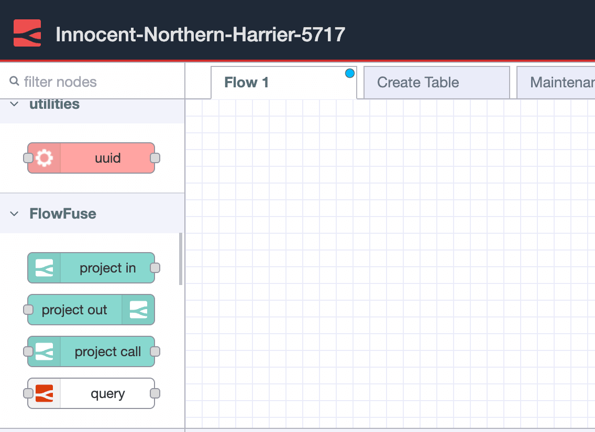

FlowFuse recently introduced a built-in database service to their platform, making it easier than ever to store Industrial IoT data. In a typical setup, you would need to provision a database, manage connection strings and credentials, configure nodes, and handle security settings. The goal of this new feature is to simplify or even eliminate those steps entirely. In this article, you will learn how it works and how to get started.

<!--more-->

## Getting Started: A Step-by-Step Guide

If you do not have a FlowFuse account yet, [sign up](/account/create)here to get started. For a full comparison of all plan features, you can also visit the [FlowFuse Pricing Page](/pricing/).

### Step 1: Enable the Database in Your Project

Once the database feature is active on your account, the first step is to create a database instance for your team to use.

1. Log in to your FlowFuse platform.
2. In the navigation menu on the left, select the Tables option.
3. On the next screen, you will be prompted to "Choose which Database you'd like to get started with." Click on the Managed PostgreSQL option to proceed.

After you make your selection, FlowFuse will begin provisioning your dedicated database in the background. This process typically takes only a few moments. 

Once the provisioning is complete, you will see two tabs in the Tables section:
- Explorer – Allows you to manage your tables through the user interface. You can create tables, add columns, and view stored data.

{data-zoomable}
_FlowFuse Tables: Explorer Tab_

- Credentials – Provides the database connection details such as host, port, username, and password. These credentials allow you to access the FlowFuse-managed database from outside FlowFuse as well.

{data-zoomable}
_FlowFuse Tables: Credentials Tab_

## Step 2: Create Your First Table

With your database instance provisioned, you can now create a table to start storing data.

FlowFuse offers two ways to create a table:

### Option 1: Using the Table Explorer (UI)

Navigate to the Explorer tab under the Tables section.

1. Click the + button.
2. A form will slide in from the right side of the screen.
3. In the first input field, enter the name of your table.
4. Click Add New Column to start defining the structure of your table:
   - Column Name: Enter the name of the column.
   - Type: Select the appropriate data type (e.g., text, bigint, boolean).
   - Default: Check this if you want to set a default value for the column and Once checked, enter the default value in the input field that appears next.
   - Nullable: Check this if the column can contain empty (null) values.

{data-zoomable}
_Interface for creating FlowFuse tables_

5. Click Save once your columns are defined.

### Option 2: Using SQL via the Query Node

If you prefer writing raw SQL or need more control over your table structure, you can use the Query node in Node-RED.

1. Go to your FlowFuse instance where you plan to build the flow and use this table.
2. Once you're in the Node-RED editor, look at the left-side node palette. You will find the Query node under the FlowFuse category.

{data-zoomable}
_FlowFuse Query Node_

3. Drag the Query node into your flow.

>The Query node uses standard SQL syntax and is pre-configured to connect to your FlowFuse-managed database automatically — you do not need to manually enter any database credentials when working inside a FlowFuse Node-RED instance. 

4. Double-click the Query node and write your SQL command in the Query field.

For example:
```sql
CREATE TABLE maintenance_tasks (
   id SERIAL PRIMARY KEY,
   title TEXT NOT NULL,
   description TEXT,
   assigned_to TEXT NOT NULL,
   due_date DATE NOT NULL,
   status TEXT CHECK (status IN ('pending', 'in_progress', 'completed')) NOT NULL,
   priority TEXT CHECK (priority IN ('low', 'medium', 'high')) NOT NULL
);
```

> If you want to send the SQL query dynamically at runtime, you can pass it through `msg.query` instead of hardcoding it in the node configuration.

5. Add an Inject node to trigger the query and optionally connect a Debug node to see the output.
6. Deploy and click the button to create the table.

## Step 3: Performing Operations with Your Table

Once your table is ready, you can start interacting with it using the **Query** node. This node allows you to run SQL queries directly—whether it is inserting new data, retrieving records, updating rows, or deleting entries. You can perform all standard operations just as you would with the PostgreSQL node or when working directly with a PostgreSQL database.

> For a complete walkthrough of CRUD operations, refer to [this article](/node-red/database/postgresql/). The only difference is the node being used. You can also try out the flow provided at the end of this article.

To demonstrate, here is how to insert a new record into your table:

1. In your Node-RED editor, drag a **Query** node from the FlowFuse category.

2. Add an **Inject** node and connect it to the Query node.

3. Double-click the Query node and paste the following SQL command into the **Query** field:

   ```sql
   INSERT INTO maintenance_tasks (
     title,
     description,
     assigned_to,
     due_date,
     status,
     priority
   ) VALUES (
     'Check motor status',
     'Routine check of motor and related sensors',
     'technician_1',
     '2025-08-10',
     'pending',
     'medium'
   );
   ```

4. Optionally, connect a **Debug** node to the output of the Query node to inspect the result.

5. Deploy the flow and click the **Inject** button to run the query.

## Using Parameters in Your Queries

While hardcoding values directly in SQL queries may work for simple use cases or testing, it is not ideal for real-world scenarios where data changes dynamically. That is where parameterized queries come in.

The FlowFuse Query node supports both **numbered parameters** and **named parameters**, making your SQL queries more flexible, secure, and reusable.

### Option 1: Numbered Parameters

Numbered parameters let you define placeholders in the SQL string and then pass actual values through `msg.params` as an array.

1. Drag an **Inject** node and set properties like `msg.payload.id` and `msg.payload.status`.

2. Add a **Change** node and set `msg.params` to `[msg.payload.status, msg.payload.id]`.

3. Add a **Query** node and write an SQL query with numbered parameters. For example:

   ```sql
   UPDATE maintenance_tasks
   SET status = $1
   WHERE id = $2;
   ```

4. Optionally, add a **Debug** node to view the output.

5. Connect the Inject node to the Change node, then to the Query node, and finally to the Debug node.

6. Deploy the flow and trigger the Inject node.

This query will update the `status` of the row where the `id` matches. When you click the Inject node, the actual values from `msg.params` will be passed into the placeholders `$1` and `$2`.

You're right—when using **named parameters**, SQL should reference the parameter names with a colon (e.g., `:status`), **not** dollar signs like `$1`.

### Option 2: Named Parameters

Named parameters allow you to reference values by name using a dollar prefix (e.g., `$status`) in your SQL query. The actual values are passed using `msg.queryParameters` as an object.

1. Drag an **Inject** node and set properties like `msg.id` and `msg.status`.

2. Add a **Change** node and set `msg.queryParameters` to `{}`. Then add the following rules:

   - Set `msg.queryParameters.id` to `msg.id`
   - Set `msg.queryParameters.status` to `msg.status`

3. Add a **Query** node and write the SQL query using named parameters. For example:

   ```sql
   UPDATE maintenance_tasks
   SET status = $status
   WHERE id = $id;
   ```

4. Optionally, add a **Debug** node to view the output.

5. Connect the Inject node to the Change node, then to the Query node, and finally to the Debug node.

6. Deploy the flow and click the Inject button to trigger the update.

When the flow runs, the values in `msg.queryParameters` will replace `$status` and `$id` in the SQL statement, ensuring that your queries are dynamic, readable, and secure.

The Node-RED flow provided below demonstrates a complete set of database interactions. It covers table creation, all standard CRUD (Create, Read, Update, Delete) operations, and includes examples of how to use both numbered and named parameters.


[{"id":"8cea02e15f688c4e","type":"group","z":"5b632b4467521c08","name":"Hardcode sql","style":{"label":true},"nodes":["55503d22390ed3cd","7ca6016b25dc9078","12302030cd44cfcd","d83341139c1f934c","dcc70ad274aae125","853be670731093f4","d77c468046588d71","c58ae6ffec545255","482ab91fe2f8c6de","1907b765c8528613","a38b7f2c950af057","602e543875c62a9e","1f274445108f3364","6cf43d0144998791","a3e4f298c0daab6b"],"x":54,"y":79,"w":532,"h":322},{"id":"55503d22390ed3cd","type":"inject","z":"5b632b4467521c08","g":"8cea02e15f688c4e","name":"","props":[],"repeat":"","crontab":"","once":false,"onceDelay":0.1,"topic":"","x":150,"y":120,"wires":[["7ca6016b25dc9078"]]},{"id":"7ca6016b25dc9078","type":"tables-query","z":"5b632b4467521c08","g":"8cea02e15f688c4e","name":"Create Table","query":"CREATE TABLE maintenance_tasks (\n    id SERIAL PRIMARY KEY,\n    title TEXT NOT NULL,\n    description TEXT,\n    assigned_to TEXT NOT NULL,\n    due_date DATE NOT NULL,\n    status TEXT CHECK (status IN ('pending', 'in_progress', 'completed')) NOT NULL,\n    priority TEXT CHECK (priority IN ('low', 'medium', 'high')) NOT NULL\n);\n","split":false,"rowsPerMsg":1,"x":310,"y":120,"wires":[["12302030cd44cfcd"]]},{"id":"12302030cd44cfcd","type":"debug","z":"5b632b4467521c08","g":"8cea02e15f688c4e","name":"Result","active":true,"tosidebar":true,"console":false,"tostatus":false,"complete":"payload","targetType":"msg","statusVal":"","statusType":"auto","x":490,"y":120,"wires":[]},{"id":"d83341139c1f934c","type":"inject","z":"5b632b4467521c08","g":"8cea02e15f688c4e","name":"","props":[],"repeat":"","crontab":"","once":false,"onceDelay":0.1,"topic":"","x":150,"y":240,"wires":[["dcc70ad274aae125"]]},{"id":"dcc70ad274aae125","type":"tables-query","z":"5b632b4467521c08","g":"8cea02e15f688c4e","name":"Insert","query":"   INSERT INTO maintenance_tasks (\n     title,\n     description,\n     assigned_to,\n     due_date,\n     status,\n     priority\n   ) VALUES (\n     'Check motor status',\n     'Routine check of motor and related sensors',\n     'technician_1',\n     '2025-08-10',\n     'pending',\n     'medium'\n   );","split":false,"rowsPerMsg":1,"x":290,"y":240,"wires":[["853be670731093f4"]]},{"id":"853be670731093f4","type":"debug","z":"5b632b4467521c08","g":"8cea02e15f688c4e","name":"Result","active":true,"tosidebar":true,"console":false,"tostatus":false,"complete":"payload","targetType":"msg","statusVal":"","statusType":"auto","x":490,"y":240,"wires":[]},{"id":"d77c468046588d71","type":"inject","z":"5b632b4467521c08","g":"8cea02e15f688c4e","name":"","props":[],"repeat":"","crontab":"","once":false,"onceDelay":0.1,"topic":"","x":150,"y":300,"wires":[["c58ae6ffec545255"]]},{"id":"c58ae6ffec545255","type":"tables-query","z":"5b632b4467521c08","g":"8cea02e15f688c4e","name":"Update","query":"UPDATE maintenance_tasks\nSET status = 'in_progress'\nWHERE id = 1;\n","split":false,"rowsPerMsg":1,"x":300,"y":300,"wires":[["482ab91fe2f8c6de"]]},{"id":"482ab91fe2f8c6de","type":"debug","z":"5b632b4467521c08","g":"8cea02e15f688c4e","name":"Result","active":true,"tosidebar":true,"console":false,"tostatus":false,"complete":"payload","targetType":"msg","statusVal":"","statusType":"auto","x":490,"y":300,"wires":[]},{"id":"1907b765c8528613","type":"inject","z":"5b632b4467521c08","g":"8cea02e15f688c4e","name":"","props":[],"repeat":"","crontab":"","once":false,"onceDelay":0.1,"topic":"","x":150,"y":360,"wires":[["a38b7f2c950af057"]]},{"id":"a38b7f2c950af057","type":"tables-query","z":"5b632b4467521c08","g":"8cea02e15f688c4e","name":"Delete","query":"DELETE FROM maintenance_tasks\nWHERE id = 1;\n","split":false,"rowsPerMsg":1,"x":290,"y":360,"wires":[["602e543875c62a9e"]]},{"id":"602e543875c62a9e","type":"debug","z":"5b632b4467521c08","g":"8cea02e15f688c4e","name":"Result","active":true,"tosidebar":true,"console":false,"tostatus":false,"complete":"payload","targetType":"msg","statusVal":"","statusType":"auto","x":490,"y":360,"wires":[]},{"id":"1f274445108f3364","type":"inject","z":"5b632b4467521c08","g":"8cea02e15f688c4e","name":"","props":[],"repeat":"","crontab":"","once":false,"onceDelay":0.1,"topic":"","x":150,"y":180,"wires":[["6cf43d0144998791"]]},{"id":"6cf43d0144998791","type":"tables-query","z":"5b632b4467521c08","g":"8cea02e15f688c4e","name":"Get","query":"SELECT * FROM maintenance_tasks;","split":false,"rowsPerMsg":1,"x":290,"y":180,"wires":[["a3e4f298c0daab6b"]]},{"id":"a3e4f298c0daab6b","type":"debug","z":"5b632b4467521c08","g":"8cea02e15f688c4e","name":"Result","active":true,"tosidebar":true,"console":false,"tostatus":false,"complete":"payload","targetType":"msg","statusVal":"","statusType":"auto","x":490,"y":180,"wires":[]},{"id":"435296aa43ced4fa","type":"group","z":"5b632b4467521c08","name":"Parameterized Queries","style":{"label":true},"nodes":["74c17b4f630b45ba","cd4a231c81924de7","f5bc24c4153f2b84","c8f4e016b476ac27","dac46e95067c0264","fd3c99742de3d9ee","ec5c7009d380545c","45db20ae39e1fbc0","4bce09361e3bd6e4","2476a1869183e9aa"],"x":54,"y":439,"w":672,"h":222},{"id":"74c17b4f630b45ba","type":"tables-query","z":"5b632b4467521c08","g":"435296aa43ced4fa","name":"","query":"INSERT INTO maintenance_tasks (\n     title, description, assigned_to, due_date, status, priority\n) VALUES (\n     $title, $description, $assigned_to, $due_date, $status, $priority\n);\n","split":false,"rowsPerMsg":1,"x":490,"y":620,"wires":[["f5bc24c4153f2b84"]]},{"id":"cd4a231c81924de7","type":"change","z":"5b632b4467521c08","g":"435296aa43ced4fa","name":"","rules":[{"t":"set","p":"queryParameters","pt":"msg","to":"{}","tot":"json"},{"t":"set","p":"queryParameters.title","pt":"msg","to":"payload.title","tot":"msg"},{"t":"set","p":"queryParameters.description","pt":"msg","to":"payload.description","tot":"msg"},{"t":"set","p":"queryParameters.assigned_to","pt":"msg","to":"payload.assigned_to","tot":"msg"},{"t":"set","p":"queryParameters.due_date","pt":"msg","to":"payload.due_date","tot":"msg"},{"t":"set","p":"queryParameters.status","pt":"msg","to":"payload.status","tot":"msg"},{"t":"set","p":"queryParameters.priority","pt":"msg","to":"payload.priority","tot":"msg"}],"action":"","property":"","from":"","to":"","reg":false,"x":320,"y":620,"wires":[["74c17b4f630b45ba"]]},{"id":"f5bc24c4153f2b84","type":"debug","z":"5b632b4467521c08","g":"435296aa43ced4fa","name":"Result","active":true,"tosidebar":true,"console":false,"tostatus":false,"complete":"payload","targetType":"msg","statusVal":"","statusType":"auto","x":630,"y":620,"wires":[]},{"id":"c8f4e016b476ac27","type":"inject","z":"5b632b4467521c08","g":"435296aa43ced4fa","name":"","props":[{"p":"payload"}],"repeat":"","crontab":"","once":false,"onceDelay":0.1,"topic":"","payload":"{\"title\":\"Replace air conditioner filter\",\"description\":\"The air filter in the main office needs to be replaced to maintain air quality.\",\"assigned_to\":\"jdoe\",\"due_date\":\"2025-08-15\",\"status\":\"pending\",\"priority\":\"high\"}","payloadType":"json","x":150,"y":620,"wires":[["cd4a231c81924de7"]]},{"id":"dac46e95067c0264","type":"comment","z":"5b632b4467521c08","g":"435296aa43ced4fa","name":"Named Parameters","info":"","x":170,"y":580,"wires":[]},{"id":"fd3c99742de3d9ee","type":"comment","z":"5b632b4467521c08","g":"435296aa43ced4fa","name":"Numbered Parameters","info":"","x":180,"y":480,"wires":[]},{"id":"ec5c7009d380545c","type":"function","z":"5b632b4467521c08","g":"435296aa43ced4fa","name":"function 1","func":"msg.params = {}\nmsg.params = [msg.payload.title, msg.payload.description, msg.payload.assigned_to, msg.payload.due_date, msg.payload.status, msg.payload.priority]\nreturn msg;\n","outputs":1,"timeout":0,"noerr":0,"initialize":"","finalize":"","libs":[],"x":320,"y":520,"wires":[["4bce09361e3bd6e4"]]},{"id":"45db20ae39e1fbc0","type":"inject","z":"5b632b4467521c08","g":"435296aa43ced4fa","name":"","props":[{"p":"payload"}],"repeat":"","crontab":"","once":false,"onceDelay":0.1,"topic":"","payload":"{\"title\":\"Replace air conditioner filter\",\"description\":\"The air filter in the main office needs to be replaced to maintain air quality.\",\"assigned_to\":\"jdoe\",\"due_date\":\"2025-08-15\",\"status\":\"pending\",\"priority\":\"high\"}","payloadType":"json","x":150,"y":520,"wires":[["ec5c7009d380545c"]]},{"id":"4bce09361e3bd6e4","type":"tables-query","z":"5b632b4467521c08","g":"435296aa43ced4fa","name":"","query":"INSERT INTO maintenance_tasks (\n     title, description, assigned_to, due_date, status, priority\n) VALUES (\n     $1, $2, $3, $4, $5, $6\n);\n","split":false,"rowsPerMsg":1,"x":490,"y":520,"wires":[["2476a1869183e9aa"]]},{"id":"2476a1869183e9aa","type":"debug","z":"5b632b4467521c08","g":"435296aa43ced4fa","name":"Result","active":true,"tosidebar":true,"console":false,"tostatus":false,"complete":"payload","targetType":"msg","statusVal":"","statusType":"auto","x":630,"y":520,"wires":[]},{"id":"3ad5122100ae7922","type":"global-config","env":[],"modules":{"@flowfuse/nr-tables-nodes":"0.1.0"}}]


## Wrapping Up

The new built-in database feature in FlowFuse removes many of the traditional complexities of working with databases, especially in Industrial IoT applications where ease of integration and speed are critical. Whether you prefer using a no-code UI to manage your tables or writing SQL directly in Node-RED, FlowFuse provides the flexibility to build your solutions your way.

In this article, we explored how to enable and provision the FlowFuse-managed PostgreSQL database, create tables using both the UI and SQL, perform insert and update operations using the Query node, and apply numbered and named parameters for dynamic, secure queries.

The Query node also supports advanced features such as backpressure and flow control, streaming with split results, and message sequencing—these will be covered in future articles.

FlowFuse has also introduced a [built-in MQTT broker](/blog/2024/10/announcement-mqtt-broker/) service, added a few months ago. Similar to the Query node, the [Project node](/blog/2024/10/exploring-flowfuse-project-nodes/) configures itself automatically and enables communication between your instance and devices through the broker, helping teams get started faster. FlowFuse continues to roll out features aimed at simplifying industrial automation—remote monitoring, version control, audit logs, DevOps tools, real-time collaboration, high availability, RBAC, SSO, and much more.

If you are interested in learning more about the platform and its features, book a demo with our experts [here](/book-demo).