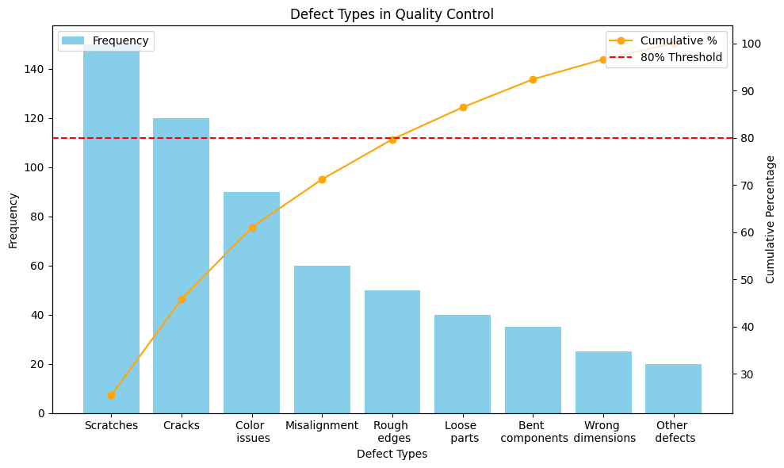

A Pareto Chart helps manufacturing teams cut through the chaos when problems arrive in clusters—defects, delays, downtime, and customer complaints all competing for attention. With limited resources and time, how do you decide which fire to put out first?

<!--more-->

A Pareto Chart is a decision-making tool that reveals which problems deserve immediate attention and which can wait. Based on the principle that roughly 80% of problems stem from 20% of causes, this visual tool transforms chaos into clarity. It shows manufacturing teams exactly where to focus their efforts for maximum impact.

## What is the Pareto Principle ?

The Pareto Principle, discovered by Italian economist Vilfredo Pareto in 1896, reveals a universal truth: imbalance is the norm, not the exception. Pareto originally observed that 80% of Italy's land belonged to 20% of the population. This same pattern appears everywhere in manufacturing.

Think about your own facility. Chances are, most of your headaches come from a handful of root causes. A few machines cause most breakdowns. A small number of suppliers create most delays. A limited set of defect types generate most customer complaints. The Pareto Chart makes these hidden patterns visible, turning intuition into actionable data.

If you prefer video, watch this quick explainer to understand the Pareto Principle:

<lite-youtube videoid="lsGwqk_agcQ" params="rel=0" style="margin-top: 20px; margin-bottom: 20px; width: 100%; height: 480px;" title="YouTube video player"></lite-youtube>

### Pareto Chart Formula

Creating a Pareto Chart involves a straightforward calculation process. Here's the step-by-step formula approach:

**Step 1: Calculate Frequency or Impact**

First, count how many times each problem occurs (or calculate the cost/impact of each problem type).

```
Frequency = Number of occurrences for each category
```

**Step 2: Calculate Total**

Add up all frequencies to get the total:

```
Total = Sum of all frequencies
```

**Step 3: Calculate Individual Percentage**

For each category, calculate what percentage it represents of the total:

```
Individual Percentage = (Category Frequency / Total) × 100
```

**Step 4: Calculate Cumulative Percentage**

Starting from the largest category, add percentages progressively:

```
Cumulative Percentage = Sum of all previous percentages + Current percentage
```

## What Does a Pareto Chart Show?

A Pareto Chart combines the best of both worlds—the immediate clarity of a bar graph with the cumulative insight of a line graph. Here's what makes it powerful:

**The Bars Tell the Story**: Each vertical bar represents a problem category, arranged from tallest to shortest. The height shows frequency or impact. This simple arrangement immediately draws your eye to the biggest problems—no statistical knowledge required.

**The Line Shows the Opportunity**: The cumulative percentage line climbs from left to right, showing the combined impact of addressing each problem. When this line starts to flatten, you've found your "vital few"—the problems that, once solved, will transform your operation.

**The Axes Frame the Decision**: The left axis measures actual occurrences, the right shows cumulative percentage, and the horizontal axis lists your problem categories. Together, they create a complete picture that anyone can understand and act upon.

This visualization does something remarkable: it makes the invisible visible. Problems that seemed equally important suddenly reveal their true impact. The path forward becomes clear.

## Pareto Real World Example

{data-zoomable}
_Pareto Chart showing defect categories in manufacturing with bars for scratches, cracks, color issues, and other defects, alongside a cumulative percentage line._

Look at this real Pareto Chart from a manufacturing facility. The bars show different types of defects found in one month, arranged from most common (scratches) to least common (other defects).

Here's the key insight: See where the orange line crosses the 80% mark? It happens after just three defect types—scratches, cracks, and color issues. This means:

- Fix these three problems → Eliminate 80% of all defects
- Ignore the other six for now → Save time and resources

Instead of trying to fix nine different problems, the team focuses on just three:

1. Why do scratches happen? (Maybe rough handling)
2. What causes cracks? (Could be temperature changes)  
3. How to fix color issues? (Check supplier materials)

This simple focus typically cuts total defects by 60-70% in just a few months. That's the power of Pareto—work smarter, not harder.

## What is a Pareto chart used for ?

1. **Quality Control**
   Smart manufacturers prioritize defects, not just track them. When teams break down defects into specific categories—particle contamination, dimensional variations, assembly errors, material flaws—each reveals different root causes requiring targeted solutions.

The key is specificity. Generic "defect" tracking will not reveal actionable insights. Break them down into meaningful categories that point to specific improvement opportunities.

2. **Equipment Maintenance**
   Traditional maintenance schedules treat all equipment equally, but Pareto analysis reveals this approach wastes resources. Manufacturing studies show that bearing wear and sensor failures often account for nearly 50% of all equipment failure occurrences. By identifying which specific components cause the most downtime, teams can shift from time-based maintenance to condition monitoring on critical equipment.

The lesson: focus your predictive maintenance budget where failures hurt most.

3. **Supply Chain Intelligence**
   When supplier issues multiply, Pareto Charts cut through the noise. Manufacturing teams tracking supplier-caused delays often discover that a small fraction of suppliers cause the majority of production stoppages. This data-driven insight enables targeted negotiations for backup agreements and buffer stock arrangements with critical suppliers.

4. **Safety Management**
   Safety teams using Pareto analysis on incident data typically find that specific operations or areas account for the majority of lost-time incidents. This focused view enables targeted ergonomic improvements and specialized training where they will prevent the most harm.

Safety resources are precious. Pareto Charts ensure they go where they will have maximum impact.

5. **Cost Reduction**
   Not all problems cost the same. Frequency alone can mislead—a defect occurring frequently but costing little to fix might be less important than rare defects causing expensive customer line stops. Cost-weighted Pareto Charts often completely reverse improvement priorities, focusing teams on high-impact issues rather than high-frequency ones.

## Why Pareto Charts Matter Now More Than Ever

Manufacturing has never been more complex. Global supply chains, tighter margins, and rising quality expectations create an environment where every resource must count. Pareto Charts provide three critical advantages:

**Speed of Decision**: In manufacturing, delayed decisions cost money. Pareto Charts compress analysis time from days to minutes. One glance tells you where to act.

**Universal Understanding**: From operators to executives, everyone understands a Pareto Chart. This shared comprehension accelerates buy-in and action. No statistics degree required.

**Measurable Progress**: Updated Pareto Charts clearly show whether improvements work. When bars shrink and rankings change, you know you're winning.

Pareto Charts do more than solve today's problems—they shape tomorrow's strategy. Patterns across multiple Pareto analyses reveal systemic issues. If supplier problems consistently top your charts, maybe it's time to reconsider your sourcing strategy. If equipment failures dominate, perhaps automation or equipment upgrade investments make sense.

Smart organizations use Pareto trends to anticipate future problems. If a previously minor issue starts climbing the ranks over successive months, they investigate before it becomes critical.

## Conclusion

In manufacturing, success isn't about solving every problem—it's about solving the right problems first. Pareto Charts cut through the noise to show you exactly where your efforts will deliver the greatest returns. By focusing on the vital few causes that drive the majority of your issues, you transform scattered firefighting into strategic improvement.

The beauty of Pareto analysis lies in its simplicity. No complex formulas, no statistical expertise required—just clear visual evidence that guides your team toward impact. Whether you're reducing defects, minimizing downtime, or cutting costs, the Pareto principle remains your compass: tackle the 20% that matters, and watch 80% of your problems disappear.

But knowing the principle and applying it in real-time are two different challenges. Modern manufacturing moves fast, and static charts built from monthly data reports can't keep pace. [FlowFuse](/) bridges this gap by connecting directly to your production systems, automatically collecting data, and generating dynamic Pareto Charts that evolve as your operation does. See problems emerge before they escalate. Track improvements as they happen. Make decisions backed by live data, not outdated reports.

The first step is always the hardest—and the most important. Choose one persistent problem area this week. Gather the data. Build your first Pareto Chart. You'll be surprised how quickly priorities become obvious and how fast your team aligns around them.

**Next up:** read our article on [building interactive Pareto Charts in FlowFuse](/blog/2025/09/creating-pareto-chart/) that connect directly to your production systems.
**Ready to transform your manufacturing data into actionable insights?** 

Stop guessing which problems to tackle first. [Try FlowFuse free for 14 days](https://app.flowfuse.com/account/create) and build automated Pareto Charts that connect directly to your production data, or [see a live demo](https://flowfuse.com/book-demo/) of how leading manufacturers identify their vital few problems in real-time.
