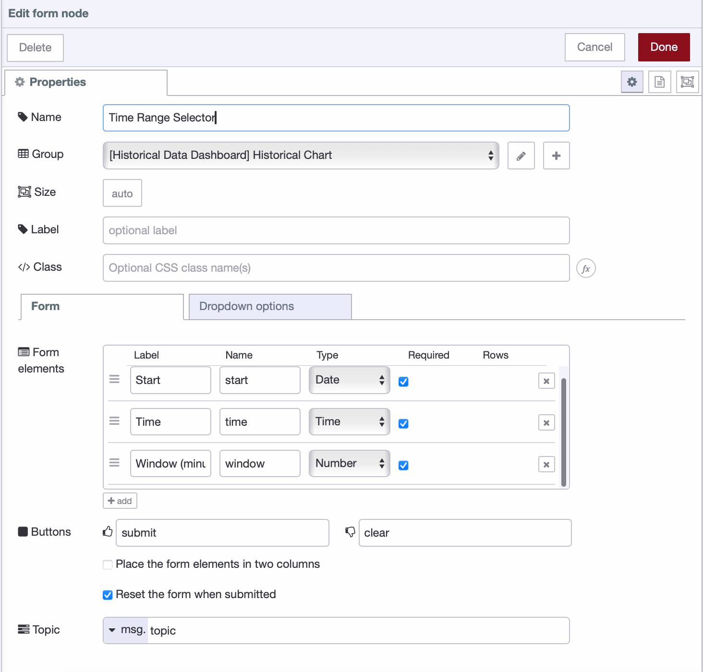
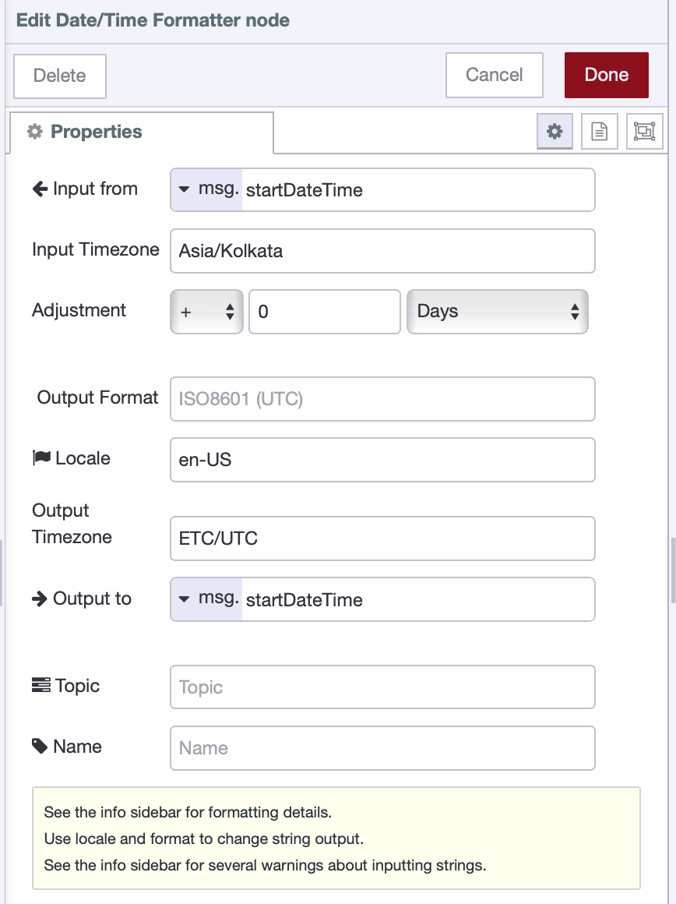
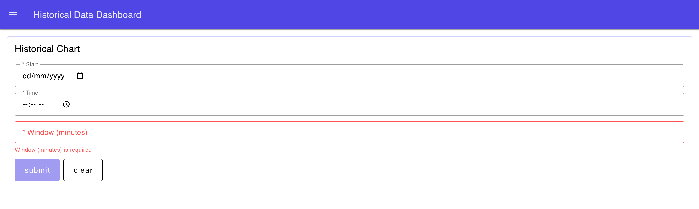

In Industrial IoT, tracking data over time is crucial. Whether you’re monitoring temperature changes throughout the day, spotting machine downtime, or analyzing production trends across shifts, a historical data dashboard helps you see important patterns clearly.

<!--more-->

This tutorial guides you through building such a dashboard using FlowFuse Tables. FlowFuse Tables currently provides a managed PostgreSQL database—a reliable and widely used system—which we will use throughout this tutorial to store time-series data.

## Why PostgreSQL for Time-Series Data?

You might wonder if PostgreSQL can efficiently handle large volumes of time-series data. The answer is yes—when configured properly. Without optimization, query performance can slow as data grows. However, by using techniques like batch inserts and smart indexing, PostgreSQL delivers fast and reliable access even at an industrial scale.

We chose PostgreSQL as the first database offering in FlowFuse Tables because it is flexible, reliable, and open source. It serves as a solid foundation for FlowFuse Tables. Whether your data comes from IIoT sensors or other sources, PostgreSQL is well equipped to handle it.

## Prerequisites

Before we begin, please ensure you have the following set up:

* A FlowFuse Enterprise account, as FlowFuse Tables is an exclusive Enterprise feature.
* The `@flowfuse/node-red-dashboard` package installed in your FlowFuse instance to create the user interface.
* The `node-red-contrib-moment` node installed for handling date and time operations within your flows.
* FlowFuse Tables configured for your FlowFuse Team with a managed PostgreSQL database.

If you are new to FlowFuse Tables, we highly recommend reading our [getting started guide](/blog/2025/08/getting-started-with-flowfuse-tables/) to familiarize yourself with the basics.

## Creating an Optimized Database Schema

Our first step is to design a database table structured for both high-speed writes and efficient queries.

### Step 1: Design and Create the Table

We will create a single table to hold all our sensor data. The key is to use appropriate data types and indexes to ensure performance.

1.  In your FlowFuse Node-RED instance, drag a **Query node** onto the canvas.

2.  Configure the node with the following SQL statement to create the table and its indexes:

    ```sql
    CREATE TABLE sensor_readings (
        id SERIAL PRIMARY KEY,
        timestamp TIMESTAMPTZ NOT NULL DEFAULT NOW(),
        sensor_id VARCHAR(50) NOT NULL,
        location VARCHAR(100),
        temperature DECIMAL(5,2)
    );

    CREATE INDEX idx_timestamp ON sensor_readings(timestamp DESC);
    CREATE INDEX idx_sensor_timestamp ON sensor_readings(sensor_id, timestamp DESC);
    ```

**Schema Breakdown:**

  * `TIMESTAMPTZ`: We use this data type to store timestamps with timezone information. This is critical for applications with sensors spread across different geographical locations, ensuring data is always consistent.
  * **Indexes**: The indexes are vital for query speed. The `DESC` (descending) keyword in our `idx_timestamp` is a specific optimization. It pre-sorts the data from newest to oldest. When you runs a common query like `SELECT * FROM sensor_readings ORDER BY timestamp DESC LIMIT 10` to fetch the latest readings, PostgreSQL can use this index to retrieve the data instantly without performing a costly sort operation.

> **Important:** The `DESC` index provides a significant performance boost for queries that explicitly use `ORDER BY timestamp DESC`. If you need to process data chronologically from oldest to newest, you would create a standard ascending index (the default).

3.  To execute this one-time setup, connect an **Inject node** to the input of the **Query node** and a **Debug node** to its output.
4.  Click **Deploy**, then click the button on the **Inject node** to create your table.

### Step 2: Storing Sensor Data Efficiently with Batch Inserts

Writing every single sensor reading to the database individually can create significant overhead and slow down performance. A much more efficient method is to "batch" readings together and write them in a single transaction.

Let's build a flow to simulate sensor data and batch-insert it.

1.  Add an **Inject node** configured to repeat every **1 second** to simulate a continuous stream of data.

2.  Connect it to a **Change node** that generates a simulated sensor reading. Configure it to set `msg.payload` using the following JSONata expression:

    ```json
    {
        "sensor_id": "sensor_01",
        "location": "Production Line A",
        "temperature": 20 + $random() * 5
    }
    ```

3.  Add another **Change node** to add a precise timestamp to each reading.

      - Set `msg.payload.timestamp`
      - To the value type **timestamp**.

4.  Now, add a **Function node** named "Batch Accumulator". This node uses the Node-RED context store to collect readings until a specified batch size is met. Paste the following JavaScript code into function node:

    ```javascript
    // Store readings in context until batch size is reached
    const batchSize = 100;
    const readings = context.get('readings') || [];

    readings.push(msg.payload);

    // Only proceed if the batch size is met
    if (readings.length >= batchSize) {
        // Prepare the parameterized query string for a batch insert
        const values = readings.map((_, i) =>
            `($${i * 4 + 1}, $${i * 4 + 2}, $${i * 4 + 3}, $${i * 4 + 4})`
        ).join(',');

        msg.query = `
            INSERT INTO sensor_readings 
            (timestamp, sensor_id, location, temperature)
            VALUES ${values}
        `;

        // Flatten the array of reading objects into a single array of values
        msg.params = readings.flatMap(r => [
            r.timestamp,
            r.sensor_id,
            r.location,
            r.temperature
        ]);

        // Clear the context for the next batch
        context.set('readings', []);
        return msg;
    }

    // If batch is not full, store it and stop the flow
    context.set('readings', readings);
    return null;
    ```

5.  Connect the output of the "Batch Accumulator" to a **Query node**. This node will receive the fully formed `msg.query` and execute the batch insert.

6.  Deploy the flow. It will now collect 100 readings (over 100 seconds) and perform a single, highly efficient database write instead of 100 separate ones.

## Building the Interactive Dashboard

With data flowing into our database, let's create a user interface to query and visualize it.

### Step 3: Create an Interactive Time Range Selector

We'll start with a form that allows users to select a date, time, and duration to view.

1.  Drag a **ui_form** onto the canvas. Create a new dashboard group for it and add the following form elements:

{data-zoomable}
_Time Range Selector form configuration in Node-RED Dashboard_


2.  Connect the output of the form to a **Change node** to format the input, add these rules to change node:

      - Set `msg.startDateTime` to the JSONata expression: `payload.start & "T" & payload.time & ":00"`
      - Set `msg.windowMinutes` to the expression: `payload.window`

3.  Next, add a **Date/Time Formatter node**. This is crucial for handling timezones correctly. Configure it as follows:

    
      - Input property: `msg.startDateTime`
      - Input timezone: your local timezone, for example, `Asia/Kolkata`
      - Output timezone: `Etc/UTC` (to match the database `TIMESTAMPTZ` standard)
      - Output property: `msg.startDateTime`


{data-zoomable}
_Configuring the Date/Time Formatter node to convert from local timezone to UTC_


4.  Add one more **Change node** to set the query parameters for our SQL query. Set `msg.params` to the following JSONata expression:

    ```json
    [
        msg.startDateTime,
        msg.windowMinutes & " minutes"
    ]
    ```

5.  Finally, connect this to a **Query node** with the following parameterized SQL. This query fetches the data for the selected time window.

    ```sql
    SELECT 
        timestamp,
        temperature,
    FROM sensor_readings
    WHERE sensor_id = 'sensor_01'
      AND timestamp >= $1::timestamptz
      AND timestamp < ($1::timestamptz + $2::interval)
    ORDER BY timestamp DESC;
    ```

6.  You can connect a **Debug node** after this query to test your flow. Deploy the flow, select a **date**, **time**, and **window** on the dashboard, then verify that the correct data appears in the debug panel.

{data-zoomable}
_Complete time range selector form_

### Step 4: Display the Data in a Chart

The final step is to visualize the query result.

1.  Connect the output of the final **Query node** to a **ui_chart** widget.

2.  Configure the chart node:

      - Group: Create new group for chart.
      - Type: Line
      - X: Set to `timestamp` as a key.
      - Y: Set to `temperature` as a key.
      - Series: Set to "Temperature" as string.

3.  Deploy the flow. Your complete historical data dashboard is now live!

{data-zoomable}
_Historical data dashboard retrieving and displaying historical data_

Below is the complete flow we built in this tutorial.



[{"id":"f6f6bd2c78547168","type":"group","z":"fa9da3f45f949067","name":"Create Table","style":{"label":true},"nodes":["52f82d4aa9a97588","0d98257815fb40e3","65d5d7b8975fc2f0"],"x":34,"y":319,"w":572,"h":82},{"id":"52f82d4aa9a97588","type":"inject","z":"fa9da3f45f949067","g":"f6f6bd2c78547168","name":"","props":[],"repeat":"","crontab":"","once":false,"onceDelay":0.1,"topic":"","x":130,"y":360,"wires":[["0d98257815fb40e3"]]},{"id":"0d98257815fb40e3","type":"tables-query","z":"fa9da3f45f949067","g":"f6f6bd2c78547168","name":"Create Table","query":"    CREATE TABLE sensor_readings (\n        id SERIAL PRIMARY KEY,\n        timestamp TIMESTAMPTZ NOT NULL DEFAULT NOW(),\n        sensor_id VARCHAR(50) NOT NULL,\n        location VARCHAR(100),\n        temperature DECIMAL(5,2)\n    );\n\n    CREATE INDEX idx_timestamp ON sensor_readings(timestamp DESC);\n    CREATE INDEX idx_sensor_timestamp ON sensor_readings(sensor_id, timestamp DESC);","split":false,"rowsPerMsg":1,"x":290,"y":360,"wires":[["65d5d7b8975fc2f0"]]},{"id":"65d5d7b8975fc2f0","type":"debug","z":"fa9da3f45f949067","g":"f6f6bd2c78547168","name":"debug 1","active":true,"tosidebar":true,"console":false,"tostatus":false,"complete":"false","statusVal":"","statusType":"auto","x":500,"y":360,"wires":[]},{"id":"15627074513a2ad7","type":"group","z":"fa9da3f45f949067","name":"Simulate Sensor and perform batch insert","style":{"label":true},"nodes":["eb1bb5193ddde8ba","60315b8ef9fe44ae","c6390c75effe5e20","296d4a80db186ac8","d9be1d81b114f59e","08258bdd680649c5"],"x":34,"y":419,"w":1072,"h":82},{"id":"eb1bb5193ddde8ba","type":"inject","z":"fa9da3f45f949067","g":"15627074513a2ad7","name":"","props":[{"p":"payload"},{"p":"topic","vt":"str"}],"repeat":"1","crontab":"","once":false,"onceDelay":0.1,"topic":"","payload":"","payloadType":"date","x":150,"y":460,"wires":[["d9be1d81b114f59e"]]},{"id":"60315b8ef9fe44ae","type":"tables-query","z":"fa9da3f45f949067","g":"15627074513a2ad7","name":"Query","query":"qconst batchSize = 100;\nconst readings = context.get('readings') || [];\n\nreadings.push(msg.payload);\n\nif (readings.length >= batchSize) {\n    // Prepare batch insert\n    const values = readings.map((_, i) => \n        `($${i*7+1}, $${i*7+2}, $${i*7+3}, $${i*7+4}, $${i*7+5}, $${i*7+6}, $${i*7+7})`\n    ).join(',');\n    \n    msg.query = `\n        INSERT INTO sensor_readings \n        (timestamp, sensor_id, location, temperature, humidity, pressure, quality_score)\n        VALUES ${values}\n    `;\n    \n    msg.params = readings.flatMap(r => [\n        new Date(),\n        r.sensor_id,\n        r.location,\n        r.temperature,\n        r.humidity,\n        r.pressure,\n        r.quality_score\n    ]);\n    \n    context.set('readings', []);\n    return msg;\n}\n\ncontext.set('readings', readings);\nreturn null;","split":false,"rowsPerMsg":1,"x":870,"y":460,"wires":[["296d4a80db186ac8"]]},{"id":"c6390c75effe5e20","type":"function","z":"fa9da3f45f949067","g":"15627074513a2ad7","name":"Batch Accumulator","func":"// Store readings in context until batch size is reached\nconst batchSize = 100;\nconst readings = context.get('readings') || [];\n\n// Add timestamp to the reading when it arrives\nmsg.payload.timestamp = new Date();\nreadings.push(msg.payload);\n\nif (readings.length >= batchSize) {\n    // Prepare batch insert\n    const values = readings.map((_, i) =>\n        `($${i * 7 + 1}, $${i * 7 + 2}, $${i * 7 + 3}, $${i * 7 + 4}, $${i * 7 + 5}, $${i * 7 + 6}, $${i * 7 + 7})`\n    ).join(',');\n\n    msg.query = `\n        INSERT INTO sensor_readings \n        (timestamp, sensor_id, location, temperature, humidity, pressure, quality_score)\n        VALUES ${values}\n    `;\n\n    msg.params = readings.flatMap(r => [\n        r.timestamp,  // Now each reading has its own timestamp!\n        r.sensor_id,\n        r.location,\n        r.temperature,\n        r.humidity,\n        r.pressure,\n        r.quality_score\n    ]);\n\n    context.set('readings', []);\n    return msg;\n}\n\ncontext.set('readings', readings);\nreturn null;","outputs":1,"timeout":0,"noerr":0,"initialize":"","finalize":"","libs":[],"x":710,"y":460,"wires":[["60315b8ef9fe44ae"]]},{"id":"296d4a80db186ac8","type":"debug","z":"fa9da3f45f949067","g":"15627074513a2ad7","name":"debug 2","active":true,"tosidebar":true,"console":false,"tostatus":false,"complete":"false","statusVal":"","statusType":"auto","x":1000,"y":460,"wires":[]},{"id":"d9be1d81b114f59e","type":"change","z":"fa9da3f45f949067","g":"15627074513a2ad7","name":"Simulate Sensor","rules":[{"t":"set","p":"payload","pt":"msg","to":"{\t   \"sensor_id\": \"sensor_01\",\t   \"location\": \"Production Line A\",\t   \"temperature\": 20 + $random() * 5,\t   \"humidity\": 40 + $random() * 20,\t   \"pressure\": 1010 + $random() * 10,\t   \"quality_score\": $floor(85 + $random() * 15)   \t}","tot":"jsonata"}],"action":"","property":"","from":"","to":"","reg":false,"x":320,"y":460,"wires":[["08258bdd680649c5"]]},{"id":"08258bdd680649c5","type":"change","z":"fa9da3f45f949067","g":"15627074513a2ad7","name":"Add timestamp","rules":[{"t":"set","p":"payload.timestamp","pt":"msg","to":"iso","tot":"date"}],"action":"","property":"","from":"","to":"","reg":false,"x":520,"y":460,"wires":[["c6390c75effe5e20"]]},{"id":"97ce85da34597712","type":"group","z":"fa9da3f45f949067","name":"Historical data dashboard","style":{"label":true},"nodes":["e4afef5f243c8da0","717eabd27b6fbe18","fc6a0e85d73405a2","876e69e260a0f3bf","0c50224e220917b2","9336c25df2fcbbaa"],"x":34,"y":519,"w":1092,"h":82},{"id":"e4afef5f243c8da0","type":"ui-chart","z":"fa9da3f45f949067","g":"97ce85da34597712","group":"bb833d0dec39ffd7","name":"chart","label":"","order":1,"chartType":"line","category":"Temperature","categoryType":"str","xAxisLabel":"","xAxisProperty":"timestamp","xAxisPropertyType":"property","xAxisType":"time","xAxisFormat":"","xAxisFormatType":"ccc HH:mm","xmin":"","xmax":"","yAxisLabel":"","yAxisProperty":"temperature","yAxisPropertyType":"property","ymin":"","ymax":"","bins":10,"action":"replace","stackSeries":false,"pointShape":"circle","pointRadius":4,"showLegend":true,"removeOlder":1,"removeOlderUnit":"3600","removeOlderPoints":"","colors":["#0095ff","#ff0000","#ff7f0e","#2ca02c","#a347e1","#d62728","#ff9896","#9467bd","#c5b0d5"],"textColor":["#666666"],"textColorDefault":true,"gridColor":["#e5e5e5"],"gridColorDefault":true,"width":"12","height":8,"className":"","interpolation":"linear","x":1050,"y":560,"wires":[[]]},{"id":"717eabd27b6fbe18","type":"ui-form","z":"fa9da3f45f949067","g":"97ce85da34597712","name":"","group":"6d7a8eed50e3a59b","label":"","order":1,"width":0,"height":0,"options":[{"label":"Start","key":"start","type":"date","required":true,"rows":null},{"label":"Time","key":"time","type":"time","required":true,"rows":null},{"label":"Window (minutes)","key":"window","type":"number","required":true,"rows":null}],"formValue":{"start":"","time":"","window":""},"payload":"","submit":"submit","cancel":"clear","resetOnSubmit":true,"topic":"topic","topicType":"msg","splitLayout":"","className":"","passthru":false,"dropdownOptions":[],"x":110,"y":560,"wires":[["fc6a0e85d73405a2"]]},{"id":"fc6a0e85d73405a2","type":"change","z":"fa9da3f45f949067","g":"97ce85da34597712","name":"","rules":[{"t":"set","p":"startDateTime","pt":"msg","to":"payload.start & \"T\" & payload.time & \":00\"","tot":"jsonata"},{"t":"set","p":"windowMinutes","pt":"msg","to":"payload.window","tot":"msg"}],"action":"","property":"","from":"","to":"","reg":false,"x":320,"y":560,"wires":[["0c50224e220917b2"]]},{"id":"876e69e260a0f3bf","type":"tables-query","z":"fa9da3f45f949067","g":"97ce85da34597712","name":"","query":"    SELECT \n        timestamp,\n        temperature,\n        humidity,\n        pressure\n    FROM sensor_readings\n    WHERE sensor_id = 'sensor_01'\n      AND timestamp >= $1::timestamptz\n      AND timestamp < ($1::timestamptz + $2::interval)\n    ORDER BY timestamp DESC;","split":false,"rowsPerMsg":1,"x":910,"y":560,"wires":[["e4afef5f243c8da0"]]},{"id":"0c50224e220917b2","type":"moment","z":"fa9da3f45f949067","g":"97ce85da34597712","name":"","topic":"","input":"startDateTime","inputType":"msg","inTz":"Asia/Kolkata","adjAmount":0,"adjType":"days","adjDir":"add","format":"","locale":"en-US","output":"startDateTime","outputType":"msg","outTz":"ETC/UTC","x":540,"y":560,"wires":[["9336c25df2fcbbaa"]]},{"id":"9336c25df2fcbbaa","type":"change","z":"fa9da3f45f949067","g":"97ce85da34597712","name":"Set Params","rules":[{"t":"set","p":"params","pt":"msg","to":"[     msg.startDateTime,     msg.windowMinutes & \" minutes\"   ]","tot":"jsonata"}],"action":"","property":"","from":"","to":"","reg":false,"x":750,"y":560,"wires":[["876e69e260a0f3bf"]]},{"id":"bb833d0dec39ffd7","type":"ui-group","name":"Historical Chart","page":"d79b42b732ce9e5b","width":"12","height":1,"order":2,"showTitle":true,"className":"","visible":"true","disabled":"false","groupType":"default"},{"id":"6d7a8eed50e3a59b","type":"ui-group","name":"Form","page":"d79b42b732ce9e5b","width":"12","height":1,"order":1,"showTitle":false,"className":"","visible":"true","disabled":"false","groupType":"default"},{"id":"d79b42b732ce9e5b","type":"ui-page","name":"Historical Data Dashboard","ui":"afea04ce8735c0a6","path":"/historical-data","icon":"home","layout":"grid","theme":"6d8bff5f3fded5c2","breakpoints":[{"name":"Default","px":"0","cols":"3"},{"name":"Tablet","px":"576","cols":"6"},{"name":"Small Desktop","px":"768","cols":"9"},{"name":"Desktop","px":"1024","cols":"12"}],"order":1,"className":"","visible":"true","disabled":"false"},{"id":"afea04ce8735c0a6","type":"ui-base","name":"UI Name","path":"/dashboard","includeClientData":true,"acceptsClientConfig":["ui-control","ui-notification"]},{"id":"6d8bff5f3fded5c2","type":"ui-theme","name":"FF Theme","colors":{"surface":"#5046e5","primary":"#5046e5","bgPage":"#ffffff","groupBg":"#ffffff","groupOutline":"#d4d1ff"},"sizes":{"density":"default","pagePadding":"15px","groupGap":"15px","groupBorderRadius":"4px","widgetGap":"12px"}},{"id":"fe8aa2ddfe955f18","type":"global-config","env":[],"modules":{"@flowfuse/nr-tables-nodes":"0.1.0","@flowfuse/node-red-dashboard":"1.25.0","node-red-contrib-moment":"5.0.0"}}]


## Conclusion

You have successfully built a historical data dashboard using FlowFuse Tables and Node-RED. By implementing efficient batch inserts and optimized query patterns, you have created a solution that is both powerful and scalable for demanding Industrial IoT environments.

With FlowFuse Tables now part of the platform, you can build complete industrial applications without juggling external databases or leaving the FlowFuse environment. FlowFuse is now a comprehensive data platform with the ability to collect, connect, transform, store, and visualize data. Combined with FlowFuse's enterprise features—team collaboration, version control, device management, and secure deployments—you have everything needed to take your IIoT projects from prototype to production within one integrated platform.

This means less complexity and faster time to value for your industrial data initiatives. Your historical dashboards, real-time monitoring, and OEE dashboards can all live in the same ecosystem, managed by the same team, with consistent security and governance controls.

[Start using FlowFuse today](https://app.flowfuse.com/account/create) to make your IIoT data work for you.
