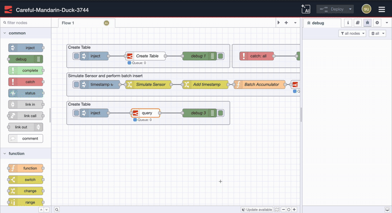

In our previous posts, we covered [getting started with FlowFuse Tables](/blog/2025/08/getting-started-with-flowfuse-tables/) and [building time-series dashboards](/blog/2025/08/time-series-dashboard-flowfuse-postgresql/). Both required writing SQL queries to get data from your tables.

<!--more-->

FlowFuse 2.20 introduces an AI Assistant in Tables nodes that converts natural language prompts into SQL queries. Instead of writing SQL manually, you can describe what you want and let the assistant generate the query based on your table structure.

## Getting Started

If you have the `sensor_readings` table from our earlier tutorials, you're ready to try the AI Assistant. Open your Table node and you'll see a new "Assistant" field where you can enter natural language prompts.

Let's start simple. Instead of writing `SELECT * FROM sensor_readings WHERE timestamp >= DATE_TRUNC('day', CURRENT_DATE)`, just type "Show me all readings from today" and the assistant generates the SQL for you.

Try it now:

1. Add an Inject node.
2. Connect it to your Table node. Open the Table node, enter your prompt in the "Assistant" field, and then click the "Ask the FlowFuse Assistant" option.

{data-zoomable}
_FlowFuse Ai Assistant in table node_

3. Connect a Debug node and deploy the flow.

## Practical Examples

Now let's explore different types of queries you can make with natural language prompts.

### Filtering Your Data

**Temperature threshold monitoring:**
Prompt: "Show me readings where temperature is above 22 degrees"

<lite-youtube videoid="M_CIoHiSW6s" params="rel=0" style="margin-top: 20px; margin-bottom: 20px; width: 100%; height: 480px;" title="YouTube video player"></lite-youtube>

This generates a query that filters your sensor data for temperature values exceeding your specified threshold—perfect for monitoring overheating conditions.

**Time-based filtering:**
Prompt: "Get the last 24 hours of temperature readings"

<lite-youtube videoid="M_CIoHiSW6s" params="rel=0" style="margin-top: 20px; margin-bottom: 20px; width: 100%; height: 480px;" title="YouTube video player"></lite-youtube>

The assistant understands relative time references and creates the appropriate date filtering logic.

### Working with Aggregations

**Performance averages:**
Prompt: "What's the average temperature for this week?"

<lite-youtube videoid="M_CIoHiSW6s" params="rel=0" style="margin-top: 20px; margin-bottom: 20px; width: 100%; height: 480px;" title="YouTube video player"></lite-youtube>

Instead of writing complex date functions and GROUP BY clauses, simply ask for the metric you need.

**Finding extremes:**
Prompt: "Find the highest temperature reading this month"

<lite-youtube videoid="M_CIoHiSW6s" params="rel=0" style="margin-top: 20px; margin-bottom: 20px; width: 100%; height: 480px;" title="YouTube video player"></lite-youtube>

The assistant handles MAX functions and date ranges automatically.

### Time-Based Grouping

**Hourly analysis:**
Prompt: "Average temperature per hour today"

<lite-youtube videoid="M_CIoHiSW6s" params="rel=0" style="margin-top: 20px; margin-bottom: 20px; width: 100%; height: 480px;" title="YouTube video player"></lite-youtube>

This creates queries with proper time grouping—invaluable for identifying patterns throughout the day.

Perfect for creating summary reports or identifying trends over multiple days.

## Advanced Query Patterns

The AI Assistant handles more complex scenarios too:

**Multi-condition filtering:**
Prompt: "Show readings where temperature > 20, temperature < 25, and temperature ≠ 22"

<lite-youtube videoid="M_CIoHiSW6s" params="rel=0" style="margin-top: 20px; margin-bottom: 20px; width: 100%; height: 480px;" title="YouTube video player"></lite-youtube>

**Statistical analysis:**
Prompt: "Calculate standard deviation of temperature readings this month"

<lite-youtube videoid="M_CIoHiSW6s" params="rel=0" style="margin-top: 20px; margin-bottom: 20px; width: 100%; height: 480px;" title="YouTube video player"></lite-youtube>

## Building on Our AI-First Vision

Recently, we showed how [FlowFuse's AI Assistant is helping engineers focus on building solutions rather than writing code](https://flowfuse.com/blog/2025/07/flowfuse-ai-assistant-better-node-red-manufacturing/). The AI Assistant in Tables continues this mission—removing another layer of technical complexity so your team can focus on what matters most.

First, we helped engineers write JavaScript function nodes without coding from scratch. Now, we're removing SQL barriers from data access. Each step makes industrial development more intuitive and accessible to your entire team.

The Tables AI Assistant takes our simplification mission further. No more waiting for data analysts to write queries. No more learning SQL syntax to get basic production metrics. Your entire team can now access critical data instantly using the language they already speak.

This is how FlowFuse evolves—each release removes another layer of complexity. What used to require specialized knowledge becomes accessible to everyone. Building industrial solutions gets easier, teams move faster, and good ideas don't get stuck waiting for technical implementation.

## The Complete FlowFuse Platform

FlowFuse is building the future of industrial automation and digital transformation by removing technical complexity. Our platform combines Node-RED with enterprise-grade capabilities and intelligent AI assistance across every part of developement, so you can focus on solving real problems.

With FlowFuse, you can use Node-RED's simple low-code approach to connect equipment, collect data, transform it, and visualize it. Whether you're integrating old systems, monitoring production lines, or creating real-time dashboards, FlowFuse provides the infrastructure and intelligence to speed up your development.

From generating flows to querying data, and from creating dashboards to integrating systems, FlowFuse removes technical barriers so your team can innovate faster. Engineers without SQL skills can query databases. Teams without coding backgrounds can build complex automations. Your experts can directly implement their ideas without waiting for IT support.

FlowFuse reinvents Node-RED by adding crucial features like real-time collaboration, version control, remote device monitoring, audit logs, and DevOps tools. This makes it much easier and faster to manage, deploy, scale, and secure your systems. With FlowFuse, you get complete control and unmatched capability, setting the new standard for industrial automation.

## More AI Features Coming Soon

We're just getting started. Our roadmap includes more AI features that will make industrial development much easier and faster.

Ready to experience the future of industrial automation? [Book a demo](https://flowfuse.com/book-demo/) and see how FlowFuse's AI-powered platform can transform your development workflow.