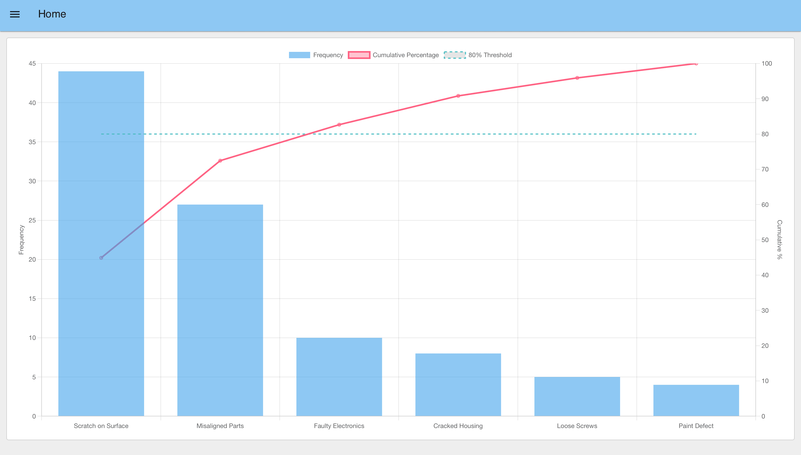
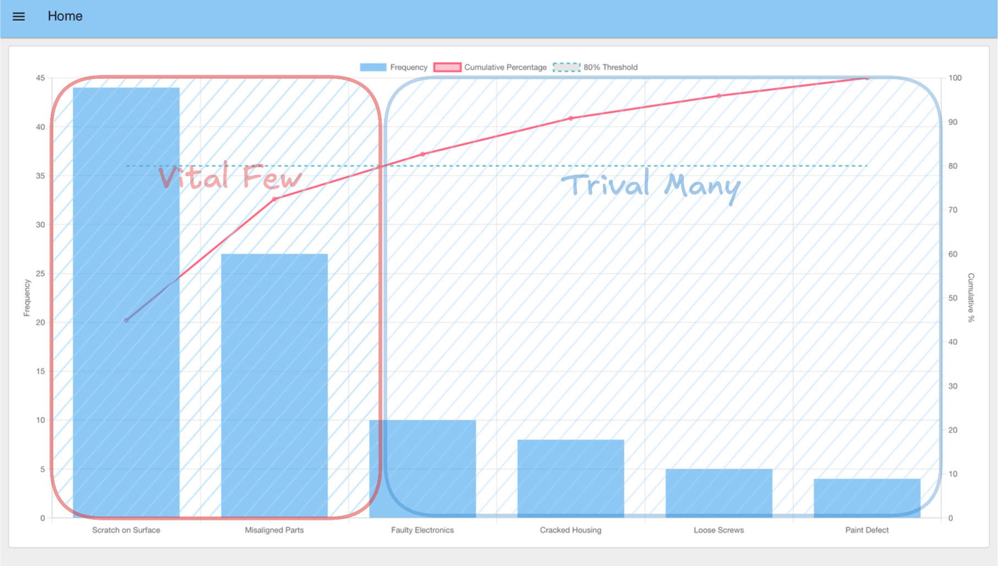

In the [first part of this series](/blog/2025/08/pareto-chart-manufacturing-guide/), we explored the foundational principles of the Pareto Chart, understanding how this powerful tool can help manufacturing teams quickly identify and focus on the "vital few" problems that have the biggest impact. We learned that by combining a bar graph and a cumulative percentage line, a Pareto Chart provides a clear visual roadmap to prioritize quality issues, equipment downtime, or other key performance indicators.

<!--more-->

Now, it's time to move from theory to practice. This guide will show you how to create a Pareto Chart using modern industrial data tools. You will learn how to connect to your production data, calculate frequencies and format data, and visualize the results in a chart that helps your team make data-driven decisions.

{data-zoomable}
_Pareto Chart showing defect categories in manufacturing with bars for scratches, cracks, color issues, and other defects, alongside a cumulative percentage line._

## Getting Started

To create a Pareto Chart for manufacturing data, you'll need access to industrial data platforms that can connect to your production systems. This guide uses FlowFuse, a low-code platform that simplifies industrial data workflows. If you don't have an account yet, you can [sign up for a 14-day free trial](https://app.flowfuse.com/).

### Step 1: Connect to Your Data Source

The first step to create a Pareto Chart is accessing the data you want to analyze. In industrial environments, machine or process data is commonly collected via [industrial protocols](/node-red/protocol/) such as [OPC-UA](/blog/2025/07/reading-and-writing-plc-data-using-opc-ua/), [MQTT](/blog/2024/06/how-to-use-mqtt-in-node-red/), or direct [database](/node-red/database/) queries. Modern industrial platforms support nearly all industrial protocols and databases, making it easy to connect to your existing systems.

To connect your data:

1. Drag the appropriate input node into your flow (e.g., an OPC-UA Read node).
2. Enter the connection details for your industrial system.
3. Test the connection to confirm that live data is flowing correctly.

If a live PLC or factory dataset is not available, you can use a simple Inject node to simulate production data and learn how to make a Pareto Chart with sample data.

### Step 2: Format and Aggregate the Data

Once data is flowing, the next step to create a Pareto Chart is to **organize it into types or categories and count how often each occurs**. A Pareto Chart is most useful when you can clearly see, for example, defect data like:

*"Scratch on Surface – 20 occurrences, Misaligned Parts – 10 occurrences, Loose Screws – 5 occurrences."*

When you make a Pareto Chart, this can be done in three steps:

1. **Format the data** – Use a JSON, CSV, or Change node to clean or convert incoming data if needed.

2. **Aggregate in a Function node** – Map each data point to a type (e.g., machine type, process step, defect category) and keep a running count of occurrences.

   > **Tip:** You do not need to know JavaScript. Simply describe the desired outcome and provide a sample dataset—the **FlowFuse Expert** will generate the Function node for you. [Learn more](/blog/2025/07/flowfuse-ai-assistant-better-node-red-manufacturing/).

3. **Sort the results** – Use a Sort node to arrange categories so the most frequent appear first.

At the end of this step, your data should be transformed into a structure like this, which is the **required format to create a Pareto Chart** in Step 3:

```json
[
  { "type": "Paint Defect", "count": 8 },
  { "type": "Faulty Electronics", "count": 6 },
  { "type": "Scratch on Surface", "count": 5 },
  { "type": "Misaligned Parts", "count": 3 },
  { "type": "Loose Screws", "count": 2 },
  { "type": "Cracked Housing", "count": 1 }
]
```

### Step 3: Visualizing the Chart

Before you can create a Pareto Chart visualization, ensure that you have installed the **`@flowfuse/node-red-dashboard`** node. This library provides the essential user interface components needed to create a real-time dashboard.

1. Open the Editor and click on the **hamburger menu** (☰) in the top-right corner.
2. Select **Manage palette**.
3. Navigate to the **Install** tab.
4. Search for **`@flowfuse/node-red-dashboard`** and click **Install**.

After installation, new UI nodes—such as **UI Chart**, **UI Gauge**, **UI Template**, and others—will appear in your palette. These nodes provide the building blocks to make a Pareto Chart and other interactive dashboard components for industrial applications.

While the standard **UI Chart** node supports most common chart types, it does not include a native **Pareto chart**. To create a Pareto Chart with advanced features, the **UI Template** node can be used, allowing you to embed custom components for fully tailored visualizations.

Below is an example showing how to create a Pareto Chart using the **UI Template** node. You can copy and import this flow directly into your editor to start using it immediately.


[{"id":"fef40951758bc433","type":"ui-template","z":"fd8e1f4dd4a1bb0b","group":"5a4c5fe0a49298d4","page":"","ui":"","name":"Pareto Chart","order":1,"width":0,"height":0,"head":"","format":"<template>\n    <canvas ref=\"chart\" />\n</template>\n\n<script src=\"https://cdn.jsdelivr.net/npm/chart.js@4\"></script>\n<script>\n    export default {\n        mounted() {\n            this.draw();\n            // Register a listener for incoming data from Node-RED\n            this.$socket.on('msg-input:' + this.id, this.onInput);\n        },\n        methods: {\n            draw() {\n                // Get the canvas element to draw the chart on\n                const ctx = this.$refs.chart;\n                \n                // Initialize the chart with no data\n                const chart = new Chart(ctx, {\n                    type: 'bar', // This is the default type\n                    data: {\n                        labels: [],\n                        datasets: []\n                    },\n                    options: {\n                        responsive: true,\n                        interaction: {\n                            mode: 'index',\n                            intersect: false,\n                        },\n                        scales: {\n                            // Left Y-axis for the bars (counts)\n                            y: {\n                                type: 'linear',\n                                display: true,\n                                position: 'left',\n                                title: {\n                                    display: true,\n                                    text: 'Frequency'\n                                },\n                                beginAtZero: true\n                            },\n                            // Right Y-axis for the cumulative line (percentages)\n                            y1: {\n                                type: 'linear',\n                                display: true,\n                                position: 'right',\n                                title: {\n                                    display: true,\n                                    text: 'Cumulative %'\n                                },\n                                // Do not display grid lines for this axis\n                                grid: {\n                                    drawOnChartArea: false,\n                                },\n                                // Ensure the percentage scale goes to 100%\n                                max: 100\n                            }\n                        }\n                    }\n                });\n                \n                // Make the chart object accessible to other methods\n                this.chart = chart;\n            },\n            onInput(msg) {\n                // Get the raw data from the incoming message payload\n                const rawData = msg.payload;\n\n                let cumulativeSum = 0;\n                const total = rawData.reduce((sum, item) => sum + item.count, 0);\n\n                const labels = [];\n                const barData = [];\n                const lineData = [];\n\n                // Process the data to build chart datasets\n                rawData.forEach(item => {\n                    labels.push(item.type);\n                    barData.push(item.count);\n\n                    // Calculate cumulative sum and percentage\n                    cumulativeSum += item.count;\n                    const cumulativePercentage = (cumulativeSum / total) * 100;\n                    lineData.push(cumulativePercentage);\n                });\n\n                // Update the chart's data and labels\n                this.chart.data.labels = labels;\n                this.chart.data.datasets = [\n                    {\n                        type: 'bar',\n                        label: 'Frequency',\n                        data: barData,\n                        backgroundColor: 'rgba(54, 162, 235, 0.6)',\n                        yAxisID: 'y'\n                    },\n                    {\n                        type: 'line',\n                        label: 'Cumulative Percentage',\n                        data: lineData,\n                        borderColor: 'rgb(255, 99, 132)',\n                        backgroundColor: 'rgba(255, 99, 132, 0.4)',\n                        fill: false,\n                        yAxisID: 'y1'\n                    },\n                    // -- START OF MODIFICATIONS --\n                    {\n                        type: 'line',\n                        label: '80% Threshold',\n                        data: labels.map(() => 80), // Creates a horizontal line at 80\n                        borderColor: 'rgba(75, 192, 192, 1)',\n                        borderWidth: 2,\n                        borderDash: [5, 5], // This property creates a dotted line\n                        fill: false,\n                        pointRadius: 0, // Hides data points\n                        yAxisID: 'y1'\n                    }\n                ];\n\n                // Redraw the chart to show the new data\n                this.chart.update();\n            }\n        }\n    }\n</script>","storeOutMessages":true,"passthru":true,"resendOnRefresh":true,"templateScope":"local","className":"","x":1030,"y":260,"wires":[[]]},{"id":"5a4c5fe0a49298d4","type":"ui-group","name":"Pareto Chart Group","page":"74853f680cb16c6c","width":"12","height":1,"order":1,"showTitle":false,"className":"","visible":"true","disabled":"false","groupType":"default"},{"id":"74853f680cb16c6c","type":"ui-page","name":"Home","ui":"d7fb2be4d7cb92b9","path":"/","icon":"home","layout":"grid","theme":"faac104f34962f3e","breakpoints":[{"name":"Default","px":"0","cols":"3"},{"name":"Tablet","px":"576","cols":"6"},{"name":"Small Desktop","px":"768","cols":"9"},{"name":"Desktop","px":"1024","cols":"12"}],"order":1,"className":"","visible":"true","disabled":"false"},{"id":"d7fb2be4d7cb92b9","type":"ui-base","name":"My Dashboard","path":"/dashboard","appIcon":"","includeClientData":true,"acceptsClientConfig":["ui-notification","ui-control"],"showPathInSidebar":false,"headerContent":"page","navigationStyle":"default","titleBarStyle":"default","showReconnectNotification":true,"notificationDisplayTime":1,"showDisconnectNotification":true,"allowInstall":true},{"id":"faac104f34962f3e","type":"ui-theme","name":"Default Theme","colors":{"surface":"#8ec8f3","primary":"#0094ce","bgPage":"#eeeeee","groupBg":"#ffffff","groupOutline":"#cccccc"},"sizes":{"density":"default","pagePadding":"12px","groupGap":"12px","groupBorderRadius":"4px","widgetGap":"12px"}},{"id":"2ebdb042b8d72fd5","type":"global-config","env":[],"modules":{"@flowfuse/node-red-dashboard":"1.26.0"}}]


### Connecting Your Real Production Data

1. Ensure your upstream data flow (from OPC-UA, MQTT, or database nodes) is cleaned and aggregated into the JSON format described in Step 2.
2. Connect the output of that flow to the **Pareto Chart (UI Template)** node you imported, then deploy the flow.
3. Whenever new data arrives, the chart will automatically update, displaying both the bars (frequency) and the cumulative percentage line.

To view the dashboard, click the **Open Dashboard** button in the top-right corner of the Dashboard 2.0 sidebar. Your newly created Pareto Chart will appear, complete with bars, the cumulative line, and the 80% threshold.

{data-zoomable}
_Pareto Chart showing defect categories in manufacturing with bars for scratches, cracks, color issues, and other defects, alongside a cumulative percentage line._

The chart visualizes defect types using bars. The cumulative line and the 80% threshold indicate the cutoff point: bars to the left of this intersection represent the vital few defects that contribute most to the total—and these are the areas where you should focus your improvement efforts.

{data-zoomable}
_Pareto Chart showing defect categories in manufacturing. The bars on the left, highlighted with a red box, represent the vital few defects_

## Takeaways

By following the steps outlined above, you have successfully learned how to create a Pareto Chart that transforms raw production data into clear, actionable insights. This visualization helps manufacturing teams focus their limited time and resources on the problems that matter most.

### Why This Matters for Your Business

The real power when you create a Pareto Chart isn't just in identifying problems—it's in changing how your team makes decisions. Instead of trying to fix everything at once or relying on gut feelings, you now have **data-driven clarity** on where to focus. This translates into:

* **Less firefighting, more strategic improvement:** Teams can stop chasing every small issue and concentrate on the critical few that truly impact production.
* **Faster problem resolution:** When everyone can see which issues dominate, alignment happens quickly and solutions get implemented faster.
* **Better conversations with management:** Visual data makes it easier to justify resource allocation and demonstrate the impact of improvement initiatives.
* **Continuous learning:** As the top issues are resolved, new patterns emerge, creating a cycle of ongoing improvement.

### Building on Your Success

With your ability to create a Pareto Chart established, you've built a foundation for **data-driven decision-making**. The same approach to make a Pareto Chart can be applied to other areas of operations:

* Track equipment downtime reasons to optimize maintenance schedules.
* Analyze customer feedback to prioritize product improvements.
* Monitor supplier performance to strengthen the supply chain.
* Identify training gaps by analyzing operator errors.

FowFuse makes it simple to replicate this success across your organization. The same flow can be deployed to multiple lines, shared with other teams, and adapted for different use cases—while maintaining security and control through enterprise-grade features.

Ready to see how FlowFuse can help your team make better decisions with production data? [Book a demo](/book-demo/) to discover how manufacturers are using visual analytics to drive continuous improvement and operational excellence.