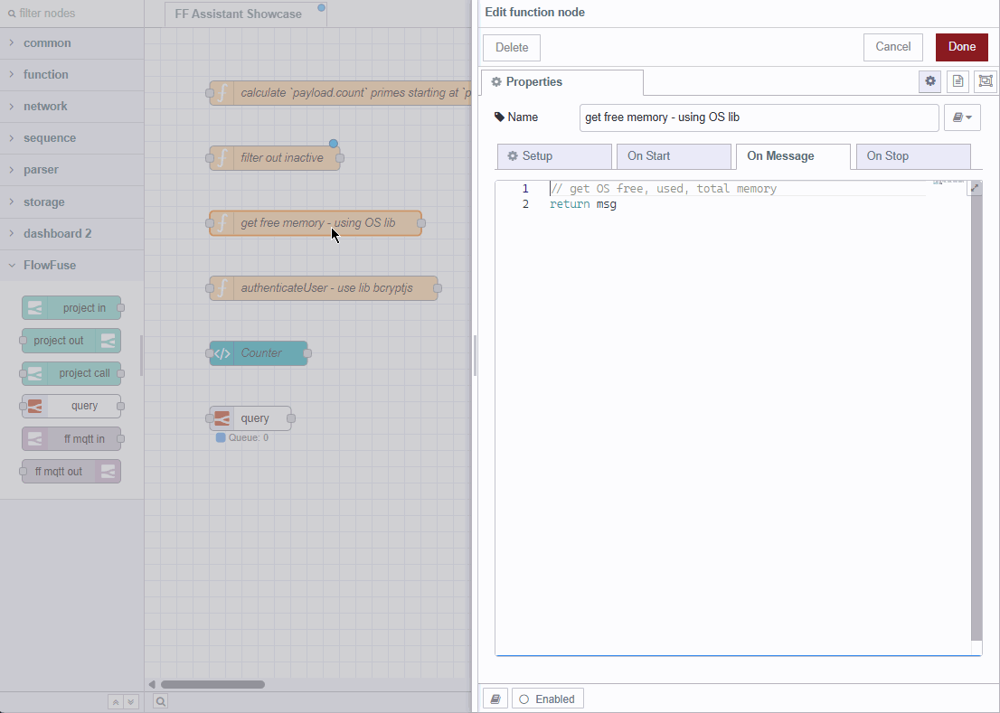
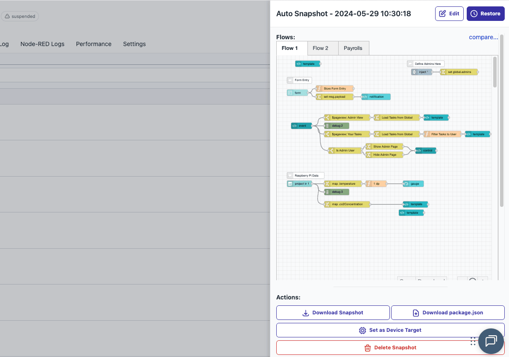

FlowFuse 2.22 provides more powerful development by bringing the FlowFuse Expert to more nodes, supports operational maturity with automatic FlowFuse Broker schema detection, and enhances the developer experience with an improved Snapshots interface, support for more powerful visualizations, a better Device Agent Installer experience, Dashboard updates, and more! Take a look:

<!--more-->

## AI Copilot for Node Editing

_FlowFuse Expert at work_

We've enhanced the capabilities of the FlowFuse Expert, which now provides automatic suggestions to draft and edit your code that extends to Tables nodes, Dashboard Template nodes (ui-template), and Function nodes. You can now simply start typing, and the FlowFuse Expert will provide code for you based on your context, making the FlowFuse Expert your AI copilot in Node-RED.

With this change, the FlowFuse Expert can now write HTML, CSS, SQL, Javascript, and JSON, all based on your words, and with awareness of your FlowFuse environment (like your Tables structure), cursor position, and where in your code you are editing.

## FlowFuse Team Broker Automatic Schema Detection

_Enable schema autodetection for FlowFuse Broker_

Documenting a broker schema can be a challenging and time-consuming task, which is why we've provided schema autodetection for the FlowFuse Broker. With the click of a button, our broker will now listen for topics and provide suggestions for the topic schema that you can accept or revise, and these will be added to documentation for your broker.

This will keep your team aligned on message format and serve as a single source of truth for maintaining your Unified Namespace.

## Enablement for Apache eCharts

With this release, we are now positioned to enable much more powerful and visually-compelling charts to FlowFuse Dashboard, and have significantly increased chart performance.

We've enabled the use of Apache eCharts. It used to take 8.3 seconds to render 1,000 data points, and now it takes 75 milliseconds -- that is about 111 times faster performance!

While the primary work for Apache eCharts has been to enable the addition of new chart types, we did add one new type of chart: categorical line charts.

Which charts would you like to see added first? [Check out these examples of what is now possible](https://echarts.apache.org/examples/en/index.html), and reach out on [GitHub](https://github.com/flowfuse/node-red-dashboard)!

## Updated Snapshots UI

_Manage Snapshots in the new panel_

Snapshots are now much easier to manage and interact with.

The Snapshots user interface now provides a centralized place to manage your snapshots, providing a preview of the snapshot, download options, restore, edit name and description, and compare to other snapshots, all in one easy-to-manage location in the right side of the interface.

While the features available for managing Snapshots remain, this update brings those features to the surface in a much cleaner and more intuitive way.

## Remote Instance Snapshot Summaries

Speaking of Snapshots: until this release, our automatic snapshot summary feature only worked with hosted instances. As of today, you can now get AI-generated summaries of snapshots of your remote instances as well.

This is especially important for users with large remote instance deployments, and provides an important step forward in enabling FlowFuse users to manage and scale their deployments.

## SAML Group Assertions for Dashboard Development

Managing Dashboard permissions when building flows just got easier for Enterprise teams using SSO.

We've added an new option so that a users SSO Group memberships can be included in the `user` object Dashboard flows receive when a user is logged in. This makes it much easier to build custom permissions into your FlowFuse Dashboard applications, giving you far more flexibility.

## Device Agent Installer handles Multiple Remote Instances

We're continuing to work on making the process for installing the Device Agent as simple, easy, fast, and reliable as possible. With this release, the Device Agent Installer can install multiple Device Agents on a single remote device, by allowing you to install the Device Agent in a non-default directory and specify a non-default port. In addition, clearer installation summaries, documentation links, and improved installer output have improved the overall usability of the installer.

## Dashboard Fixes

Finally, we've made a number of small fixes that overall improve the Dashboard experience. These include:
- Changeable colors on the X-axis
- Significantly decreased loading time for ui-chart
- Categorical line chart option
- Number inputs can be set to decimals
- Fixed some display bugs with the display when the sidebar is collapsed or uncollapsed

# Sneak Peek

We're excited about a few more features that are just on the verge of being ready to ship! Here's a preview:

## Detailed Access Control

Until now, all user permissions in FlowFuse are set at the team level, where each user is either an Owner, Admin, Viewer, or Dashboard-only user, for everything in the team. If you wanted to set different permissions for different applications, you needed to put your application under a team where you had set the permissions you wanted: this made visibility difficult and increased the hassle of managing permissions.

Now, permissions can be set at the application level. If you're a team running many different applications and need to organize who can access what, you are able to do that for each individual appication, significantly increasing the security and management abilities of FlowFuse.

This feature will be available in the next few days - keep an eye on our [ChangeLog](https://flowfuse.com/changelog/) for updates on when its available.

## AI and Machine Vision

Be on the lookout for some very cool applications of AI to machine vision! 

## What's Next?

In the next release, we'll provide support for building AI agents, real-time streaming protocol, a far more flexible Dashboard, bringing the FlowFuse Expert to all self-hosted customers, and more! Stay tuned!

## What else is new?

For a complete list of everything included in our 2.22 release, check out the [release notes](https://github.com/FlowFuse/flowfuse/releases/tag/v2.22.0).

Your feedback continues to be invaluable in shaping FlowFuse's development. We'd love to hear your thoughts on these new features and any suggestions for future improvements. Please share your experiences or report any [issues on GitHub](https://github.com/FlowFuse/flowfuse/issues/new/choose).

Which of these new features are you most excited to try? Email me directly at greg@flowfuse.com - I'd love to hear from you!

## Try FlowFuse

### FlowFuse Cloud

The quickest way to get started is with FlowFuse Cloud.

[Get started for free]({{ site.onboardingURL }}) and have your Node-RED instances running in the cloud within minutes.

### Self-Hosted

Get FlowFuse running locally in under 30 minutes using [Docker](/docs/install/docker/) or [Kubernetes](/docs/install/kubernetes/).