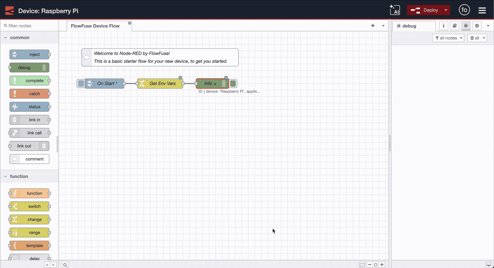

Installing Node-RED is straightforward. Install Node.js, run a command, and you're ready for visual programming in industrial automation. The real challenge begins when it must run across production lines, connect to PLCs, and stay operational 24/7.

<!--more-->

## Download Node-RED for Production Use

Standalone Node-RED works great for testing, but production is different. When your flows control PLCs and critical equipment, downtime costs thousands per minute.

Hardware fails. Networks drop. Power cuts out. Your Node-RED instance must restart automatically, handle connectivity issues, and keep production running without manual intervention. Deploying, managing and scaling must be easy and quick in such environments.

Managing dozens of industrial PCs running Node-RED? You need centralized updates, secure remote access, proper backups, and role-based permissions. Your engineering team's months of flow development can't be lost to a hardware failure.

Production Node-RED needs enterprise reliability, security, and management capabilities that the basic installation simply can't provide.

## FlowFuse for Production: Built by Node-RED’s Creator

FlowFuse was co-founded by [Nick O'Leary](https://knolleary.net/about/), the creator and project lead of Node-RED. Since creating Node-RED at IBM in 2013, Nick has led its evolution from an internal IoT tool into one of the most widely used low-code platforms for industrial automation, with millions of downloads each year. You can read the history of Node-RED written by Nick [here](/blog/2024/02/history-of-nodered/).

After more than a decade of working directly with enterprise users deploying Node-RED in production environments, Nick and the FlowFuse team built FlowFuse to address the operational challenges that standalone Node-RED cannot solve at scale.

FlowFuse makes Node-RED production-ready through centralized management across industrial infrastructure, incorporating years of real-world deployment experience from the creator of Node-RED himself.

### Enterprise Reliability from Node-RED Experts

When hardware fails, FlowFuse keeps operations running through High Availability mode that distributes processing across multiple instances. Device Agents monitor system health and provide secure remote access for engineering teams—features designed by the same team that built and maintains Node-RED's core architecture.

Engineering teams get proper DevOps workflows that move flows through development, testing, and production with automated deployments. Device grouping makes updates reach thousands of devices possible while version control and rapid rollbacks keep projects on track.

Enterprise security comes built-in with single sign-on, role-based access control, comprehensive audit logging, and encrypted communications. Automated snapshots protect engineering work with rapid recovery when needed.

These core capabilities are just the foundation—FlowFuse includes dozens of additional features designed specifically for industrial environments, refined through direct experience deploying Node-RED across Fortune 500 manufacturers and critical infrastructure.

### Trusted by Industry Leaders

FlowFuse is deployed in production environments across manufacturing, energy, and infrastructure sectors where Node-RED reliability is mission-critical. The platform's architecture reflects over 12 years of Node-RED development expertise and direct feedback from thousands of industrial deployments.

As the official enterprise solution developed by Node-RED's creator, FlowFuse represents the authoritative approach to production Node-RED deployments, backed by the team with the deepest expertise in the technology.

## Setting Up FlowFuse

Sign up for the [14-day trial](https://app.flowfuse.com/account/create) at FlowFuse, and you can get started immediately.

### Step 1: Add Remote Instance

Once the platform opens:

1. Click on **Remote Instances** from the left sidebar

{data-zoomable}
*FlowFuse platform dashboard showing Remote Instances option*

2. Click **Add Remote Instance**

{data-zoomable}
*Button to add a new remote Node-RED instance*

3. Give it a name and select the device type

{data-zoomable}
*Configuring the remote device instance with name and type*

4. Select your application and click **Add**

### Step 2: Install Device Agent

FlowFuse shows you a device configuration window with two options. The **One-Line Install** handles everything automatically. It installs Node.js if missing, installs the device agent, and registers your device with the platform.

The **NPM Installation** method provides manual instructions for Windows, Mac, or Linux.

{data-zoomable}
*Device configuration window showing installation options for the FlowFuse Device Agent*

Follow the steps given within the window, which takes less than a minute to connect your device.

### Step 3: Manage Your Device

Once registered, you get complete control over your remote Node-RED instance through FlowFuse's management interface:

{data-zoomable}
*Tools for managing Node-RED instance remotely via FlowFuse*

There are even more features available at the application level and team level that you can explore. To remove infrastructure management complexity of required services such as MQTT and PostgreSQL, they are built-in and available for use.

### Step 4: Start Building

To start building flows:

1. Enable **Developer Mode** from the top right

{data-zoomable}
*Developer Mode Option*

2. Click **Open Editor**

{data-zoomable}
*Open Editor Option*

Your automation flows now run with production reliability. Remote access works securely, and your team can collaborate while production continues running.

{data-zoomable}
*Node-RED Editor*

## Up Next

FlowFuse bridges the gap between Node-RED's simplicity and production reliability requirements—built by the people who created Node-RED and understand its production needs better than anyone.

Ready to see FlowFuse in action? [Book a demo](https://flowfuse.com/book-demo/) and we'll show you how it works with your setup.
