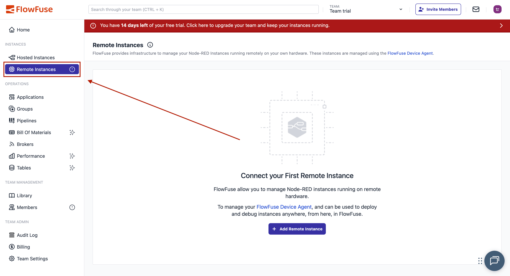

Installing Node-RED is straightforward. install Node.js, run a command, and you’re ready for visual programming in industrial automation. The real challenge begins when it must run across production lines, connect to PLCs, and stay operational 24/7.

<!--more-->

## Local Setup

Testing Node-RED locally takes minutes. First, make sure you have Node.js installed:

```bash
sudo npm install -g --unsafe-perm node-red
node-red
```

If you are using Windows, do not start the command with sudo:

```bash
npm install -g --unsafe-perm node-red
node-red
```

Open `http://localhost:1880` in your browser and start connecting nodes. You can quickly build flows that read sensors, control actuators, and process data. While this setup is perfect for development and small projects, a true production environment has far greater requirements.

## Production Requirements

In production, Node-RED connects to PLCs, Modbus devices, OPC servers, and legacy equipment across your facility. When these systems fail, production stops and costs accumulate quickly.

Your equipment operates continuously, processing high message volumes with strict timing requirements. Power outages occur, networks fail, and hardware breaks. When failures happen, Node-RED must restart automatically, preserve data integrity, and handle intermittent connectivity without manual intervention.

Operators need visibility into system status but should not modify flows controlling critical equipment. This requires proper authentication, audit logging, and secure remote access with role-based permissions for engineering teams.

Your flows represent significant engineering investment - safety interlocks, quality control logic, and production optimizations that took months to develop and refine. Hardware failures can destroy this work without proper backup and recovery procedures in place.

Managing Node-RED across hundreds of industrial PCs introduces complexity. Coordinating updates, maintaining configurations, monitoring performance, and deploying flows across multiple sites requires management tools that scale with your infrastructure.

## FlowFuse for Production

FlowFuse transforms Node-RED into an enterprise-ready platform with centralized management across industrial infrastructure.

When hardware fails, FlowFuse maintains operational continuity. High Availability mode distributes processing across multiple Node-RED instances, ensuring hardware failures do not interrupt operations. The Device Agent monitors system health - CPU usage, memory consumption, network connectivity - while providing secure remote access for engineering teams.

Engineering teams require proper development workflows. FlowFuse provides DevOps pipelines that move flows through development, testing, and production stages with automated deployments. Device grouping allows updates to thousands of devices with single-click deployment. Teams can collaborate effectively with version control and rapid rollback capabilities when issues arise.

Enterprise integration requirements are addressed comprehensively. Single sign-on integrates with existing identity providers. Role-based access control prevents unauthorized modifications to production flows. Comprehensive audit logging tracks all changes. All communications remain encrypted in transit. Automated snapshots protect engineering work, with rapid recovery when hardware failures occur.

These capabilities represent the foundation - FlowFuse includes numerous additional features designed specifically for industrial environments.

## Setting Up FlowFuse

Sign up for the [14-day trial](https://app.flowfuse.com/account/create) at FlowFuse, and you can get started immediately.

### Step 1: Add Remote Instance

Once the platform opens:

1. Click on **Remote Instances** from the left sidebar

{data-zoomable}
*FlowFuse platform dashboard showing Remote Instances option*

2. Click **Add Remote Instance**

{data-zoomable}
*Button to add a new remote Node-RED instance*

3. Give it a name and select the device type

{data-zoomable}
*Configuring the remote device instance with name and type*

4. Select your application and click **Add**

### Step 2: Install Device Agent

FlowFuse shows you a device configuration window with two options. The **One-Line Install** handles everything automatically. It installs Node.js if missing, installs the device agent, and registers your device with the platform.

The **NPM Installation** method provides manual instructions for Windows, Mac, or Linux.

{data-zoomable}
*Device configuration window showing installation options for the FlowFuse Device Agent*

### Step 3: Manage Your Device

Once registered, you get complete control over your remote Node-RED instance through FlowFuse's management interface:

{data-zoomable}
*Tools for managing Node-RED instance remotely via FlowFuse*

There are even more features available at the application level and team level that you can explore. To remove infrastructure management complexity of required services such as MQTT and PostgreSQL, they are built-in and available for use.

### Step 4: Start Building

To create automation flows:

1. Enable **Developer Mode** from the top right

{data-zoomable}
*Developer Mode Option*

2. Click **Open Editor**

{data-zoomable}
*Developer Mode Option*

Your automation flows now run with production reliability. Remote access works securely, and your team can collaborate while production continues running.

{data-zoomable}
*Developer Mode Option*

## Up Next

FlowFuse bridges the gap between Node-RED's simplicity and production reliability requirements.

Ready to see FlowFuse in action? [Book a demo](https://flowfuse.com/book-demo/) and we'll show you how it works with your setup.