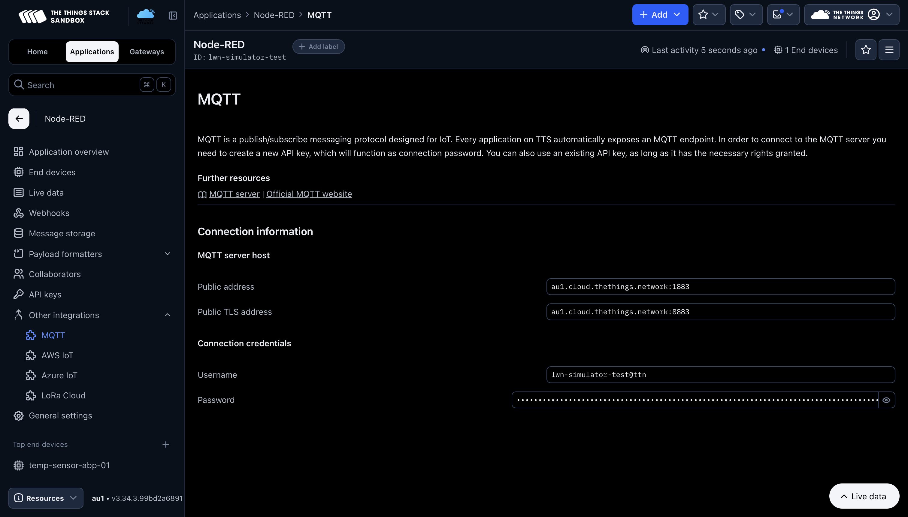
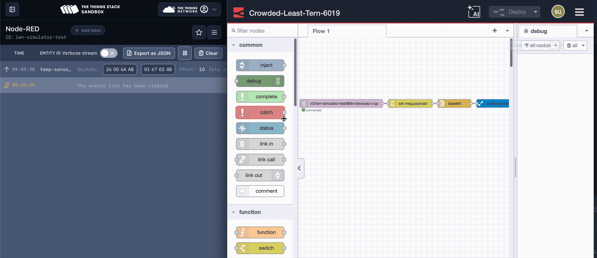
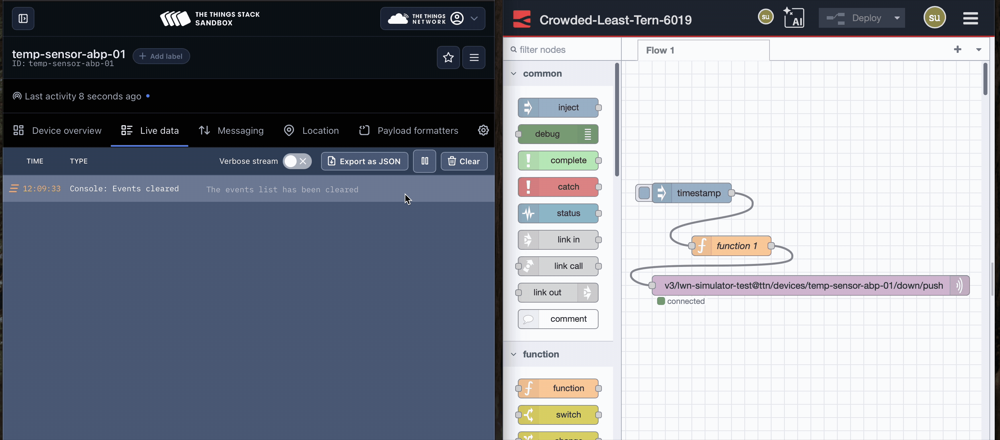

LoRaWAN (Long Range Wide Area Network) is a low-power wireless protocol designed for IoT devices that need to transmit small amounts of data over long distances. FlowFuse is a platform that provides a visual programming interface for connecting IoT devices and services.

<!--more-->

By combining LoRaWAN with FlowFuse, you can easily collect data from remote sensors, process it, and integrate it with other systems or dashboards—all without writing complex code. In this article, we will guide you through setting up the integration and creating your first data processing flows.

## What is LoRaWAN and How Does It Work?

LoRaWAN is designed for devices that need to send small amounts of data over long distances while using very little battery power. Your sensors can communicate up to 15 kilometers away and run for years on a single battery.

The system has three main parts:
- End devices - Your sensors that collect and send data
- Gateways - These receive data from your sensors and pass it along
- Network server - Manages everything and sends your data to applications

[The Things Network (TTN)](https://www.thethingsnetwork.org/) is a free, global LoRaWAN network with thousands of gateways around the world. It's perfect for getting started with LoRaWAN projects and provides easy-to-use tools for managing your devices.

We'll show you how to connect TTN to FlowFuse for monitoring sensor data and building scalable industrial applications.

## Getting Started

Now that we understand the basics of LoRaWAN, let's set up the integration with FlowFuse.

### Prerequisites

Before we begin, make sure you have the following components ready:

1. Node-RED instance – Ensure you have a running Node-RED instance. The quickest way to set one up is through FlowFuse. [Sign up](), create your instance, and you will be able to manage, deploy, scale, and secure your flows with ease. FlowFuse also provides enterprise-ready features out of the box.
2. LoRaWAN device and gateway registered on TTN – You need a sensor or device connected to TTN and a gateway that can receive its uplinks.

If you do not have a LoRaWAN device, you can simulate one using available tools. For this article, I am using the [LWN-Simulator](https://github.com/UniCT-ARSLab/LWN-Simulator).

## Setting Up TTN MQTT Connection

TTN provides MQTT integration that allows external applications to receive uplink messages from your devices. We'll use this to connect TTN with FlowFuse.

### Getting TTN Connection Details

1. Log into your TTN Console (https://console.thethingsnetwork.org)
2. Navigate to your application
3. Go to the Other Integrations tab and select MQTT
4. Note down the following connection details:
   - Server Address: Depends on your cluster, for example: `nam1.cloud.thethings.network`
   - Port: 1883 (for non-TLS) or 8883 (for TLS)
   - Username: Your application ID
   - Password: Your API key

{data-zoomable}
*Screenshot of TTN console showing MQTT integration details including server address, port, username, and API key*

### Configure MQTT Node and Receiving Uplink Messages

Uplink messages are data transmissions sent from your LoRaWAN sensors and devices to Network and then forwarded to your applications. These messages contain sensor readings, status updates, or any other data your devices collect. Let's configure FlowFuse to receive these uplink messages.

1. Open your FlowFuse instance Editor.
2. Drag an MQTT In node from the palette onto your workspace
3. Double-click the node to configure it:
   - Server: Add a new MQTT broker configuration
   - Host: Enter your TTN server address (e.g., nam1.cloud.thethings.network)
   - Port: 1883 or 8883 (if using TLS)
   - Username: Your TTN application ID
   - Password: Your TTN API key
   - Topic: `v3/{application-id}/devices/{device-id}/up` (replace with your actual application and device IDs)
4. Click Done to save the configuration
5. Connect a Debug node to the output of your MQTT In node
6. Deploy the flow by clicking the Deploy button
7. Open the Debug panel to see incoming messages from your LoRaWAN device

The messages you receive will be in JSON format and contain various fields as following:

| Field | Description |
| -------------------------------- | --------------------------------------------------------------- |
| end_device_ids.device_id | Unique identifier of the device in TTN |
| end_device_ids.dev_eui | Globally unique hardware identifier (EUI) of the device |
| end_device_ids.join_eui | Identifier used during device activation (JoinEUI/AppEUI) |
| end_device_ids.dev_addr | Device address assigned by the network |
| received_at | Timestamp when TTN received the message |
| uplink_message.f_port | LoRaWAN port number (used to separate types of payloads) |
| uplink_message.f_cnt | Frame counter for tracking uplinks |
| uplink_message.frm_payload | Raw payload |
| uplink_message.decoded_payload | Decoded values (requires a payload formatter in TTN) |
| uplink_message.rx_metadata | Metadata per gateway (includes RSSI, SNR, gateway ID, etc.) |
| uplink_message.settings | Radio parameters (frequency, data rate, spreading factor, etc.) |
| uplink_message.received_at | Timestamp when TTN processed the uplink |
| correlation_ids | IDs used internally to correlate events across the TTN stack |

## Processing Data

Let's add some processing to extract and format the received data. This approach uses community-contributed nodes and requires minimal coding. Install the `node-red-node-base64` and `node-red-contrib-buffer-parser` nodes.

1. Drag a Change node and set `msg.payload` to `msg.payload.uplink_message.frm_payload`
2. Drag a base64 node and set the action to "Decode" (converts Base64 string to Buffer)
3. Drag the buffer parser node and configure elements based on your data format
4. Click the "+" button to add each element and fill in the following fields for each data point you want to extract:

**Example Configuration for Temperature/Humidity Sensor:**

| Element | Type | Name | Length | Offset | Scale |
|-------------|----------|----------|------------|------------|-----------|
| 1 | int16be | temperature | 2 | 0 | 0.01 |
| 2 | int16be | humidity | 2 | 2 | 0.01 |

**Quick Parameter Guide:**

- Type: How to read the bytes (int16be = 2-byte big-endian signed integer, uint8 = 1-byte unsigned integer)
- Name: What to call it in your output (becomes msg.payload.temperature)
- Length: Number of bytes to read (2 for int16be, 1 for uint8)
- Offset: Where to start reading (0 = first byte, 2 = third byte, etc.)
- Scale: Math to apply (0.01 = divide by 100, 1 = no scaling)

5. Connect the MQTT in node to the input of change node, change node output to base64 node and base64 node output to the input of buffer parser and add the debug node at the end to see the output.
6. Deploy the flow.

Now you will see the object with the parsed sensor data in the debug panel. The output will show something like:

```json
{
  "temperature": 21.5,
  "humidity": 57.2
}
```

As you can see in the image below, TTN console shows live data with uplink message on the left side, and FlowFuse successfully reads and processes it on the right side.

{data-zoomable}
*Image showing TTN console with live uplink messages on the left and FlowFuse debug panel with processed sensor data on the right*

## Sending Commands to Devices (Downlink)

Downlink messages are commands sent from your application back to LoRaWAN devices through the network. These messages allow you to remotely control your devices, update their configuration, trigger specific actions, or send firmware updates. LoRaWAN devices can only receive downlink messages during their receive windows after sending an uplink, making this communication asynchronous but highly power-efficient.

1. Drag the Inject node onto the canvas.
2. Drag a Function node and add JavaScript to format the downlink message with the data you want to send. Alternatively, you can use a Change node with a Base64 node for a low-code approach.

```javascript
// Example: Send a command to turn on LED or change sensor interval
const downlinkMessage = {
    downlinks: [{
        f_port: 1, // Port number (1-223)
        frm_payload: Buffer.from([0x01, 0x0A]).toString('base64'), // Command bytes
        priority: "NORMAL"
    }]
};

msg.payload = JSON.stringify(downlinkMessage);
return msg;
```

**Downlink Properties Explanation:**

- `f_port`: The LoRaWAN port number (1-223) used to differentiate message types
- `frm_payload`: Your command data encoded as Base64 string
- `priority`: Message priority ("LOWEST", "LOW", "BELOW_NORMAL", "NORMAL", "ABOVE_NORMAL", "HIGH", "HIGHEST")

3. Add an MQTT Out node to your workspace
4. Configure it with the same TTN broker settings as your MQTT In node
5. Set the topic to: `v3/{application-id}/devices/{device-id}/down/push` (replace with your actual application and device IDs)
6. Connect the Inject node to Function node and Function node to MQTT out node.
7. Deploy the flow.

In the image below, you can see FlowFuse sending and processing the downlink message, while TTN console displays the live data on the left.

{data-zoomable}
*Image showing TTN console with live Downlink messages on the left and FlowFuse debug panel with processed sensor data on the right*

## Next Steps

Next, you can store this data in a database. With FlowFuse, a managed PostgreSQL database is already provided—so you do not need to install or configure one manually. FlowFuse also offers a Query node that is automatically configured for your instance. Inside the Query node, you can use FlowFuse Expert, which allows you to write natural language prompts instead of SQL queries. The assistant will generate SQL automatically based on your table schema.

For a complete guide on storing and visualizing data, see the article on [Building Historical Data Dashboards with FlowFuse Tables](https://flowfuse.com/blog/2025/08/time-series-dashboard-flowfuse-postgresql/). It also includes step-by-step instructions for creating dashboards using [FlowFuse Dashboard](https://dashboard.flowfuse.com/)—a low-code way to build powerful industrial dashboards that also allows you to send downlink data to devices interactively.

With FlowFuse, you get a complete enterprise-grade platform built around visual programming—perfect for production-ready IoT deployments. It adds powerful capabilities like centralized management of Node-RED instances, DevOps tools, snapshots, real-time team collaboration, audit logs, RBAC, SSO, Built mqtt broker and database service and more—all designed to help you scale and manage your applications with ease.

If you're interested in exploring FlowFuse further for your industrial IoT applications, come visit us at our booth at upcoming TTN conferences to see live manufacturing demos. You can also [book a demo](/book-demo/) to see how FlowFuse can streamline your development and deployment workflows, or [start your free trial]() and build your first LoRaWAN-enabled dashboard today.
