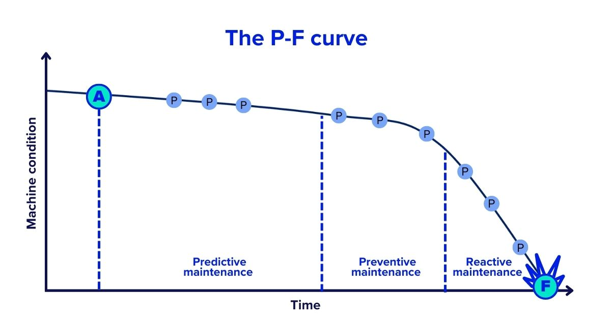

At 2:47 AM on a Tuesday, a $15 bearing brought down a $2 million production line.

<!--more-->

While this specific incident is illustrative, the failure pattern it represents is all too real and systemic. According to recent industry research, unplanned downtime outages last an average of four hours and cost an average of $2 million per incident. These bearing failures happen across manufacturing facilities worldwide with predictable consistency: emergency repairs, overtime labor, expedited parts, delayed customer orders, and relationship damage. All from a component that could have been replaced during scheduled downtime for $800.

The real tragedy? Every signal was there. Vibration readings had climbed 40% over six weeks. Temperature spikes occurred during peak loads. Acoustic signatures screamed impending failure. But without systematic monitoring, these warnings vanished into the noise of daily operations.

This isn't a maintenance story, it's a data story. And it's playing out in manufacturing facilities worldwide every day. According to Forbes, unplanned downtime can cost manufacturing companies a whopping $50 billion per year. Siemens' 2024 report reveals that unplanned downtime now costs Fortune Global 500 companies 11% of their yearly turnover, almost $1.5 trillion, up from $864 billion two years ago.

## The Predictable Science of Equipment Death

Equipment failures aren't random disasters, they're predictable processes that unfold over weeks or months, leaving digital breadcrumbs that reveal exactly when intervention will be most cost-effective.

Reliability engineers call this the P-F curve: the measurable interval between when a potential failure (P) becomes detectable and functional failure (F) occurs. For rotating equipment like motors and pumps, this window typically spans 6-12 weeks. For hydraulic systems, 2-8 weeks. For electronic components, days to months.

{data-zoomable}
_P-F Curve._

During this P-F interval, equipment broadcasts its distress through dozens of measurable parameters:

- **Vibration patterns** shift as bearings wear and alignments drift
- **Power consumption** increases as friction rises and efficiency drops  
- **Temperature profiles** change as lubricants degrade and clearances widen
- **Acoustic signatures** evolve as mechanical tolerances exceed design limits
- **Process variables** drift as equipment performance degrades

The math is brutal. According to research by Eptura, on-demand work orders generally take twice as long as preventive maintenance, cutting associated labor costs in half through proactive approaches. A comprehensive study by JLL (Jones Lang LaSalle) analyzing 14 million square feet of mixed building types found that preventive maintenance produces an astounding 545% return on investment.

## Why Over Half of Manufacturers Still Play Failure Roulette

Despite overwhelming evidence favoring preventive approaches, many facilities still operate critical equipment on run-to-failure strategies. The reason isn't ignorance, it's infrastructure complexity and historical implementation challenges.

Traditional preventive maintenance software promised comprehensive monitoring but delivered integration nightmares. Each device required custom programming, proprietary gateways, and specialized expertise. Implementation projects stretched 12-18 months, cost hundreds of thousands of dollars, and often failed to deliver promised capabilities.

Meanwhile, production environments grew increasingly complex. A single line now might include:
- 1990s CNC machines speaking serial protocols
- 2000s PLCs using Modbus communication  
- 2010s robots on Ethernet/IP networks
- 2024 sensors transmitting via MQTT and other IoT protocols

Each system operates in isolation, generating valuable data that remains trapped behind incompatible interfaces.

## The Platform Revolution: Universal Data, Unified Insights

Modern industrial data platforms are eliminating these barriers by treating connectivity as a solved problem rather than a custom project.

Instead of requiring expensive integration for each device type, these platforms provide universal connectivity out of the box. Legacy equipment, modern sensors, and everything in between can communicate through a single interface without gateways, converters, or custom programming.

This fundamental shift changes the economics of comprehensive monitoring. Instead of monitoring a few critical machines with dedicated systems, manufacturers can monitor everything, from primary production equipment to auxiliary systems like compressed air, HVAC, and power distribution.

Research indicates that 95% of predictive maintenance adopters reported a positive ROI, with 27% of these reporting amortization in less than a year.

## Evidence-Based Results from Leading Manufacturers

The transformation from reactive to predictive maintenance is delivering measurable results across industries:

**Automotive Manufacturing:** Major automotive suppliers have achieved 50% reduction in unplanned downtime after implementing comprehensive equipment monitoring across their facilities. The key wasn't just monitoring critical assets, it was monitoring everything, creating a complete picture of facility health.

**Electronics Production:** Leading electronics manufacturers report 25% reduction in maintenance costs by connecting previously isolated systems on unified data platforms. Maintenance teams can finally see relationships between equipment performance and environmental factors.

**Industrial Equipment:** According to the U.S. Department of Energy, predictive maintenance helps enterprises gain remarkable results such as a tenfold increase in ROI, 70-75% decrease in breakdowns, 25-30% reduction in costs, and 35-45% reduction in downtime.

## FlowFuse: The Open, Scalable, and Flexible Industrial Data Platform

FlowFuse represents the next evolution in industrial data platforms, designed by engineers who understand both the promise and frustrations of traditional systems.

Built on Node-RED, the open-source standard for industrial connectivity, FlowFuse eliminates integration barriers that have historically made comprehensive monitoring expensive and complex. Native support for almost all industrial protocols and systems means any device that communicates digitally can connect without custom development.

But connectivity is just the foundation. FlowFuse's visual programming environment enables engineers to build sophisticated monitoring applications using drag-and-drop interfaces. Need to correlate motor vibration with production load? Create custom dashboards for different user roles? Set up automated alerts based on complex conditions? All possible without writing code.

The platform's AI-powered editor goes further by reducing the development effort for engineers.

For enterprise users, FlowFuse provides several essential features to support large-scale, collaborative, and secure industrial data operations. This includes DevOps tools and Remote Device Management, which streamline the deployment of applications and allow teams to remotely monitor and update their connected devices. To facilitate teamwork and project management, the platform incorporates Snapshot & Version Control and Real-Time Team Collaboration, enabling multiple people to work together on projects and easily track changes. For system reliability, FlowFuse offers High Availability, and to simplify user access while boosting security, it provides Single Sign-On (SSO). Additionally, Role-Based Access Control is a key security feature that lets administrators manage and restrict data access for different users.

Most importantly, FlowFuse uses transparent pricing that encourages comprehensive data collection. No per-tag penalties, no volume restrictions, just straightforward costs that scale with business value rather than data points monitored.

## The New Maintenance Economics

Companies implementing comprehensive equipment monitoring through modern data platforms are rewriting the economics of manufacturing operations. The financial picture changes almost immediately: emergency repairs drop by as much as **60–80%** as failures shift from unexpected crises to planned interventions. Overall maintenance spending falls by **12–18%** as teams allocate resources more efficiently, while spare parts inventories shrink by **30–50%** because demand becomes predictable rather than chaotic.

The impact extends well beyond cost savings. Equipment life stretches by **20–40%** when replacement is driven by condition rather than arbitrary schedules. Overall Equipment Effectiveness (OEE) climbs by **10–20%** as downtime disappears from production schedules, and energy consumption drops by **5–15%** as machines run closer to their designed efficiency.

Operational excellence amplifies across the board. Companies see on-time delivery rates climb past **95%**, far outpacing the industry average of 75% in reactive environments. Customer satisfaction rises in parallel, supported by the reliability of consistent delivery. Workforce safety also improves as proactive monitoring identifies hazards before they escalate.

According to research by **McKinsey & Company**, the cumulative effect of these improvements is profound: organizations that adopt data-driven decision making are on average **5% more productive** and **6% more profitable** than competitors who remain locked in reactive cycles.

## The Implementation Reality

The path from reactive to proactive maintenance is clearer than ever, but success requires more than software selection, it requires cultural transformation.

Start with pain point identification. Which equipment failures cause the most disruption? Where are emergency repair costs highest? What assets have the longest replacement lead times? These become your monitoring priorities.

Focus on quick wins that build organizational confidence. Monitor 3-5 critical assets that represent different failure modes and equipment types. Establish baselines, implement basic condition monitoring, and measure results rigorously.

The US Department of Energy reports a projected ROI of ten times the investment for organizations implementing predictive maintenance strategies.

Most importantly, treat this as a capability-building exercise, not a technology project. The goal isn't just preventing failures, it's developing organizational competencies in data-driven decision making that enable continuous operational improvement.

## Taking Action

The business case is overwhelming. The technology barriers are eliminated. The competitive advantages are clear and measurable.

The question isn't whether to implement comprehensive equipment monitoring, it's how quickly you can build capabilities that deliver sustainable competitive advantages.

Calculate your current failure costs honestly. Include not just repair expenses but lost production, customer impact, and opportunity costs. Identify your most critical assets and pain points. Evaluate platforms that provide universal connectivity without integration complexity.

The manufacturers moving decisively are gaining first-mover advantages in operational excellence that their competitors will struggle to match. Those delaying risk permanent disadvantage in an increasingly data-driven industry.

**Ready to transform equipment failures from crisis events into predictable costs?** [Discover how FlowFuse enables comprehensive equipment monitoring](https://flowfuse.com/book-demo/) that delivers measurable competitive advantages from day one.

## References

1. TeamSense (2024). *High Cost of Downtime in Manufacturing & How to Reduce It*.  
2. IIoT World (2023). *The Actual Cost of Downtime in Manufacturing*.  
3. Evocon (2024). *Cost of Downtime in Manufacturing: Insights & Implications*.  
4. IDS Data (2025). *The Real Cost of Downtime in Manufacturing*.  
5. Eptura (2025). *Workplace Index: Preventive Maintenance ROI*.  
6. IoT Analytics (2024). *Predictive Maintenance Market: 5 Highlights*.  
7. Polaris Market Research (2024). *Predictive Maintenance Market Report, 2024–2032*.  
8. MoldStud (2024). *ROI Benefits of Predictive Maintenance*.  
9. Sensorfy (2023). *How to Calculate Predictive Maintenance ROI*.  
10. MicroMain (2024). *Preventive Maintenance ROI of 545%*.  
11. ScienceDirect (2025). *Systematic Review of Predictive Maintenance Practices*.  
12. IIoT World (2024). *Predictive Maintenance: Hidden ROI Driver*.  

*Additional references: U.S. Department of Energy (predictive maintenance effectiveness), McKinsey & Company (productivity studies), Siemens (True Cost of Downtime reports).*
