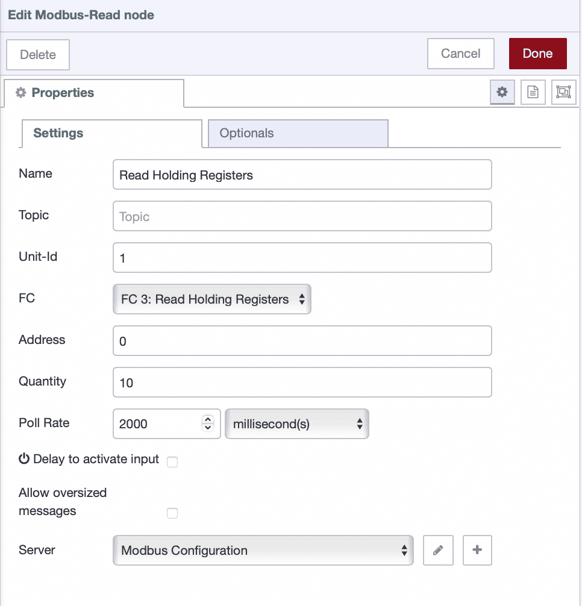
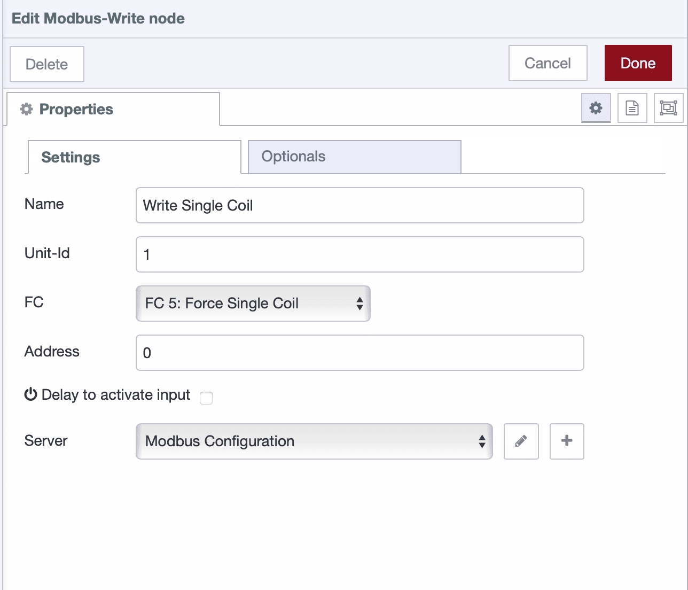
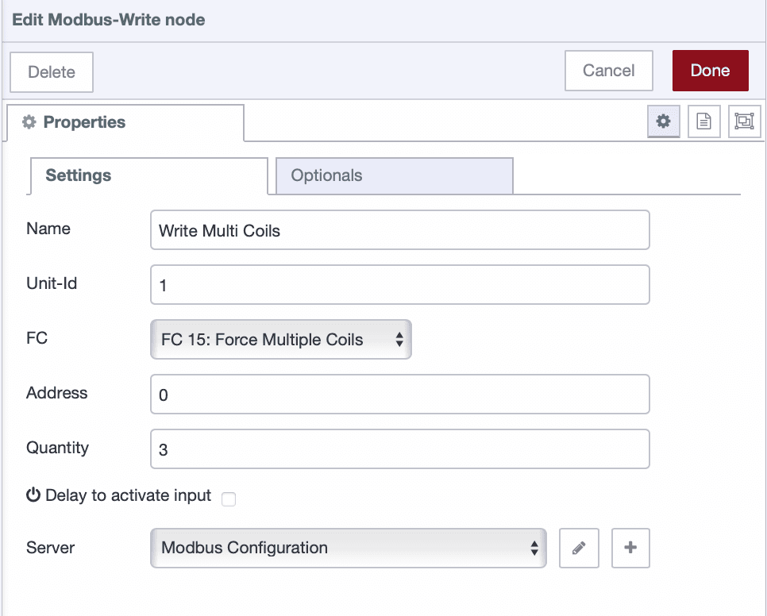

Modbus RTU is one of the most widely used communication protocols in industrial automation. It allows you to read sensor data, monitor equipment status, and control devices through a simple master-slave architecture. This guide will walk you through everything you need to know to start reading and writing industrial data with FlowFuse (a platform built around Node-RED with enterprise-level capabilities).

<!--more-->

Whether you're connecting a single sensor or building a comprehensive industrial monitoring system, this step-by-step guide will show you how to leverage FlowFuse's powerful capabilities to bridge the gap between legacy industrial devices and modern data systems.  

## Understanding Modbus RTU Basics

Modbus RTU operates on a **master–slave system**. Unlike its TCP counterpart, it runs over serial connections (RS485/RS422/RS232), making it extremely reliable in environments where network connectivity may be unstable. The protocol has been battle-tested in harsh conditions for decades, which is why it is still used in everything from simple temperature sensors to complex PLCs.  

In a FlowFuse setup, the instance acts as the master, initiating all communication. Devices such as sensors, meters, and controllers act as slaves, responding only when addressed. Each slave has a unique address from 1 to 247, with 0 reserved for broadcast messages. Communication follows a simple pattern: the master sends a request, the addressed slave responds, and the master processes the response before moving to the next device.

### Device Data Types

Devices organize data into four main types, each with a specific purpose:

* **Coils (Digital Outputs)** – Remote switches you can turn on/off from FlowFuse, used for motors, pumps, relays, or alarms.
* **Discrete Inputs (Digital Inputs)** – Read-only status points that indicate the state of buttons, doors, or alarms.
* **Input Registers (Analog Inputs)** – Read-only values representing measurements such as temperature, pressure, or flow.
* **Holding Registers (Analog Outputs/Settings)** – Read/write values for setpoints, timers, and configuration parameters.

**Note:** Coils and discrete inputs are single-bit (ON/OFF), while registers store 16-bit values that may require scaling depending on the device.

### Register Addressing

Addressing can be confusing because manufacturers document it differently:

* **Zero-based** – Modbus standard (first register = 0).
* **One-based** – Some manuals start counting at 1 (subtract 1 in FlowFuse).
* **Offset-based** – Registers like 40001 or 30001 require subtracting the base number to get the actual address.

**Example:** If a manual shows “Temperature = 40001,” FlowFuse should use address **0**. Always refer to the device’s “Register Map” for clarity.

By understanding the **master-slave control, data types, and addressing**, you can reliably communicate with your devices and make the most of Modbus RTU in FlowFuse.

## Getting Started

Let’s start by setting up the basics before connecting Modbus RTU devices to FlowFuse.

### Prerequisites

Before diving in, make sure you have the following ready:

- **Node-RED instance** – A running Node-RED instance. The quickest way to get one ready for production is with FlowFuse. Simply [sign up]() and [create and set up a remote instance](/blog/2025/09/installing-node-red/), and you’ll have a managed Node-RED environment running in minutes. 
- **Node-RED Modbus nodes** – Installable via the Palette Manager (`node-red-contrib-modbus`).  
- **Modbus-enabled device** – Such as a sensor, PLC, or meter, along with its register map documentation.  
- **Serial interface** – For example, a USB-to-RS485 converter to physically connect your Modbus devices. Connect the **A (+)** and **B (–)** terminals of the RS485 adapter to the device, add termination resistors if the line is long or has multiple devices, and note the serial port path (e.g., `/dev/ttyUSB0` on Linux or `COM1` on Windows).  

## Reading Data

Reading data from Modbus slaves in FlowFuse is straightforward. The process is the same regardless of which data type you want to read.

1. Drag the **Modbus Read** node onto the FlowFuse canvas. Double-click it to open the configuration. Enter the **Unit ID** (slave address), select the **data type** you want to read, specify the **starting address**, set the **quantity** of values to read, and define the **poll rate** (how often data should be read).

  {data-zoomable}
  _Modbus Read node configured to read data from a slave device._

2. Click the **+** icon next to the *Server* field to add Modbus connection details.

3. In the server configuration window:

   * Set **Type** to *Serial*.
   * In the **Serial Port** field, use the dropdown or search option to see all available ports (e.g., `/dev/ttyUSB0` on Linux or `COM1` on Windows). Select the port to which your Modbus device is connected.
   * Configure the communication settings to match your device:

     * **Baud Rate**
     * **Data Bits**
     * **Stop Bits**
     * **Parity**

   These values must match exactly with the Modbus device’s configuration; otherwise, the communication will fail.

  {data-zoomable}
  _Serial port and communication settings for the Modbus device._

4. Connect the Modbus Read node to a **Debug** node and deploy your flow. If everything is set up correctly, you will start seeing live data from your Modbus device in the debug sidebar.

## Writing Data

Modbus RTU allows you to **write data back to devices**, enabling control of motors, relays, setpoints, and other outputs directly from FlowFuse.

Follow these steps to configure and test writing:

1. Drag the **Modbus Write** node onto the canvas. This node will send data to your Modbus device.

2. Double-click the node and set:

   * **Unit ID** – the slave address of your device.
   * **Data type** – choose one of:

     * *Force Single Coil* – write one digital output.
     * *Force Multiple Coils* – write several digital outputs at once.
     * *Preset Single Register* – write one analog/config value.
     * *Force Multiple Registers* – write several analog values at once.
   * **Address** – the target coil or register.
   * **Quantity** – only for multiple writes, set the number of values you will send.

   {data-zoomable}
   _Writing a single coil using the Modbus Write node._

   {data-zoomable}
    _Writing multiple coils using the Modbus Write node._

3. Connect an **Inject** node to the Modbus Write node to send values:

   * **Single Coil/Register:** send a boolean (`true`/`false`) for coils or a number for registers.
   * **Multiple Coils/Registers:** send an array corresponding to each value.

   **Examples:**

   * `[true, false, true]` → Coils 0, 1, 2
   * `[25, 50, 75]` → Holding Registers 0, 1, 2

4. Deploy the flow and press **Inject**. The Modbus device should update immediately.

**Tip:** Use a **UI input (slider, switch, or numeric box)** from the [FlowFuse Dashboard](https://dashboard.flowfuse.com/) instead of an Inject node for real-time control via a web interface.

## Scaling and Interpreting Values

Raw Modbus values often don’t make sense until you apply **scaling factors** or unit conversions.

* A temperature register might return `235`, which actually means **23.5 °C**.
* An energy meter might output `12345`, representing **12.345 kWh**.
* A pressure sensor could use two consecutive registers (32-bit values) that need decoding.

You can handle these conversions with simple **Function nodes** or **Change nodes** in FlowFuse.

**Example Function Node:**

```javascript
// Convert raw register value to temperature in °C
let raw = msg.payload[0];
msg.payload = raw / 10;
return msg;
```

This takes the raw register, divides it by 10, and gives you a clean, human-readable temperature.

**Tip:** You do not need to know JavaScript — simply use the **FlowFuse Expert**, which can generate a Function node for you from plain English instructions. For the most accurate results, provide sample data along with the scaling you want to achieve. You can learn more in this article: [FlowFuse Expert for Manufacturing](/blog/2025/07/flowfuse-ai-assistant-better-node-red-manufacturing/).

**Best Practice:** Always keep a copy of the device’s **Register Map documentation** handy. It tells you which addresses map to which variables, and how to interpret them.

## Troubleshooting Tips

If things do not work on the first attempt, avoid frustration. Modbus is straightforward, but even small configuration mismatches can disrupt communication.

* Verify the **serial port** is correct and not already in use.
* Double-check **baud rate, data bits, stop bits, and parity**. Even a single mismatch will block communication.
* Ensure the **Unit ID** matches your device’s slave address.
* Keep your wiring neat. For longer cables, use **termination resistors** and twisted-pair shielded cables.
* Use a Modbus simulator or diagnostic tool to test the setup if the hardware isn’t responding.

## Conclusion

Modbus RTU has stood the test of time in industrial automation because it’s simple, reliable, and built for harsh environments. With FlowFuse, you can take this legacy protocol and give it **modern superpowers**:

* Collect real-time data from sensors and machines.
* Control devices directly from a web dashboard.
* Combine Modbus with MQTT, REST APIs, or databases to share data across your entire organization.
* Scale from a single sensor to a **factory-wide monitoring and control system**.

The real value comes when you stop treating Modbus as just a communication protocol and start using FlowFuse as the **bridge between industrial devices and enterprise systems**. From dashboards to alerts, from analytics to cloud integration — the possibilities are endless once the data is in your hands.
