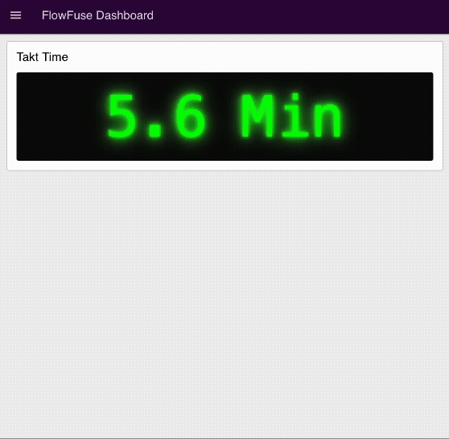

Takt time is one of the most fundamental—and most misunderstood—concepts in lean manufacturing. Despite being widely referenced in textbooks, audits, and production meetings, many factories still calculate takt time incorrectly or treat it as a theoretical number rather than an operational control. The result is familiar: overproduction during low demand, missed deliveries during peak demand, unstable lines, and constant firefighting on the shop floor.

<!--more-->

In reality, **takt time is not a KPI—it is a design constraint**. It defines the exact pace at which a production system must operate to meet real customer demand using the available working time. When applied correctly, takt time becomes the backbone of flow, line balancing, capacity planning, and continuous improvement. When applied incorrectly, it creates false confidence, hidden bottlenecks, and chronic inefficiencies.

This guide is written from a **practical, factory-floor perspective**, not just a theoretical lean framework. It reflects how takt time is actually used in modern manufacturing environments—automotive plants, electronics assembly lines, FMCG production, and digitally connected factories running real-time systems. Every definition, formula, and example in this article is grounded in how takt time is applied by production engineers, operations managers, and lean practitioners to solve real problems.

In this 2026 edition, you’ll learn:

- The correct definition of takt time and what it truly represents operationally
- How to calculate takt time accurately, including what time must be excluded (and why)
- The difference between takt time, cycle time, and lead time, and how confusing them leads to bad decisions
- Real-world examples showing how takt time exposes bottlenecks and capacity gaps
- How modern digital tools calculate and monitor takt time in real time, not spreadsheets

Whether you are designing a new production line, stabilizing an existing process, or transitioning toward lean and Industry 4.0 practices, this guide gives you a complete, trustworthy, and experience-backed explanation of takt time, from first principles to real-world execution.

## What is Takt Time?

**Takt time** is the maximum allowable time to produce one unit of product to meet customer demand. It acts as the "heartbeat" of your production line, establishing the rhythm at which work must flow to satisfy customer orders without overproducing or falling behind.

The word "takt" derives from the German word "taktzeit," which translates to "cycle time" or "beat." This linguistic origin reflects the concept's European manufacturing heritage, though it's important to recognize that takt time and cycle time represent fundamentally different metrics. We'll examine this critical distinction in detail later in this guide.

### Formal Definition of Takt Time

The **definition of takt time** is: the available production time divided by customer demand. This establishes the pace at which your production line must operate to meet customer requirements. It's a customer-driven metric calculated from actual demand rather than production capability.

Takt time serves as both a planning tool and a mechanism for waste elimination, providing a common reference point for distributing work evenly across production stations.

### Meaning of Takt Time

The **meaning of takt time** goes deeper than just a calculation—it represents your production heartbeat. It's the pulse that synchronizes all production activities with real customer demand.

The operational meaning of takt time functions as:
- A planning target that prevents overproduction and underproduction
- A balancing tool that distributes work evenly across workstations
- A performance metric that reveals bottlenecks and capacity constraints
- A continuous improvement baseline that quantifies the gap between current and required performance

When you properly understand what takt time means, you transform it from a simple formula into a powerful operational philosophy that drives lean manufacturing excellence.

## Takt Time Formula

{data-zoomable}
_The fundamental takt time formula_

The **takt time formula** is deceptively simple, yet its application transforms manufacturing operations:

**Takt Time = Available Production Time ÷ Customer Demand**

This **formula of takt time** contains two critical components that require careful definition. Let's break down each element to understand how to calculate takt time accurately.

### Available Production Time

This is the net time available for production during your planning period (typically one shift or one day). When applying the takt formula, available production time includes only planned production time. It excludes planned breaks, meetings, shift changes, and scheduled maintenance, but does not include unplanned downtime such as breakdowns or minor stoppages. It excludes scheduled breaks and lunch periods, shift changeovers, planned maintenance windows, and scheduled meetings or training.

Consider an example calculation of takt time. An eight-hour shift equals 480 minutes. Subtract a 10-minute break to yield 470 minutes. Subtract a 20-minute lunch to yield 450 minutes. Subtract a 30-minute planned changeover to yield 420 minutes. The available production time equals 420 minutes.

The distinction between included and excluded time proves critical for accurate takt time calculation. Organizations frequently overestimate available time by failing to account for all legitimate non-production activities, then face persistent schedule shortfalls when reality proves less generous than planning assumptions.

### Customer Demand

When you calculate takt time, customer demand represents the number of units customers require during your planning period. This figure can derive from actual customer orders, forecasted demand, production targets based on inventory levels, or averaged demand over longer periods such as weeks or months.

The choice of demand figure affects the meaning of takt time stability and operational practicality. Using daily order quantities creates takt times that vary day-to-day, potentially requiring frequent line rebalancing. Averaging demand over weekly or monthly periods creates more stable takt times but may result in temporary overproduction or underproduction as actual daily demand fluctuates around the average.

Most manufacturers employ hybrid approaches, using averaged demand for line design and capacity planning while adjusting targets periodically to reflect actual order patterns. The appropriate averaging period depends on demand volatility, product mix complexity, and production flexibility.

### Calculating Takt Time: A Step-by-Step Example

Using our example numbers where available production time equals 420 minutes and customer demand equals 210 units, let's apply the takt time formula:

**Takt Time = 420 minutes ÷ 210 units = 2.0 minutes per unit**

This result means your production line must complete one unit every 2 minutes to meet customer demand. When you define takt time this way, the calculation establishes a maximum allowable cycle time—any operation taking longer than 2 minutes per unit will prevent the line from meeting demand unless compensated by faster cycle times elsewhere or by adding capacity.

## Real-World Examples of Takt Time

Examining several real-world examples demonstrates how to calculate takt time across different manufacturing contexts. These examples show the practical application of the takt time formula in diverse scenarios.

### Example 1: Automotive Parts Manufacturing

An automotive parts manufacturer produces brake assemblies during an eight-hour shift. The shift includes a 30-minute lunch period and two 10-minute breaks totaling 20 minutes. A planned changeover consumes 10 minutes. Customer orders require 120 brake assemblies per shift.

To calculate takt time, first determine available production time. Start with 480 minutes for the eight-hour shift. Subtract 30 minutes for lunch, 20 minutes for breaks, and 10 minutes for changeover. The available production time equals 420 minutes.

Now apply the takt time formula. Divide 420 minutes by 120 units to yield 3.5 minutes per unit.

Understanding the meaning of takt time in this result shows the production line must complete one brake assembly every 3.5 minutes to meet customer demand. If actual cycle time equals 5 minutes per unit, production will fall short by approximately 30 percent, completing only 84 units instead of the required 120 units. If actual cycle time equals 3 minutes per unit, the line produces 140 units, creating 20 units of excess inventory and risking overproduction waste.

This example illustrates why defining takt time correctly matters for matching cycle time to customer demand. Cycle times significantly exceeding takt time reveal capacity shortfalls requiring immediate attention. Cycle times falling well below takt time suggest excess capacity that might be redeployed elsewhere or indicate risk of overproduction if production control systems fail to prevent excess output.

### Example 2: Electronics Assembly (Multiple Shifts)

An electronics manufacturer operates two shifts producing circuit boards, with weekly demand of 2,400 units across five operating days. Each eight-hour shift allocates 40 minutes for breaks and 20 minutes for changeovers.

When you calculate takt time for multiple shifts, first determine available time per shift: 480 minutes minus 40 minutes for breaks minus 20 minutes for changeovers equals 420 minutes per shift.

Calculate total available time per week: 420 minutes multiplied by 2 shifts multiplied by 5 days equals 4,200 minutes per week.

Apply the takt formula: 4,200 minutes divided by 2,400 units equals 1.75 minutes per unit.

An alternative approach to calculate takt time uses per-shift demand. Daily demand equals 2,400 units divided by 5 days, or 480 units per day. Demand per shift equals 480 units divided by 2 shifts, or 240 units per shift. Using the takt time formula: 420 minutes divided by 240 units equals 1.75 minutes per unit—the same result.

This example demonstrates that the takt time calculation can proceed from different time horizons and still yield consistent results. Whether calculating weekly, daily, or per-shift takt time using the takt formula, the fundamental relationship between available time and required output remains constant. Organizations typically choose calculation periods matching their planning cycles and demand visibility horizons.

### Example 3: Variable Product Mix

A manufacturer produces three different models on the same production line with 450 minutes of available time. Model A requires 100 units at 2 minutes per unit, Model B requires 50 units at 3 minutes per unit, and Model C requires 30 units at 4 minutes per unit.

To define takt time for mixed-model production, calculate weighted average takt time by summing total demand: 100 plus 50 plus 30 equals 180 units. Using the takt time formula, average takt time equals 450 minutes divided by 180 units, or 2.5 minutes per unit.

Individual product takt times can also be calculated using the formula of takt time. Model A would receive 4.5 minutes per unit (450 divided by 100), though its actual process time is only 2 minutes. Model B would receive 9.0 minutes per unit, and Model C would receive 15.0 minutes per unit. In mixed-model production, manufacturers typically employ level loading techniques to smooth production across the shift rather than producing in large batches.

Level loading for this scenario might sequence production as A-A-B-A-A-C-A-A-B-A-A-C, distributing the three models proportionally throughout available time. This sequence maintains steadier overall pace than producing all Model A units first, then all Model B units, then all Model C units. Understanding the meaning of takt time in this context shows how steady pace reduces work-in-process buildup, makes quality problems visible sooner, and creates more predictable material consumption patterns.

## Takt Time vs. Cycle Time vs. Lead Time: Comparison Matrix

You might have heard the terms takt time, cycle time, and lead time, but they're not the same. Let's define takt time and these related metrics to understand their distinct meanings.

| Feature | **Takt Time** | **Cycle Time** | **Lead Time** |
| --- | --- | --- | --- |
| **Fundamental Meaning** | The "Heartbeat." The pace required to satisfy the customer. | The "Actual Speed." The time it takes to perform the work. | The "Wait Time." The total duration a part spends in the system. |
| **Formula** | **Available Production Time ÷ Customer Demand** | **Time to complete one unit of work** | **Order completion time – Order placement time** |
| **What it Includes** | Only net available production time (no breaks). | Loading, processing, unloading, and reset time. | Processing time + Queue time + Shipping + Delays. |
| **Operational Focus** | **Planning:** How many people or machines do we need? | **Efficiency:** How can we make this specific task faster? | **Responsiveness:** How quickly can we turn an order into cash? |
| **Management Signal** | If this changes, you must rebalance your production line. | If this is too high, you have a bottleneck at that station. | If this is too high, your inventory levels are likely bloated. |

### The "Ideal State" Relationship

In a perfect Lean environment, the relationship between these three metrics follows a hierarchy that maximizes ROI and eliminates waste. When you properly calculate takt time and understand its meaning, the ideal relationships emerge:

1. **Cycle Time ≤ Takt Time:** Your actual work speed should be roughly **90–95% of Takt Time**, providing a small buffer for minor interruptions without failing to meet customer demand.
2. **Minimized Lead Time:** Lead Time should be as close as possible to the sum of your Cycle Times. For example, if total Cycle Time is 1 hour but Lead Time is 10 days, **99% of the product's time is idle**, representing pure waste.

## Why Takt Time Matters in Manufacturing

Understanding the definition of takt time and applying the takt formula functions as more than a calculation exercise. It represents a fundamental operating principle that transforms manufacturing execution from reactive scheduling to demand-synchronized production.

### Synchronization with Customer Demand

Production systems operating without understanding what takt time means typically run at maximum achievable speed, independent of actual demand signals. This approach generates inventory during periods of low demand and creates capacity shortages when demand increases. The disconnect between production pace and order rate leads to resource misallocation and suboptimal working capital deployment.

When you define takt time and apply it correctly, you establish direct alignment between order rate and production pace. When demand changes, the calculated takt time changes proportionally using the takt time formula, triggering controlled adjustments to production resources. This synchronization maintains lean inventory levels while meeting delivery commitments.

### Elimination of Overproduction

Overproduction amplifies other forms of manufacturing waste. Excess production requires additional handling, consumes storage capacity, ties up working capital, and increases the inventory at risk from quality issues or obsolescence. Organizations often underestimate the compounding effect of overproduction on total manufacturing cost.

The meaning of takt time in waste elimination establishes a maximum production rate derived from actual demand. Production exceeding the rate calculated using the takt formula generates inventory that customer orders have not yet justified. Pull-based production systems use takt time as the foundation for inventory replenishment signals, preventing unauthorized production while maintaining buffer stock at calculated levels.

### Line Balancing and Flow

Manufacturing lines develop bottlenecks when workstation cycle times vary significantly. Slow stations create waiting at downstream operations, fast stations create waiting at upstream operations, and both conditions generate work-in-process inventory that obscures quality issues and extends lead time.

When you calculate takt time and apply it to each workstation, you provide a common target for balancing workload across all stations. When each station operates near the calculated takt time, flow improves and waiting decreases. Line balancing efforts use the takt time formula as the reference point for redistributing work elements across stations.

Consider a three-station line before balancing. Station 1 completes work in 1.5 minutes, Station 2 requires 3.5 minutes, and Station 3 completes in 2.0 minutes. The bottleneck at Station 2 limits throughput while Stations 1 and 3 accumulate idle time. After balancing to a 2.5-minute takt time (calculated using the takt formula), Station 1 performs work totaling 2.3 minutes, Station 2 completes 2.4 minutes of work, and Station 3 handles 2.3 minutes. Flow improves and bottleneck waiting largely disappears.

### Resource Planning and Capacity Analysis

The takt time formula quantifies the relationship between demand and required capacity. When cycle time exceeds the calculated takt time, analysis immediately reveals whether additional operators, additional shifts, faster equipment, or process improvement can close the gap. When cycle time falls well below takt time, excess capacity becomes visible and can be redeployed.

Staffing requirements derive from the comparison between takt time and cycle time. Equipment investment decisions gain quantitative support when takt time analysis demonstrates that current equipment cannot achieve required cycle times. Capacity planning validates whether demand projections require facility expansion or whether existing assets suffice.

### Continuous Improvement Framework

When you define takt time clearly, it establishes a baseline for improvement initiatives. The gap between current cycle time and required takt time (calculated using the takt time formula) quantifies the improvement target. Kaizen events and process optimization efforts use this gap to prioritize activities and measure progress.

The improvement cycle follows a standard pattern. Measure current cycle time and compare to calculated takt time. Identify root causes for the gap. Implement improvements addressing these causes. Validate the new cycle time against the takt formula results. Document the process and repeat. This structured approach replaces ad hoc improvement with systematic capability building.

### Quality and Safety Considerations

Operating at sustainable pace rather than maximum speed affects both quality outcomes and safety performance. Production systems pushed to maximum throughput often sacrifice quality checks, proper technique, and ergonomic considerations. The pressure to maintain speed creates conditions where errors multiply and injuries occur.

Understanding the true meaning of takt time shows it's about sustainable pace. Takt time–based production (properly calculated using the takt formula) operates at a pace that supports proper work methods, allows time for quality verification at each station, and reduces the physical stress associated with rushing. Manufacturing operations report substantial reductions in defects when transitioning from maximum-speed production to takt time–based production. Similarly, safety incident rates decline when operators work at a sustainable pace rather than pushing to maximum achievable speed.

## Implementing Takt Time Monitoring with FlowFuse

While understanding the theory behind the definition of takt time is important, putting it into practice requires the right tools and approach. [FlowFuse](/) provides an industrial automation platform that connects to your existing systems—whether that's [PLCs](/blog/2025/10/plc-to-mqtt-using-flowfuse/), [databases](/node-red/database/), or ERP software—to automatically calculate takt time in real-time using the takt time formula.

Instead of manually calculating takt time on spreadsheets or relying on static reports, you can build a dynamic monitoring system that updates continuously as customer orders and production conditions change. Let's see how to calculate takt time automatically, but before we begin, make sure you have a FlowFuse instance running. You can [create an account here]() and get it set up quickly.

### Step 1: Connect to Your Data Sources

The foundation of accurate takt time calculation is reliable data. FlowFuse supports connections to virtually any industrial system through its extensive library of [protocol](/node-red/protocol/) and [database](/node-red/database/) nodes.

In a real implementation where you define takt time based on actual operations, you would pull customer order data from your ERP system, gather production schedules from manufacturing execution systems, connect to PLCs for real-time production counts, and integrate with quality systems for good parts tracking. You can [pull customer order data from your ERP system](/blog/2025/06/connect-shop-floor-to-odoo-erp-flowfuse/) using FlowFuse's integration capabilities.

For this demonstration of how to calculate takt time, we'll simulate customer orders using an Inject node:

1. Add an Inject node
2. Configure the payload with this JSONata expression:
```json
   $round($random() * 50 + 50)
```
3. Set it to trigger every 5 seconds

This simulates variability in customer demand between 50 and 100 units, demonstrating how the takt time formula responds to changing demand.

### Step 2: Calculate Available Production Time

Next, establish the available production time for your shift—a critical component when you calculate takt time. This typically equals your total shift hours minus planned downtime for breaks, maintenance, and changeovers.

1. Add a Change node
2. Use the following JSONata expression:
```json
   (8 * 60) - 60
```

This represents an 8-hour shift (480 minutes) minus 1 hour (60 minutes) for breaks and changeovers, giving 420 minutes of available production time—the numerator in the takt time formula.

### Step 3: Automate Takt Time Calculation

Now, apply the takt formula to calculate takt time based on customer demand and available time.

1. Add another Change node
2. Configure it with this JSONata expression:
```json
   $round(($number(msg.payload.availableTime) / $number(msg.payload.customer_order)) * 100)/100
```

This implements the takt time formula automatically: Available Production Time ÷ Customer Demand. The calculation ensures takt time updates dynamically with each new order and produces clean, readable numbers for operators and managers.

### Step 4: Create Real-Time Dashboards

Data is most valuable when operators can interpret the meaning of takt time instantly on the shop floor. FlowFuse's dashboard lets you create real-time displays showing calculated takt time using the same intuitive drag-and-drop interface.

1. Install the [FlowFuse Dashboard](/platform/dashboard/) package via the Palette Manager (`@flowfuse/node-red-dashboard`)
2. For basic displays, use text widgets to show current takt time values calculated using the takt formula. For more sophisticated interfaces, the Template widget allows you to create custom components. With [FlowFuse AI](/blog/2025/07/flowfuse-ai-assistant-better-node-red-manufacturing/), you can describe your desired interface in plain English and let the AI generate the appropriate code
3. Connect the output of the Inject node to the input of the Change node that calculates available production time. Next, connect the output of this Change node to the input of the Change node that calculates takt time using the formula. Finally, connect the output of the takt time Change node to the input of the UI Template node
4. Next, deploy the flow and open the dashboard to see real-time takt time updates

{data-zoomable}
*Real-time takt time monitoring dashboard in FlowFuse showing the takt formula in action*

Here's the complete flow we built for automated takt time calculation and visualization with FlowFuse, demonstrating how to calculate takt time in real-time.


[{"id":"d5e580f48a9299a6","type":"inject","z":"c2c694c911f786fe","name":"Simulate Customer Order","props":[{"p":"payload.customer_order","v":"$round($random() * 50 + 50)","vt":"jsonata"}],"repeat":"5","crontab":"","once":false,"onceDelay":0.1,"topic":"","x":400,"y":300,"wires":[["518dbc1ac72f7c21"]]},{"id":"518dbc1ac72f7c21","type":"change","z":"c2c694c911f786fe","name":"Calculate total available time","rules":[{"t":"set","p":"payload.availableTime","pt":"msg","to":"(8 * 60) - 60","tot":"jsonata"}],"action":"","property":"","from":"","to":"","reg":false,"x":660,"y":300,"wires":[["3d35535dbb06fc86"]]},{"id":"3d35535dbb06fc86","type":"change","z":"c2c694c911f786fe","name":"Calculate Takt Time","rules":[{"t":"set","p":"payload","pt":"msg","to":"$round(($number(msg.payload.availableTime) / $number(msg.payload.customer_order)) * 100)/100","tot":"jsonata"}],"action":"","property":"","from":"","to":"","reg":false,"x":910,"y":300,"wires":[["de044b9204a9b248"]]},{"id":"de044b9204a9b248","type":"ui-template","z":"c2c694c911f786fe","group":"79d59adc1e8219b7","page":"","ui":"","name":"Display: Takt Time","order":1,"width":0,"height":0,"head":"","format":"<template>\n  <v-sheet class=\"d-flex justify-center align-center led-background\" height=\"150\" elevation=\"4\" rounded>\n    <div class=\"led-display\">\n      {{taktTime}}\n    </div>\n  </v-sheet>\n</template>\n\n<script>\n  export default {\n  data() {\n    return {\n      taktTime: this.msg?.payload ?? '00:00.0'\n    }\n  },\n  watch: {\n    msg(newMsg) {\n      if (newMsg?.payload) {\n        this.taktTime = newMsg.payload;\n      }\n    }\n  }\n}\n</script>\n\n<style scoped>\n  .led-background {\n    background: #0a0a0a;\n    /* Dark black background */\n    background-image: radial-gradient(circle, #111 1px, #0a0a0a 1px);\n    background-size: 20px 20px;\n    /* Carbon-like grid */\n  }\n\n  .led-display {\n    font-family: 'Digital-7', monospace;\n    font-size: 96px;\n    color: #0f0;\n    text-shadow:\n      0 0 5px #0f0,\n      0 0 10px #0f0,\n      0 0 20px #0f0,\n      0 0 30px #0f0;\n  }\n</style>\n\n<!-- Include Digital-7 font from CDN -->\n<link href=\"https://fonts.googleapis.com/css2?family=Orbitron&display=swap\" rel=\"stylesheet\">","storeOutMessages":true,"passthru":true,"resendOnRefresh":true,"templateScope":"local","className":"","x":1110,"y":300,"wires":[[]]},{"id":"79d59adc1e8219b7","type":"ui-group","name":"Takt Time","page":"9b1c640ccc6a665e","width":6,"height":1,"order":1,"showTitle":true,"className":"","visible":"true","disabled":"false","groupType":"default"},{"id":"9b1c640ccc6a665e","type":"ui-page","name":"FlowFuse Dashboard","ui":"d44eab3a91dda8d9","path":"/","icon":"home","layout":"grid","theme":"2278e18670b606b7","breakpoints":[{"name":"Default","px":"0","cols":"3"},{"name":"Tablet","px":"576","cols":"6"},{"name":"Small Desktop","px":"768","cols":"9"},{"name":"Desktop","px":"1024","cols":"12"}],"order":1,"className":"","visible":"true","disabled":"false"},{"id":"d44eab3a91dda8d9","type":"ui-base","name":"My Dashboard","path":"/dashboard","appIcon":"","includeClientData":true,"acceptsClientConfig":["ui-notification","ui-control"],"showPathInSidebar":false,"headerContent":"page","navigationStyle":"default","titleBarStyle":"default","showReconnectNotification":true,"notificationDisplayTime":1,"showDisconnectNotification":true,"allowInstall":true},{"id":"2278e18670b606b7","type":"ui-theme","name":"Default Theme","colors":{"surface":"#2e073e","primary":"#0094ce","bgPage":"#eeeeee","groupBg":"#ffffff","groupOutline":"#cccccc"},"sizes":{"density":"default","pagePadding":"12px","groupGap":"12px","groupBorderRadius":"4px","widgetGap":"12px"}},{"id":"da2b78557435736b","type":"global-config","env":[],"modules":{"@flowfuse/node-red-dashboard":"1.27.2"}}]


## Best Practices for Takt Time Implementation

When you understand how to define takt time and apply the takt time formula correctly, implementation success depends on following proven best practices. The meaning of takt time only translates to operational excellence when these principles guide your approach:

- **Accurate Data:** Base your takt time calculation on actual production time, including breaks, changeovers, maintenance, and realistic downtime. Use real customer demand when applying the takt formula and update regularly to maintain accuracy.

- **Leadership Commitment:** Leaders must support implementation visibly, allocate resources, participate in training, and communicate the benefits clearly. Understanding the takt time starts at the top.

- **Gradual Deployment:** Start with a pilot line where you can define takt time clearly, train operators thoroughly, stabilize each phase, and expand gradually. Avoid implementing the takt time across all lines at once.

- **Lean Integration:** Combine takt time (calculated using the proper formula) with value stream mapping, standardized work, and 5S to reduce waste and improve process capability. The meaning of takt time is amplified when integrated with other lean tools.

- **Visual Management:** Use intuitive, visible displays that show calculated takt time and production status at a glance, enabling quick operator action when cycle times exceed the takt time.

- **Problem Response:** Establish escalation procedures, maintain critical spares, station maintenance nearby, and train operators in basic troubleshooting. Quick response preserves the production pace defined by takt time.

- **Continuous Refinement:** Review takt time calculations regularly, analyze performance trends against calculated takt time, and share lessons learned to improve future deployments.

## Conclusion

The true meaning of takt time goes far beyond a simple calculation—it's the essential "heartbeat" of lean manufacturing that transforms volatile customer demand into a precise, manageable production rhythm. When you properly define takt time and apply the takt time formula consistently, you expose bottlenecks, balance workloads, and create predictable flow that maximizes resource utilization.

While the **takt formula** (Takt Time = Available Production Time ÷ Customer Demand) is mathematically simple, its implementation is what separates world-class operations from those plagued by overproduction and constant firefighting. Understanding how to calculate takt time accurately and what the definition of takt time truly means operationally allows you to synchronize your production pace with the market.

By learning to define takt time properly and applying the takt time formula in the right contexts, you expose bottlenecks, balance workloads, and create a predictable flow that maximizes resource utilization. However, manual tracking often leads to lagging data and missed opportunities. Modern industrial platforms like **FlowFuse** bridge this gap, providing the real-time visibility needed to monitor Takt Time, Cycle Time, and Lead Time automatically across your entire value stream.

Mastering takt time isn't about working faster—it's about working at the right pace. When production is synchronized with demand, every minute on the shop floor creates customer value instead of waste. When you truly understand what it means to define takt time and calculate takt time correctly using the proper formula, you unlock the foundation of lean manufacturing excellence.

**[Book your demo](/book-demo/) today to see how FlowFuse can automate your production metrics and help you eliminate waste through real-time data visibility.**
