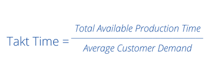

To achieve true efficiency, a factory must operate in sync with its customers. Guesswork in production planning often leads to a cycle of shortages and overstock. Takt time replaces this guesswork with a precise calculation. It determines the exact pace your team needs to maintain to meet customer demand, creating a smooth, steady flow that minimizes waste and maximizes productivity.

<!--more-->

In this article, we'll explore what takt time is, how to calculate it using its simple formula, and how you can implement it to create a more responsive and efficient manufacturing operation.

## Understanding Takt Time: Definition and Meaning

[Takt time](https://en.wikipedia.org/wiki/Takt_time) is the rate at which you need to complete products to meet customer demand. The meaning of takt time centers on creating a production rhythm that matches customer requirements. The word "takt" comes from the German word "taktzeit," which means cycle time. This metric determines the pace of your production process based on customer requirements.

The definition of takt time can be understood as the available production time divided by customer demand - it's the heartbeat of manufacturing. This concept originated in Germany's aircraft industry during the 1930s and became an element of lean manufacturing principles. Today, companies worldwide use takt time to create production systems.

> Takt time, cycle time, and lead time are distinct metrics that serve different purposes. Takt time is the rate at which you must complete products to meet customer demand—it's calculated from customer orders, not your process capability. Cycle time measures how long your process actually takes to complete one unit. Lead time spans the entire journey from customer order to delivery, including processing, waiting, and transportation. For optimal operations, your cycle time should be equal to or slightly less than your takt time, ensuring you can meet demand without overproducing or building excess inventory.

## Takt Time Formula

{data-zoomable}
_Takt Time Formula_

The takt time formula is:

**Takt Time = Available Production Time ÷ Customer Demand**

This takt formula is functional because it connects customer demand directly to production pace, removing guesswork about production speed. When demand increases, takt time decreases, indicating the need to increase production rate. When demand drops, takt time increases, allowing for a slower production pace.

## How to Calculate Takt Time

Takt time calculation becomes clear with an example. Consider an automotive parts manufacturer that needs to produce 120 brake assemblies during an 8-hour shift. With 480 minutes of available production time, their takt time is 480 ÷ 120 = 4 minutes per brake assembly. This means the production line must complete one brake assembly every 4 minutes to meet customer orders.

If the assembly process takes 5 minutes per unit, the manufacturer will fall short of demand. If they complete assemblies in 3 minutes each, they will overproduce, creating excess inventory and tying up resources. The 4-minute target maintains alignment with customer requirements.

## Why Takt Time Matters

Takt time provides several benefits for manufacturing operations:

- **Production Balance**: Ensures each workstation operates at the right pace to meet customer demand
- **Waste Elimination**: Prevents overproduction by aligning output with orders
- **Resource Planning**: Guides decisions on staffing levels and equipment capacity
- **Cost Control**: Reduces inventory holding costs and storage requirements

The concept also guides staffing decisions. If your current cycle time exceeds takt time, you need workers or process improvements. If cycle time is faster than takt time, you may have excess capacity that could be redirected elsewhere.

## Implementing Takt Time Monitoring with FlowFuse

While understanding the theory behind takt time is important, putting it into practice requires the right tools and approach. FlowFuse provides an industrial automation platform that connects seamlessly to your existing systems—whether that's PLCs, databases, or ERP software—to automatically calculate and monitor takt time in real-time. Let’s see how it works, but before we begin, make sure you have a FlowFuse instance running. You can [create an account here](https://app.flowfuse.com/account/create) and get it set up quickly.

Instead of manually calculating takt time on spreadsheets or relying on static reports, you can build a dynamic monitoring system that updates continuously as customer orders and production conditions change. Follow the steps below to set up automated takt time tracking using FlowFuse.

### Step 1: Connect to Your Data Sources

The foundation of accurate takt time calculation is reliable data. FlowFuse supports connections to virtually any industrial system through its extensive library of [protocol](/node-red/protocol/) and [database](/node-red/database/) nodes.

* You can [pull customer order data from your ERP system](/blog/2025/06/connect-shop-floor-to-odoo-erp-flowfuse/), gather production schedules from manufacturing execution systems.

**Set up simulated order data:**

For demonstration purpose, we will simulate customer orders using Inject node. In a real implementation, this would be replaced with actual data connections to your systems.

1. Add an **Inject** node.
2. Configure the payload with this JSONata expression:

   ```json
   $round($random() * 50 + 50)
   ```
3. Set it to trigger every 5 seconds.

This simulates variability in customer demand between 50 and 100 units.

### Step 2: Calculate Available Production Time

Next, establish the available production time for your shift. This typically equals your total shift hours minus planned downtime for breaks, maintenance, and changeovers.

1. Add a **Change** node.
2. Use the following JSONata expression:

   ```json
   (8 * 60) - 60
   ```

This represents an 8-hour shift (480 minutes) minus 1 hour (60 minutes), giving 420 minutes of available production time.

### Step 3: Automate Takt Time Calculation

Now, calculate takt time based on customer demand and available time.

1. Add another **Change** node.
2. Configure it with this JSONata expression:

   ```json
   $round(($number(msg.payload.availableTime) / $number(msg.payload.customer_order)) * 100)/100
   ```

This ensures takt time updates dynamically with each new order and produces clean, readable numbers for operators and managers.

### Step 4: Create Real-Time Dashboards

Data is most valuable when operators can interpret it instantly on the shop floor. FlowFuse’s dashboard lets you create real-time displays using the same intuitive drag-and-drop interface.

1. Install the FlowFuse Dashboard package via the Palette Manager (`@flowfuse/node-red-dashboard`).
2. For basic displays, use text widgets to show current takt time values. For more sophisticated interfaces, the Template widget allows you to create custom components. With [FlowFuse AI](/blog/2025/07/flowfuse-ai-assistant-better-node-red-manufacturing/), you can describe your desired interface in plain English and let the AI generate the appropriate code.
3. Connect the output of the Inject node to the input of the Change node that calculates available production time. Next, connect the output of this Change node to the input of the Change node that calculates takt time. Finally, connect the output of the takt time Change node to the input of the UI Template node.
4. Next, deploy the flow and open the dashboard to see real-time takt time updates.

{data-zoomable}
*Real-time takt time monitoring dashboard in FlowFuse*

Here's the complete flow we built for automated takt time calculation and visualization with FlowFuse.


[{"id":"d5e580f48a9299a6","type":"inject","z":"c2c694c911f786fe","name":"Simulate Customer Order","props":[{"p":"payload.customer_order","v":"$round($random() * 50 + 50)","vt":"jsonata"}],"repeat":"5","crontab":"","once":false,"onceDelay":0.1,"topic":"","x":400,"y":300,"wires":[["518dbc1ac72f7c21"]]},{"id":"518dbc1ac72f7c21","type":"change","z":"c2c694c911f786fe","name":"Calculate total available time","rules":[{"t":"set","p":"payload.availableTime","pt":"msg","to":"(8 * 60) - 60","tot":"jsonata"}],"action":"","property":"","from":"","to":"","reg":false,"x":660,"y":300,"wires":[["3d35535dbb06fc86"]]},{"id":"3d35535dbb06fc86","type":"change","z":"c2c694c911f786fe","name":"Calculate Takt Time","rules":[{"t":"set","p":"payload","pt":"msg","to":"$round(($number(msg.payload.availableTime) / $number(msg.payload.customer_order)) * 100)/100","tot":"jsonata"}],"action":"","property":"","from":"","to":"","reg":false,"x":910,"y":300,"wires":[["de044b9204a9b248"]]},{"id":"de044b9204a9b248","type":"ui-template","z":"c2c694c911f786fe","group":"79d59adc1e8219b7","page":"","ui":"","name":"Display: Takt Time","order":1,"width":0,"height":0,"head":"","format":"<template>\n  <v-sheet class=\"d-flex justify-center align-center led-background\" height=\"150\" elevation=\"4\" rounded>\n    <div class=\"led-display\">\n      {{ taktTime }}\n    </div>\n  </v-sheet>\n</template>\n\n<script>\n  export default {\n  data() {\n    return {\n      taktTime: this.msg?.payload ?? '00:00.0'\n    }\n  },\n  watch: {\n    msg(newMsg) {\n      if (newMsg?.payload) {\n        this.taktTime = newMsg.payload;\n      }\n    }\n  }\n}\n</script>\n\n<style scoped>\n  .led-background {\n    background: #0a0a0a;\n    /* Dark black background */\n    background-image: radial-gradient(circle, #111 1px, #0a0a0a 1px);\n    background-size: 20px 20px;\n    /* Carbon-like grid */\n  }\n\n  .led-display {\n    font-family: 'Digital-7', monospace;\n    font-size: 96px;\n    color: #0f0;\n    text-shadow:\n      0 0 5px #0f0,\n      0 0 10px #0f0,\n      0 0 20px #0f0,\n      0 0 30px #0f0;\n  }\n</style>\n\n<!-- Include Digital-7 font from CDN -->\n<link href=\"https://fonts.googleapis.com/css2?family=Orbitron&display=swap\" rel=\"stylesheet\">","storeOutMessages":true,"passthru":true,"resendOnRefresh":true,"templateScope":"local","className":"","x":1110,"y":300,"wires":[[]]},{"id":"79d59adc1e8219b7","type":"ui-group","name":"Takt Time","page":"9b1c640ccc6a665e","width":6,"height":1,"order":1,"showTitle":true,"className":"","visible":"true","disabled":"false","groupType":"default"},{"id":"9b1c640ccc6a665e","type":"ui-page","name":"FlowFuse Dashboard","ui":"d44eab3a91dda8d9","path":"/","icon":"home","layout":"grid","theme":"2278e18670b606b7","breakpoints":[{"name":"Default","px":"0","cols":"3"},{"name":"Tablet","px":"576","cols":"6"},{"name":"Small Desktop","px":"768","cols":"9"},{"name":"Desktop","px":"1024","cols":"12"}],"order":1,"className":"","visible":"true","disabled":"false"},{"id":"d44eab3a91dda8d9","type":"ui-base","name":"My Dashboard","path":"/dashboard","appIcon":"","includeClientData":true,"acceptsClientConfig":["ui-notification","ui-control"],"showPathInSidebar":false,"headerContent":"page","navigationStyle":"default","titleBarStyle":"default","showReconnectNotification":true,"notificationDisplayTime":1,"showDisconnectNotification":true,"allowInstall":true},{"id":"2278e18670b606b7","type":"ui-theme","name":"Default Theme","colors":{"surface":"#2e073e","primary":"#0094ce","bgPage":"#eeeeee","groupBg":"#ffffff","groupOutline":"#cccccc"},"sizes":{"density":"default","pagePadding":"12px","groupGap":"12px","groupBorderRadius":"4px","widgetGap":"12px"}},{"id":"da2b78557435736b","type":"global-config","env":[],"modules":{"@flowfuse/node-red-dashboard":"1.27.2"}}]


## Troubleshooting Takt Time Challenges

Calculating takt time is simple mathematics. Sustaining it on the production floor requires addressing several common obstacles.

### When Production Cannot Keep Pace

If your cycle time exceeds takt time, you cannot meet customer demand at the current production rate. Start by identifying the bottleneck—the slowest operation in your process determines overall output.

Immediate fixes include adding operators to constrained workstations or implementing parallel processing. For lasting improvement, conduct time studies to eliminate non-value activities and redesign workstations for better flow.

### Handling Demand Fluctuations

Customer orders rarely arrive at steady rates. Calculate takt times for your peak, average, and minimum demand periods, then design staffing models for each scenario.

Cross-train operators to shift between production lines as needed. Integrate your takt time calculations with ERP systems to automatically adjust targets as order volumes change.

### Managing Multiple Product Variants

Production lines running different product types require adapted approaches. For similar products, calculate weighted average takt time based on processing requirements and demand mix.

When products differ significantly, implement pitch—takt time multiplied by container quantity. This maintains production rhythm while accommodating variation.

### Accounting for Equipment Downtime

Calculate available time using realistic downtime rates, not theoretical shift hours. If your line averages 10% unplanned stops, use 432 minutes of a 480-minute shift in your takt time formula.

Reduce downtime through total productive maintenance, critical spare parts inventory, and operator training in basic troubleshooting.

### Addressing Quality Losses

Poor first-pass yield reduces effective capacity. If 95% of parts pass inspection, factor this into calculations by multiplying available time by 0.95 before dividing by demand.

The better path is eliminating defects through error-proofing. Install verification sensors and mistake-proofing devices at critical operations to improve yield and remove the need for quality time adjustments.

### Ramping New Products

Operators need time to reach full proficiency. Set initial takt time at 150% of the target rate, then tighten weekly as skills develop.

Run pilot batches before full production to refine processes and train core team members. This staged approach typically reduces ramp time compared to immediate full-speed targets.

### Implementing Visual Management

Production teams need real-time feedback to maintain pace. Display current output versus target on the shop floor using color-coded status indicators.

Configure alerts when production falls 10% behind schedule. Hourly production boards and immediate deviation alerts enable teams to correct issues during the shift rather than discovering shortfalls at day's end.

### Recognizing When Takt Time Does Not Apply

Continuous process industries—chemicals, refining, steel—operate better with throughput metrics than discrete unit takt time. Job shops with extreme processing variation (200-300% between parts) benefit more from individual operation targets.

In these environments, apply takt time principles at higher levels. Calculate weekly rather than hourly targets, or focus on overall system flow rather than rigid station-by-station compliance.

## Conclusion

Takt time is essential for keeping production synchronized with customer demand, minimizing waste, and maximizing the efficiency of available resources. By implementing this lean manufacturing metric, companies can create a production rhythm that eliminates overproduction while ensuring customer orders are fulfilled on time.

FlowFuse simplifies the implementation of takt time monitoring by enabling seamless connections to hardware devices and business systems. The platform processes and transforms data, calculates key production metrics like takt time, and provides real-time visualization of performance—all without requiring complex coding or extensive technical expertise.

Whether you're tracking takt time, cycle time, [OEE](/blueprints/manufacturing/oee-dashboard/), or other critical manufacturing metrics, FlowFuse provides the tools needed to optimize your operations and maintain alignment between production capacity and customer demand.

*[Book your demo](/book-demo/) today to see how FlowFuse can help you track production metrics and build industrial applications to improve efficiency and reduce waste*
